## Objectives

::: {.incremental}
- Use the proper terminology and understand its meaning
- Describe the elements of a UAS
- Classify different UAS according to their design and characteristics
- Understand the current state of UAS development, including the platforms used for mapping today
- Describe the range of applications UAS are used for
:::

::: {.notes}
First lecture of the course: the goal is shared vocabulary and a mental model of what a UAS is before the course narrows to mapping. Ask who has flown a drone before and what kind; the class survey usually surfaces a good spread from toy quads to Part 107 pilots, which helps calibrate the rest of the topic.
:::

## What is a UAV? {.center .text-center}
For a brief summary read the [overview article](http://www.insidegnss.com/auto/janfeb08-wp.pdf)

::: {.notes}
Section opener. The linked Inside GNSS piece is an early overview; it is dated technologically but still a clean explanation of the navigation problem, which is why it survives here. Use this beat to ask students what they would call the thing before giving them the terminology.
:::

## UAS or UAV? Or maybe a drone?

::: {.incremental}
- **UAV** = Unmanned Aerial Vehicle - the aircraft itself
- **UAS** = Unmanned Aircraft System - the aircraft plus everything needed to operate it
- **RPA / RPAS** = Remotely Piloted Aircraft (System) - ICAO's preferred term
- **Drone** = the colloquial catch-all, now standard in industry and media
:::

::: {.notes}
The FAA and this course use UAS because the regulations govern the whole system, not just the airframe. "Drone" carried military stigma in the 2010s and professionals avoided it; that fight is over and the industry itself says drone now. One myth to preempt: "drone" is not an acronym, the usage traces back to 1930s target aircraft named after the male bee.
:::

## UAS: Unmanned Aircraft System {.smaller}

::: {.columns}

<!-- Left -->
::: {.column width="40%"}
- **Unmanned** = without a person onboard (operated by automatic or remote control)
- **Aircraft** = able to fly
- **System** = associated elements related to safe operations (may include control stations, control links, support equipment, payloads, flight termination systems, and launch recovery equipment)
:::

<!-- Right -->
::: {.column width="60%"}

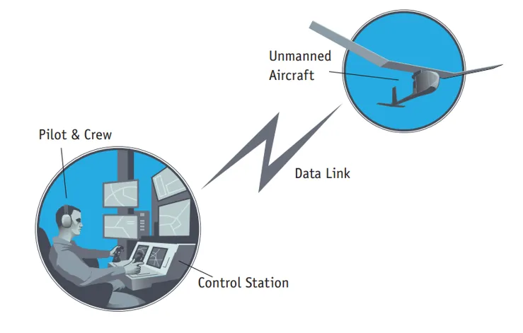

**Consists of three elements:**

1. Unmanned Aircraft
2. Control Station
3. Data Link
:::

:::

::: {.notes}
The three-element decomposition matters practically: most field failures are control-station or data-link problems (dead tablet, lost link, interference), not aircraft problems. When the course reaches flight planning, pre-flight checks are organized around exactly these three elements.
:::

## UAS or UAV? Or maybe a drone? {.smaller}

::: {.columns}

::: {.column width="50%"}
**Unmanned Aerial Vehicle (UAV)**

- **Excludes:** missiles, weapons, or exploding warheads,
- **Includes:** all classes of airplanes, helicopters, airships, and powered-lift aircraft,
- **Doesn't include:** traditional balloons, rockets, tethered aircraft, and un-powered gliders.
:::

::: {.column width="50%"}
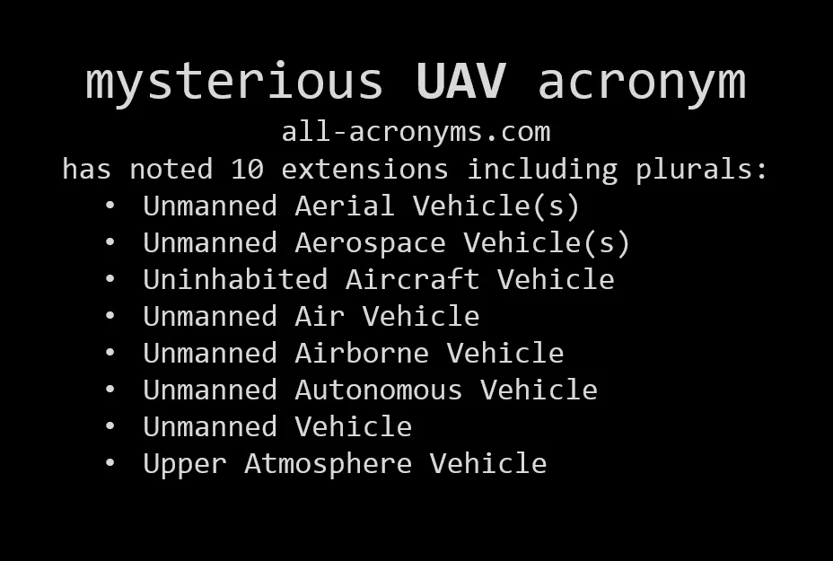
:::

:::

::: {.notes}
The definitional edges are worth a beat: a cruise missile flies unmanned but is not a UAV because it is expendable ordnance; a tethered balloon carrying a camera is aerial sensing but not a UAV because it is neither free-flying nor powered. These boundary cases foreshadow the regulatory definitions in Lecture 1B.
:::

## What does a UAS look like? {.center .text-center}
Types and classification of UAS

::: {.notes}
Section transition into classification. Preview: there is no single official taxonomy; military, civil-airworthiness, and market classifications all coexist, so the next slides show several cuts of the same space.
:::

## Different shapes and sizes {.center .text-center}
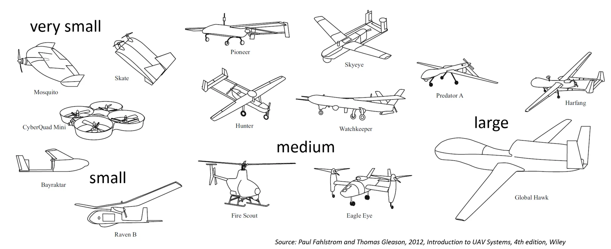

::: {.notes}
Span the extremes on the figure: from insect-scale micro air vehicles to the Global Hawk with an airliner-class wingspan. Everything this course flies sits in the small-UAS band, under 55 lbs, but the design diversity above and below is useful context for classification.
:::

## Different Designs {.center .text-center}
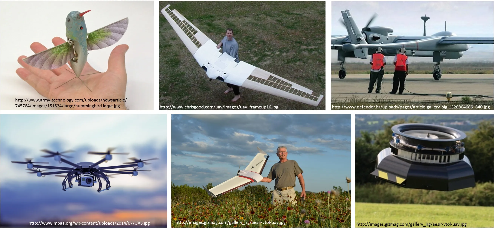

::: {.notes}
Walk the main design families: fixed wing (efficiency, endurance, area coverage), rotary wing / multirotor (vertical takeoff, hover, ease of use), and hybrids like VTOL fixed wing that take off vertically then cruise on wings. Multirotors dominate small-site mapping; fixed wing and VTOL hybrids win on large-area coverage per battery.
:::

## Different Classifications {.smaller}
:::{.columns}

::: {.column width="40%"}
* Physical size
* Weight
* Endurance
* Altitude
* Wing loading
* Engine type
* Range
* Performance
* Capabilities
* Type
:::
::: {.column width="60%"}
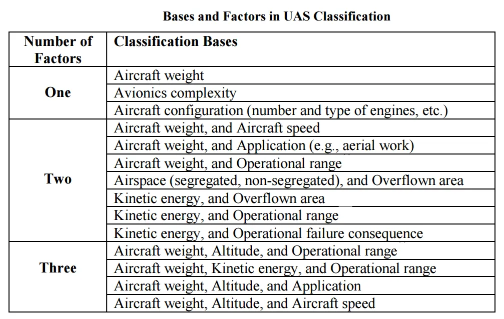

:::
::: aside
More about classification in the article: [Perspectives on Unmanned Aircraft
Classification for Civil Airworthiness Standards](https://shemesh.larc.nasa.gov/people/jmm/NASA-TM-2013-217969.pdf)
:::
:::

::: {.notes}
Key point: the classification axis you pick depends on your question. Regulators classify by weight (55 lb line, 250 g line), mission planners by endurance and range, engineers by propulsion and wing loading. Weight is the axis with legal consequences, which is why it dominates in Lecture 1B.
:::

## Simplified classifications {.smaller}

:::{.columns}
:::{.column width="50%"}
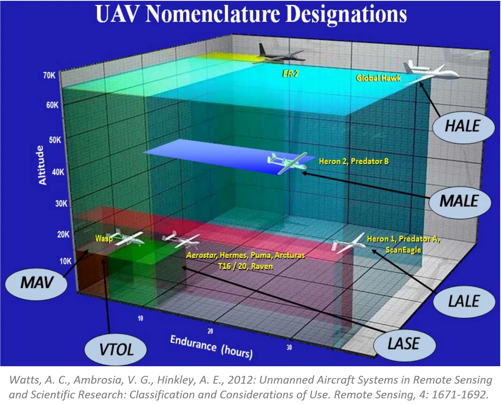
:::

:::{.column width="50%"}
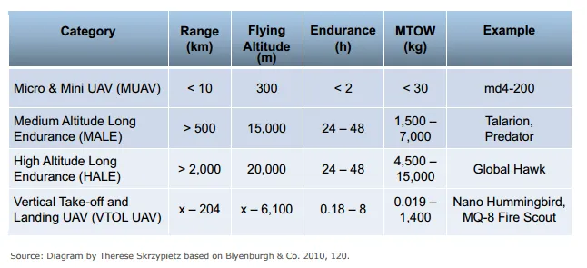
:::

- More (much much more) about classifications in the [NASA report](https://shemesh.larc.nasa.gov/people/jmm/NASA-TM-2013-217969.pdf)
:::

::: {.notes}
The simplified schemes collapse to what matters for civil users: micro/mini/small on one axis, fixed vs rotary wing on the other. Have students place a familiar aircraft (DJI Mini, an eBee-style flying wing, a military MALE platform) into each scheme to see how the taxonomies overlap.
:::

## How does a UAS work? {.center .text-center}
System elements

::: {.notes}
Section transition from what they look like to how the pieces fit together. This is the systems-engineering view that the term "UAS" implies.
:::

## Generic Unmanned Aircraft System {.smaller}

:::{.columns}

:::{.column width="40%"}
- Air vehicle
- Mission planning element
- Command and control element
- Communication link
- Launch and recovery element (for some of them)
- Payload
:::

:::{.column width="60%"}
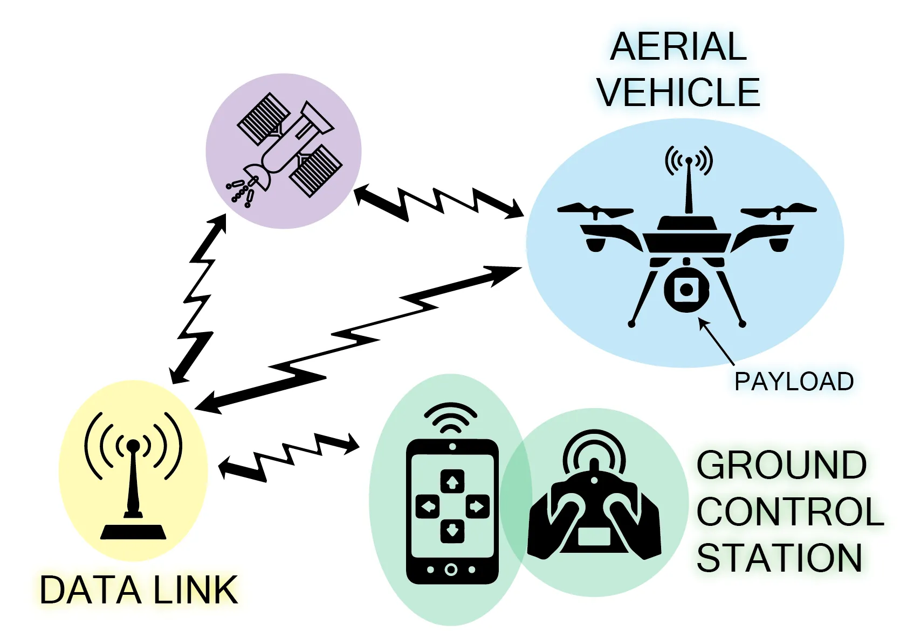
:::
:::

::: {.notes}
Map these onto the course: mission planning element is the flight-planning software in Topic 3; payload is the sensor whose imagery feeds Structure from Motion in Topic 2; the communication link constraints shape where you can safely fly. Launch and recovery elements are mostly a fixed-wing concern (catapults, belly landings, parachutes).
:::

## Sensors {.center .text-center}
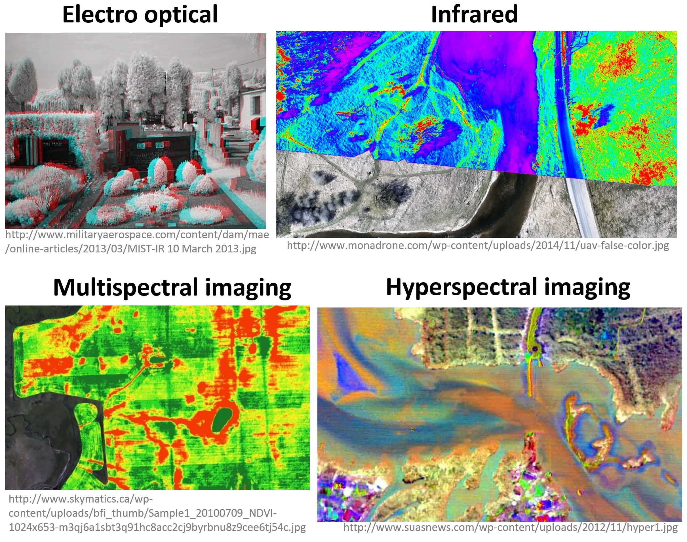

::: {.notes}
Transition into payloads, the part of the system this course cares most about: for mapping, the aircraft is just a sensor positioning platform. The figure shows the breadth beyond cameras: chemical sniffers, radiation detectors, meteorological probes.
:::

## Sensors {.center .text-center}
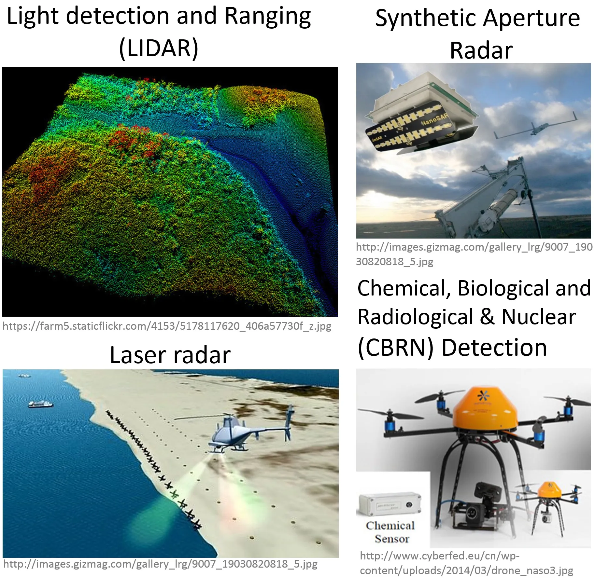

::: {.notes}
Second sensor overview figure; use it to point out that sensor choice drives aircraft choice, not the other way around. Payload mass, power draw, and mounting/gimbal requirements are the coupling constraints, which the integration slide will formalize.
:::

## UAS sensors for mapping

- RGB cameras
- Infrared sensors
- Multispectral and hyperspectral sensors
- Laser scanners
- Thermal sensors

::: {.notes}
This is the shortlist the course actually uses. RGB feeds photogrammetry (Topics 2-4); multispectral supports vegetation indices; lidar gives below-canopy terrain; thermal supports water, wildlife, and infrastructure applications. The following slides take each in turn.
:::

## RGB (natural color) cameras {.smaller}

:::{.columns}
:::{.column width="50%"}
- Most common payload for consumer-grade UAS
- Photo or video mode
- Mapping (orthophoto and DSM generation) possible even with non-photogrammetric cameras
- Variety of cameras, lenses, and mounting systems - some suitable for 3D modeling
:::
:::{.column width="50%"}
<!-- 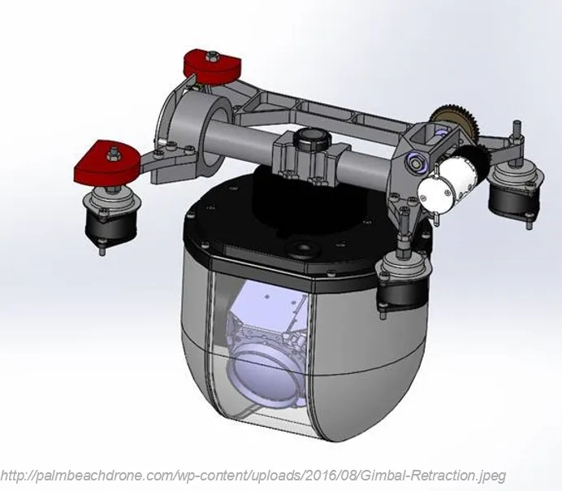{.nostretch fig-align="center" width="400px"} -->
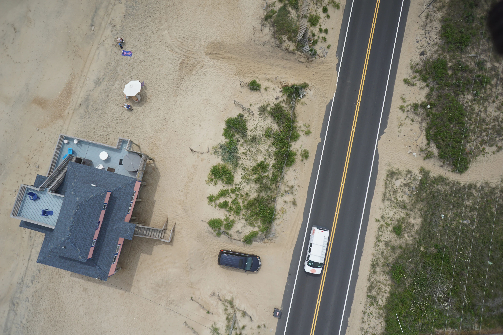
:::
:::

::: {.notes}
"Non-photogrammetric" means consumer cameras without calibrated, stable lens geometry; Structure from Motion self-calibrates well enough that they still produce usable orthophotos and surface models, which is what made UAS mapping cheap. Mechanical vs rolling shutter is the spec worth teaching here: rolling shutter distorts imagery taken in motion and modern mapping drones advertise mechanical/global shutters for that reason.
:::

## Multispectral and hyperspectral cameras {.smaller}
:::{.columns}
:::{.column width="60%"}
- Miniaturization is challenging in terms of optics and sensor calibration
- Weight, cost, data quality have improved; spectral bands, resolution keep improving
- Cameras with NIR band: agriculture and vegetation mapping (for NDVI)
- The more bands the more information, but also higher price of the sensor
    - $$ multispectral - couple thousand
    - $$$ hyperspectral - tens of thousands
:::
:::{.column width="40%"}
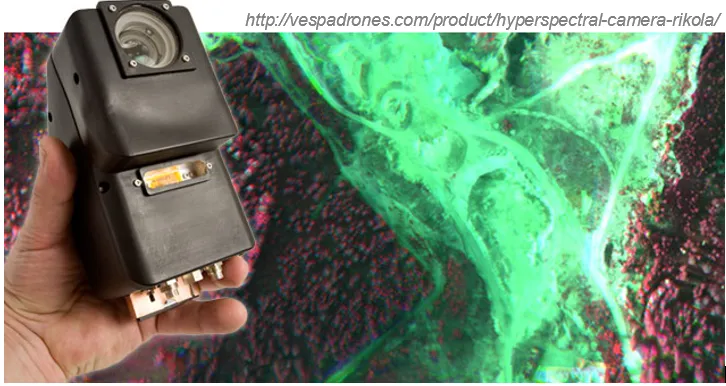
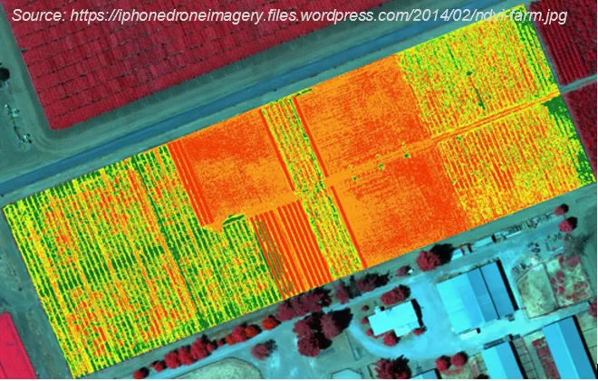
:::
:::

::: {.notes}
Multispectral has gone mainstream: integrated platforms like the DJI Mavic 3 Multispectral bundle RGB plus narrow bands with a sunlight sensor for reflectance calibration, at a price individual labs can afford. Hyperspectral (hundreds of contiguous bands) still costs an order of magnitude more and demands careful radiometric calibration; it stays a research payload.
:::

## Active sensors - LiDAR and SAR {.smaller}
:::{.columns}
:::{.column width="60%"}
- Active sensors can reach below-canopy ground surface
- Trade-offs between performance and size or cost of LiDAR keep shrinking
- LiDAR is now a routine UAS payload thanks to miniaturization
- SAR (Synthetic Aperture Radar) used experimentally, still faces challenges in adaptation to UAS
:::
:::{.column width="40%"}
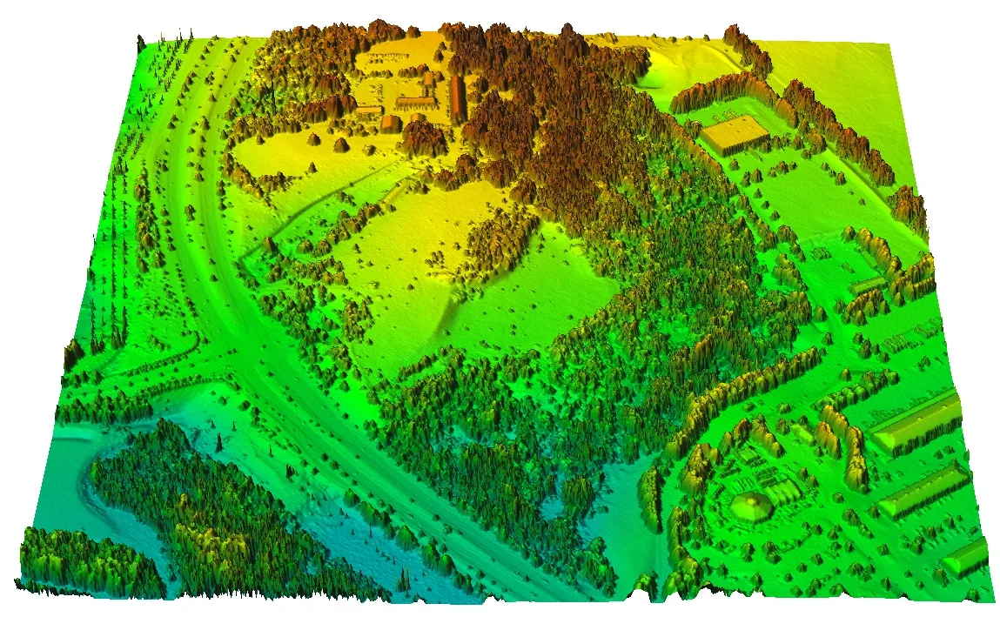
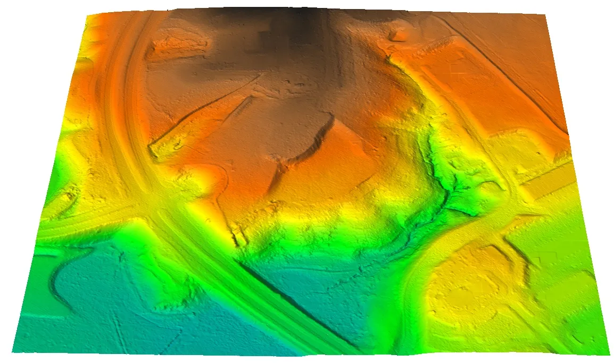
:::
:::

::: {.notes}
The figure pair is the pitch: first-return surface vs bare-earth ground under vegetation, which passive photogrammetry cannot deliver. Integrated lidar payloads (DJI Zenmuse L2 class) have made this routine survey equipment. Connect to the photogrammetry-vs-lidar comparison that returns in the terrain-analysis topics.
:::

## Thermal imaging {.smaller}
:::{.columns}
:::{.column width="60%"}
- Used in forest fire monitoring, search and rescue missions, wildlife surveys, and building/solar inspection
- For mapping purposes usually paired with a visible-band camera on the same gimbal (e.g. DJI Mavic 3T class platforms)
:::
:::{.column width="40%"}
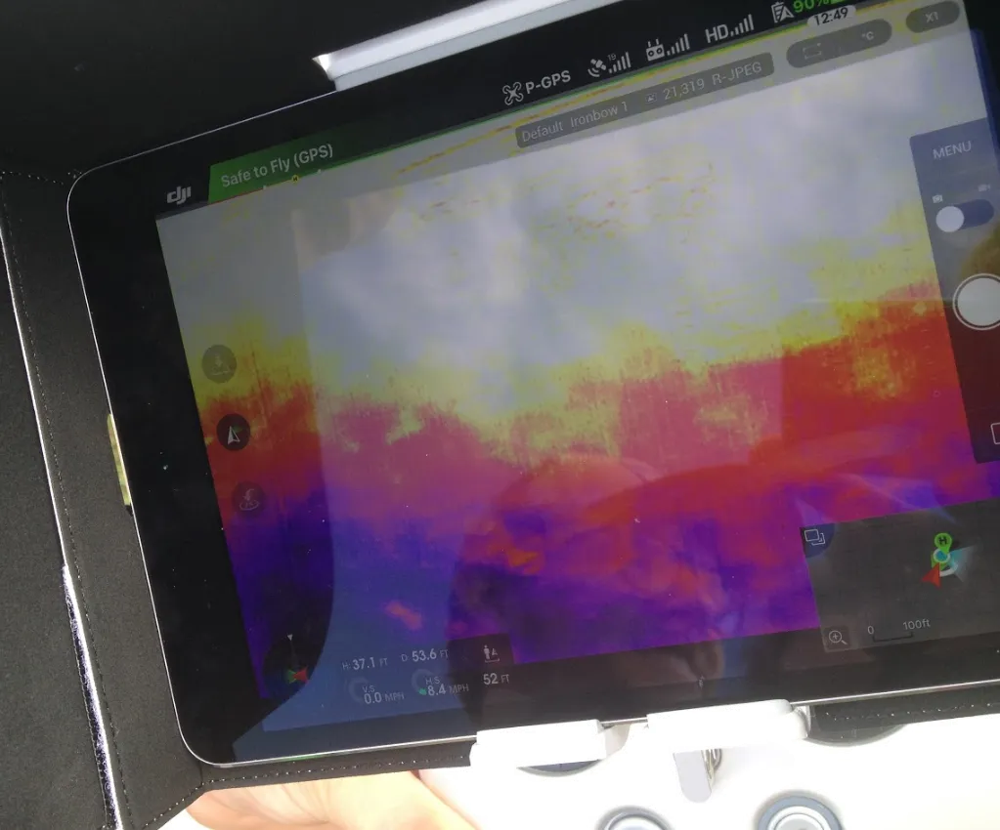
:::
:::

::: {.notes}
Uncooled microbolometers are what fit on small UAS: lower resolution (often 640x512) and radiometric accuracy of a few degrees, so thermal mapping is about patterns and anomalies more than absolute temperature. Flights happen at night or dawn to maximize thermal contrast, which is why the 2021 night-operations rule (Lecture 1B) mattered to this application.
:::

## Sensor and platform integration {.smaller}

The optimal combination of carrier (unmanned vehicle) and sensing payload needs to be determined based on:

:::{.columns}
:::{.column width="60%"}
- Volume, size, and weight specifications
- Specific application requirements
- Mounting: integrated by manufacturer or custom solutions
- **The sensors must be adapted to the carrier and vice versa**
:::
:::{.column width="40%"}
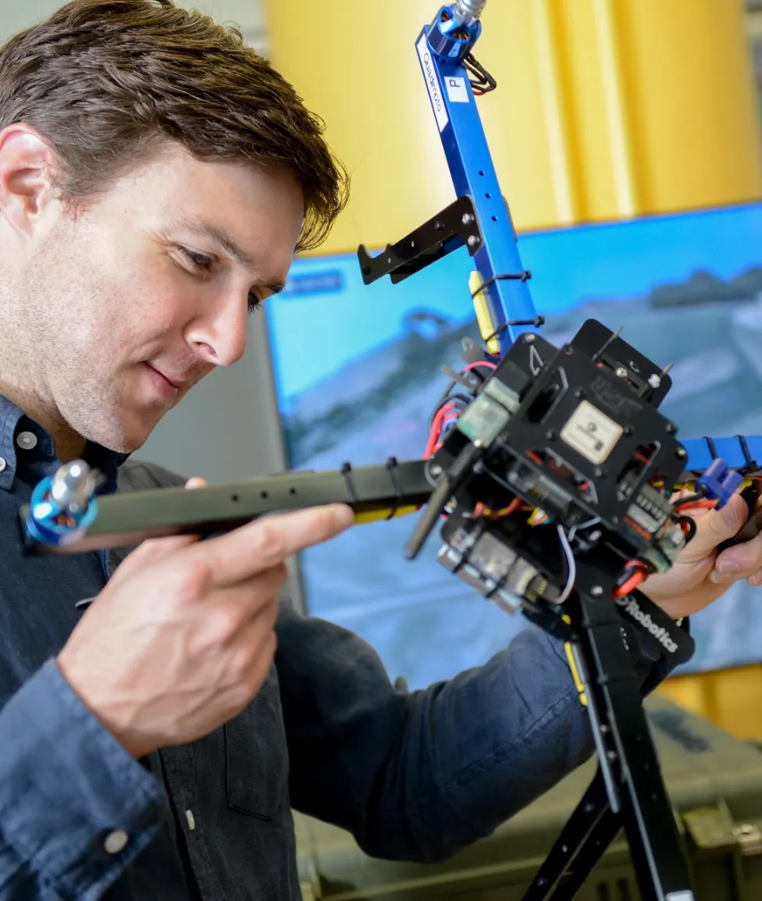
:::
:::

::: {.notes}
The market has largely resolved this in favor of manufacturer integration: turnkey platforms with matched sensor, gimbal, and processing pipeline. Custom integration survives at the research edge (novel sensors, larger platforms). Note the regulatory hook: payload weight counts toward the 250 g and 55 lb thresholds discussed next lecture.
:::

## The platform landscape today {.smaller}

- Consumer/prosumer multirotors dominate small-site mapping (DJI Mini and Mavic series)
- Dedicated survey platforms: DJI Matrice series, WingtraOne and other VTOL fixed wings, eBee-class flying wings (AgEagle)
- **Supply-chain and security policy now shapes procurement:** NDAA-compliant / [Blue UAS](https://www.diu.mil/blue-uas)-listed aircraft (Skydio, Freefly, and others) are required for many U.S. government and federally funded operations
- Check program requirements before buying: see [drone use in federally funded projects at NC State](https://research.ncsu.edu/administration/compliance/research-compliance/research-security/drone-use-in-federally-funded-projects/)

::: {.notes}
Two forces define the current market: DJI's dominance on capability per dollar, and U.S. policy restricting Chinese-made aircraft in government and federally funded contexts (American Security Drone Act, agency bans, proposed broader restrictions). For students heading into public-sector or funded-research work, "which drone may I use" is now a compliance question before a technical one; the NC State research-security page linked here is the campus authority.
:::

## Who uses UAS? {.center .text-center}
Types of UAV Operations

::: {.notes}
Section transition from hardware to users and applications. The operational categories here get their full regulatory treatment in Lecture 1B; today is just the landscape.
:::

## Types of UAS Operations {.smaller}

- **Public Operations**
  Governmental: agencies and public universities operating under federal statute (COA) or Part 107;

- **Civil Operations**
  Non-governmental, must be conducted in accordance with all Federal Aviation Administration (FAA) regulations (Part 107);

- **Recreational Operations**
  Flying strictly for fun, under the recreational-flyer exception (49 USC 44809).

::: {.notes}
Terminology update worth stating aloud: the old "model aircraft" category was repealed in 2018 and replaced by the recreational-flyer exception; older materials and videos still use the old term. Purpose of the flight, not the aircraft, decides the category; the full rules for each are next lecture.
:::

## FAA - Federal Aviation Administration {.smaller}

::: {.columns}
:::{.column width="70%"}
**NAS - National Airspace System**

The common network of U.S. airspace:

- air navigation facilities, equipment, and services;
- airports or landing areas;
- aeronautical charts, information and services;
- rules, regulations, and procedures;
- technical information; and manpower and material.
:::
:::{.column width="30%"}
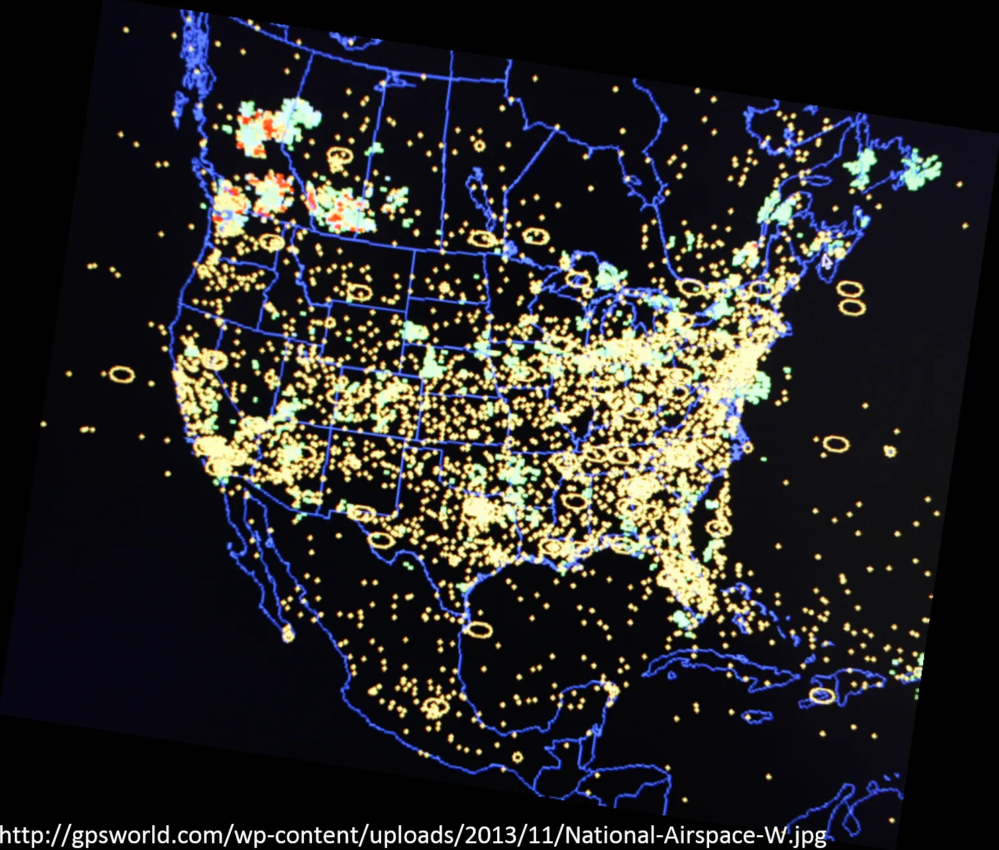
:::
:::

::: {.notes}
Plant the flag that returns in Lecture 1B: the NAS is a single shared system and drones are new entrants into it, not users of separate airspace. Everything below 400 ft is still NAS; there is no free zone.
:::

## Integration of UAS into the NAS {.smaller}

- review of current policies, regulations, environmental impact, privacy considerations, standards, and procedures;
- identification of **gaps in current UAS** technologies and **regulations,** standards, policies, or procedures;
- development of new technologies and **new or revised regulations, standards, policies, and procedures;**
- and the associated development of guidance material, **training, and certification** of aircraft systems, propulsion systems, and airmen.

::: {.notes}
This integration effort is ongoing, not historical: Part 107 (2016), the 2021 Remote ID and operations-over-people rules, and the proposed Part 108 BVLOS rule are successive steps of exactly this process. Lecture 1B walks through where it stands today.
:::

## Can I use it? {.center .text-center}

Regulations, standards, policies, and procedures

::: {.notes}
Deliberate cliffhanger: the honest answer is "it depends on purpose, place, aircraft, and pilot," and resolving that is all of Lecture 1B. Today only the orientation layer.
:::

## Know before you fly {.text-center}

- ["Know Before You Fly"](https://knowbeforeyoufly.org/) is an educational campaign that provides prospective unmanned aircraft users with the information and guidance they need to fly safely and responsibly.
- Different rules apply to [recreational](https://knowbeforeyoufly.org/recreational/) and [business](https://knowbeforeyoufly.org/commercial/) users and [government entities](https://knowbeforeyoufly.org/government-entities/)
- Commercial operations are governed by [Part 107](https://www.faa.gov/uas/commercial_operators), covered in depth next lecture

::: {.notes}
Know Before You Fly is an industry-FAA outreach partnership; it is a decent student-facing entry point, though faa.gov/uas is the authoritative source. Set expectations: next lecture covers Part 107, the recreational exception, TRUST, and airspace authorization in detail.
:::

## What are UAS used for? {.center .text-center}

::: {.notes}
Applications section: the goal is breadth, since Assignment 1A asks each student to research one system and its application in depth and present it. Encourage them to note which applications connect to their own research as these slides go by.
:::

## Army and Government {.smaller .text-center}
:::{.columns}
:::{.column}
<!-- - Public Use Aircraft -->
- Department of Agriculture
- Department of Commerce
- Department of Defence
- Department of Energy
- Department of Homeland Security
- Department of Interior
- Department of Justice
- NASA
- NOAA
- State Universities
- State Law Enforcement
:::

:::{.column}
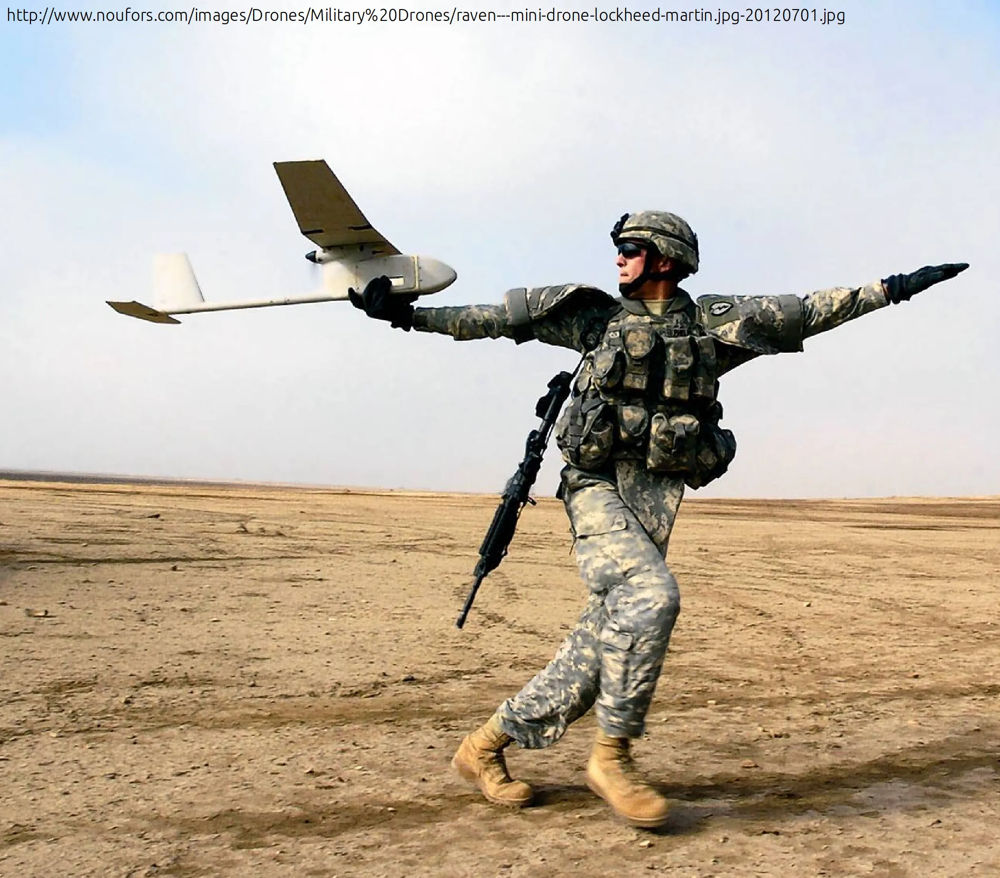
:::
:::

::: {.notes}
Military use drove the technology historically and still drives much R&D funding; the civil agencies on this list operate large mapping and monitoring fleets (Interior and NOAA especially). This is also where the NDAA/Blue UAS procurement constraints from the platform slide bind hardest.
:::

## Civilian Application Fields {.center .text-center}

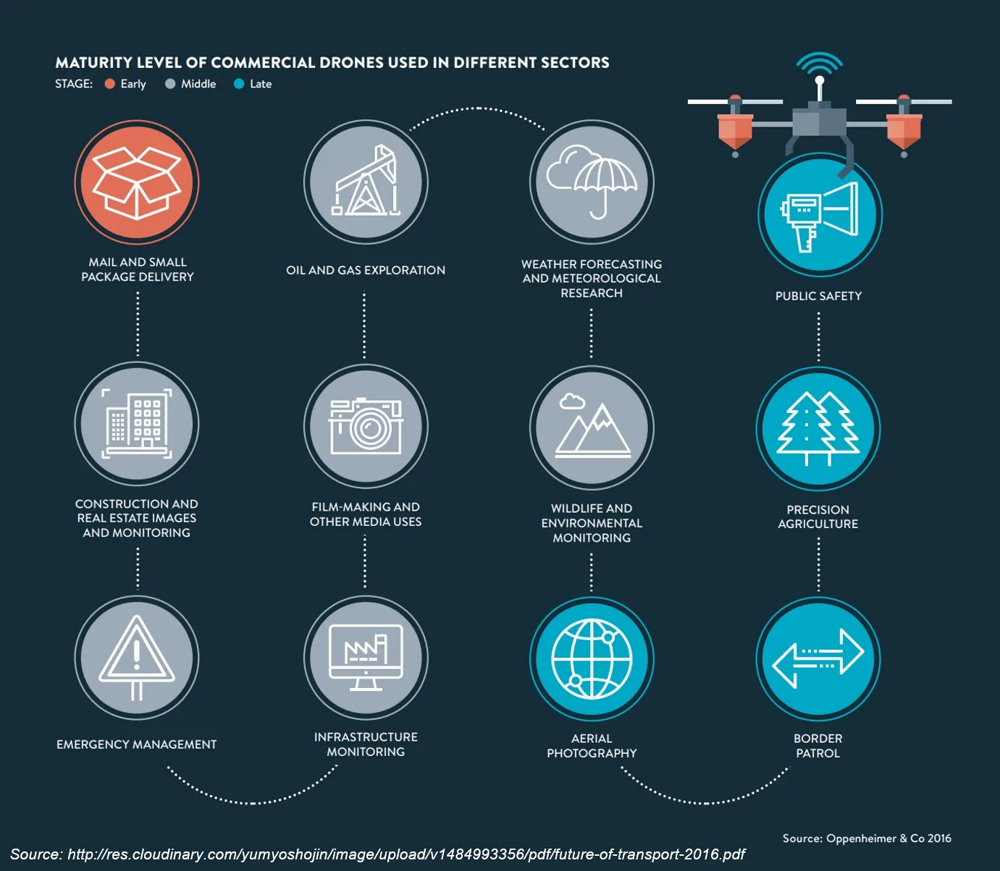

::: {.notes}
Big-picture market view: inspection, agriculture, construction, and surveying/mapping are the dominant commercial segments by revenue. Mapping and analytics, this course's slice, cuts across nearly all of them because most applications ultimately want georeferenced products.
:::

## Application Examples (1) {.smaller}
:::{.columns}
:::{.column width="60%"}
- **Agriculture:**
    - UAS equipped with fertilizer and pesticide dispersing equipment can be used to spray over large fields;
- **Telecommunications:**
    - As mobile relay platforms, e.g., in disaster zones for emergency telecommunications
:::

:::{.column width="40%"}
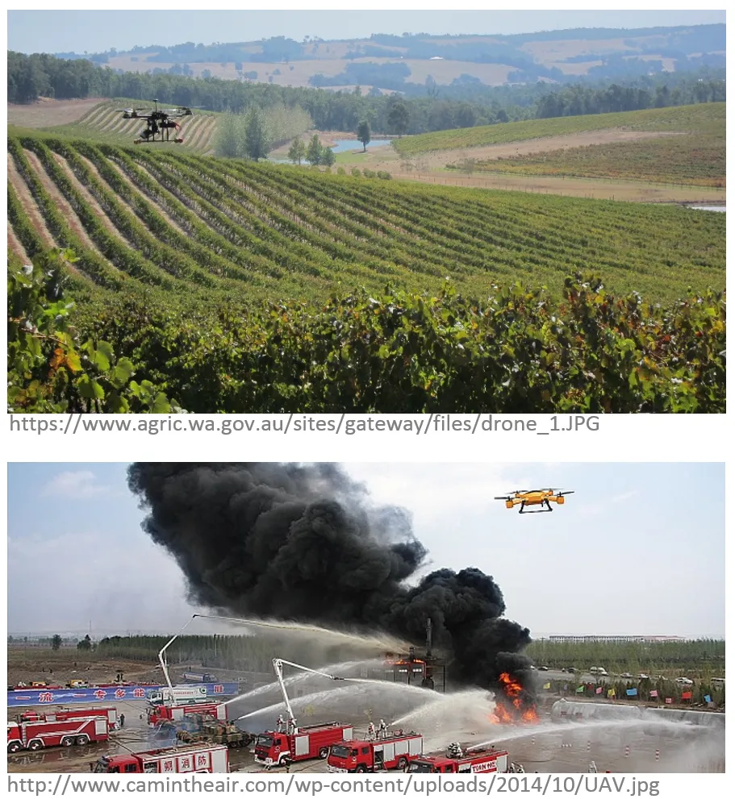
:::
:::

::: {.notes}
Spray drones are a distinct regulatory world: over 55 lbs, they need exemptions beyond Part 107, and agricultural spraying is one of the fastest-growing segments. The telecom-relay use case reappeared prominently in recent hurricane responses, including in western North Carolina.
:::

## Application Examples (2) {.smaller}

:::{.columns}
:::{.column width="60%"}
- **News Broadcasting:**
    - In providing aerial video feeds for news events;
- **Air Traffic Control and Ground Traffic Control:**
    - To monitor traffic and accidents over highways and streets, capture violation of traffic rules;
:::

:::{.column width="40%"}
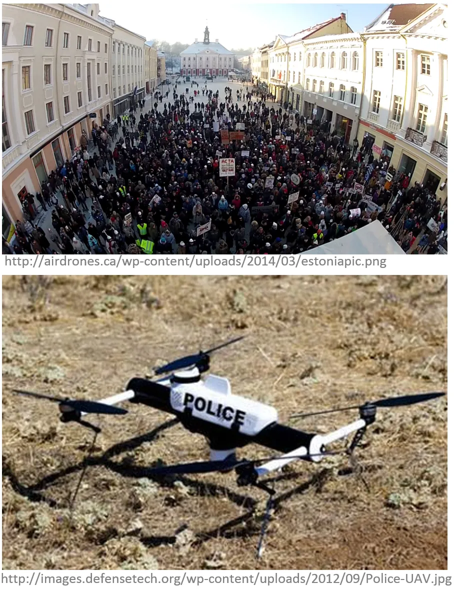
:::
:::

::: {.notes}
Both examples raise the flight-over-people and privacy questions that Lecture 1B's operations-over-people categories and best-practices slides address; newsgathering over crowds is exactly the case the category rules were written for. Traffic monitoring by DOTs is now routine, including NCDOT programs.
:::

## Application Examples (3) {.smaller}

:::{.columns}
:::{.column width="60%"}
- **Mineral Exploration:**
    - In aerial survey, to find minerals in hard-to-reach regions;
    - In existing mines, to map extracted material volumes;
- **Coastal Monitoring:**
    - Mapping dynamic shorelines and post-storm assessment
:::

:::{.column width="40%"}

:::
:::

::: {.notes}
Mine volumetrics is a flagship photogrammetry use case: repeat surveys plus DEM differencing gives stockpile and extraction volumes, exactly the change-detection workflow taught later in this course. Coastal monitoring is the local research strength; CGA has flown repeat shoreline surveys on the North Carolina coast.
:::

## UAS for Remote Sensing (1) {.smaller}

:::{.columns}
:::{.column width="60%"}
- **Agriculture and Environment:**
    - Crop monitoring, vegetation mapping, forest fire monitoring, animal detection;
- **Intelligence, Surveillance, and Reconnaissance:**
    - Detection of lost persons in difficult-to-access situations, support fire brigades in real-time crisis management, rapid disaster management;
:::

:::{.column width="40%"}
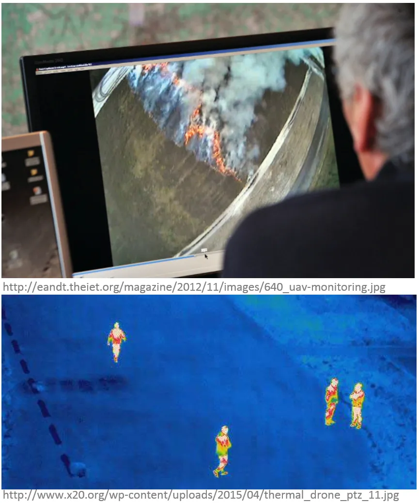
:::
:::

::: {.notes}
The remote-sensing framing distinguishes these from the service applications: here the product is data and derived maps. Crop monitoring connects to the multispectral/NDVI slide; search and rescue to thermal. Disaster response is a strong thread for this course given recent North Carolina hurricane experience.
:::

## UAS for Remote Sensing (2) {.smaller}

:::{.columns}
:::{.column width="60%"}
- **Aerial Monitoring in Engineering:**
    - Infrastructure inspections, distributed wind measurement, landslide monitoring;
- **Cultural Heritage:**
    - Orthophotos of archaeological sites, 3D models of man-made structures;
:::

:::{.column width="40%"}
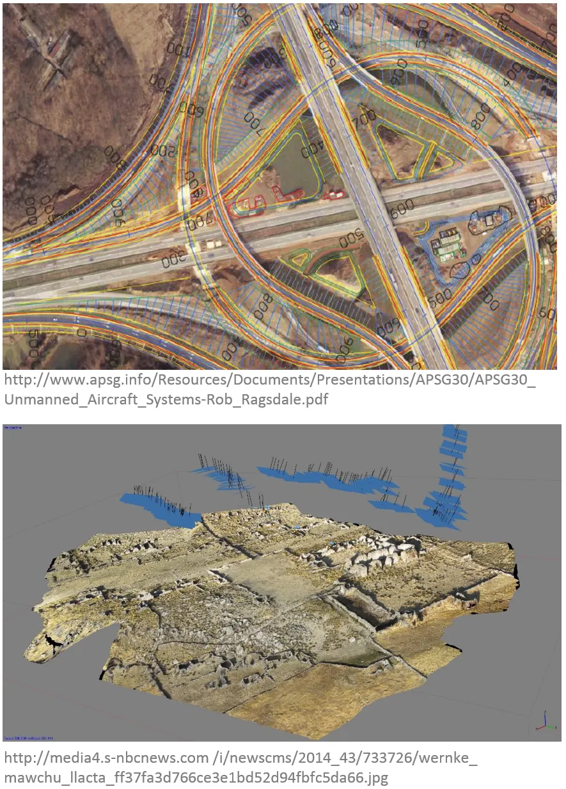
:::
:::

::: {.notes}
Infrastructure inspection is the killer commercial app: bridges, towers, and solar farms replace rope teams and lift trucks with a camera in the air. Cultural heritage showcases Structure from Motion 3D reconstruction (Topic 2) on structures rather than terrain; both engineering monitoring cases (landslides especially) are repeat-survey change-detection problems.
:::

## UAS for Remote Sensing (3) {.smaller}

:::{.columns}
:::{.column width="60%"}
- **General surveying, mapping, and photogrammetry, cadastral applications:**
    - Cadastral surveying, alternative to traditional surveying, high-precision parcel boundary determination;
:::

:::{.column width="40%"}
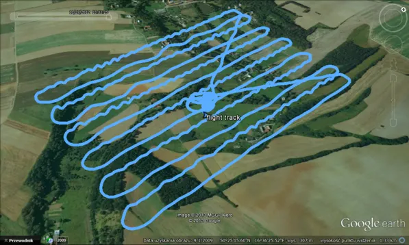
:::
:::

::: {.notes}
This is the course's home application. The flight-track figure previews Topic 3: systematic overlapping flight lines are what turn a camera drone into a survey instrument. Modern RTK/PPK positioning on survey platforms reaches centimeter-level accuracy, which is what makes cadastral-grade work possible.
:::

## Use your imagination! {.center .text-center}

<iframe width="560" height="315" src="https://www.youtube.com/embed/ZDXuGQRpvs4" title="YouTube video player" frameborder="0" allow="accelerometer; autoplay; clipboard-write; encrypted-media; gyroscope; picture-in-picture" allowfullscreen></iframe>

::: {.notes}
Fun palette-cleanser video before wrapping up. Use it to launch Assignment 1A: each student picks one UAS, researches its specs and a real case study, and presents it to the class; unusual and imaginative systems are explicitly welcome.
:::

## Why should you know how to use UAS? {.center .text-center}

[How to obtain spatial data?](https://www.youtube.com/watch?v=47TNPodZqH0)

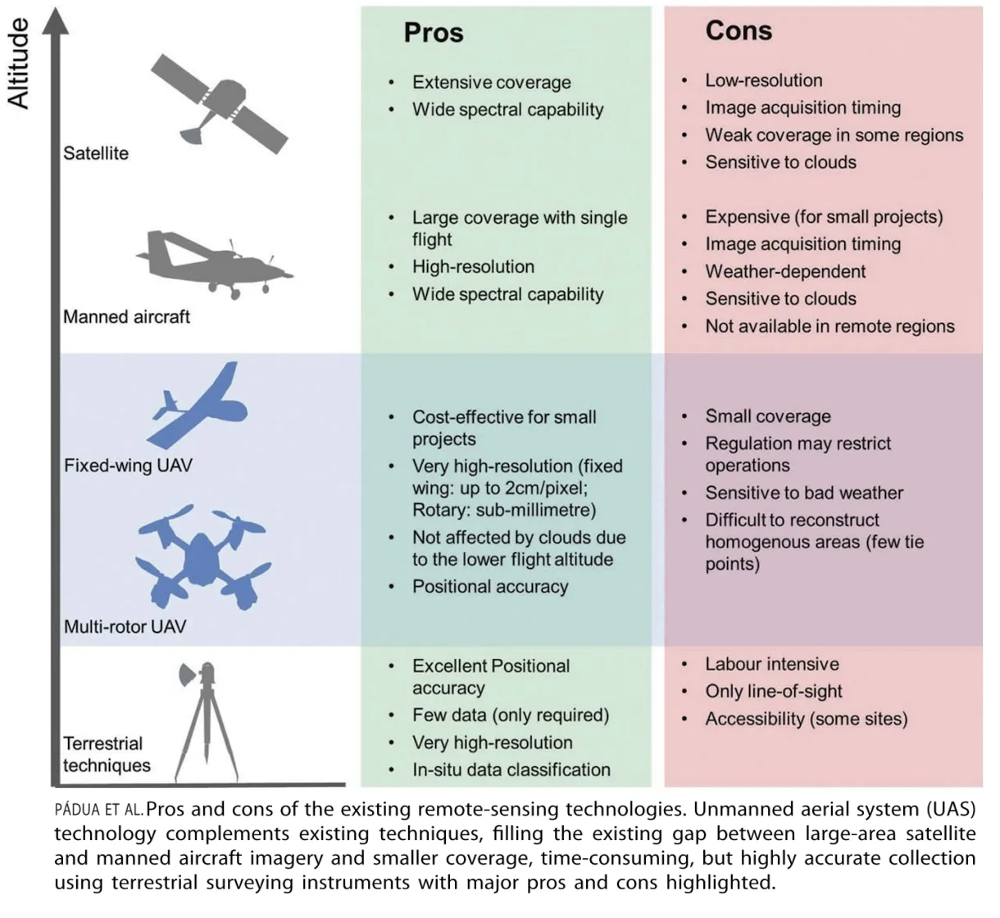

::: {.notes}
The figure places UAS in the data-acquisition spectrum between terrestrial survey and crewed-aircraft/satellite platforms: UAS win on spatial resolution and revisit flexibility, lose on coverage area. The course's premise is that this niche, centimeter-resolution mapping on demand, is now accessible to any trained geospatial analyst.
:::

## Barriers

- Constantly changing legislation and regulations
- Political and societal acceptance, privacy concerns
- Supply-chain and security restrictions on aircraft procurement

*... what do you consider a barrier in UAS development? What obstacles do you see for yourself as a potential UAS user?*

::: {.notes}
Close with the open discussion; typical student answers include cost, battery endurance, training burden, and airspace access, all worth affirming. The three listed barriers each get follow-up in this course: regulations in Lecture 1B, procurement policy from the platform-landscape slide, and societal acceptance in the best-practices discussion. Collect answers on the board; they make a nice callback in the final topic.
:::
