## Objectives

- **Understand** the role of the Federal Aviation Administration (FAA) in ensuring safety in the National Airspace System (NAS)
- **Recognize** the main types of UAS operations and distinguish between them
- **Name** the requirements for legal commercial UAS operations in the U.S., both for the pilot and for the UAS
- **Outline** the requirements for recreational flying under the 49 USC 44809 exception, including TRUST

::: {.notes}
Frame the lecture: last week was what UAS are; this week is when and how you may legally fly them. Emphasize that everyone in the room who ever launches a drone, even a 249 g toy in a park, falls under one of these rule sets. The recreational exception is a statute (49 USC 44809, from the 2018 FAA Reauthorization Act), while commercial rules are regulation (14 CFR Part 107, effective August 29, 2016).
:::

## Objectives

- **Know** the operating rules for commercial use of UAS (Part 107)
- **Understand** how airspace authorization works today (LAANC) and **recognize** permanent and temporary "no-drone-zones"
- **Understand** the role of the Certificate of Authorization (COA) for public agencies
- **Recognize** when educational use of UAS falls under the recreational exception and when it requires Part 107

::: {.notes}
Point out that this material changes often: the rules taught in this course in 2017 are substantially different from today's. Encourage students to always verify against faa.gov/uas rather than blog posts. Mapping work done for the university or a client is commercial in the FAA's eyes, so Part 107 is the rule set most relevant to this course.
:::

## Federal Aviation Administration (FAA) {.smaller}

::: {.columns}
::: {.column width="60%"}
- Created in 1958 in response to a series of fatal accidents and midair collisions involving commercial aircraft
- Mandated to develop plans and policies for the use of navigable airspace to ensure the safety of aircraft and the efficient use of airspace
- Since the creation of the FAA, American airspace has become one of the most regulated fields in the United States
:::
::: {.column width="40%"}
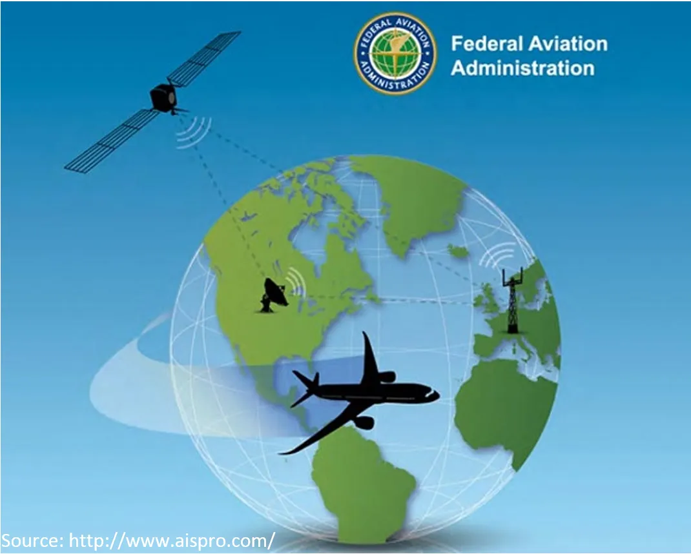
:::
:::

::: {.notes}
The 1956 Grand Canyon midair collision is the classic trigger event; the Federal Aviation Act of 1958 created the agency. The key takeaway for drone pilots: the FAA owns the airspace from the ground up. There is no unregulated altitude band below 400 ft; that figure is an operating limit, not a boundary of FAA authority.
:::

## National Airspace System (NAS)

::: {.incremental}
- Already congested with piloted aircraft, and adding a swarm of UAS requires thoughtful planning
- Main mandate: to ensure that UAS do not endanger current users of the NAS (including manned or other unmanned aircraft) nor compromise the safety of people and property on the ground
- The lack of detect-and-avoid capability of most current UAS technology remains a major concern for the FAA, and is the core problem the proposed Part 108 BVLOS rule tries to solve (more at the end of this lecture)
:::

::: {.notes}
Detect-and-avoid is the drone equivalent of "see and avoid" that manned pilots perform visually. Because a remote pilot cannot scan the sky from the cockpit, the default mitigations are visual line of sight and yielding right of way. This is the thread that connects most Part 107 operating rules, and the reason beyond-visual-line-of-sight flight currently requires a waiver. Foreshadow the Part 108 slide at the end.
:::

## Types of UAS operations

::: {.columns}
::: {.column width="60%"}
- **Commercial / civil**: any flight in furtherance of a business or non-recreational purpose, under **14 CFR Part 107**
- **Recreational**: strictly for personal enjoyment, under the **49 USC 44809** exception
- **Public aircraft operations**: government entities, under Part 107 or a **Certificate of Authorization (COA)**
- **Educational use** can fall under the recreational exception or Part 107, depending on the activity
:::
::: {.column width="40%"}
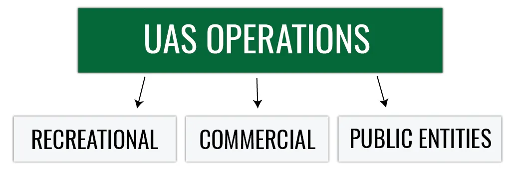
:::
:::

::: {.notes}
The 2018 FAA Reauthorization Act repealed the old "model aircraft" rule (Section 336) and replaced it with the 44809 recreational exception; the FAA no longer uses "model aircraft" as an operational category. Stress that intent, not the aircraft, determines the category: the same Mini 4 Pro is recreational in a park on Saturday and commercial when photographing a field site for a project.
:::

## Recreational use of UAS {.smaller}

::: {.columns}
::: {.column width="60%"}
- Operation of an unmanned aircraft strictly for **personal interests and enjoyment**
- Taking photographs for your own personal use is recreational
- Taking the same photographs for compensation, for sale, or in furtherance of any business (including research or coursework deliverables for pay) is a **commercial** operation under Part 107
:::
::: {.column width="40%"}
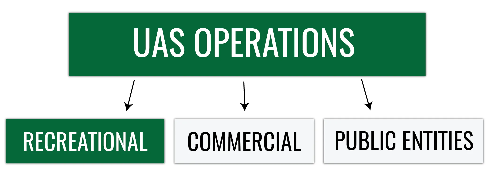
:::
:::

::: {.notes}
Useful test question for the class: is posting drone footage to a monetized YouTube channel recreational? (No; compensation makes it commercial.) Is flying to practice piloting skills for a future Part 107 job recreational? (FAA guidance says yes, if the flight itself is purely for enjoyment/proficiency.) The line is the purpose of the individual flight.
:::

## Recreational use - the 44809 exception {.smaller}

To fly recreationally without a Part 107 certificate you must follow **all** conditions of 49 USC 44809:

::: {.columns}
::: {.column width="60%"}
- Fly **strictly for recreational purposes**
- Pass **TRUST** (The Recreational UAS Safety Test) and carry proof of completion
- **Register** the aircraft if it weighs 250 g or more ([FAADroneZone](https://faadronezone-access.faa.gov/)) and comply with **Remote ID**
- Follow the safety guidelines of an FAA-recognized **Community Based Organization (CBO)**
:::
::: {.column width="40%"}
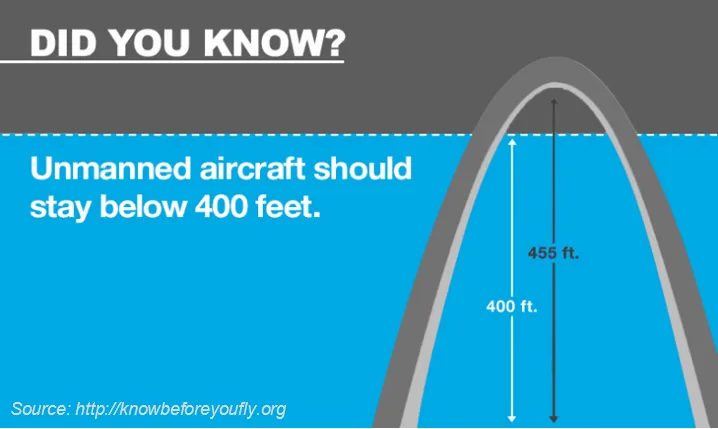
:::
:::

::: {.notes}
TRUST (required since 2021) is free, online, cannot be failed (wrong answers are corrected and re-asked), and takes about 30 minutes; proof must be shown to the FAA or law enforcement on request. Recognized CBOs include the Academy of Model Aeronautics and FPV Freedom Coalition; their published guidelines fill in operational detail the statute leaves open. Registration is $5 for 3 years and the number goes on the aircraft.
:::

## Recreational use - the 44809 exception {.smaller}

::: {.columns}
::: {.column width="60%"}
- Keep the aircraft within **visual line of sight** (or use a co-located visual observer)
- **Give way** to and never interfere with manned aircraft
- Fly at or below **400 ft** in uncontrolled (Class G) airspace
- In controlled airspace (Class B, C, D, E surface areas): fly only with a **LAANC** authorization or FAA authorization, at or below the UAS Facility Map altitude
:::
::: {.column width="40%"}
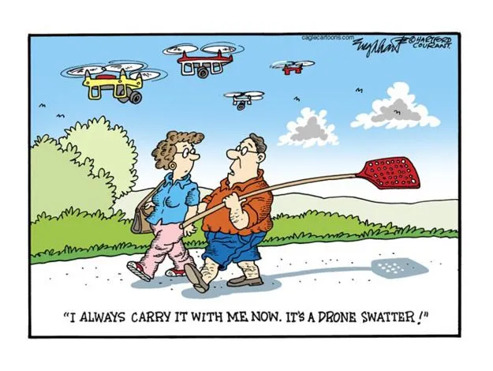
:::
:::

::: {.notes}
This slide is where the old rules differ most from current ones: the pre-2019 "notify airports within 5 miles" requirement is gone. Today recreational and commercial pilots use the same LAANC system for controlled-airspace authorization, covered in detail later in this lecture. UAS Facility Maps grid the airspace around airports into maximum authorized altitudes (often 0 ft near the runway ends).
:::

## Recreational use - safety practices {.smaller}

::: {.columns}
::: {.column width="60%"}
- Ensure the operating environment is safe and the operator is competent and proficient
- Do not fly over people or moving vehicles, and keep a safe distance from individuals and vulnerable property
- Do not fly near or over sensitive infrastructure (power stations, water treatment facilities, correctional facilities, heavily traveled roadways, government facilities)
- Do not fly in adverse weather such as high winds or reduced visibility
:::
::: {.column width="40%"}
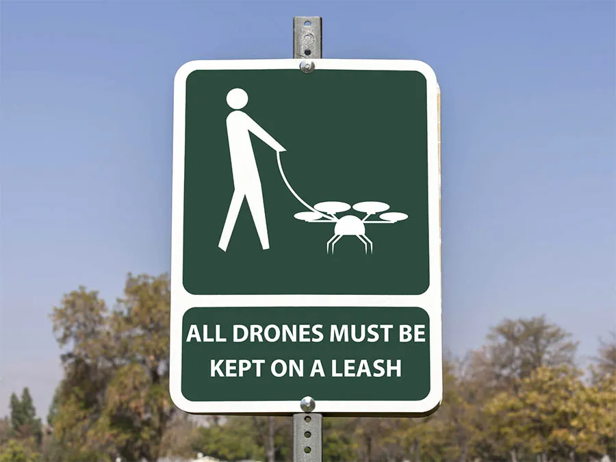
:::
:::

::: {.notes}
These practices come from the CBO safety guidelines that the statute requires recreational flyers to follow. They mirror many Part 107 rules, which makes the later transition to certificated flying easier. Wind is the practical one for mapping students: most small quads struggle above roughly 20 mph sustained wind, well before the flight becomes illegal it becomes useless for data quality.
:::

## Recreational use - safety practices {.smaller}

::: {.columns}
::: {.column width="60%"}
- Check and follow all local laws and ordinances before flying over private property
- Do not conduct surveillance or photograph persons where there is an expectation of privacy without permission
- Do not fly under the influence of alcohol or drugs
:::
::: {.column width="40%"}
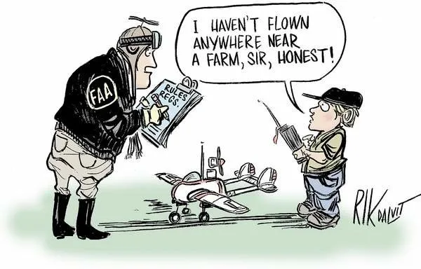
:::
:::

::: {.notes}
Privacy is mostly governed by state and local law, not the FAA. North Carolina's drone statutes (G.S. 15A-300.1) prohibit surveillance of persons or private property without consent, with civil damages available. Good discussion prompt: who enforces what? The FAA handles airspace violations; local police handle privacy, trespass, and harassment complaints.
:::

## Commercial use of UAS {.smaller}

Any use in connection with a business or work, including:

::: {.columns}
::: {.column width="60%"}
- Selling photos or videos taken from a UAS
- Providing contract services, such as industrial equipment or factory inspection
- Providing professional services, such as security or telecommunications
- Monitoring the progress of work your company is performing
- University research and mapping projects like the ones in this course
:::
::: {.column width="40%"}
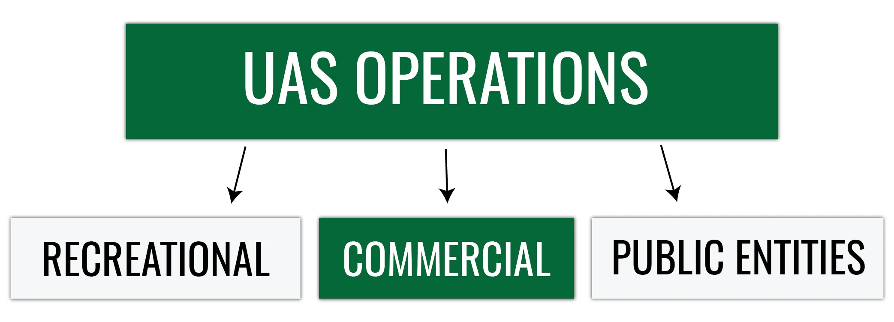
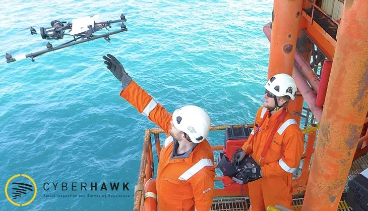
:::
:::

::: {.notes}
The FAA interprets "commercial" broadly: any flight in furtherance of a business or performed as part of one's job, whether or not money changes hands for the flight itself. Faculty research flights and most university data-collection missions are Part 107 operations. This is why the flight operations later in this course are conducted under Part 107 by certificated pilots.
:::

## Commercial use - Remote Pilot requirements {.smaller}

- Must be at least 16 years of age
- Be able to read, speak, write, and understand English
- Be in a physical and mental condition to safely fly a drone
- [Pass the initial aeronautical knowledge exam: "Unmanned Aircraft General - Small (UAG)"](https://www.faa.gov/uas/commercial_operators/become_a_drone_pilot/)

::: {.columns}
::: {.column width="60%"}
- Must pass the applicable Transportation Security Administration (TSA) vetting
- See the course [Step-by-Step Guide to Getting an FAA Part 107 License](../faa_part_107_guide.qmd)
:::
::: {.column width="40%"}
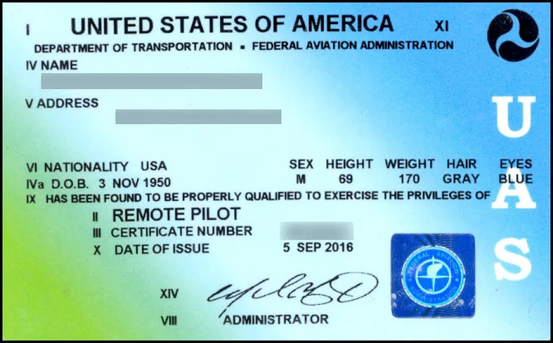
:::
:::

::: {.notes}
The knowledge test is 60 multiple-choice questions, 2 hours, 70% to pass, about $175 at a PSI testing center. Point students to the step-by-step guide on the course site; also note the certificate is not required for this course, but it is one of the most employable single credentials a geospatial student can add. Assignment 1B has them work through sample test questions.
:::

## Remote Pilot Certificate {.smaller}

::: {.columns}
::: {.column width="60%"}
### Requirements
- Must be easily accessible by the remote pilot during all UAS operations
- Certificate holders must complete free [online recurrent training](https://www.faa.gov/uas/commercial_operators/become_a_drone_pilot#keepCurrent) every 24 calendar months to maintain aeronautical knowledge recency (effective April 2021)
- [FAA Safety Team Part 107 Small UAS Training Course (login required)](https://www.faasafety.gov/gslac/ALC/CourseLanding.aspx?cID=677)
:::
::: {.column width="40%"}
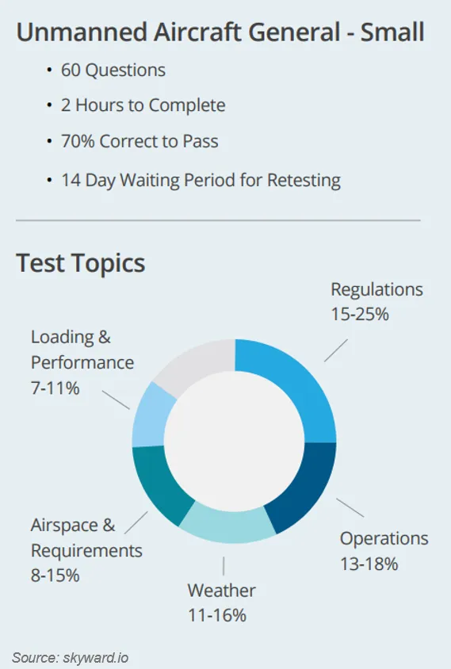{width=80%}
:::
:::

::: {.notes}
Before April 2021 keeping current meant paying to retake a proctored test every 24 months; now it is free online recurrent training (course ALC-677) that also covers the 2021 night-operations and operations-over-people rules. The certificate itself never expires; only recency lapses, and a lapsed pilot simply completes the training before flying again.
:::

## Commercial use - UAS requirements

::: {.columns}
::: {.column width="60%"}
- Must weigh less than 55 lbs
- Must be **registered** in [FAADroneZone](https://faadronezone-access.faa.gov/) ($5, valid 3 years)
- Must comply with **Remote ID**
- Must undergo a pre-flight check by the remote pilot in command
:::
::: {.column width="40%"}
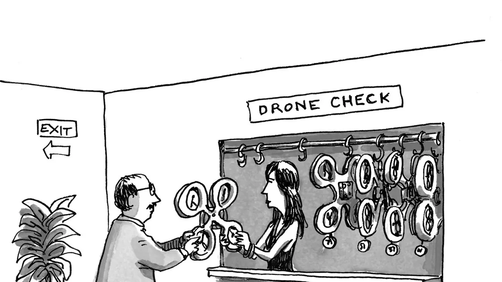
:::
:::

::: {.notes}
Under Part 107 every aircraft is registered individually regardless of weight (the 250 g threshold applies only to recreational registration). At 55 lbs and above you leave Part 107 entirely and need an exemption or airworthiness certification. The pre-flight check requirement (107.49) is where checklists, battery inspection, and control-link verification live; this becomes routine in the flight-planning topic.
:::

## Commercial use - location requirements

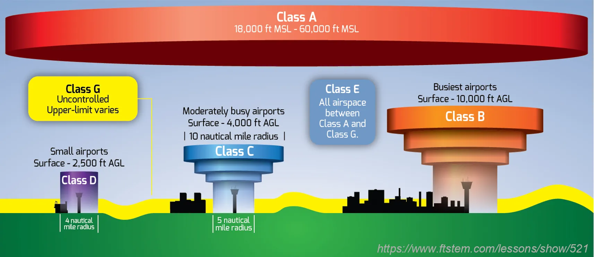{width=100% .center}

- Class B/C/D and Class E surface areas: operations require an **airspace authorization**, normally obtained through **LAANC**
- Class G (uncontrolled): may operate while following all other Part 107 rules, no authorization needed

::: {.notes}
Walk through the airspace classes on the figure from the top down: A (18,000 ft and above, irrelevant to sUAS), B around major hubs like Charlotte, C around mid-size towered airports like RDU, D around smaller towered airports, E controlled airspace that can extend to the surface, G uncontrolled. The practical question for every mission: is my site under controlled airspace that reaches the surface? If yes, get a LAANC authorization first.
:::

## LAANC - airspace authorization {.smaller}

**Low Altitude Authorization and Notification Capability**

::: {.columns}
::: {.column width="60%"}
- Automated, near-real-time FAA authorization for flights in controlled airspace, up to the altitude in the **UAS Facility Maps**
- Available to **both Part 107 and recreational** flyers
- Request through an [FAA-approved service supplier](https://www.faa.gov/uas/getting_started/laanc) app (e.g. Aloft, AutoPylot, Airspace Link)
- Above facility-map altitudes or where LAANC is unavailable: apply via [FAADroneZone](https://faadronezone-access.faa.gov/)
:::
::: {.column width="40%"}
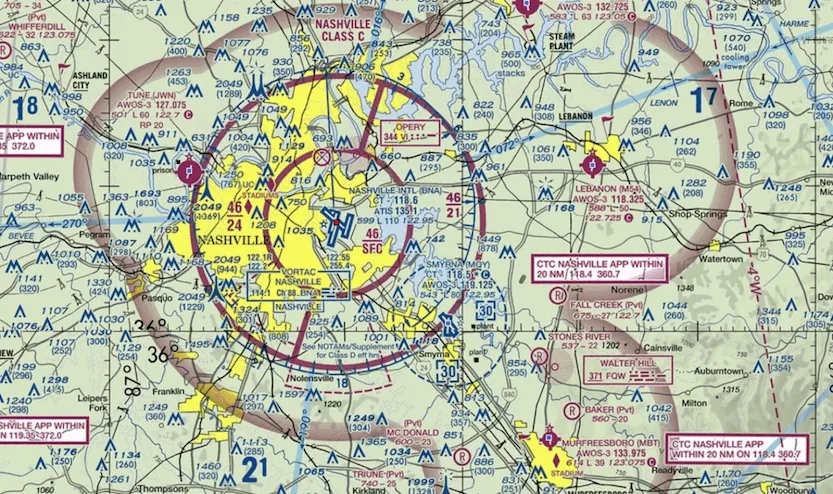
:::
:::

::: {.notes}
LAANC replaced the old call-the-tower and 5-mile-notification era: since 2018-2019 authorization is an app workflow that usually returns approval in seconds. Demo one supplier app live if possible, showing the UAS Facility Map grid around RDU: each grid cell shows the maximum altitude the FAA will auto-authorize, and zero-grid cells require a manual FAADroneZone application with longer lead time. This is the single most-used regulatory tool students will touch in practice.
:::

## Reading aeronautical charts {.smaller}

::: {.columns}
::: {.column width="50%"}

#### Line Pattern

- Solid line - higher class (more restrictive)
- Dashed line - lower class (less restrictive)

#### Line Color

- Blue line - higher class (more restrictive)
- Magenta line - lower class (less restrictive)

[FAA course on airspace classification](https://www.faasafety.gov/gslac/ALC/course_content.aspx?cID=42&sID=505&preview=true)
:::
::: {.column width="50%"}
#### This translates to:

- **Solid blue** - class B, **Solid magenta** - class C
- **Dashed blue** - class D, **Dashed magenta** - class E

Interactive charts: [VFRMap](https://vfrmap.com/), [SkyVector](https://skyvector.com/)
:::
:::

::: {.notes}
Chart reading is heavily tested on the Part 107 exam, so this slide maps directly to Assignment 1B question types. Suggest pulling up SkyVector on the Raleigh area and having students identify the RDU Class C shelves and the dashed magenta Class E surface areas nearby. Remind them that the sectional shows airspace; the UAS Facility Map shows what LAANC will authorize, and both are needed for mission planning.
:::

## Commercial use - operating rules

- Must fly at or below 400 feet above ground level (AGL), or within 400 feet of a structure if flying higher

::: {.columns}
::: {.column width="60%"}
- Must not fly from a moving vehicle unless in a sparsely populated area
- Must fly at or below 100 mph (87 knots)
- Must yield right of way to manned aircraft
:::
::: {.column width="40%"}
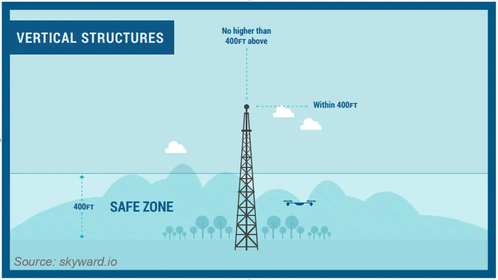
:::
:::

::: {.notes}
The 400-ft-of-a-structure allowance (107.51) exists for tower and building inspection: you may fly up to 400 ft above a structure's top while within a 400 ft radius of it. For mapping work in this course, flight altitude is chosen for ground sampling distance and is normally 200-400 ft AGL, so the ceiling rarely binds, but it matters when a site sits under a low LAANC grid altitude.
:::

## Commercial use - operating rules {.smaller}

::: {.columns}
::: {.column width="60%"}
- Must keep the UAS within **visual line of sight** (VLOS) of the remote pilot in command or a visual observer
- **Night operations** allowed without a waiver (since April 2021) if the pilot has completed current training and the aircraft has **anti-collision lighting** visible for 3 statute miles
:::
::: {.column width="40%"}
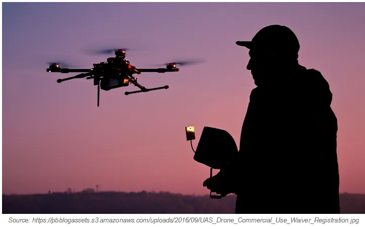
:::
:::

::: {.notes}
VLOS means unaided eyes (glasses fine, binoculars or FPV goggles alone do not count); an FPV pilot needs a visual observer next to them. The 2021 rule ended the era of night waivers: before it, daylight-only operation (old 107.29) was the most-waived rule in Part 107. Thermal mapping missions, which fly at night or dawn for temperature contrast, are the course-relevant beneficiary.
:::

## Remote ID {.smaller}

- UAS must broadcast identification, location, and control-station location during flight (rule effective 2021, enforced since **March 16, 2024**)
- Three ways to comply:
    - **Standard Remote ID** aircraft (built-in broadcast)
    - Aircraft with an attached **broadcast module** (VLOS only)
    - Fly without Remote ID only inside an **FAA-Recognized Identification Area (FRIA)**
- Applies to all aircraft that must be registered (recreational and Part 107)

::: {.notes}
Think of Remote ID as a digital license plate broadcast over WiFi/Bluetooth that anyone with a phone app can receive; the FAA and law enforcement can correlate it with registration data. FRIAs are fixed sites sponsored by CBOs and educational institutions, mostly model-aircraft fields. Practical note for the course: all recent DJI aircraft have standard Remote ID built in; check compliance for anything older or self-built.
:::

## Operations Over People - Categories 1-4 {.smaller}

Since April 2021, routine flight **over people** is allowed under Part 107 if the aircraft qualifies for one of **four categories** (14 CFR Part 107 Subpart D).

- Not to be confused with **airspace classes** B/C/D/E/G from earlier in this lecture
- Category is a property of the **aircraft** (weight, injury severity, certification), not of the pilot
- Sustained flight over **open-air assemblies** additionally requires Remote ID (Categories 1-3)

::: {.notes}
Set up the next four slides. Before 2021 any flight over a person outside your crew required a waiver; the Operations Over People rule made it routine, scaled to how much harm the aircraft could do. Emphasize the terminology trap: FAA "Category 1-4" (over-people) vs airspace "Class B-G"; the exam uses both. Also distinguish transiting over people (allowed per category) from sustained hovering over crowds.
:::

## Category 1 {.smaller}

**Eligibility:** aircraft weighs **0.55 lb (250 g) or less**, including everything attached.

**Requirements:**

- No exposed rotating parts that could lacerate human skin
- Remote ID required for sustained flight over open-air assemblies

**Operations:**

- May fly over people without a waiver or a Declaration of Compliance

**Example UAS:** sub-250 g aircraft such as the DJI Mini series or DJI Neo (with propeller guards where needed to meet the laceration requirement)

::: {.notes}
Category 1 is self-declared: no FAA paperwork, the operator just has to be right about the weight and the laceration criterion. This is a major reason the sub-250 g market segment exists; manufacturers engineer to sit under the threshold. Weight includes payload, so adding a prop-guard set or beacon can push an aircraft out of Category 1.
:::

## Category 2 and Category 3 {.smaller}

**Eligibility:** no weight limit; injury-severity based, demonstrated through an FAA-accepted **Means of Compliance** and a **Declaration of Compliance** by the manufacturer.

- **Category 2:** impact must not exceed the severity of **11 ft-lbs** of kinetic energy; no exposed lacerating parts; allows routine flight over people
- **Category 3:** impact must not exceed **25 ft-lbs**; **no flight over open-air assemblies**; over people only within a **closed or restricted-access site** with notice, or when people are under cover or in stationary vehicles

::: {.notes}
Categories 2 and 3 are manufacturer-certified, not operator-declared, and as of the mid-2020s very few aircraft hold accepted Declarations of Compliance, so these categories are rare in practice; most operators either stay in Category 1 or avoid flying over people entirely. The kinetic-energy thresholds translate to roughly a 2 lb and 4 lb aircraft at terminal velocity, though the tests are on impact severity, not weight.
:::

## Category 4 {.smaller}

**Eligibility:** aircraft holds an **airworthiness certificate** issued under Part 21, like a crewed aircraft.

**Requirements:**

- Operated within its approved flight manual limitations
- Maintenance, inspection, and record-keeping program required

**Operations:**

- May operate over people, including sustained flight over open-air assemblies, subject to the operating limitations in the certificate

::: {.notes}
Category 4 is the "certify it like an airplane" path, aimed at larger aircraft and future package-delivery style operations; it is out of reach for typical mapping platforms and no common survey drone uses it. For this course the takeaway hierarchy is: Category 1 if under 250 g, otherwise plan missions so you are not over people at all, which is standard practice for site mapping.
:::

## Waivers from Part 107 operating rules

- To operate outside Part 107 rules, apply for a **Certificate of Waiver** through [FAADroneZone](https://faadronezone-access.faa.gov/)
- The FAA grants waivers when the proposed operation can be performed safely with the applicant's proposed mitigations

::: {.notes}
The waiver process asks "how will you mitigate the risk this rule addresses?" and successful applications read like safety cases, not requests. Approval times run weeks to months, so waivers are planned mission infrastructure, not a quick fix. Since the 2021 rules absorbed night operations and some over-people flight, the dominant remaining waiver is beyond visual line of sight.
:::

## Waivable sections of Part 107 {.smaller}

::: {.columns}
::: {.column width="50%"}
- Operation from a moving vehicle or aircraft (§ 107.25)
- Visual line of sight aircraft operation (§ 107.31) - **the most requested waiver today (BVLOS)**
- Visual observer (§ 107.33)
- Operation of multiple small unmanned aircraft systems (§ 107.35)
:::
::: {.column width="50%"}
- Yielding the right of way (§ 107.37(a))
- Operation over people (§ 107.39, beyond the category rules)
- Operation in certain airspace (§ 107.41)
- Operating limitations for small unmanned aircraft (§ 107.51)
:::
:::

- No waiver will be issued to allow the carriage of property of another by aircraft for compensation or hire

::: {.notes}
BVLOS (107.31) waivers dominate because they unlock the economics of linear inspection, agriculture, and delivery: one pilot covering miles instead of a visual bubble. Daylight-only operation (old 107.29) used to top this list before the 2021 night rule removed the need. The carriage-for-hire exclusion is why drone delivery companies operate under separate exemptions and air-carrier rules, not Part 107 waivers.
:::

## Accident reporting (§ 107.9) {.smaller}

No later than **10 days** after an operation, the remote pilot in command must report to the FAA any operation of the small unmanned aircraft involving at least:

::: {.columns}
::: {.column width="60%"}
- Serious injury to any person or any loss of consciousness; or
- Damage to any property, other than the small unmanned aircraft, unless the cost of repair (including materials and labor) or fair market value of the property does not exceed **$500**
:::
::: {.column width="40%"}
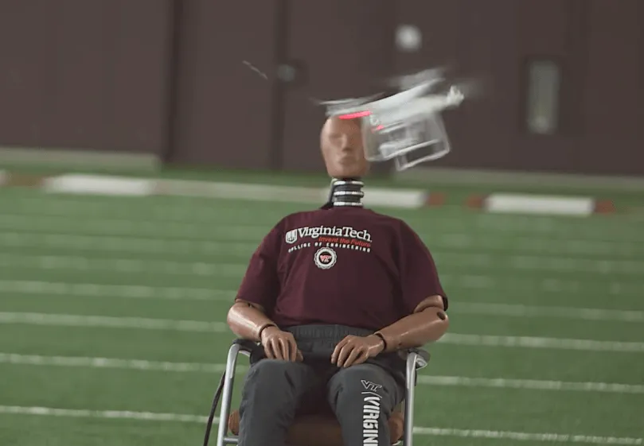
:::
:::

::: {.notes}
Reports go through FAADroneZone. Note what does not trigger a report: destroying your own aircraft, or minor property damage under $500. "Serious injury" follows the AIS Level 3 standard, roughly an injury requiring hospitalization. Universities typically layer their own incident reporting on top, which connects to the NC State UAS procedures linked from the part page.
:::

## Where NOT to fly

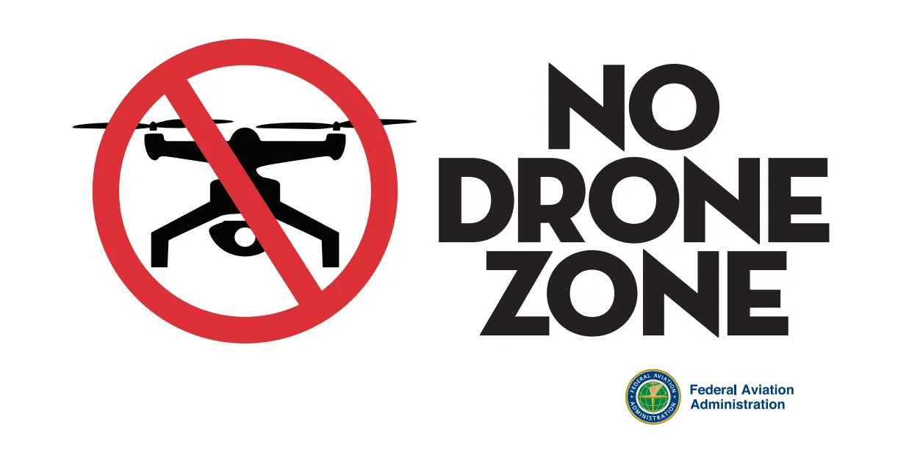{width=70%}

::: {.notes}
Transition into airspace restrictions. The no-drone-zone signage is public outreach; the legal substance is in the TFRs, special-use airspace, and security restrictions on the following slides. Best pre-flight habit: check a LAANC/B4UFLY-service app the day of the flight, since restrictions appear and move (wildfires, VIP movement, sporting events).
:::

## Airspace restrictions {.smaller}

::: {.columns}
::: {.column width="50%"}
- Security Sensitive Airspace Restrictions
- Temporary Flight Restrictions (TFRs)
- Restricted or Special Use Airspace
- Stadiums and sporting events
- Wildfires
- Controlled airspace around airports (LAANC)
:::
::: {.column width="50%"}
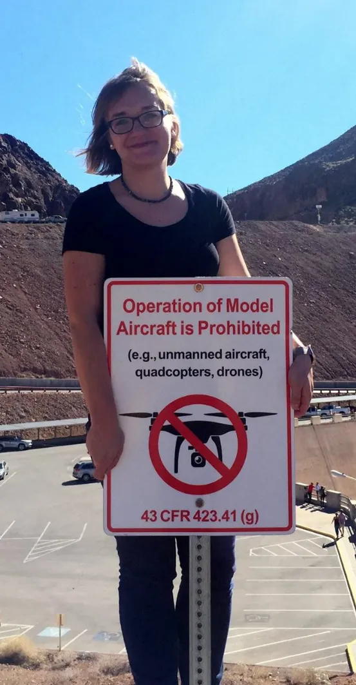{width=60%}
:::
:::

::: {.notes}
Preview the taxonomy: some restrictions are permanent and mapped (special use airspace, security areas), some are scheduled (stadium TFRs), some pop up with hours' notice (wildfire TFRs). All of them override any LAANC authorization you may hold. The next slides take them one at a time.
:::

## Security Sensitive Airspace Restrictions

::: {.columns}
::: {.column width="60%"}
- All UAS flights prohibited within the airspace
- Restrictions extend from the ground up to 400 feet AGL
- Apply to all types and purposes of UAS flight operations
- Remain in effect 24 hours a day, 7 days a week
:::
::: {.column width="40%"}
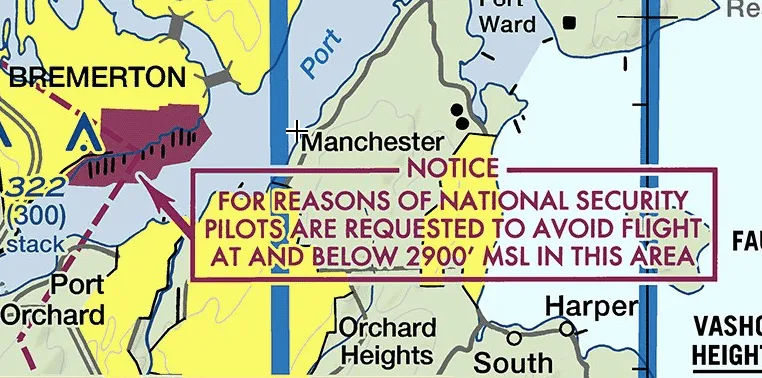

14 CFR § 99.7
:::
:::

::: {.notes}
These cover sites like military bases, national landmarks, and critical infrastructure designated at federal request. They are depicted on the FAA's UAS-specific maps rather than sectionals, another reason to check a drone-specific app rather than only a pilot's chart. Violations here draw federal attention quickly; some sites have counter-UAS authority.
:::

## Temporary Flight Restrictions

::: {.columns}
::: {.column width="60%"}
- TFR: airspace where flight is limited because of a temporary hazardous condition (wildfire, chemical spill) or a security-related event (VIP movement, large public events)
- The TFR text gives the details: size, altitude, effective times, and which operations are restricted or permitted
:::
::: {.column width="40%"}
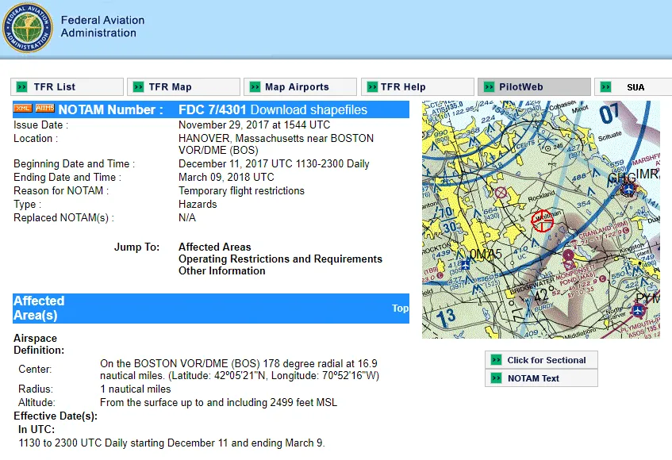

- [TFR map](https://tfr.faa.gov/tfr_map_ims/html/index.html)
- [TFR list](https://tfr.faa.gov/tfr2/list.html)
:::
:::

::: {.notes}
Presidential TFRs are the famous ones: a 30-nautical-mile ring that shuts down drone activity wherever the President travels, often on short notice. For fieldwork the operational lesson is to check TFRs the same day as the flight; a site that was clear during planning can be closed by a wildfire TFR the morning of the mission.
:::

## Restricted or Special Use Airspace

::: {.columns}
::: {.column width="60%"}
Types of Special Use Airspace include:

- Prohibited areas
- Restricted areas
- Warning areas
- Military operation areas (MOAs)
- Alert areas
- Controlled firing areas (CFAs)
:::
::: {.column width="40%"}
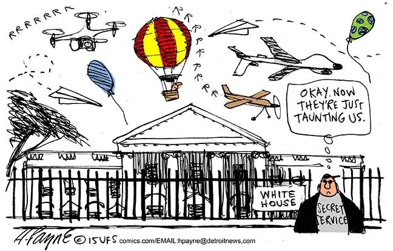

*The airspace surrounding Washington DC is the most restricted in the country*
[More info](https://www.faa.gov/uas/resources/community_engagement/no_drone_zone)
:::
:::

::: {.notes}
Prohibited areas (P-56 over the White House and National Mall) ban flight outright; restricted areas require permission from the using agency; MOAs and warning areas are legal but hazardous. North Carolina relevance: large MOAs and restricted areas sit east of Raleigh around Seymour Johnson AFB and the Dare County bombing range, which matters for coastal mapping projects.
:::

## Stadiums and sporting events

::: {.columns}
::: {.column width="60%"}
UAS operations are **prohibited** within a radius of **3 nautical miles** of the stadium or venue, from one hour before to one hour after, for:

- Major League Baseball
- National Football League
- NCAA Division One Football
- NASCAR Cup Series, IndyCar, and Champ Series races
:::
::: {.column width="40%"}
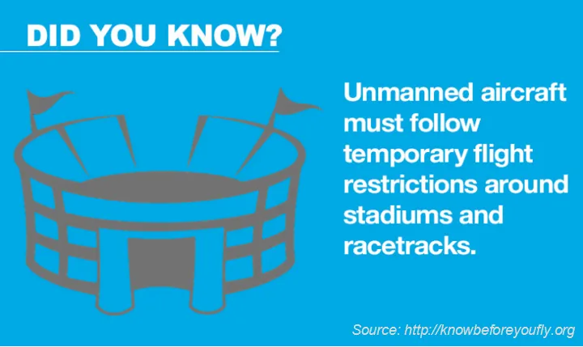
:::
:::

::: {.notes}
This is a standing TFR (FDC NOTAM 4/3621) up to 3,000 ft AGL. Local hook: Carter-Finley Stadium is on this list on football Saturdays, and the restriction covers a 3 nm radius, which reaches much of west Raleigh including parts of campus and Lake Wheeler Road. Check the game schedule before planning fall field days.
:::

## Wildfires

::: {.columns}
::: {.column width="50%"}
It is **illegal** to fly your UAS in or around a wildfire firefighting operation
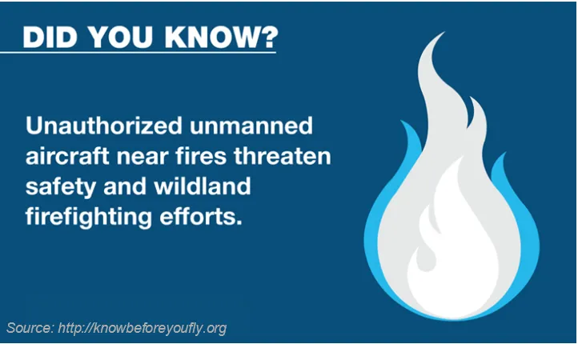{width=90%}
:::
::: {.column width="50%"}
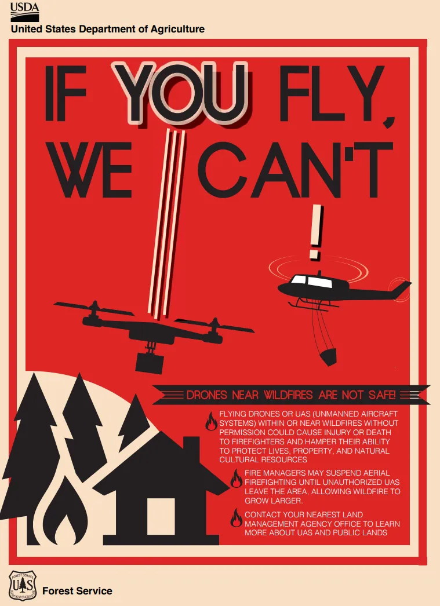{width=90%}
:::
:::

::: {.notes}
"If you fly, we can't" is the fire community's campaign line: a single drone sighting grounds firefighting aircraft. Wildfire TFRs carry civil penalties that can exceed $20,000 plus potential criminal liability. The legitimate path exists: public agencies fly fire-mapping missions under COAs in coordination with incident command, an application area from Lecture 1A.
:::

## Airports and controlled airspace {.smaller}

- There is **no** "notify within 5 miles" rule anymore; that pre-2019 requirement was repealed with Section 336
- Both recreational and Part 107 pilots need a **LAANC (or FAADroneZone) authorization** to fly in Class B, C, D, or surface Class E airspace
- Authorization is granted up to the **UAS Facility Map** altitude for the grid cell; near runways this is often **0 ft** (no automatic authorization)

::: {.columns}
::: {.column width="50%"}
:::
::: {.column width="50%"}
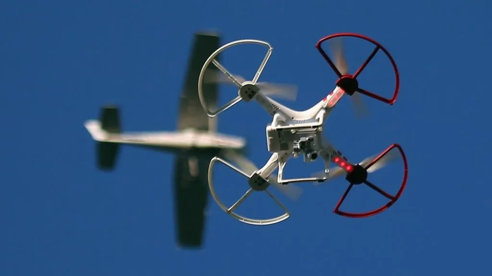
:::
:::

::: {.notes}
Called out explicitly because the 5-mile rule persists in older videos and blog posts and in some exam-prep material. The current logic is airspace-based, not distance-based: a site 4 miles from an airport in Class G needs nothing, while a site 8 miles away under a Class C shelf that reaches the surface needs authorization. Always resolve the question with a facility-map app, not distance.
:::

## Public entities {.smaller}

::: {.columns}
::: {.column width="50%"}
Publicly funded universities, law enforcement agencies, fire departments, and other government agencies have **two options:**

- Follow the same requirements and operating rules as commercial users (**Part 107**)

**OR**

- Operate as public aircraft under a blanket **Certificate of Authorization (COA)**
:::
::: {.column width="50%"}
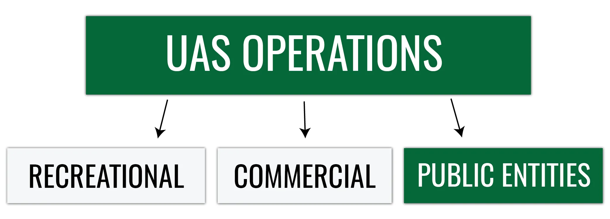
:::
:::

::: {.notes}
In practice most public entities, including most university flight programs, simply use Part 107 because it is simpler and their missions fit within it; COAs are reserved for operations Part 107 cannot cover, such as certain law-enforcement or emergency operations. Ask the class why an agency might still want a COA (self-certification of pilots, emergency provisions, operations outside Part 107 limits).
:::

## Certificate of Authorization

::: {.incremental}
**Can be obtained:**

- Only by government entities, such as federal and state agencies, law enforcement, and public colleges and universities
- Only for public (governmental) UAS aircraft operations

**Allows:**

- Flights at or below 400 feet in Class G airspace nationwide
- Self-certification of the UAS pilot
- Emergency COAs under special circumstances
:::

::: {.notes}
The blanket public COA is the standing nationwide authorization; operations outside it (higher altitudes, specific controlled airspace) need a jurisdictional COA for a defined area. Self-certification of pilots is the notable difference from Part 107: the agency, not the FAA, attests pilot qualification.
:::

## How to apply for a COA?

::: {.incremental}
- Applications are submitted online via the FAA's COA process
- Visit the [FAA website](https://www.faa.gov/about/office_org/headquarters_offices/ato/service_units/systemops/aaim/organizations/uas/coa/) for details on how to apply
- The average COA processing time is less than 60 days
- Expedited authorization is available in emergency and life-threatening situations
- [Sample COA Application](https://www.faa.gov/sites/faa.gov/files/about/office_org/headquarters_offices/ato/COA%2520Sample%2520Application%2520v%25201-1.pdf)
:::

::: {.notes}
Mostly reference material; students will not file COAs themselves, but they may work under one. Emergency COAs matter after disasters: post-hurricane mapping flights in North Carolina have operated under expedited authorizations coordinated with emergency management, a direct link to the change-detection applications later in the course.
:::

## Educational use {.smaller}

::: {.columns}
::: {.column width="60%"}
- Under **49 USC 44809(c)** and FAA educational-user guidance, students at accredited institutions may fly under the **recreational exception** as part of coursework (TRUST, registration, and all other 44809 conditions still apply)
- **Faculty-directed research** and flights that further university business generally require **Part 107**
- In this course, instructional flight operations are conducted under Part 107 by certificated pilots
:::
::: {.column width="40%"}

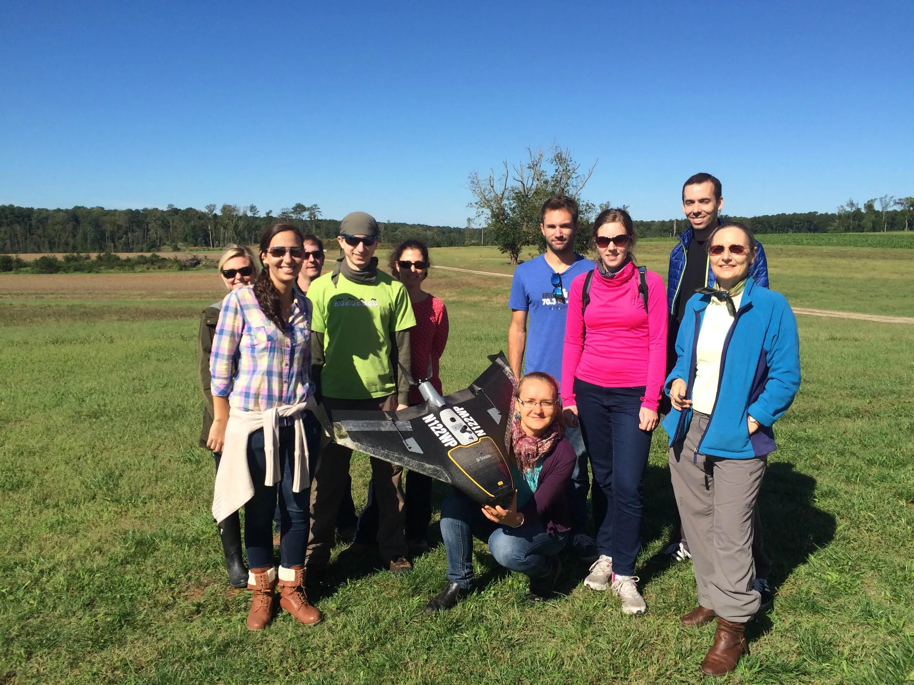
:::
:::

::: {.notes}
History for context: a May 2016 FAA legal interpretation first allowed student flying under model-aircraft rules; the 2018 Reauthorization Act wrote the concept into statute at 44809(c), and 2021 FAA guidance details when instructors and faculty can participate (limited assistance is fine; directing research flights is not recreational). The safe institutional default is Part 107 for anything tied to funded research.
:::

## UAS best practices {.smaller}

::: {.columns}
::: {.column width="60%"}
- If you can, tell other people you'll be taking pictures or video of them before you do so
- If someone has a reasonable expectation of privacy, don't violate it by taking pictures or video, unless you've got a very good reason
- Don't fly over other people's private property without permission if you can easily avoid doing so
:::
::: {.column width="40%"}
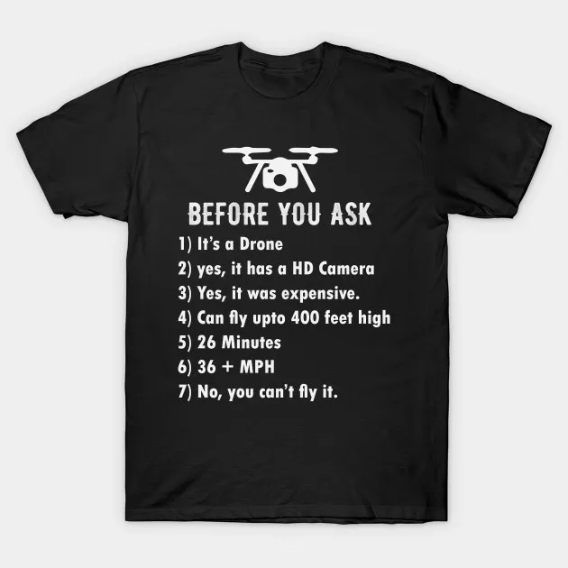
:::
:::
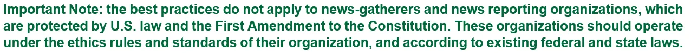

::: {.notes}
These come from the NTIA voluntary best practices for UAS privacy: not law, but the professional norm, and often stricter than what the FAA requires. For mapping projects, landowner permission for takeoff, landing, and ground control points is both courteous and usually a practical necessity; the FAA governs the air, but the launch site is property law.
:::

## UAS best practices {.smaller}

::: {.columns}
::: {.column width="60%"}
- Don't gather personal data for no reason, and don't keep it for longer than you have to
- If you keep sensitive data about other people, secure it against loss or theft
- If someone asks you to delete personal data about him or her that you've gathered, do so, unless you've got a good reason not to
:::
::: {.column width="40%"}

- Don't harass people with your drone
:::
:::

::: {.notes}
Data-handling practices map directly onto research-data management: orthophotos of residential areas contain personal data (faces, vehicles, backyards), and IRB or data-management plans may govern retention. Good habit to teach: plan flight lines to minimize capture of areas outside the study site rather than cropping afterwards.
:::

## Current developments - BVLOS and Part 108 {.smaller}

- The biggest open problem from earlier in this lecture: **beyond visual line of sight (BVLOS)** flight without a waiver
- The FAA published the proposed **Part 108** rule (Notice of Proposed Rulemaking, August 2025) to enable routine BVLOS operations
- Built on automated traffic awareness/deconfliction services and aircraft airworthiness acceptance instead of one-off waivers
- Expect the regulatory landscape to keep shifting; **always check [faa.gov/uas](https://www.faa.gov/uas) for current rules**

::: {.notes}
Close the loop with the detect-and-avoid concern from the NAS slide: Part 108 is the FAA's answer, replacing case-by-case BVLOS waivers with a performance-based rule using strategic deconfliction and third-party services. Check the current rulemaking status before lecture and update the class, since the final rule may land during or after this semester. Good discussion prompt: which mapping applications change most if BVLOS becomes routine? (Corridor mapping, large-area agriculture, disaster response.)
:::

## Resources {.smaller}

::: {.columns}
::: {.column width="50%"}
- [FAA UAS home](https://www.faa.gov/uas) - start here, always current
- [Recreational flyers and TRUST](https://www.faa.gov/uas/recreational_flyers)
- [LAANC and approved service suppliers](https://www.faa.gov/uas/getting_started/laanc)
- [FAADroneZone](https://faadronezone-access.faa.gov/) - registration, waivers, reports
- [Operating UAS in North Carolina](https://www.ncdot.gov/aviation/uas/)
- [Aviation Weather Center](https://www.aviationweather.gov/)
:::
::: {.column width="50%"}
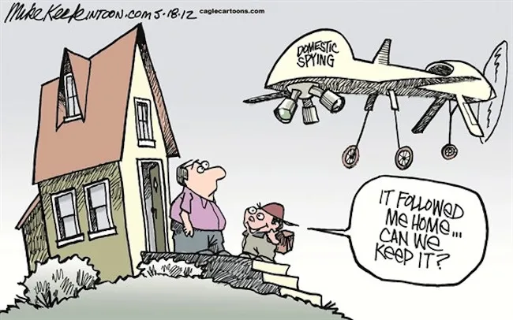
:::
:::

::: {.notes}
Point students at faa.gov/uas as the single source of truth and remind them Assignment 1B (Part 107 sample questions) is where this lecture becomes graded work. The NCDOT page matters because North Carolina additionally requires a state UAS operator permit for commercial and government operations in the state, a detail many out-of-state guides miss.
:::
