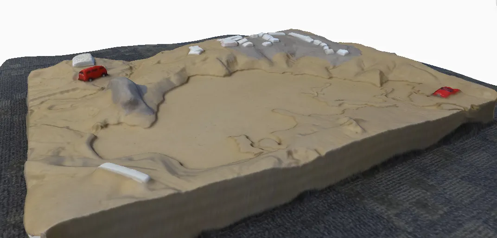
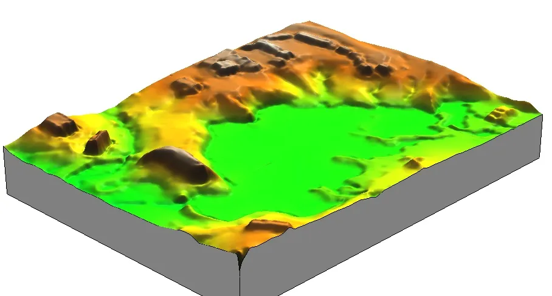
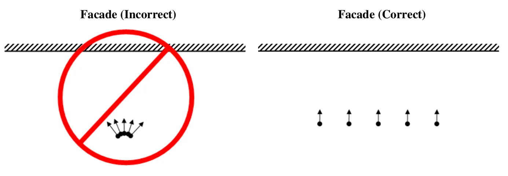
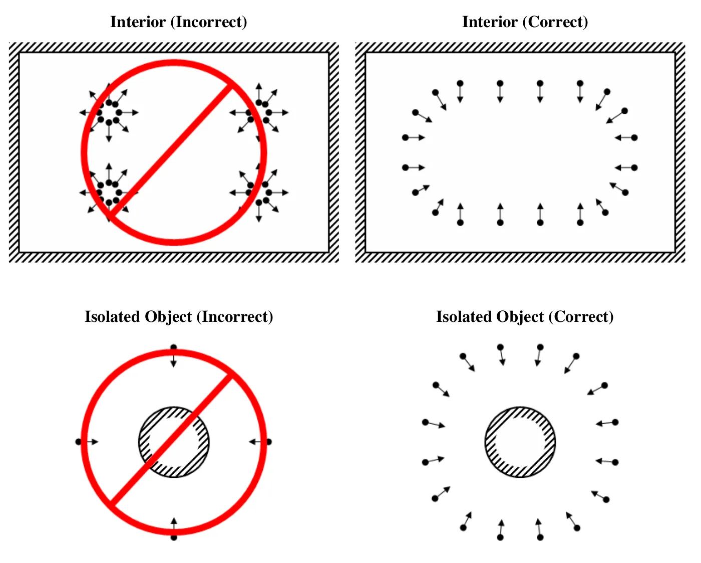

## Task

Run an experiment on how the number and orientation of photos, the lighting, and the shape and surface of the photographed object affect its 3D reconstruction from multiple overlapping images.

Select an object in your office, at home, or outside. Take multiple overlapping photos of it with a camera or phone and build a 3D model with one of the software options below. Keep the zoom fixed during a capture session unless testing zoom changes is part of your experiment. Then vary one factor and rebuild, so that you end up with at least two models to compare: fewer photos, a different camera path, different light, added surface features, or a second camera (for example a phone against a dedicated camera). Compare the models and explain the differences.

::: {.columns}
::: {.column width="50%"}
{fig-alt="Textured 3D model of a sand terrain model with roads and buildings, reconstructed from photographs"}
:::
::: {.column width="50%"}
{fig-alt="Color-shaded digital elevation model interpolated from the exported point cloud of the terrain model"}
:::
:::

## Software

Use any Structure from Motion tool. The two the course uses are listed first; the rest are good alternatives, all free for students.

- [Agisoft Metashape Professional](https://www.agisoft.com/) : the software used for aerial processing in Assignment 2B. Windows, macOS, and Linux. A license is provided for every student in this class; the installer is on the [Agisoft download page]() and the activation instructions will be provided on Moodle.
- [WebODM](https://webodm.org/) : free and open source, the software used for drone mapping in Assignment 2C. Native installers for Windows and macOS, Docker on Linux; 8 GB RAM minimum. It processes aerial and ground images, nadir or oblique, so it works for this assignment too, though its defaults are tuned for mapping flights rather than small objects. 

  >Since April 2026 WebODM is an independent project (github.com/WebODM); the "OpenDroneMap Desktop" installer sold by the OpenDroneMap organization is a different product.

- [RealityScan](https://www.realityscan.com/) 2.2 (Epic Games, formerly RealityCapture): free for students and educators. The desktop application is Windows only, installed through the Epic Games Launcher, and needs an NVIDIA or AMD GPU; the mobile app for iOS and Android is free as well.
- [COLMAP](https://colmap.github.io/) 4.1: free and open source. Windows binaries with and without CUDA on the [releases page](https://github.com/colmap/colmap/releases), Homebrew on macOS, packages on Linux. See the notes below.
- [Meshroom](https://alicevision.org/) 2025.1 (AliceVision): free and open source, Windows and Linux only; the binaries are built for NVIDIA CUDA GPUs.
- [Polycam](https://poly.cam/): iOS, Android, and web. The free tier caps a capture at 150 photos and exports only glTF, which is fine for the optional model submission.

:::{.callout-tip}
- **On a Mac?** Metashape, WebODM, COLMAP (Homebrew), or Polycam.
- **No NVIDIA GPU?** Metashape and WebODM run on the CPU; COLMAP and Meshroom need CUDA for the dense step (with COLMAP, stop after sparse reconstruction), and RealityScan needs a discrete GPU.
:::

### Good starting points

A first attempt that works is worth more than an ambitious one that fails to align. Pick one of these, get a clean model, then run your experiment as variations on it.

- **A shoebox-sized object with a matte, textured surface**: a hiking boot, a carved bowl, a potted plant with its pot, a rock with visible grain. On a table in even indoor light, or outside in shade. 40 to 60 photos in two rings around the object at different heights, plus 5 or 6 looking down from above, each photo overlapping the last by more than half.
- **A fixed outdoor object**: a fire hydrant, a tree stump, a boulder, a small sculpture. Overcast light or open shade. 60 to 100 photos in two full circuits at two distances, keeping the object filling the frame.
- **A building corner or a section of facade** with windows and brick or siding, from the sidewalk. 80 to 120 photos in a slow walk along the facade with the camera pointed at it, then a second pass from farther back or at a different height.

Variations that produce a clear result in the report: use half the photos; keep one ring only; stand in one spot and rotate instead of walking around; shoot in direct sun versus shade; cover a shiny or plain surface with tape or newspaper and rebuild; capture the same object with a phone and a dedicated camera. Objects that usually fail, and are worth avoiding for the baseline: glass, polished metal, plain white walls, anything that moves in the wind.

### Photo capturing guidelines

Adapted from the [Agisoft Metashape user manual](https://www.agisoft.com/pdf/metashape-pro_2_3_en.pdf).

- Use a camera with reasonable resolution (5 MP or more); a modern phone camera is fine.
- Avoid ultra-wide-angle and fisheye lenses.
- Prefer a fixed focal length. With a zoom lens, keep it at either the minimum or the maximum for the whole session.
- Use the lowest ISO you can; high ISO adds noise.
- Capture sharp, well-exposed photos. Avoid blur, flash, and light sources inside the frame.
- Avoid untextured, shiny, reflective, or transparent objects, and objects that move between photos.
- Avoid completely flat objects or scenes.
- Fill the frame with the object; portrait orientation can help. The whole object does not need to fit in every photo as long as every part appears in several photos.
- More photos than you think you need is better than too few.
- Move the camera around the object. Standing in one spot and rotating the camera does not produce parallax, the apparent shift of a feature between photos taken from different positions, and without parallax the software cannot triangulate depth.

{width="80%" fig-align="center" fig-alt="Diagrams of camera positions for photographing a facade and an interior: rotating in one spot marked incorrect, moving the camera between overlapping positions marked correct"}

{width="80%" fig-align="center" fig-alt="Diagrams of camera positions for an isolated object: a few photos from one side marked incorrect, a full ring of overlapping photos around the object marked correct"}

### COLMAP notes

COLMAP is a general-purpose Structure from Motion and Multi-View Stereo pipeline with a graphical and a command-line interface. On Windows, download the binaries from the [COLMAP releases page](https://github.com/colmap/colmap/releases), unzip, and run `COLMAP.bat` to start the graphical interface; on macOS, install with `brew install colmap` and run `colmap gui`. Dense reconstruction requires an NVIDIA GPU with CUDA; without one, stop after the sparse reconstruction.

The video below (no audio) loads about 20 images of a physical terrain model and runs the full pipeline. Notice that you can inspect keypoints, matches, and the links between cameras and reconstructed points.

::: {.callout-note}
If you have CUDA, stereo reconstruction can crash COLMAP with a GPU timeout. See the [COLMAP FAQ](https://colmap.github.io/faq.html#fix-gpu-freezes-and-timeouts-during-dense-reconstruction) for the fix.
:::

<iframe width="853" height="480" src="https://www.youtube.com/embed/sHW0f6R0rbI?rel=0" frameborder="0" gesture="media" allow="encrypted-media" allowfullscreen></iframe>

## Report

Prepare a short report (2 to 4 pages including figures) on your 3D modeling experiment:

1. **Setup**: the object, the camera (make, model, or phone), the software, and the capture conditions (indoor or outdoor, lighting).
2. **Experiment**: what you varied (number of photos, camera path, light, surface features, camera) and how many photos went into each model.
3. **Results**: screenshots of each model, including the reconstructed camera positions. Point out holes, noise, distortions, or missing parts.
4. **Discussion**: which factors mattered most, and why, using the concepts from the lecture (overlap, texture, parallax, lighting).

If you would like your model added to the [OSGeoLab Sketchfab collection](https://sketchfab.com/osgeolab/collections/classroom-models) of models from previous offerings of this course, add this line at the end of your report and include the model file in your submission:

> I agree for my 3D model to be uploaded to the OSGeoLab Sketchfab collection and I want / do not want my name listed as an author in the model description.

## Submission

Upload to Moodle, Assignment 2A:

* Your report as a PDF.
* Optional: your 3D model, preferably as an OBJ with its MTL and texture image files, or as a GLB, zipped into one archive.

## Grading

* **Setup**: object, camera, software, and capture conditions stated clearly enough to interpret the results.
* **Experiment design**: at least one factor varied deliberately, with the models compared side by side.
* **Results**: figures show the models and camera positions clearly, with the problems identified.
* **Discussion**: differences are explained with the lecture concepts, not just described.
* On-time submission.

### Due 
