## Task

Generate an orthomosaic and a digital surface model (DSM) from UAS photographs in Agisoft Metashape Professional , using ground control points, and explain the processing report the software produces, including the accuracy of your products.

The photos were taken by a Trimble UX5 fixed-wing UAS on September 22, 2016 over the NC State Lake Wheeler Road Field Laboratory ([map](https://www.openstreetmap.org/?mlat=35.7260&mlon=-78.7020#map=15/35.7260/-78.7020)). Processing can be time consuming, so the lab uses a subset of the flight and images downsampled by 50 percent. That is enough to finish in class; the same steps apply to a full flight at full resolution.

Metashape 2.x renamed several workflow steps. The instructions use the current names, with the older name in parentheses the first time it appears, so that older tutorials and videos still make sense. The screenshots are from Metashape 1.x and may show the old dialog names.

Keep your exported products and the processing report: [Assignment 2C](assignment_2c.qmd) processes the same imagery in WebODM and compares the two.

### Workflow overview (with GCPs)

- [Stage 1](#stage-1-aligning-photos): load photos and camera positions, align them (a preliminary model to place the GCPs on)
- [Stage 2](#stage-2-placing-gcps): place the GCPs and optimize the alignment
- [Stage 3](#stage-3-building-geometry-and-products): build the point cloud, model, DEM, and orthomosaic
- [Stage 4](#stage-4-exporting-results): export the products and generate the report

## Preparation

### Data

- [Download the data](): photos, the flight log, and the coordinates of 3 GCPs
- Or use your own data set, with a flight log or geotags and GCP coordinates

### Software

- Agisoft Metashape Professional  ([installer]()). A license is provided for every student in this class; the activation instructions are on Moodle.

### Preferences

Set these once, the first time you run Metashape; they are kept for later sessions.

#### Menu > Tools > Preferences

**General tab**: leave the defaults (optionally enable "Write log to file" to keep a text log of every run).

**GPU tab**: check "Use CPU when performing GPU accelerated processing" at the bottom. Your GPU, if Metashape detects one, is listed here and should be checked.

**Advanced tab**:

- Project files: Keep key points `disabled`, Keep depth maps `disabled`, Store absolute image paths `disabled`
- Export/Import: enable all
- Miscellaneous: Enable fine-level task subdivision `enabled`

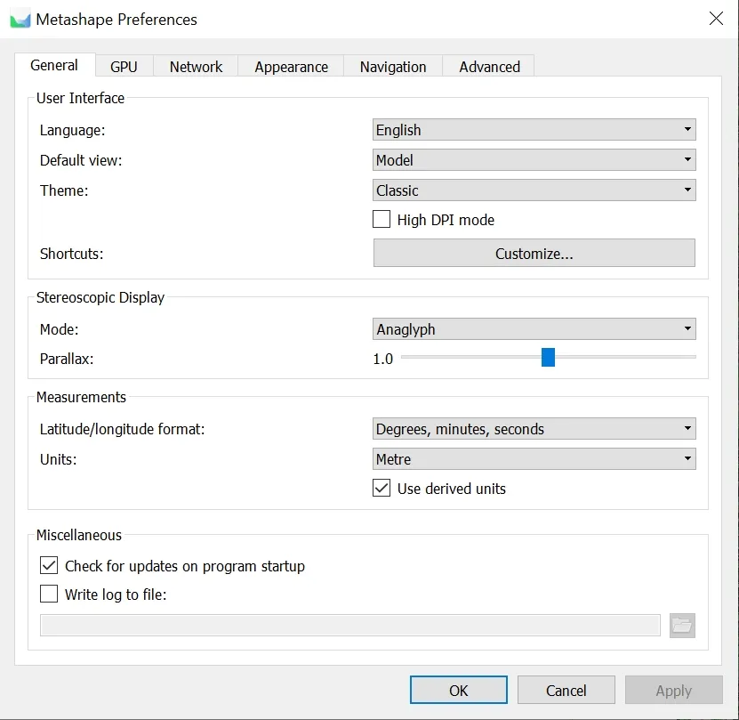

## Stage 1: Aligning photos

A preliminary alignment is needed before the GCPs can be located on the photos.

### Adding photos

#### Menu > Workflow > Add Photos

Select all the photos in the downloaded folder. They appear in the Reference pane with local coordinates, because the coordinate system has not been set yet.

Click the Settings icon 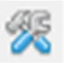{width=25} in the Reference pane toolbar and set the coordinate system to `WGS 84 (EPSG:4326)`.

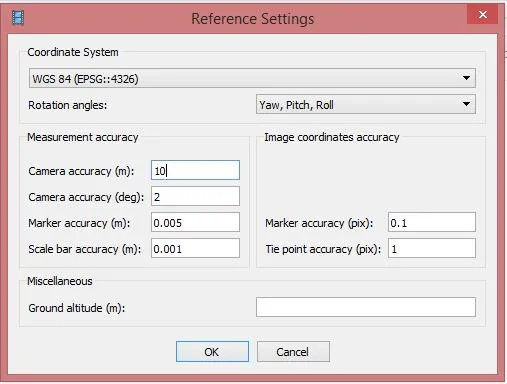

::: {.callout-note}
The Settings dialog also holds the accuracy weights the adjustment uses:

- **Camera accuracy (m)**: positional accuracy of the camera geotags, typically 2.5 to 10 m for a standard GNSS receiver, centimeters with RTK or PPK.
- **Camera accuracy (deg)**: accuracy of yaw, pitch, and roll; use a large value (2 degrees or more) unless the attitude was measured precisely.
- **Marker accuracy (m)**: accuracy of the surveyed GCP coordinates, usually 0.01 to 0.05 m; x/y and z can be set separately.
- **Scale bar accuracy (m)**: accuracy of measured distances between markers, often 0.001 m.
- **Marker accuracy (pix)**: how precisely a marker can be placed on an image; 0.1 px for printed targets, 0.5 px for natural features.
- **Tie point accuracy (pix)**: weight of the automatically detected points, typically 0.5 to 1 px.

For this flight leave the defaults.
:::

### Loading camera positions

Click the Import icon 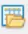{width=25} in the Reference pane toolbar and select the camera positions file `2016_09_22_sample.txt`.

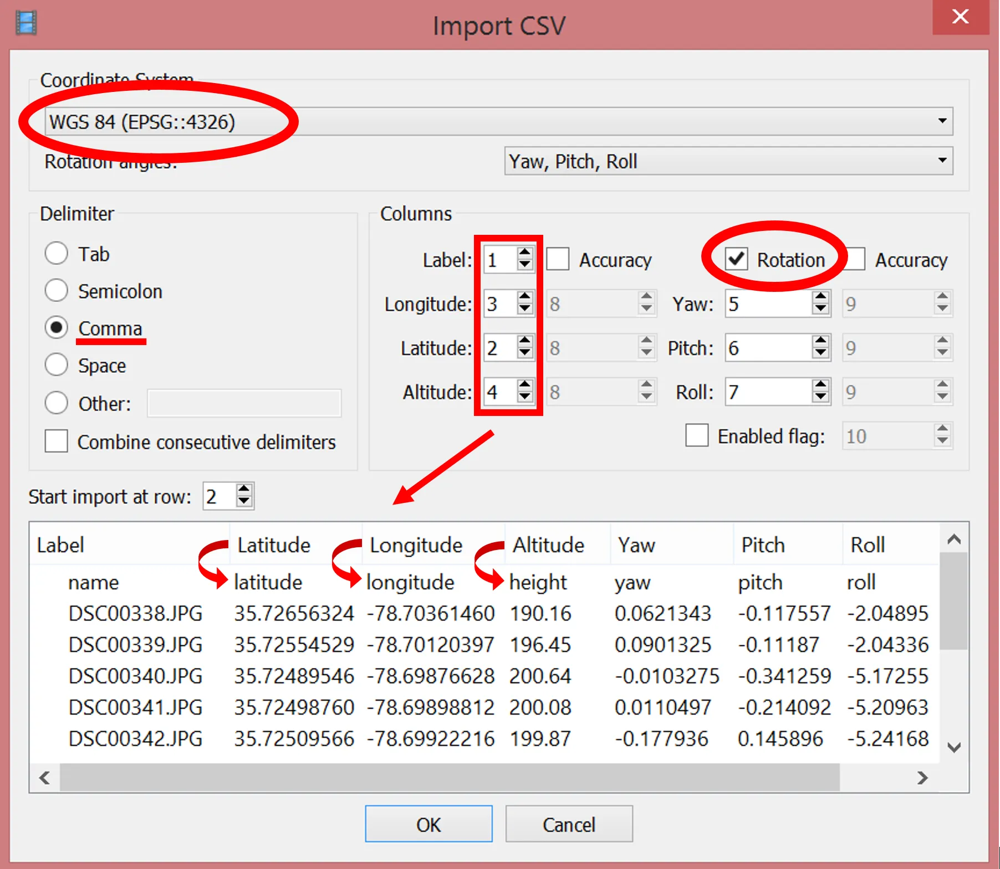

::: {.callout-note}
Metashape reads camera orientation files in .csv, .txt, .tel, .xml, and .log formats. The Trimble Aerial Imaging log is a .jxl file; the provided .txt is a converted copy. To convert your own, use [jxl2csv by Vaclav Petras](https://github.com/wenzeslaus/jxl2csv).
:::

Check that the columns are mapped correctly (name, latitude, longitude, altitude, yaw, pitch, roll); the column numbers can be adjusted at the top right of the dialog.

### Aligning photos

#### Menu > Workflow > Align Photos

- Accuracy: `Low` (fast; enough to place the GCPs)
- Generic preselection: `enabled`
- Reference preselection: `enabled`, `Source`
- Key point limit and tie point limit: `default`
- Adaptive camera model fitting: `enabled`

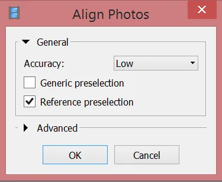

Click Save 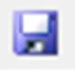{width=25} in the toolbar.

## Stage 2: Placing GCPs

### Loading the GCP coordinates

Click the Import icon {width=25} in the Reference pane toolbar and select the GCP file `GCP_3.txt`.

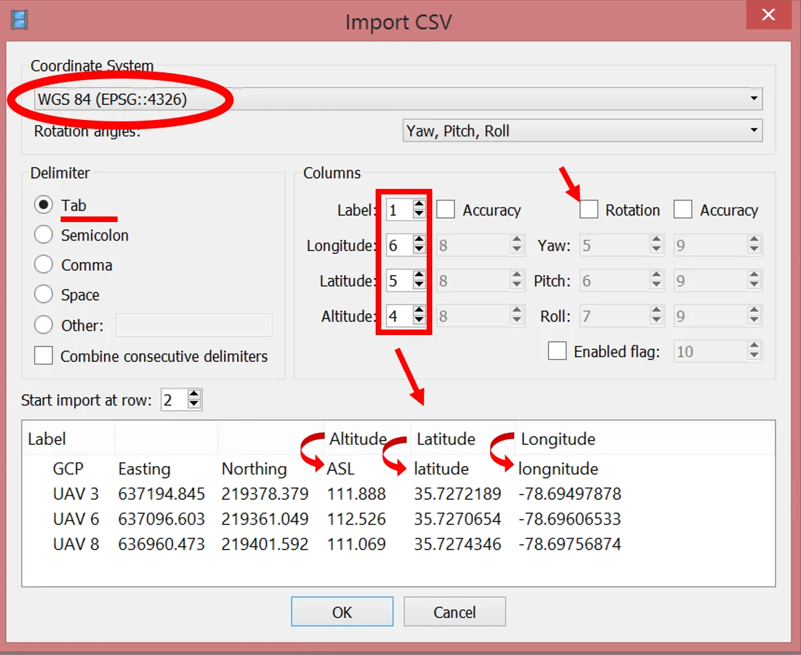

Check the column mapping and uncheck *Rotation*: GCPs are stationary and have no yaw, pitch, or roll.

Metashape asks *Can't find match for 'UAV 3' entry. Create new marker?* Choose *Yes to All*; one marker is created for each named GCP in the file, listed in the Reference pane below the cameras.

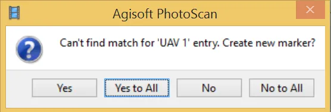

### Placing the markers on the photos

Each GCP now has to be located on every photo that shows it. The [instructional video](https://www.youtube.com/watch?v=nnKJWev7Jyc) shows the process.

The Model pane shows the approximate marker positions; they are easier to see with cameras hidden (*Menu > View > Show/Hide Items > Show Cameras*).

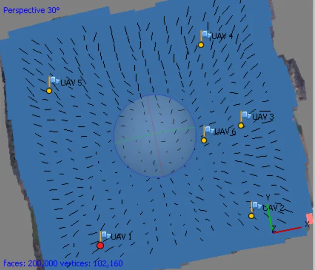
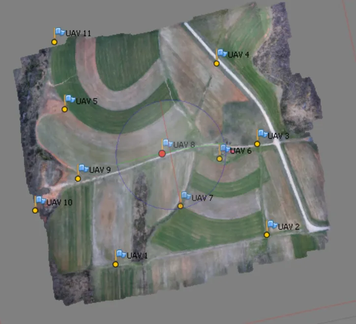

Right-click a marker in the Reference pane and choose `Filter Photos by Marker`.

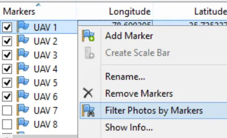

The Photos pane now lists only the images that probably show the selected GCP.

::: {.callout-note}
This filter works because the photos are geotagged. With non-geotagged photos, or a site you do not know, build the point cloud or even the model and texture first (the steps in Stage 3) so that the Model pane shows a recognizable preview of the area rather than only tie points.
:::

Double-click a photo thumbnail to open it next to the Model pane. The marker appears as a grey icon 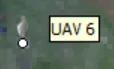{width=45}; drag it onto the center of the target.

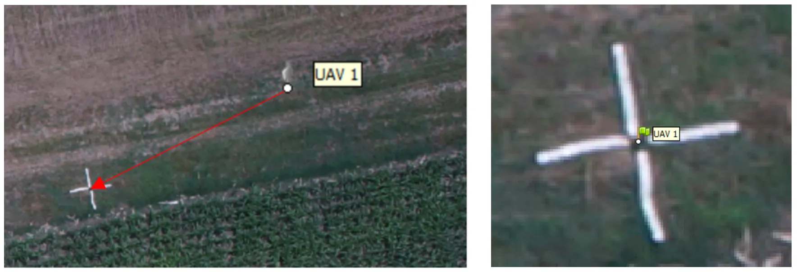

Once placed, the marker turns into a green flag: it is enabled and will be used in the adjustment.

Repeat on the next photo. After the marker has been placed on two photos, Metashape predicts its position on the remaining photos closely; drag it slightly to enable it (green flag) or leave it grey to exclude that photo.

Filter photos by marker again after each marker: as the positions improve, more photos that show the GCP appear in the Photos pane.

This lab uses 3 GCPs, the mathematical minimum for defining the coordinate system. Reliable error estimates need at least 4, and 5 or more spread across the site, including its center, keep the terrain from tilting or doming. Real projects also withhold some surveyed points as checkpoints to measure the error independently.

Click Save {width=25}.

### Optimizing the alignment

Click View Errors 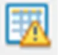{width=25} in the Reference pane to see the current errors. The best results come from optimizing twice: first on the camera coordinates only, then on the GCP markers only.

In the Reference pane, leave all cameras checked and uncheck all markers (select one, press Ctrl+A, right-click, `Uncheck`), so that this first pass adjusts on the camera coordinates only.

Click Optimize Cameras 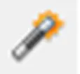{width=25} in the Reference pane toolbar. In the dialog, check every camera calibration parameter (f, cx, cy, k1 to k4, p1, p2, b1, b2) so that all of them are refined.

::: {.callout-warning}
Depending on the Metashape version, the Optimize Cameras icon is a star or a camera with a wrench.
:::

### Optimizing on the markers

In the Reference pane:

- uncheck all cameras (select one, press Ctrl+A, right-click, `Uncheck`)
- check all markers (select one, press Ctrl+A, right-click, `Check`)

Click Settings {width=25} and leave the default marker accuracy (0.005 m), or enter your GCPs' surveyed precision if you know it (0.01 to 0.05 m is typical for RTK GNSS).

Click Optimize Cameras {width=25} again with the default options, then Save {width=25}.

View Errors {width=25} now shows how much the optimization reduced the marker errors. Note the values: they go in your report.

## Stage 3: Building geometry and products

Before building the point cloud, check the bounding box of the reconstruction: it must contain the whole area of interest in all three dimensions, and should not be much larger, since the box size drives processing time and memory.

Adjust it with the Resize Region 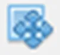{width=25} and Rotate Region 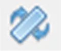{width=25} tools. The red face of the box must be at the bottom.

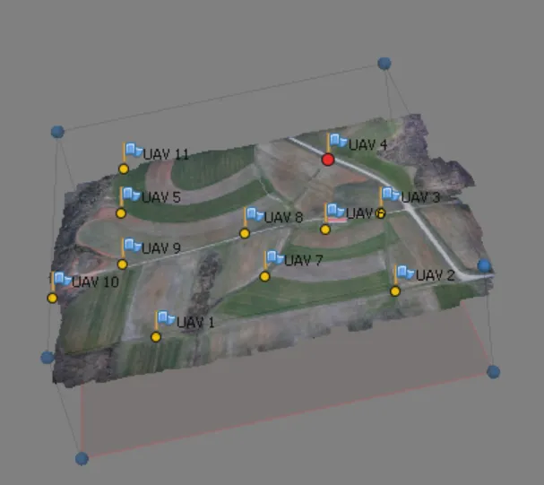

The next steps are the slow ones. Run them one at a time, or queue them with batch processing (end of this stage) and let them run unattended.

#### Menu > Workflow > Build Point Cloud (Build Dense Cloud in Metashape 1.x)

- Quality: `Medium`
- Depth filtering: `Aggressive`

| Quality | What it does |
|---|---|
| `Medium` | downsamples the images 4x; a 3D point every 4 pixels; the class setting |
| `High` | downsamples 2x; typically several hours; good results for most work |
| `Ultra high` | a 3D point for every pixel of the original imagery; a day or more |

::: {.callout-note}
For large data sets, check the memory requirements per quality setting and image count in the appendix of the [Metashape manual](https://www.agisoft.com/pdf/metashape-pro_2_3_en.pdf).
:::

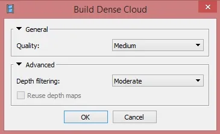

Click Save {width=25}.

#### Menu > Workflow > Build Model (Build Mesh in 1.x)

- Source data: `Point cloud` (`Dense cloud` in 1.x)
- Surface type: `Height field`
- Face count: `Medium`
- Advanced options: leave the defaults

::: {.callout-note}
A face count of `0` lets Metashape choose, which may not be enough to describe every feature on the terrain. For mapping, the model is optional: the DEM and orthomosaic can be built from the point cloud directly. This lab builds one so that you also get a textured 3D model to export.
:::

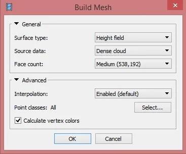

#### Menu > Workflow > Build Texture

- Texture type: `Diffuse map`
- Source data: `Images`
- Mapping mode: `Orthophoto`
- Blending mode: `Mosaic (default)`
- Texture size/count: `4096`
- Enable hole filling: `enabled`; Enable ghosting filter: `disabled`

Click Save {width=25}.

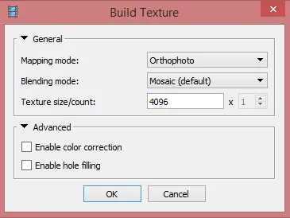

### Editing the model

If the image overlap was insufficient, the model has holes. Close them only if you need a watertight model, for example for volume calculations, where 100 percent of holes must be closed.

#### Menu > Tools > Model > Close Holes (Tools > Mesh in 1.x)

Select the size of the largest hole to close, as a percentage of the model size.

::: {.callout-warning}
Do not choose 100 percent unless you are calculating volumes.
:::

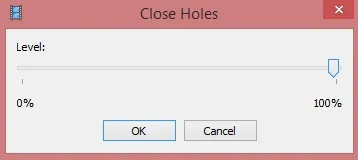

This data set has enough overlap to skip the step, but holes are common in UAS data because weather cuts flights short.

### Building the DEM

#### Menu > Workflow > Build DEM

Set the output coordinate system here. Rather than keeping the project's WGS 84, change it to the system commonly used in North Carolina, NAD83(HARN) / North Carolina in meters, `EPSG:3358`. Leave source data as `Point cloud` and interpolation `Enabled (default)`.

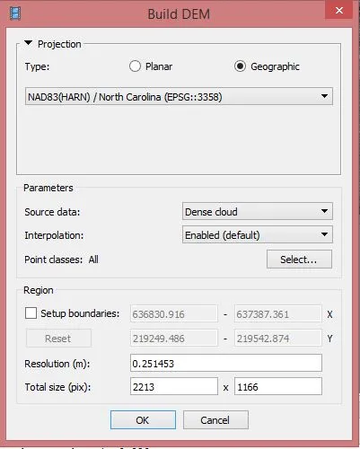

### Building the orthomosaic

#### Menu > Workflow > Build Orthomosaic (Build Orthophoto in 1.x)

The orthomosaic takes the DEM's coordinate system (`EPSG:3358`) and can only be built in that projection. Leave surface `DEM` and blending mode `Mosaic (default)`.

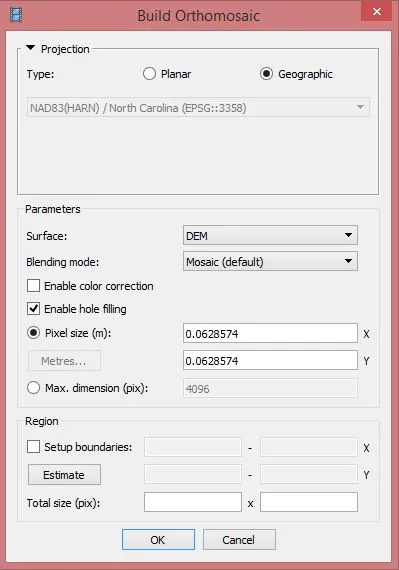

### Batch processing

#### Menu > Workflow > Batch Process > Add

Batch processing runs several steps in order without user intervention, with the same parameters as above:

1. Optimize Cameras (skip if you already optimized in Stage 2)
2. Build Point Cloud
3. Build Model
4. Build Texture
5. Build DEM
6. Build Orthomosaic

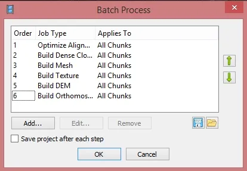

## Stage 4: Exporting results

Export is disabled in demo mode; make sure your license is activated.

### Orthomosaic

#### Menu > File > Export > Export Orthomosaic > Export JPEG/TIFF/PNG

- Projection: the DEM's coordinate system, `EPSG:3358`, is preselected; keep it
- Write KML file and world file: optional (the GeoTIFF carries its own georeferencing)
- Blending mode: `Mosaic (default)`
- Pixel size: leave the default

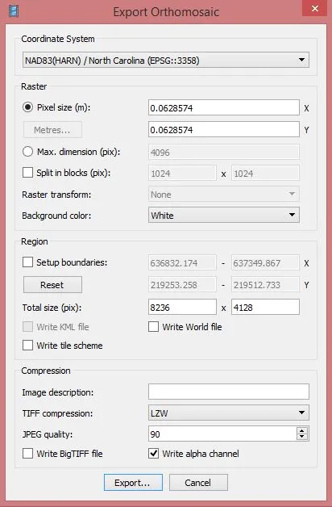

Enter a file name and save as TIFF/GeoTIFF (*.tif).

### Digital surface model

#### Menu > File > Export > Export DEM > Export TIFF/BIL/XYZ

Keep `EPSG:3358` and the default cell size; save as TIFF/GeoTIFF (*.tif).

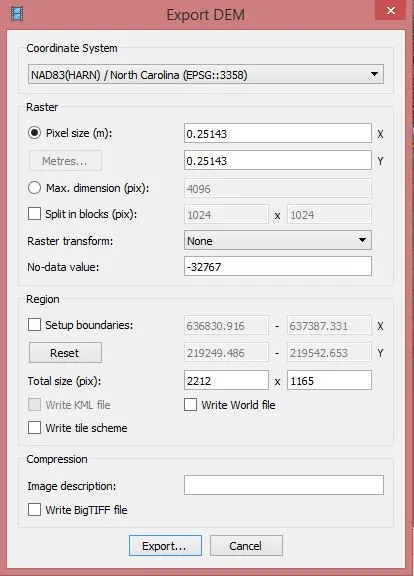

### Processing report

#### Menu > File > Export > Generate Report

Enter a name and location for the PDF. The report is a required part of your submission and the subject of the second half of your write-up.

### Optional exports

#### Menu > File > Export > Export Model

Metashape exports models as OBJ, PLY, STL, FBX, DXF, COLLADA, VRML, KMZ, U3D, glTF/GLB, and 3D PDF. Formats such as OBJ and PLY write the texture as a separate image that must stay next to the geometry file; GLB packs everything into one file. Models processed from this data set can be viewed on Sketchfab: [the lab subset](https://skfb.ly/69oyL) and [the full flight](https://skfb.ly/TEnq).

#### Menu > File > Export > Export Point Cloud

Formats include LAS, LAZ, COPC, PLY, XYZ text, E57, and Potree. Keep colors and classes; COPC and LAZ are what the later topics read in GRASS.

#### Menu > File > Export > Export Cameras

Camera positions and orientations for use in other software: Metashape XML, Bundler, CHAN, Omega Phi Kappa text, PATB, BINGO, AeroSys, and Inpho formats.

## Report

Prepare a report (3 to 5 pages including figures) on generating the orthomosaic and DSM:

1. **Workflow**: the steps you ran and the parameters you chose at each one (alignment accuracy, point cloud quality and depth filtering, model surface type, DEM and orthomosaic coordinate system), and how long the slow steps took on your machine.
2. **Products**: figures of the orthomosaic and the DSM, with the coordinate system and cell size stated.
3. **The processing report**: explain what the Metashape report says about your project: number of images and tie points, flying altitude and ground resolution, the overlap map, the camera calibration and its residuals, the camera location errors, and the ground control point errors before and after optimization. State the accuracy of your products and which number in the report supports it, and say why this report has no checkpoint error.
4. **Discussion**: what would you change to improve the accuracy (more or better distributed GCPs, checkpoints, higher quality settings, RTK positions), and what would it cost in field or processing time?

## Submission

Upload to Moodle, Assignment 2B:

* Your report as a PDF, with the Metashape processing report attached or included as an appendix.
* Optional: your exported orthomosaic and DSM (GeoTIFF) if they are under the Moodle size limit, or a link to them.

## Grading

* **Workflow**: every step and parameter is stated, so that someone else could reproduce your products.
* **Products**: the orthomosaic and DSM are shown, georeferenced in EPSG:3358, and described.
* **Report interpretation**: the accuracy figures are identified correctly and explained, not just copied; since this lab has no checkpoints, the difference between control error and checkpoint error is discussed conceptually.
* **Discussion**: improvements are tied to the concepts from the lectures.
* On-time submission.

### Due 
