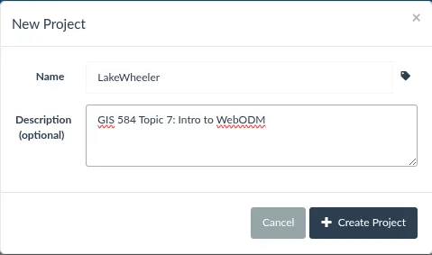
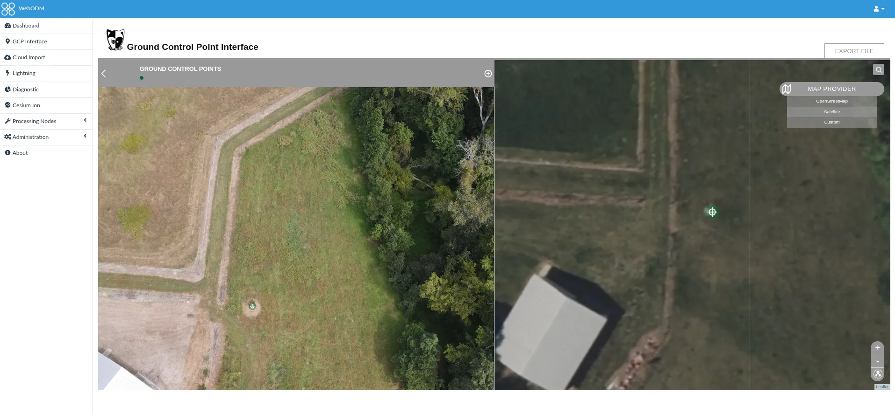
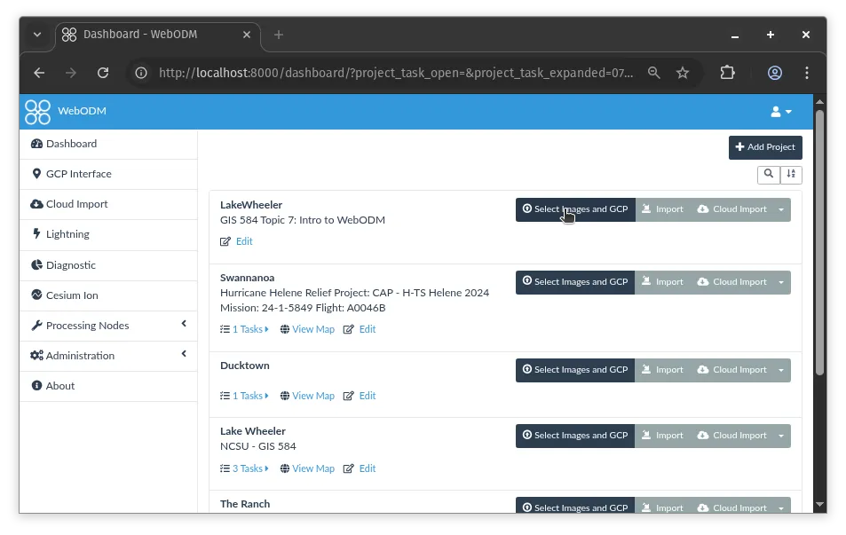
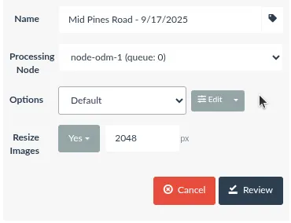
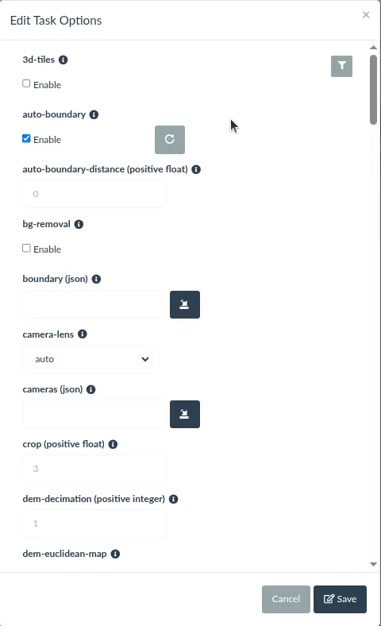
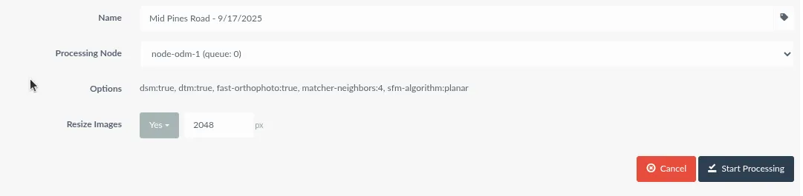
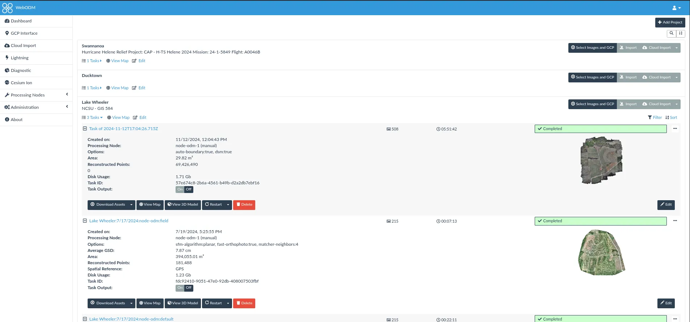
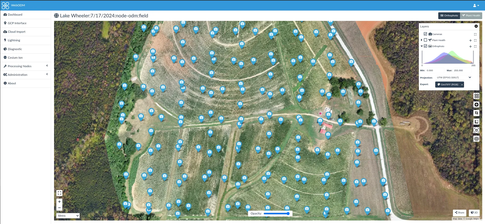
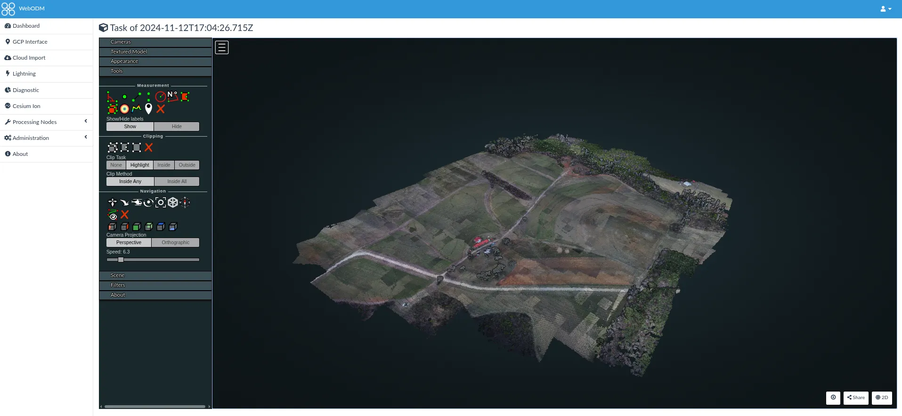
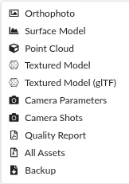

## Task

Process the Assignment 2B photographs, camera positions, and ground control points in [WebODM](https://webodm.org/), the free and open source drone mapping software [@webodm_2026], and compare the orthomosaic and DSM with the ones you produced in Agisoft Metashape. Same imagery, same control, different software: the differences you find are the software's, not the flight's.

## Software

WebODM  is an independent open source project (since April 2026 at [github.com/WebODM](https://github.com/WebODM/WebODM)). Install it one of these ways:

- **Windows or macOS**: download the free installer from [webodm.org](https://webodm.org/). The installer bundles everything, including the Docker backend on macOS. Windows 10 or newer with a 64-bit CPU; macOS 13 or newer, Apple silicon supported.
- **Linux**: install [Docker](https://docs.docker.com/engine/install/) and Git, add yourself to the `docker` group (`sudo usermod -aG docker $USER`, then log out and in), and run

  ```bash
  git clone https://github.com/WebODM/WebODM --config core.autocrlf=input --depth 1
  cd WebODM
  ./webodm.sh start
  ```

  `./webodm.sh stop` stops it and `./webodm.sh update` updates it.

- **Memory**: 8 GB RAM is the minimum and handles about 100 images, which covers this data set; 16 GB is recommended. 20 GB of free disk.
- **No suitable laptop?** [WebODM Lightning](https://webodm.net/) processes in the cloud from the same interface; it is a paid service with a small free allowance.

::: {.callout-warning}
The OpenDroneMap organization sells an installer called "OpenDroneMap Desktop". It is a different, older product. The WebODM installers are free.
:::

Once started, open [http://localhost:8000](http://localhost:8000) and create the administrator account on the first visit. See the [WebODM documentation](https://docs.webodm.org/installation/) for troubleshooting.

## Data

- [Download the data]() if you no longer have it from Assignment 2B: 78 photos, the flight log, and the coordinates of 3 GCPs.
- Two files prepared for WebODM, explained below:
  - [geo.txt](assets/geo.txt): the camera positions in WebODM's image geolocation format
  - [gcp_seed_epsg4326.txt](assets/gcp_seed_epsg4326.txt): the three GCP coordinates in the layout the GCP interface reads (also available in UTM zone 17N as [gcp_seed_epsg32617.txt](assets/gcp_seed_epsg32617.txt) if the interface asks for a projected system)

### Why geo.txt

The Trimble UX5 does not write GPS coordinates into the photos; the positions live in the flight log. Metashape imported the log directly. WebODM reads camera positions from the photos' EXIF, and when there are none it accepts an [image geolocation file](https://docs.webodm.org/ground-control-points/) named `geo.txt`: a header with the coordinate system, then one line per photo with the file name, longitude, latitude, height, and optionally yaw, pitch, and roll.

```
EPSG:4326
DSC06168.jpg -78.69809128 35.72773663 179.49 0.147352 0.0137609 -3.05065
DSC06169.jpg -78.69807484 35.72753443 177.82 0.0312571 -0.0901053 -3.09326
```

The provided file was generated from `2016_09_22_sample.txt` with a few lines of Python. File names are case sensitive: the log says `.JPG`, the files are `.jpg`.

```python
import csv

with open("2016_09_22_sample.txt") as log, open("geo.txt", "w") as geo:
    geo.write("EPSG:4326\n")
    for r in csv.DictReader(log):
        name = r["name"].replace(".JPG", ".jpg")
        geo.write(f"{name} {r['longitude']} {r['latitude']} {r['height']} "
                  f"{r['yaw']} {r['pitch']} {r['roll']}\n")
```

## Stage 1: Project and ground control points

### Create a project

On the dashboard click **Add Project** at the top right, enter a name and a description, and click **Create Project**. The project appears at the top of the dashboard.

{.lightbox fig-alt="WebODM new project dialog with name and description fields"}

### Mark the GCPs

WebODM needs a `gcp_list.txt` file: for each GCP, its ground coordinates and its pixel position on every photo where it is visible. The built-in **GCP Interface** (left sidebar) creates it.

1. Open **GCP Interface**.
2. Load the seed file `gcp_seed_epsg4326.txt`: it lists the three GCPs with their coordinates and no image positions yet. If the interface rejects the geographic coordinates, load `gcp_seed_epsg32617.txt` instead (same points in UTM zone 17N).
3. Load the 78 photos.
4. For each GCP (UAV 3, UAV 6, UAV 8): select it in the list, find it on the map (the interface shows an aerial basemap), then open each photo that shows the target and click its center. Mark every GCP on **at least 3 photos**; 5 or more is better. Use the same photos you used in Metashape if you noted them.
5. **Export File** and save it as `gcp_list.txt`.

{.lightbox fig-alt="WebODM ground control point interface showing an aerial photo beside a satellite basemap with a target marker"}

::: {.callout-note}
The [WebODM documentation](https://docs.webodm.org/ground-control-points/) recommends at least 5 GCPs on 3 or more photos each. This data set has 3, the same as in Metashape, so expect a warning in the task log; processing still uses them. The resulting `gcp_list.txt` has one line per GCP per photo: coordinates, pixel position, file name, label.
:::

## Stage 2: Processing

### Create the task

Click **Select Images and GCP** on your project and select the 78 photos **plus** `geo.txt` **plus** `gcp_list.txt`. WebODM recognizes the two text files by name.

{.lightbox fig-alt="WebODM dashboard with the Select Images and GCP button highlighted"}

Give the task a name, keep the default processing node (`node-odm-1`), and choose the **DSM+DTM** preset. Click **Edit** to check the options:

- `dsm: true`, `dtm: true`
- `dem-resolution` and `orthophoto-resolution`: leave the defaults (5 cm/pixel; they are capped at the ground sampling distance)
- `pc-quality: medium` (the default), comparable to Metashape's Medium point cloud
- Leave **resize images** at the default

{.lightbox fig-alt="WebODM task options with preset selection and processing node"}
{.lightbox fig-alt="WebODM task option editor listing dsm, dtm, and resolution options"}

Click **Review**, check the summary, then **Start Processing**. Note the start time.

{.lightbox fig-alt="WebODM task review dialog listing the selected options"}

::: {.callout-warning}
Processing takes from twenty minutes to a few hours depending on your hardware and, with Docker, on how much CPU and memory Docker Desktop is allowed to use (Settings, Resources).
:::

### Monitor

The task shows its progress and console output on the dashboard. When it finishes, the task card lists the number of reconstructed points, the average GSD, the area, and the processing time.

{.lightbox fig-alt="WebODM dashboard with completed tasks showing options, GSD, area, reconstructed points, and processing time"}

::: {.callout-note}
If a task fails or you change an option, **Restart** lets you resume from a later pipeline stage instead of starting over.
:::

## Stage 3: Results and export

### View

**View Map** opens the orthomosaic with the DSM and DTM as switchable layers and a measurement tool; **View 3D Model** opens the point cloud and textured model.

{.lightbox fig-alt="WebODM 2D map view of an orthomosaic"}
{.lightbox fig-alt="WebODM 3D viewer showing a point cloud"}

### Download

**Download Assets** offers each product separately or everything as one zip:

- Orthophoto (GeoTIFF)
- Surface model (DSM) and terrain model (DTM), GeoTIFF
- Point cloud (LAZ)
- Textured model
- **Quality report** (PDF): the WebODM equivalent of the Metashape processing report, with GSD, overlap, camera calibration, and the GCP errors
- **Backup**: the whole task, to reload into another WebODM instance

{.lightbox fig-alt="WebODM download assets menu"}

## Stage 4: Compare with Metashape

Load the two orthomosaics and the two DSMs into GRASS (or QGIS). The Metashape products are in NC State Plane, EPSG:3358; WebODM writes its products in the UTM zone of the site, EPSG:32617, unless told otherwise. `r.import` reprojects on the way in:

```bash
# in a GRASS project in EPSG:3358
r.import input=odm_dsm.tif output=dsm_webodm resolution=value resolution_value=0.15
r.import input=metashape_dsm.tif output=dsm_metashape resolution=value resolution_value=0.15
g.region raster=dsm_metashape
r.mapcalc "dsm_diff = dsm_webodm - dsm_metashape"
r.univar dsm_diff
```

Then look at:

- **Orthomosaics** side by side at building edges, tree crowns, the road, and the field boundary: sharpness, seams, doubled or smeared features, extent.
- **DSM difference**: the mean and standard deviation of `dsm_diff`, a map of it, and where the large differences are (vegetation, buildings, edges of the block). A constant offset between the two points at a vertical datum or GCP height difference rather than at the reconstruction.
- **Quality report versus processing report**: GSD, number of reconstructed points, GCP errors, and processing time.

## Report

Prepare a report (3 to 5 pages including figures):

1. **Setup**: your machine and installation route, the task options, and the processing time; the photos on which you marked each GCP.
2. **Products**: figures of the WebODM orthomosaic and DSM with their coordinate system and cell size.
3. **Comparison**: the side-by-side figures, the DSM difference statistics and map, and the report figures from both tools (GSD, point count, GCP errors).
4. **Discussion**: which product you would trust more and why, and what each tool made easy or hard. Refer to the pipeline stages from Lecture 2B when explaining a difference.

## Submission

Upload to Moodle, Assignment 2C:

* Your report as a PDF, with the WebODM quality report attached or included as an appendix.
* Optional: your `gcp_list.txt`, and the exported DSM difference map if it is under the Moodle size limit.

## Grading

* **Setup**: installation route, options, GCP photos, and timing stated.
* **Products**: orthomosaic and DSM shown, georeferenced, and described.
* **Comparison**: the two tools are compared with figures and numbers, not impressions; the DSM difference is quantified.
* **Discussion**: differences are explained with the processing concepts from the lectures.
* On-time submission.

### Due 
