## Objectives

::: {.incremental}
- **Distinguish** _remote sensing_ from _photogrammetry_ and explain what each contributes to UAS mapping
- **Explain** why a _raw aerial photograph_ cannot be measured like a map, and what _orthorectification_ fixes
- **Describe** how _Structure from Motion (SfM)_ recovers 3D geometry from overlapping 2D images
- **Explain** how _geotags_, _ground control points_, and _RTK/PPK_ positioning anchor a model to the ground
- **Recognize** the _imaging conditions_ that make SfM succeed or fail
:::

::: {.notes}
Topic 2 is where the course turns from aircraft and rules to data. This lecture is conceptual: no software today. The goal is that when students click "Align Photos" in Metashape next week (Lecture 2B) they know what the button is doing and why the result can be trusted or not. Two questions to keep asking through the deck: what do you want to measure, and what accuracy do you need? Those answers drive every later choice in flight planning and processing.
:::

## From photographs to measurements {.center .text-center .section-divider background-color="#e9f2e9"}

::: {.notes}
Section opener. Ask who has used Google Earth or a county orthophoto and assumed they could measure on it. They can, and this section explains what had to happen to the underlying photos to make that true.
:::

## Where this lecture sits {.center .text-center}

{width="90%" fig-alt="Flowchart: flight planning, flight, data processing, data analysis"}

::: {.term-card}
**Why processing before planning?** You cannot plan a flight well until you know what the processing needs from the imagery
:::

::: {.notes}
Students sometimes ask why processing comes before flight planning in the schedule. The answer is on the card: overlap, altitude, lighting, and ground control are all chosen to satisfy the reconstruction algorithm, so we teach the algorithm first. Topic 3 then turns these requirements into a mission plan, and the Lake Wheeler field trip flies it.
:::

## Remote sensing and photogrammetry {.smaller}

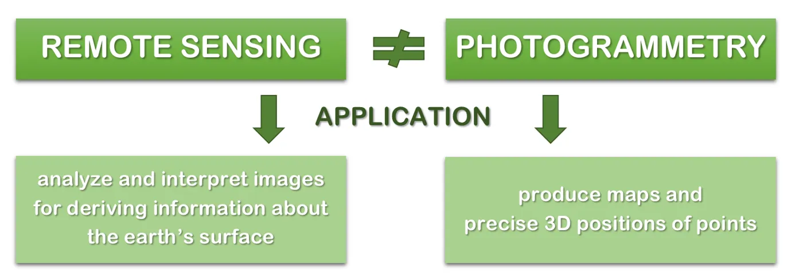{width="75%" fig-align="center" fig-alt="Remote sensing analyzes and interprets images; photogrammetry produces maps and precise 3D positions"}

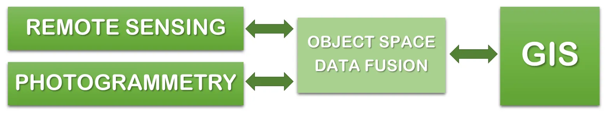{width="75%" fig-align="center" fig-alt="Remote sensing and photogrammetry both feed object space data fusion and GIS"}

::: {.notes}
Two disciplines that share the same input. Remote sensing asks what is in the image (land cover, vegetation health, temperature); photogrammetry asks where things are and how big they are. UAS mapping needs both, and GIS is where they meet. In this course, Topic 2 is photogrammetry, Topics 4 and 5 lean on remote sensing, and the change-detection topic combines them.
:::

## Passive and active sensing {.smaller}

::: {.term-card}
**Passive sensors** (RGB, multispectral, thermal cameras) record reflected or emitted energy; depth is not measured, it is inferred from parallax between overlapping images
:::

::: {.term-card}
**Active sensors** (lidar, radar) emit energy and measure the return; range is measured directly
:::

::: {.term-card}
**This topic**: passive RGB imagery, with 3D inferred by Structure from Motion
:::

::: {.notes}
Recall the sensor table from Lecture 1A. The distinction that matters here is the last row: a lidar measures distance, a camera does not. SfM has to infer depth from how features shift between photos, which is why overlap, texture, and camera geometry dominate everything that follows. Lidar returns in the terrain-analysis topics as the comparison case.
:::

## A short history {.smaller}

::: {.columns}
::: {.column width="50%"}
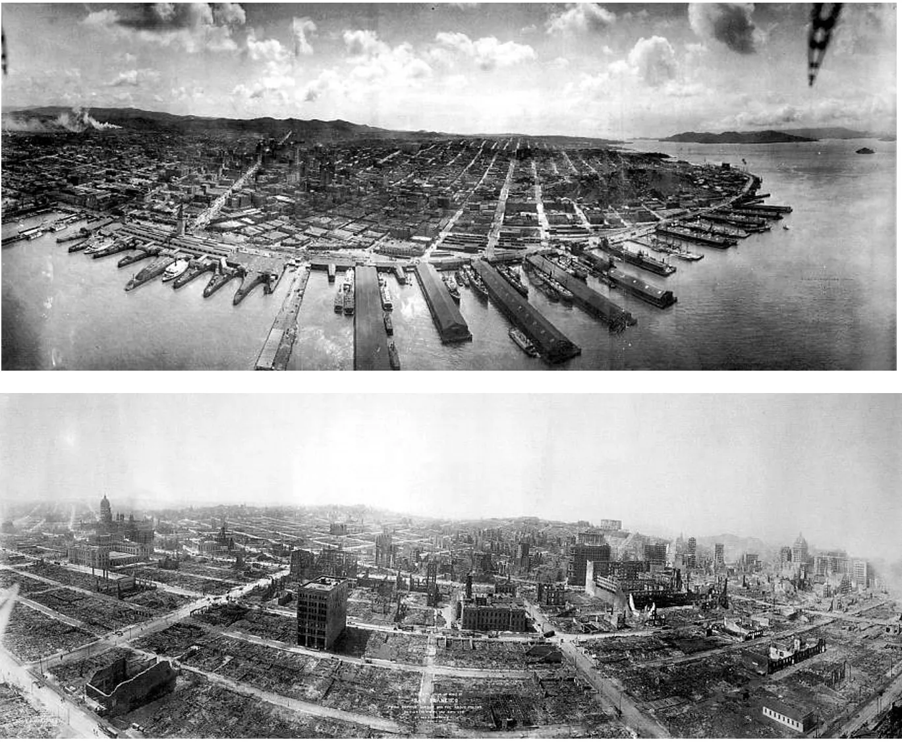{height="300" fig-alt="Two panoramic kite photographs of San Francisco in 1906 showing the waterfront and the burned city"}
:::
::: {.column width="50%"}
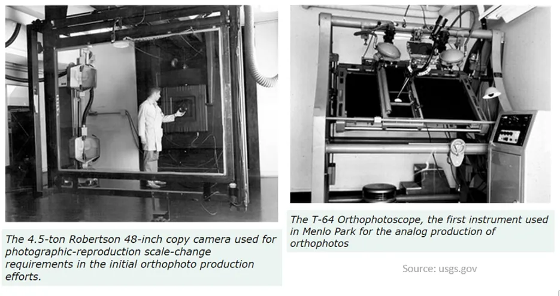{height="300" fig-alt="Two black and white photographs of room-sized analog orthophoto instruments at USGS"}
:::
:::

- 1850s: first aerial photographs from balloons; kites and pigeons follow
- 1900s to 1940s: aerial survey cameras, stereoplotters, wartime mapping
- 1960s to 1990s: analog orthophoto instruments, then analytical plotters
- 2000s onward: digital cameras, computer vision, and SfM on consumer hardware

::: {.notes}
The kite photo makes the point that aerial imaging predates aircraft; the instruments on the right make the point that turning photos into maps used to need a room-sized machine and a trained operator. What changed in the last two decades is not the geometry, which is a century old, but that computer vision automated the operator's job. The next slide shows what that looks like today.
:::

## Then and now {.smaller}

::: {.columns}
::: {.column width="50%"}
::: {.term-card}
**Analog photogrammetry**: calibrated metric cameras, film, stereoplotters, manual point measurement by trained operators
:::
::: {.term-card}
**Structure from Motion**: consumer cameras, automatic feature matching, self-calibration, thousands of images processed on a laptop
:::
:::
::: {.column width="50%"}
::: {.term-card}
**Digital photogrammetry**: scanned or digital imagery, analytical solutions, still needs camera calibration and manual control measurement
:::
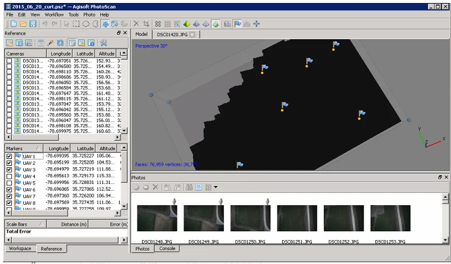{fig-alt="Screenshot of photogrammetry software with a camera list, ground control markers, model view, and photo strip"}
:::
:::

::: {.notes}
The screenshot is the modern desk: every element the historic operator measured by hand (camera positions, control points, tie points) is now a table in software. Emphasize that SfM borrowed its mathematics from photogrammetry and its automation from computer vision. That heritage explains the vocabulary in Lecture 2B: interior and exterior orientation, bundle adjustment, and collinearity all predate drones.
:::

## Types of aerial imagery {.smaller}

::: {.columns}
::: {.column width="45%"}
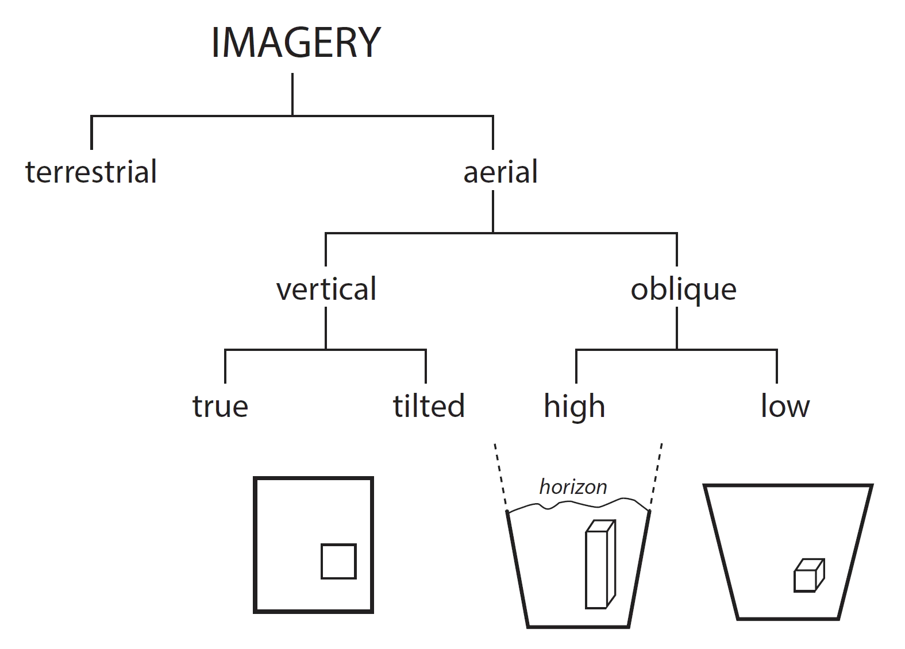{fig-alt="Tree diagram classifying imagery as terrestrial or aerial, aerial as vertical or oblique, with sketches of each view"}
:::
::: {.column width="55%"}
| | Vertical (nadir) | Oblique |
|---|---|---|
| **Camera** | Pointing straight down | Tilted; high oblique shows the horizon |
| **Scale** | Nearly uniform | Varies across the frame |
| **Good for** | Orthophotos, DSMs, measurement | Facades, undercuts, 3D texture, context |
| **Mapping flights** | The default | Added to nadir for buildings and steep terrain |

:::
:::

::: {.notes}
Vertical imagery is the mapping default because scale is nearly uniform and relief displacement is smallest and predictable. Obliques are how you get the sides of buildings and steep slopes into a 3D model; most flight planners now offer a nadir plus oblique pattern for that reason. "Tilted" vertical means a nominally nadir camera that is a few degrees off; SfM handles that automatically, which is one of its advantages over classical workflows.
:::

## Why a photograph is not a map {.center .text-center .section-divider background-color="#e9f2e9"}

::: {.notes}
Section transition. The claim to defend: you can measure on a map, but not on a raw photograph, and the reasons are geometric, not a matter of image quality.
:::

## Camera geometry {.smaller}

::: {.columns}
::: {.column width="50%"}
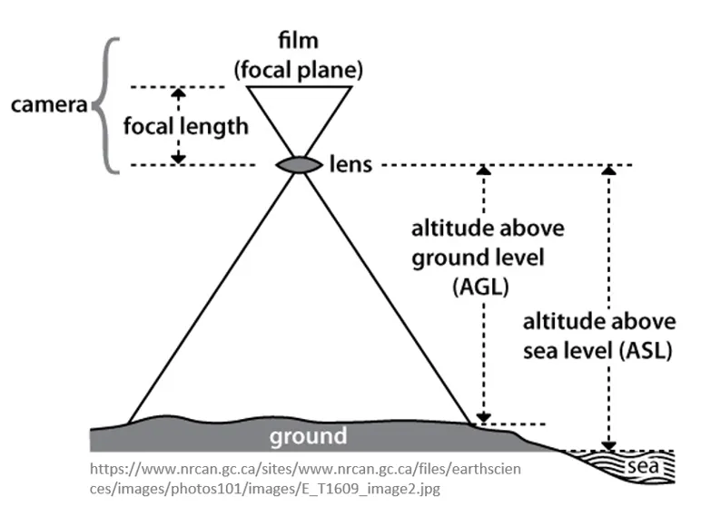{fig-alt="Diagram of a camera with focal length between lens and film, and altitude above ground level and above sea level"}
:::
::: {.column width="50%"}
::: {.term-card}
**Focal length**: distance from the lens to the sensor; with sensor size it sets the field of view
:::
::: {.term-card}
**Flying height (AGL)**: altitude above the ground, not above sea level; with focal length it sets image scale
:::
::: {.term-card}
**Ground sampling distance (GSD)**: the ground size of one pixel; the resolution of your final products. The formula and how to plan for it come in Topic 3
:::
:::
:::

::: {.notes}
Three quantities students will use in every flight plan. Scale is focal length divided by flying height AGL, so the same camera at half the height gives twice the scale and half the GSD. Introduce GSD as a term only; Topic 3 has the formula and the planning exercise. Stress AGL versus ASL: flight apps ask for one or the other and confusing them over sloping terrain changes GSD across the site.
:::

## Perspective versus orthographic {.smaller}

::: {.columns}
::: {.column width="50%"}
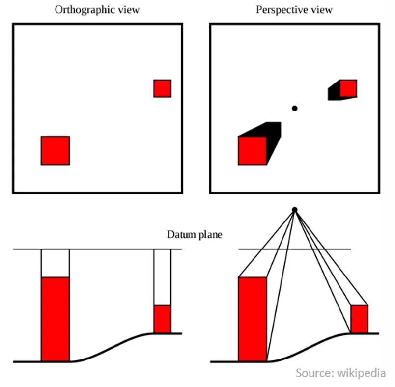{fig-alt="Two blocks at different heights shown in orthographic view at true position and in perspective view displaced outward"}
:::
::: {.column width="50%"}
- A camera is a **perspective** projection: all rays pass through one point, the lens
- A map is an **orthographic** projection: every point is projected straight down
- In a perspective image, anything above the datum plane is displaced **outward** from the image center, and the higher it is the more it moves
:::
:::

::: {.notes}
The figure is the whole argument in one picture. The two red blocks are at different heights; in the orthographic view they sit at their true plan positions, in the perspective view the taller one is displaced outward and shows its side. Every tall object in an aerial photo leans away from the center for exactly this reason. Ask students where in a photo a tall building would show no lean: only directly under the camera.
:::

## Relief displacement {.smaller}

::: {.columns}
::: {.column width="50%"}
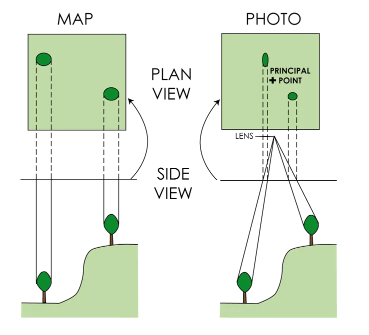{fig-alt="Map and photo of two trees on a slope, showing their positions shift in the photo relative to the map"}
:::
::: {.column width="50%"}
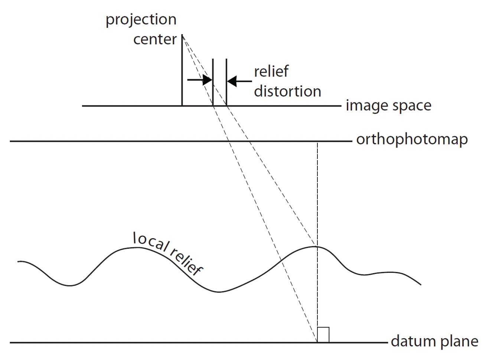{fig-alt="Cross section showing a ray from the projection center through relief to the datum plane and the resulting relief distortion on the image"}
:::
:::

::: {.term-card}
**Relief displacement**: the shift of an image point caused by the elevation of the ground point, radially away from the principal point
:::

::: {.notes}
Left: two trees at different elevations map to their true positions on the map but shift apart in the photo. Right: the same idea as a cross-section, with the displacement measured on the image plane. Displacement grows with terrain relief and with distance from the image center, and shrinks with flying height. This is why the traditional orthorectification recipe needs a terrain model: you cannot undo the shift without knowing the elevation of every pixel.
:::

## Other sources of distortion {.smaller}

| Source | Effect | Remedy |
|---|---|---|
| Camera tilt | Scale varies across the frame | Gimbal, exterior orientation solved in processing |
| Lens distortion | Straight lines bow (radial), image shears (tangential) | Camera calibration, self-calibration in SfM |
| Rolling shutter | Rows exposed at different times; features smear in motion | Global shutter, slower flight, rolling shutter model |
| Terrain relief | Radial displacement (previous slide) | Surface model and orthorectification |

::: {.notes}
Relief displacement is the big one, but the other three matter for consumer cameras. Lens distortion is why SfM software estimates a camera model for every project; rolling shutter is why survey drones advertise mechanical shutters (Lecture 1A). Tilt was a problem for film cameras and is now just another unknown the bundle adjustment solves. Everything in this table is corrected in the processing pipeline you will run in Lecture 2B.
:::

## Orthorectification {.smaller}

::: {.columns}
::: {.column width="45%"}
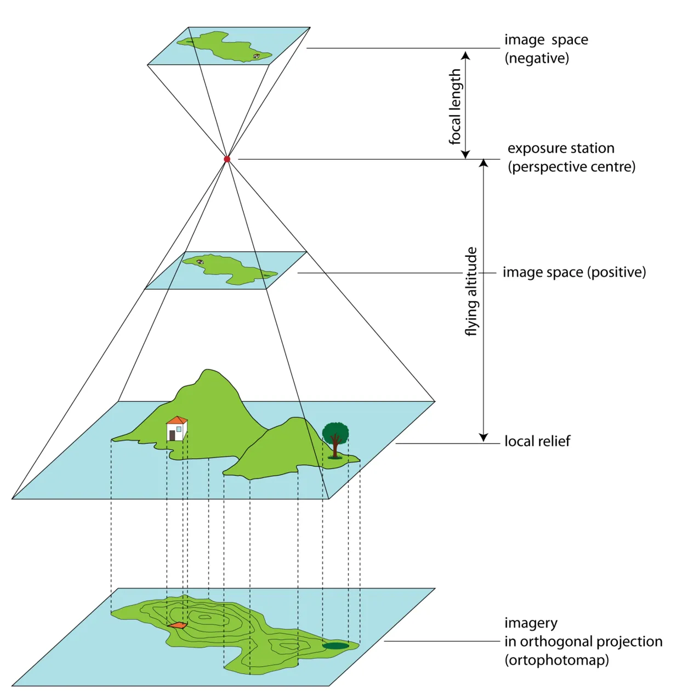{fig-alt="Diagram of image space, exposure station, terrain with relief, and the orthophotomap below it in orthogonal projection"}
:::
::: {.column width="55%"}
Orthorectification re-projects each image pixel from the camera's perspective onto a map plane. It needs:

1. The **camera model** (interior orientation: focal length, principal point, lens distortion)
2. The **camera position and attitude** for every photo (exterior orientation)
3. A **surface model** of the terrain (and, for a true orthophoto, of buildings and trees)

::: {.term-card}
**Output**: an orthophoto, a photograph with the geometry of a map
:::
:::
:::

::: {.notes}
Walk the figure top to bottom: image space, the perspective center, the terrain with its relief, and the orthophotomap below where every point has been dropped straight down. The three numbered inputs are the vocabulary for Lecture 2B. Classical workflows measured all three separately; SfM estimates the first two from the images themselves and produces the third as a by-product, which is the reason it needs so much overlap.
:::

## The orthophoto {.smaller}

::: {.columns}
::: {.column width="50%"}
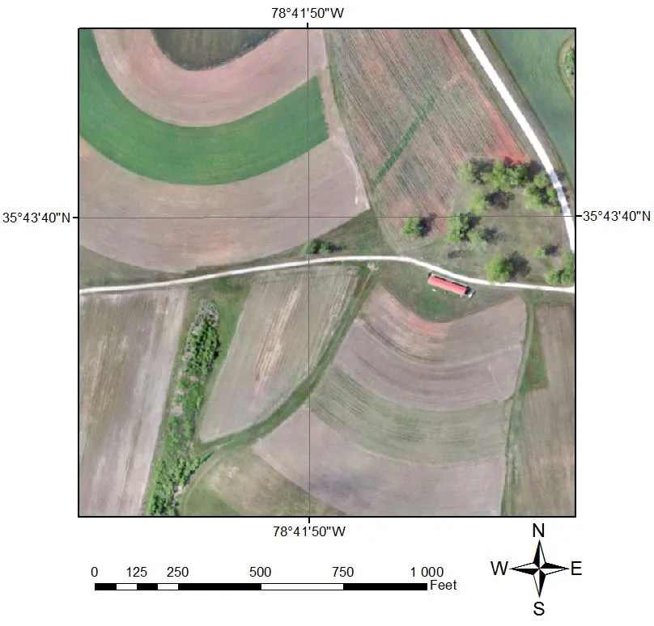{fig-alt="UAS orthophoto of fields and a road with a latitude longitude grid, scale bar, and north arrow"}
:::
::: {.column width="50%"}
- Uniform scale: distances, areas, and angles are measurable
- Georeferenced: every pixel has a map coordinate
- An RGB raster like any other; loads into GIS as a basemap or analysis layer
- Its accuracy is only as good as the surface model and control behind it

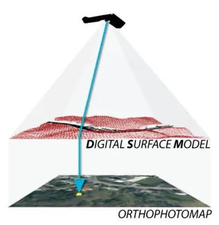{width="32%" fig-align="center" fig-alt="Camera above a digital surface model projecting down to an orthophotomap"}
:::
:::

::: {.notes}
This is the product students will make in Assignment 2B. The last bullet is the caution: an orthophoto looks authoritative, but errors in the DSM show up as smearing on building edges and errors in control show up as the whole map being shifted. The small figure reminds them that the DSM sits between the camera and the orthophoto in the pipeline; Lecture 1A's DSM versus DTM slide is the companion.
:::

## How SfM recovers 3D from 2D {.center .text-center .section-divider background-color="#e9f2e9"}

::: {.notes}
Section transition into the core mechanism. This is the part to slow down on; the two image builds that follow do most of the teaching.
:::

## It starts with overlap {.smaller}

::: {.columns}
::: {.column width="55%"}
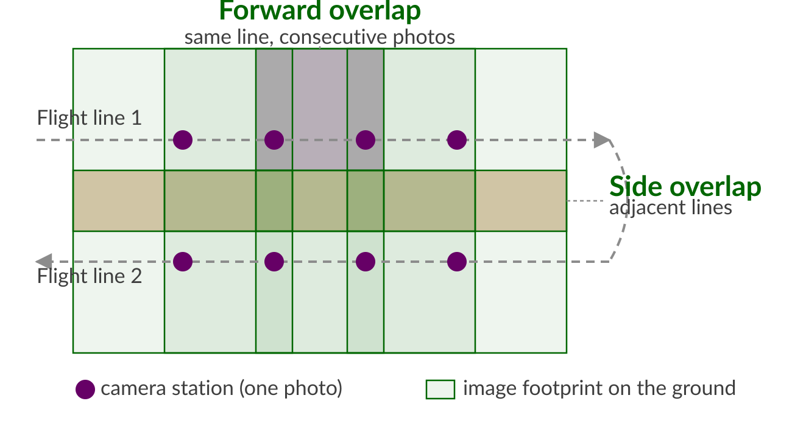{fig-alt="Two flight lines with overlapping image footprints; the forward overlap band between consecutive photos and the side overlap band between lines are shaded"}
:::
::: {.column width="45%"}
| Overlap | Typical for SfM |
|---|---|
| Forward (along the line) | 75 to 85% |
| Side (between lines) | 60 to 80% |

::: {.term-card}
**Why so much?** Every ground point must appear in at least 3 images, ideally 5 or more, for its 3D position to be solved reliably
:::

::: {.term-card}
**Parallax**: the shift of a feature between photos taken from different positions; it is what makes depth recoverable. Classical stereo used one pair per point; SfM wants many
:::
:::
:::

::: {.notes}
Classical stereo photogrammetry needed each point in two photos; SfM wants it in many, because the solution is a least-squares fit across all of them and more observations mean a better constrained geometry. High overlap costs flight time and image count, so the numbers here are the trade-off that Topic 3 plans around. Point out that low-texture surfaces (water, uniform crops) need even more overlap because fewer features can be matched.
:::

## Tie points: the desk-scale version {.center}

::: {.r-stack}
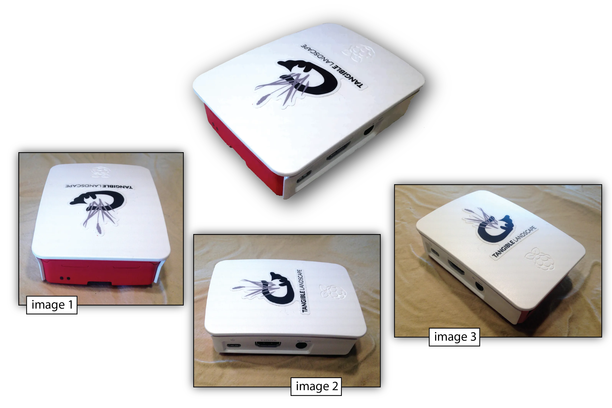{width="80%" fig-alt="Three photographs of a small box taken from different positions"}

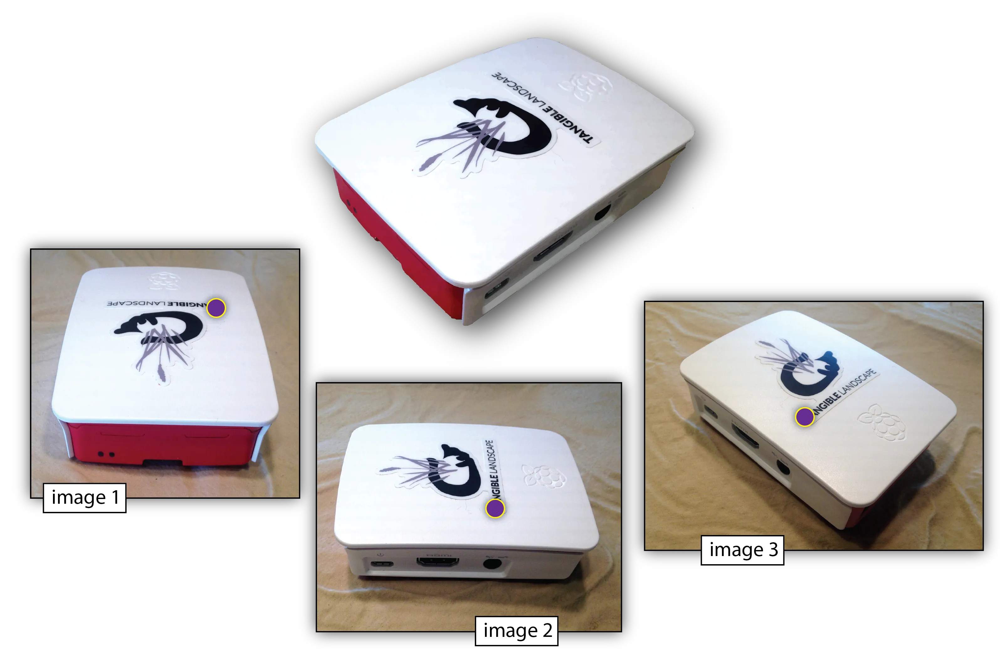{.fragment width="80%" fig-alt="The same three photographs with one feature marked in each"}

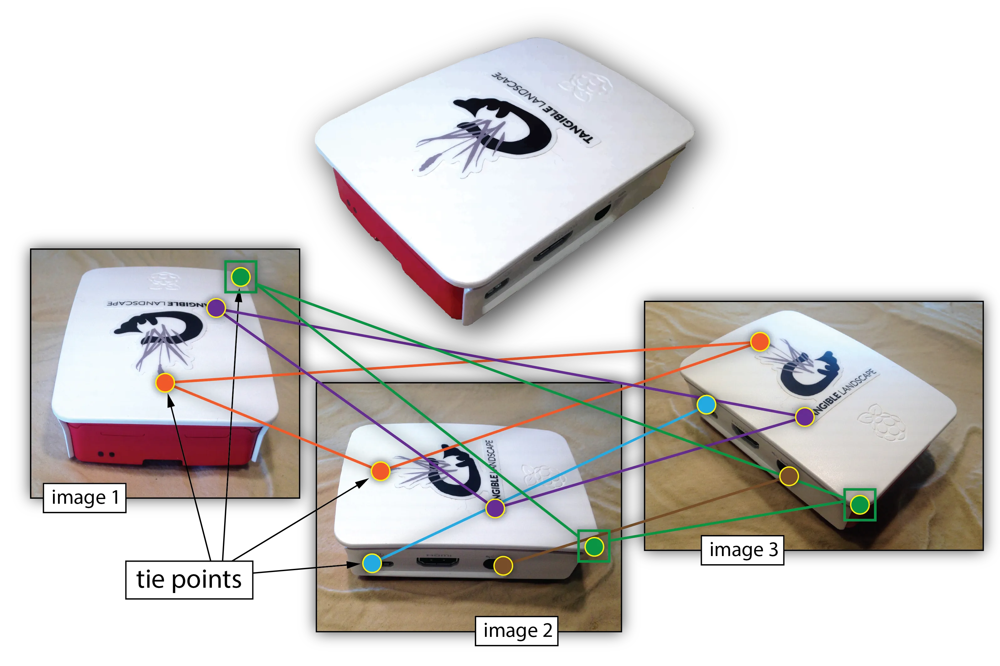{.fragment width="80%" fig-alt="Colored lines connecting matched tie points across the three photographs"}

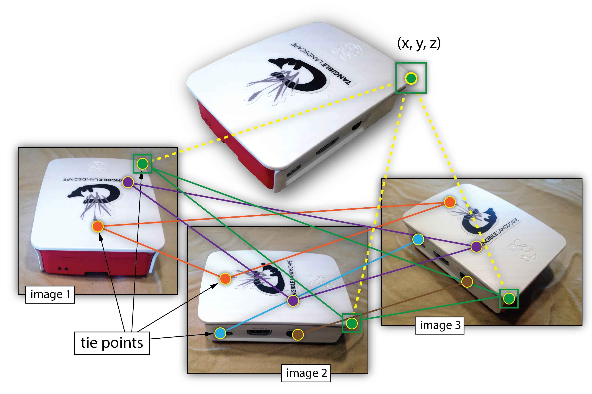{.fragment width="80%" fig-alt="Rays from the three photographs intersecting at one reconstructed 3D point on the box"}
:::

::: {.notes}
Click through the build. Three photos of one object from different positions. First, the software detects a distinctive feature, the corner of the logo, in each image. Then it finds many such features and matches them across images; each matched feature is a tie point. Finally, the rays from each camera through a matched point intersect at one location in 3D, and that intersection is the reconstructed point. Repeat for thousands of features and you have a sparse point cloud of the object plus the position of every camera. This is exactly the experiment in Assignment 2A.
:::

## Tie points: the aerial version {.center}

::: {.r-stack}
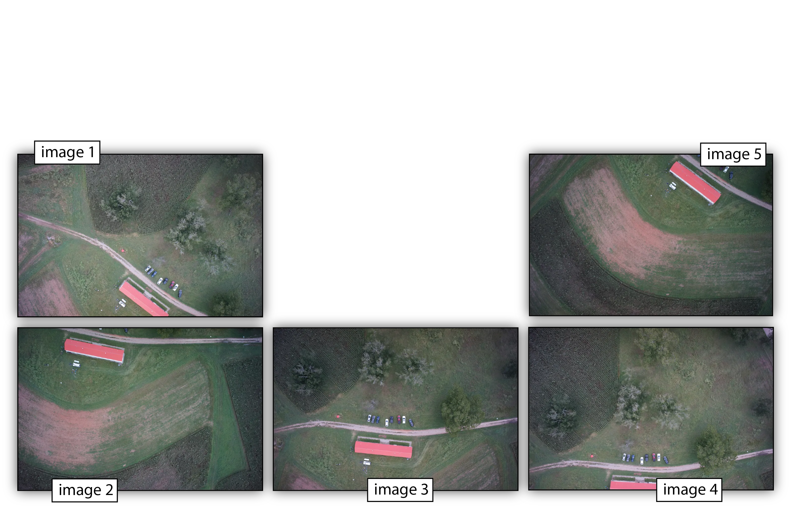{width="80%" fig-alt="Five overlapping nadir drone images of a field with a red-roofed shed"}

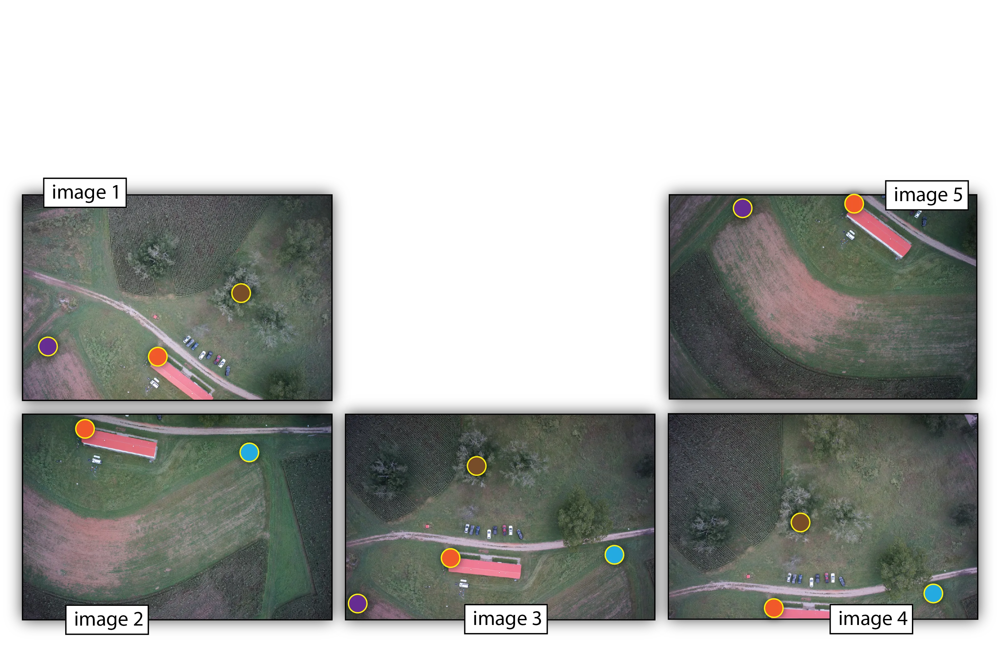{.fragment width="80%" fig-alt="The five drone images with matching features marked in each"}

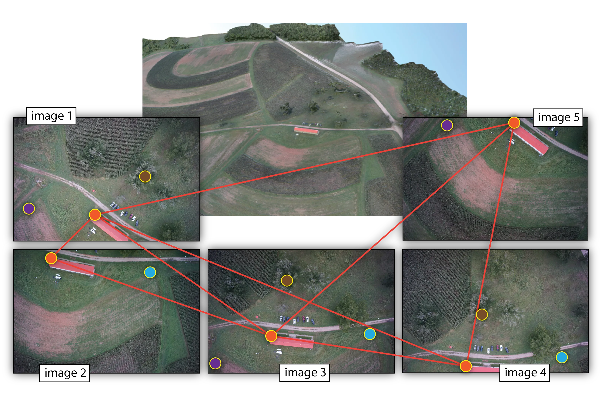{.fragment width="80%" fig-alt="Matched features connected across the five drone images below a reconstructed 3D view of the site"}

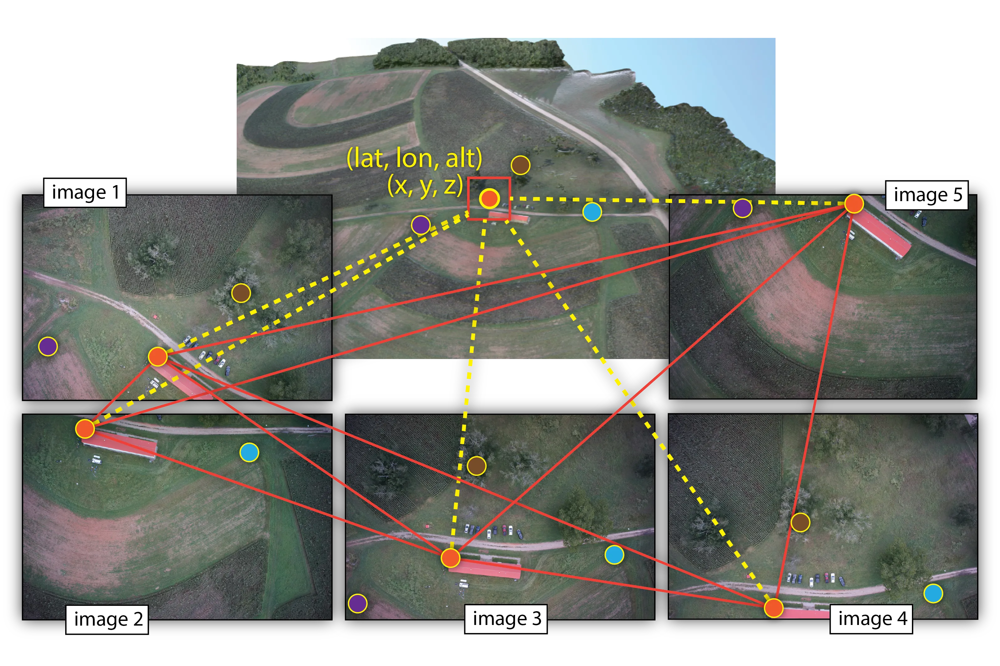{.fragment width="80%" fig-alt="Rays from the five drone images intersecting at one reconstructed point on the 3D model of the site"}
:::

::: {.notes}
Same build with five drone images. Features are detected in every frame, matched where they reappear, and the matched rays intersect on the reconstructed surface at the top. The corner of the red-roofed shed gets an x, y, z. Note that the coordinates are relative until something anchors them to the ground, which is the last section of this lecture.
:::

## SfM at work {background-iframe="../sfm_demo_embed.html" background-interactive="true"}

::: {.notes}
Live demo slide; the visualization is interactive (drag to orbit, scroll to zoom). The red dot is the camera flying a lawnmower pattern over a wireframe terrain, the green square is its ground footprint, and the rays connect the camera to the features it sees. Ask students to watch one red ground point and count how many camera positions get a ray to it: that count is the redundancy the previous slides argued for. The same page is linked from the topic page for later.
:::

## Multiple-view geometry {.smaller}

::: {.columns}
::: {.column width="50%"}
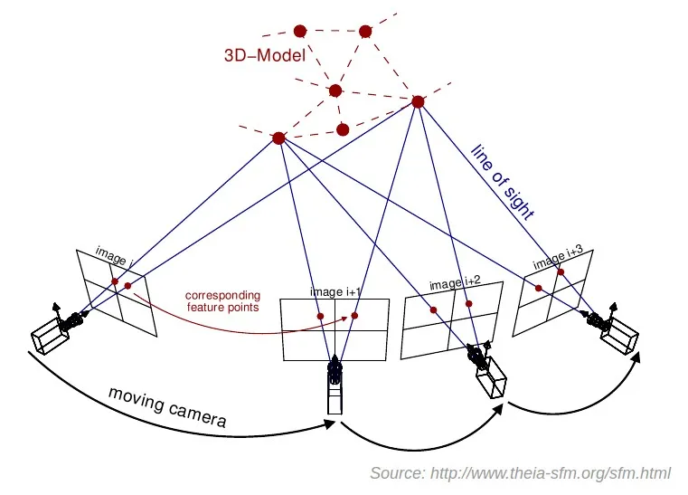{fig-alt="A moving camera captures a sequence of images; lines of sight to corresponding feature points intersect at a 3D model"}
:::
::: {.column width="50%"}
SfM solves three linked questions at once:

::: {.term-card}
**Correspondence**: which pixels in different images show the same point?
:::
::: {.term-card}
**Structure**: given the matches, where are those points in 3D?
:::
::: {.term-card}
**Motion**: where was the camera, and how was it oriented, for every image?
:::
:::
:::

::: {.notes}
The name says it: structure (the 3D points) from motion (the moving camera). None of the three questions can be answered alone; the cameras are needed to place the points and the points are needed to place the cameras. The trick is to solve them jointly by minimizing reprojection error, the distance between where a 3D point projects into an image and where the feature was actually detected. That joint solution is the bundle adjustment.
:::

## Bundle adjustment {.smaller}

::: {.columns}
::: {.column width="50%"}
::: {.term-card}
**Reprojection error**: how far each 3D point lands from its detected tie point when projected back into the image; the quantity being minimized
:::
::: {.term-card}
**Exterior orientation**: position (X, Y, Z) and attitude (omega, phi, kappa) of every camera, solved for all images together
:::
::: {.term-card}
**Interior orientation**: focal length, principal point, and lens distortion, self-calibrated from the images
:::
:::
::: {.column width="50%"}
- A non-linear least-squares optimization over every camera and every tie point
- Outputs: refined camera poses, a sparse point cloud, and a camera model
- Weak geometry (little overlap, low texture, one flying height) leaves the solution poorly constrained
- Lecture 2B looks at the Metashape settings that control it
:::
:::

::: {.notes}
Keep this at the concept level; 2B has the diagrams. The one intuition worth landing: a bundle of rays from every camera to every point is adjusted until the rays agree as well as they can. When geometry is weak, the adjustment can still converge but to a slightly wrong shape, which shows up as a dome or bowl in flat terrain; the pitfalls slide returns to that.
:::

## From tie points to products {.smaller}

| Stage | Input | Output |
|---|---|---|
| Feature detection and matching | Overlapping images | Tie points |
| Bundle adjustment (alignment) | Tie points, initial camera positions | Camera poses, camera model, **sparse point cloud** |
| Dense matching (multi-view stereo) | Aligned images | Depth maps, **dense point cloud** |
| Surface reconstruction | Dense cloud | **Mesh** and **DSM** |
| Orthorectification and mosaicking | Images, camera poses, DSM | **Orthophoto** |

::: {.columns}
::: {.column width="50%"}
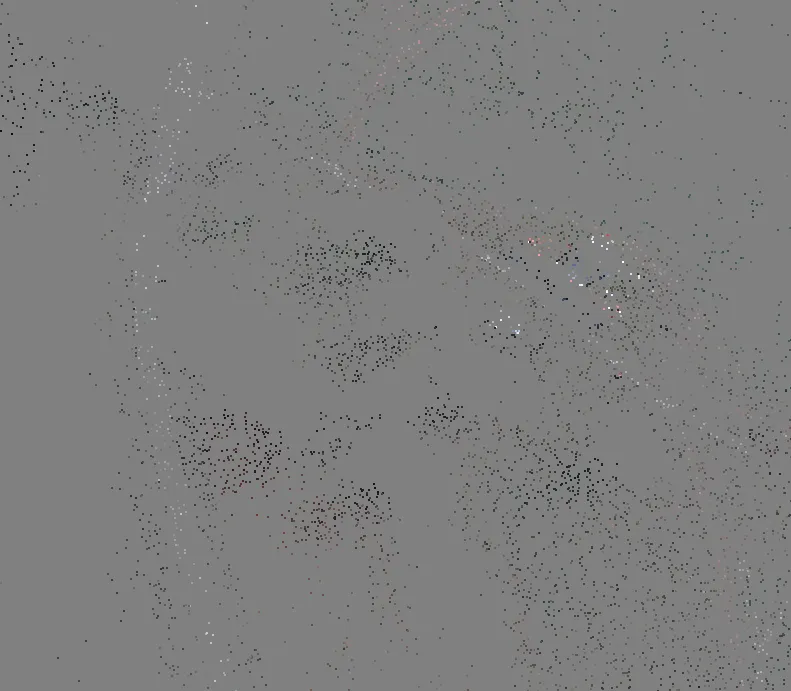{height="130" fig-alt="Sparse point cloud of a field, scattered points on a grey background"}
:::
::: {.column width="50%"}
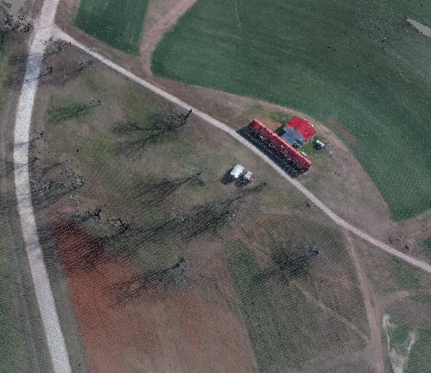{height="130" fig-alt="Dense point cloud of the same field showing the road, trees, and shed"}
:::
:::

::: {.notes}
The table is the map of Lecture 2B, where each row becomes a Metashape workflow step. The sparse cloud from alignment is the diagnostic: if it looks wrong, nothing downstream will be right, and it is cheap to recompute. Dense matching is the expensive step; it produces a point for nearly every pixel. Everything the course analyzes later (DSM, DTM, orthophoto, canopy height) comes off the bottom two rows.
:::

## Anchoring the model to the ground {.center .text-center .section-divider background-color="#e9f2e9"}

::: {.notes}
Section transition. SfM alone gives shape without scale, position, or orientation in the real world; this section is about how those get added and how accuracy is proven.
:::

## Relative and absolute orientation {.center .smaller}

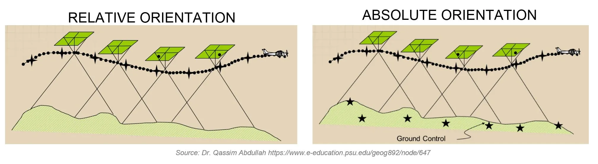{width="95%" fig-alt="Left: images fitted to each other above terrain; right: the same block fitted to ground control points marked by stars"}

::: {.term-card}
- **Relative orientation**: images fit each other. 
- **Absolute orientation**: the block fits the ground, through ground control or accurately known camera positions
:::

::: {.notes}
Left: the photos are consistent with each other but the whole block could be scaled, shifted, or rotated and still fit. Right: ground control (the stars) pins the block to real coordinates. SfM produces relative orientation automatically; absolute orientation is your responsibility, and the next slides cover the two ways to supply it, camera positions and ground control points.
:::

## Whose coordinates are these? {.center}

::: {.r-stack}
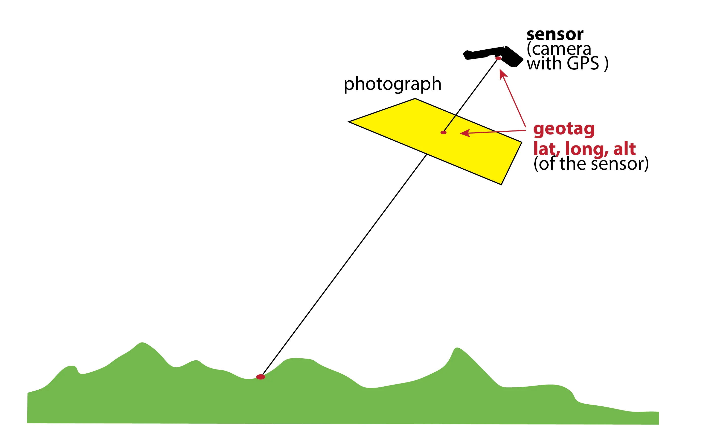{width="75%" fig-alt="A camera with GPS above terrain; the geotag gives the latitude, longitude, and altitude of the sensor"}

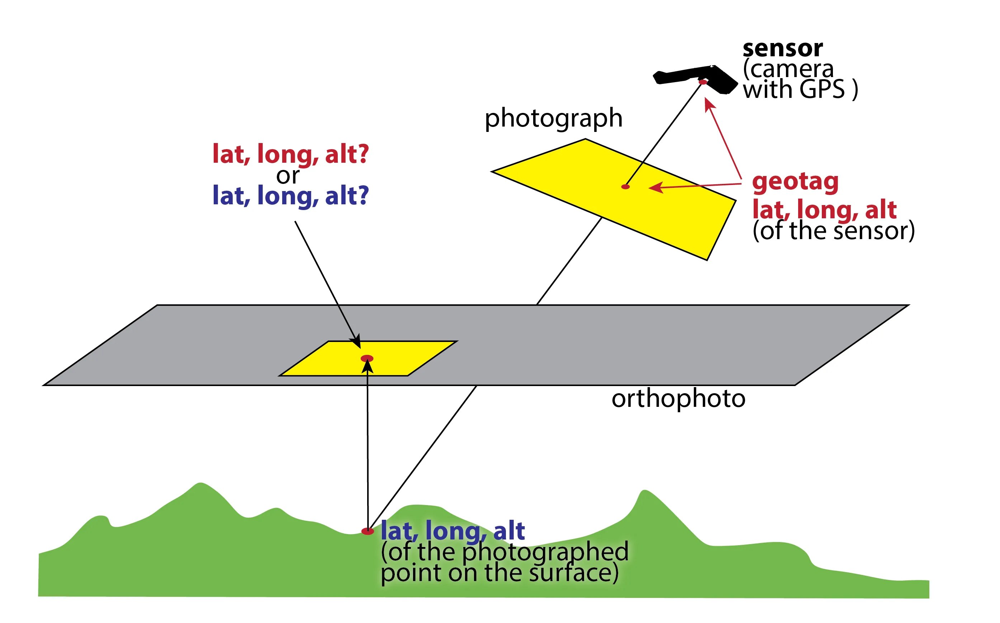{.fragment width="75%" fig-alt="The same diagram asking whether the orthophoto pixel takes the coordinates of the sensor or of the photographed ground point"}

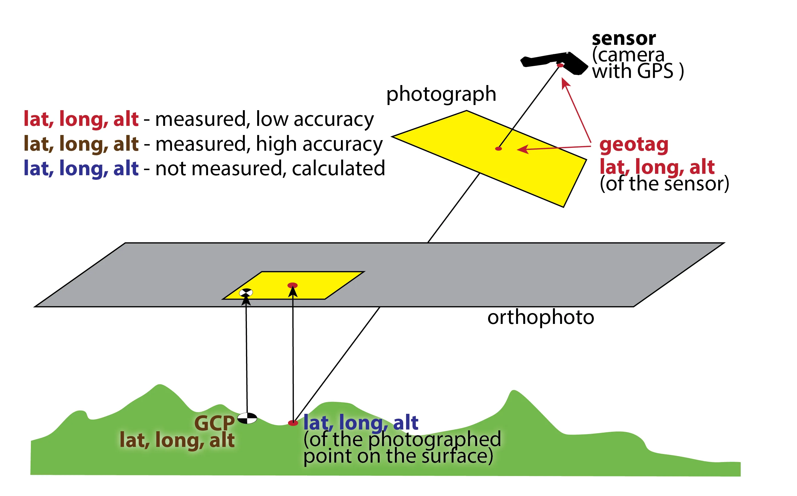{.fragment width="75%" fig-alt="The diagram with three coordinate types: geotag measured at low accuracy, GCP measured at high accuracy, ground point calculated"}
:::

::: {.notes}
Click through. A geotag is the position of the camera, not of anything in the photo. Ask which coordinates belong in the orthophoto for a given pixel: the camera's, or the ground point's? The ground point's, and those are not measured by anything on the aircraft; they are calculated by the reconstruction. Last frame: three kinds of coordinates in one project, low-accuracy measured (geotags), high-accuracy measured (GCPs), and calculated (every ground point). Accuracy of the calculated ones depends on the measured ones.
:::

## Geotags: useful, but not survey control {.smaller}

- Written into each image's EXIF by the aircraft GNSS: latitude, longitude, altitude, often attitude
- Give the bundle adjustment a starting point and a rough scale and orientation
- Consumer GNSS is accurate to 1 to 3 m horizontally and worse vertically; altitude is often barometric and relative to the takeoff point

::: {.term-card}
**Rule of thumb**: geotags get the model into the right neighborhood; centimeter accuracy comes from RTK/PPK or ground control
:::

::: {.notes}
A common student misconception is that a geotagged dataset is georeferenced. It is, at the meter level, which is fine for a quick look and not fine for measuring change between two flights. Vertical is the weak axis: barometric altitude drifts with weather and is referenced to the takeoff point, so two flights on different days can disagree by tens of meters in Z before control is applied.
:::

## Ground control points {.smaller}

::: {.columns}
::: {.column width="40%"}
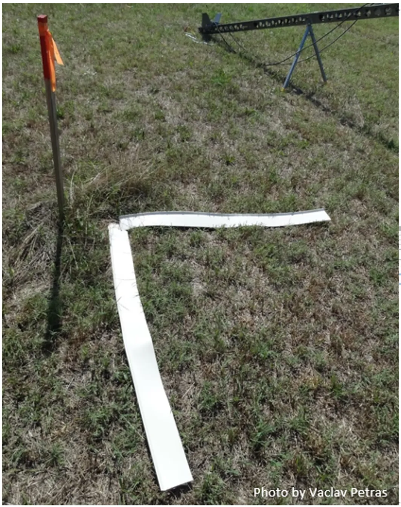{width="70%" fig-align="center" fig-alt="A white L-shaped ground control target and a survey flag on grass"}
:::
::: {.column width="60%"}
- A target on the ground whose center is surveyed to centimeter accuracy (RTK GNSS or total station)
- Visible and unambiguous in the imagery: high contrast, larger than a few pixels at your GSD
- Marked in several photos during processing; the software then adjusts the block to fit
- Distributed across the whole area and the full range of elevation, including the edges

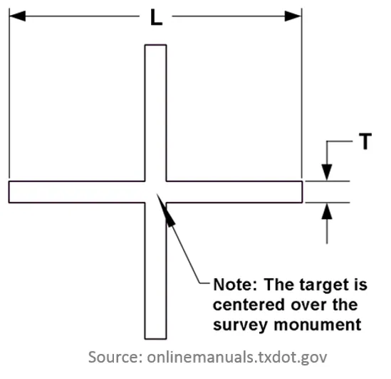{width="22%" fig-align="center" fig-alt="Sketch of a cross-shaped survey target centered over a survey monument"}
:::
:::

::: {.notes}
The photo is what the class will place before the Lake Wheeler flight. Size the target for the GSD: a 2 cm GSD needs a target at least 20 to 30 cm across for the center to be picked precisely. Distribution matters more than count: five well-spread points beat fifteen in one corner. Elevation range matters too, since a block controlled only on the flat part can tilt over the slope.
:::

## Control versus checkpoints {.smaller}

::: {.columns}
::: {.column width="50%"}
::: {.term-card}
**Ground control points (GCPs)**: used in the adjustment to constrain the solution
:::
::: {.term-card}
**Checkpoints**: surveyed the same way but withheld from the adjustment, used only to measure error
:::
:::
::: {.column width="50%"}
- At least 3 GCPs to define the coordinate system; 5 or more spread across the site in practice
- Report accuracy as RMSE on independent checkpoints, never on the GCPs themselves
- If checkpoint error is much larger than GCP error, the model is overfitting the control
:::
:::

::: {.notes}
This distinction is the difference between a map with an accuracy claim and a map with an accuracy measurement. Error reported on GCPs is circular: the adjustment was told to fit them. Checkpoints are the honest number and the one that survey standards (ASPRS) require. In Assignment 2B students will see both in the Metashape report and should be able to explain which one they would quote.
:::

## Direct georeferencing: RTK and PPK {.smaller}

| Method | Camera position accuracy | Ground control needed | Typical use |
|---|---|---|---|
| Standard GNSS geotags | 1 to 3 m | Yes, for any survey-grade product | Consumer drones |
| RTK (real-time corrections) | 1 to 3 cm | Few; still use checkpoints | Survey platforms with a base station or network |
| PPK (post-processed corrections) | 1 to 3 cm | Few; still use checkpoints | Same, more tolerant of radio dropouts |
| GCPs only | n/a | 5 or more, well distributed | Any platform, extra field time |

::: {.term-card}
**Even with RTK/PPK**: place a few checkpoints, and at least one GCP to fix any vertical offset, since camera accuracy is not the same as product accuracy
:::

::: {.notes}
This closes the loop from Lecture 1A's positioning slide. Accurate camera positions constrain the bundle adjustment nearly as well as ground control, which is why RTK drones cut field time so much. Two cautions: a constant vertical offset (antenna to sensor lever arm, geoid versus ellipsoid heights) is invisible without a ground point, and product accuracy can only be demonstrated with checkpoints. In North Carolina the base station can be the state's real-time network.
:::

## Common pitfalls {.smaller}

| Symptom | Cause | Fix |
|---|---|---|
| Few tie points, images fail to align | Low texture (water, sand, uniform crops, snow) or repetitive patterns | Fly lower, add obliques, fly when shadows add texture |
| Smeared or duplicated features | Rolling shutter, motion blur, wind | Faster shutter, slower flight, global shutter camera |
| Flat site reconstructs as a dome or bowl | Weak geometry and self-calibration error | GCPs across the site, obliques, two flying heights |
| Surfaces under trees are wrong | The model is a DSM: it sees the canopy, not the ground | Compare to a DTM only after ground classification |
| Patchy colors, visible seams | Changing light or exposure during the flight | Manual exposure, fly in even light, avoid long flights across weather changes |

::: {.notes}
Every row is something the class will see in its own data. Doming is the subtle one: the dense cloud looks fine locally and the whole surface is bowed by decimeters, which only checkpoints or a second flying height reveal. The canopy row is the DSM versus DTM distinction from Lecture 1A and is the single most common source of wrong conclusions in vegetation studies.
:::

## Quick activity {.smaller}

In teams of three, sketch a plan for mapping a site of your choice:

1. What do you want to measure, and to what accuracy?
2. What GSD does that imply? (Just the target; the formula comes in Topic 3)
3. Nadir only, or nadir plus oblique? What overlap?
4. How many GCPs and checkpoints, and where?
5. Which products do you need: orthophoto, DSM, DTM, point cloud, mesh?

::: {.notes}
Five minutes, then compare two or three plans on the board. The point is to make students commit to numbers and then discover the trade-offs: high accuracy pulls the GSD down, which pulls the altitude down, which multiplies images and flight time. Keep the plans; they become the starting point for the flight planning exercise in Topic 3.
:::

## Wrap-up

::: {.term-card}
**Assignment 2A**: [3D reconstruction from multiple photos](../assignments/assignment_2a.qmd), photograph an object, build a model, and report what helped and what hurt the reconstruction
:::

::: {.term-card}
**Next lecture**: [UAS imagery processing](lecture_2b.qmd), the full pipeline from images to orthophoto and DSM in Agisoft Metashape
:::

::: {.notes}
Recap the arc: photogrammetry versus remote sensing, why perspective geometry blocks measurement, how orthorectification fixes it, how SfM recovers 3D from overlap, and how geotags, GCPs, and RTK/PPK anchor the result. Assignment 2A is the desk-scale version of everything in the tie-point build; encourage students to deliberately break something (too few photos, a shiny object, changing zoom) so the report has something to explain.
:::

## References {.smaller}

This deck adapts and extends the original course slides [@jeziorska_mitasova_sfm_slides]. For the mathematics of dense matching see @furukawa_hernandez_2015; for a longer treatment of SfM for the geosciences see @opentopography_2021_sfm.

::: {#refs}
:::

## Image credits {.smaller}

- Camera geometry: Natural Resources Canada
- Perspective versus orthographic projection: Wikipedia
- Relative and absolute orientation: Q. Abdullah, Penn State GEOG 892
- SfM diagram: theia-sfm.org
- Analog orthophoto instruments: USGS
- GCP target sketch: TxDOT survey manual
- 1906 San Francisco kite photographs: G. Lawrence, Library of Congress
- Tie-point and geotag sequences, overlap diagram, GCP photo: NC State Center for Geospatial Analytics
