## Objectives

::: {.incremental}
- Describe photogrammetric processing as a multistep pipeline and name what each step consumes and produces
- List the data needed to generate an orthomosaic and a DSM from UAS imagery
- Distinguish interior from exterior orientation and explain where each comes from
- Run the full workflow in Agisoft Metashape and choose sensible parameters
- Read a processing report and say which numbers describe the accuracy of the products
:::

::: {.notes}
Lecture 2A explained why SfM works; today is how you run it. By the end, students should be able to open Metashape, go from photos to orthomosaic and DSM, and defend the settings they chose. Everything here is exercised in Assignment 2B on the Lake Wheeler dataset, and Topic 7 repeats the same pipeline in WebODM. If students ask why processing comes before flight planning in the schedule: you cannot plan a flight well until you know what the processing needs from the imagery.
:::

## From flight to products {.center .text-center .section-divider background-color="#e9f2e9"}

::: {.notes}
Section opener. The big picture first: what comes home from the field, what goes into the software, and what comes out. Every button in Metashape maps to one box on the next slide.
:::

## The photogrammetric pipeline {.smaller}

```{mermaid}
flowchart LR
  subgraph A["Pre-processing"]
    IMAGES["UAS images"]
    LOG["Flight log / EXIF"]
    GCP["GCPs"]
  end
  subgraph B["Data processing"]
    MATCH["Feature matching"]
    SOLVE["Camera solving<br/>(bundle adjustment)"]
    DENSE["Point cloud"]
    MESH["Model / surface"]
  end
  subgraph C["Analysis and export"]
    ORTHO["Orthomosaic"]
    DSM["DSM / DTM"]
    PCLOUD["Classified point cloud"]
    TEXMODEL["Textured 3D model"]
    REPORT["Processing report"]
  end
  IMAGES --> MATCH --> SOLVE --> DENSE --> MESH
  SOLVE -. re-optimize .-> IMAGES
  LOG --> SOLVE
  GCP --> SOLVE
  DENSE --> ORTHO
  DENSE --> DSM
  DENSE --> PCLOUD
  MESH --> TEXMODEL
  SOLVE --> REPORT
  GCP --> REPORT
```

::: {.notes}
Images come in, features are matched, cameras are solved, dense geometry is built, cartographic products are exported. The dashed arrow is the part students forget: if alignment is weak you go back, clean images or add ground control, then re-optimize. Photogrammetry is iterative, not a single pass.
:::

## What comes home from the field {.smaller}

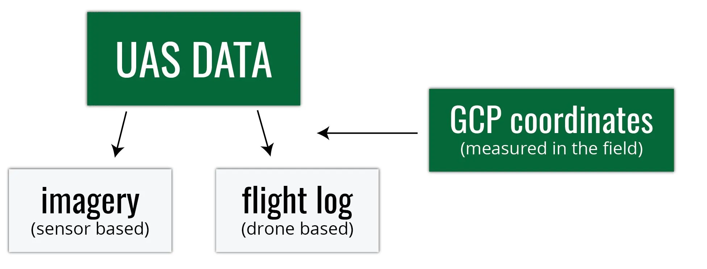{width="75%" fig-align="center" fig-alt="Three inputs from a flight: photographs, a flight log, and ground control point coordinates"}

::: {.term-card}
**Three things**: images, a flight log or EXIF positions, and ground control coordinates. Everything else is computed
:::

::: {.notes}
The better these three inputs, the less cleanup later. The rest of this section takes them one at a time.
:::

## Digital imagery {.smaller}

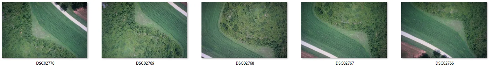{width="90%" fig-align="center" fig-alt="Five overlapping nadir drone photographs from one flight line"}

- Usually on the camera's SD card
- Often **geotagged**: the camera position is written into each photo's EXIF header
- Geotags are the position of the camera, not of anything in the picture, and are accurate to meters unless the aircraft has RTK or PPK
- Look through them before processing: blurred, over-exposed, and takeoff frames go

::: {.notes}
Reminder from 2A: a geotag gets the model into the right neighborhood and seeds the alignment; centimeter accuracy comes from RTK/PPK positions or ground control. The pre-processing step nobody likes is culling bad frames, and it pays off more than any setting in the software.
:::

## Focal length and perspective {.smaller}

::: {.columns}
::: {.column width="50%"}
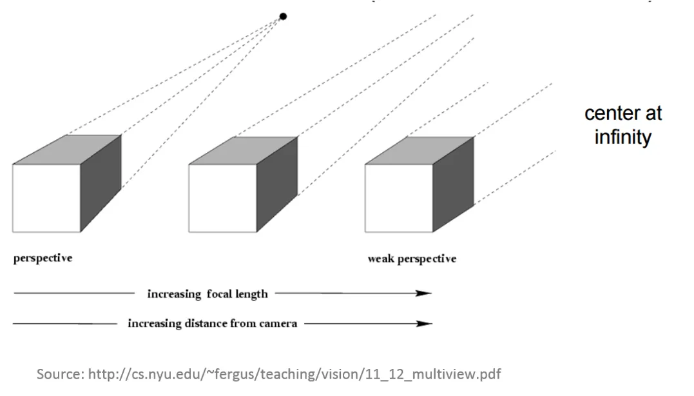{fig-alt="Diagram comparing full perspective projection with a short focal length to weak perspective with a long focal length"}
:::
::: {.column width="50%"}
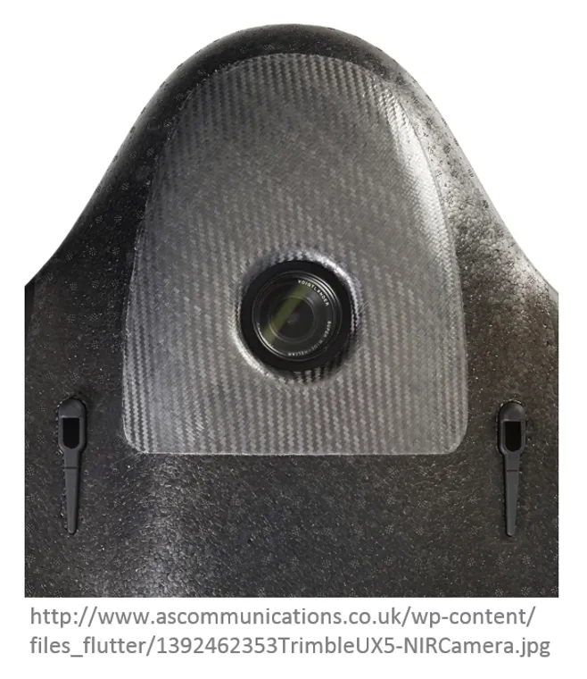{width="80%" fig-alt="Camera sensor and lens geometry"}
:::
:::

::: {.notes}
A short focal length close to the subject gives full perspective: objects near the camera look much larger, scale varies across the frame, distortion grows toward the edges. A longer focal length farther away approaches weak perspective, where rays are nearly parallel and scale is nearly uniform. UAS mapping sits between the two: wide action cameras push toward full perspective, higher flights with a longer lens toward weak perspective. Flight height and lens choice both matter for geometry, and overlap is still what makes the solution robust.
:::

## Flight log {.smaller}

::: {.columns}
::: {.column width="55%"}
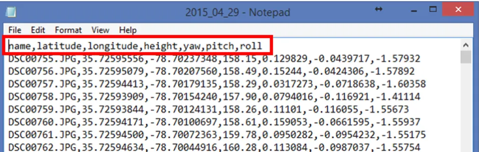{fig-alt="Text flight log listing image names with latitude, longitude, altitude, yaw, pitch, and roll"}
:::
::: {.column width="45%"}
- The onboard IMU and GNSS receiver log position and attitude for every photo
- Written to a text file, or straight into the photos' EXIF (most DJI aircraft)
- Contains the elements of **exterior orientation**
- Describes the camera, not the ground: the model still needs tie points and control to fit the world
:::
:::

::: {.term-card}
**Flight attitude**: the aircraft's orientation in space, yaw, pitch, and roll
:::

::: {.notes}
Logs seed the alignment and then bundle adjustment tightens them. When positions live in EXIF, Metashape reads them automatically; when they are in a separate log you import them with the right column order, time offset, and coordinate system, then check that the cameras land on top of your site.
:::

## GCP coordinates {.smaller}

::: {.columns}
::: {.column width="50%"}
- Surveyed coordinates of targets placed before the flight, or of photo-identifiable points surveyed later
- Anchor the model to a coordinate system and let you measure its accuracy
- Record the coordinate reference system you surveyed in, every time
:::
::: {.column width="50%"}
{fig-alt="Ground control targets laid out across a field"}
:::
:::

::: {.notes}
GCP placement and the GCP versus checkpoint distinction were in Lecture 2A; here the point is bookkeeping. A GCP file without its CRS is a set of numbers, not coordinates, and mixed CRS is the most common cause of a model that lands hundreds of meters from where it should.
:::

## Coordinate reference systems {.smaller}

::: {.columns}
::: {.column width="62%"}
| | Geographic (GCS) | Projected (PCS) |
|---|---|---|
| **Units** | degrees | meters or feet |
| **Example** | WGS 84 (EPSG:4326) | NC State Plane, NAD83(2011): EPSG:6543 in feet, EPSG:3358 in meters |
| **Use** | geotags, raw GNSS | measurement, DEMs, GIS analysis |
:::
::: {.column width="38%"}
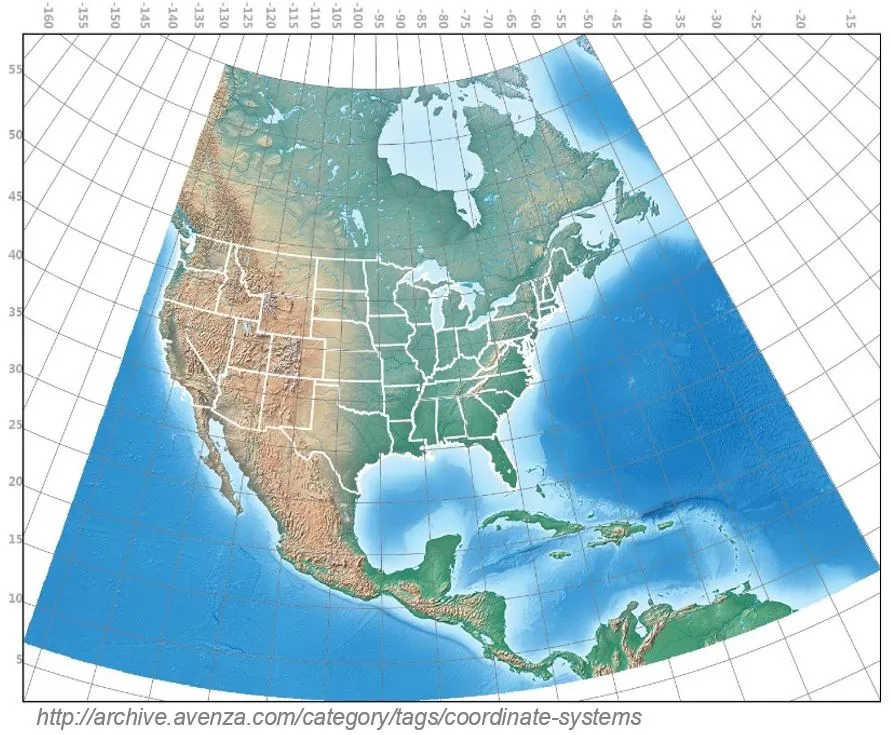{width="90%" fig-align="center" fig-alt="Globe projected onto a flat map surface"}
:::
:::

::: {.term-card}
**Vertical datum**: GNSS heights are ellipsoidal; maps use orthometric heights above the geoid. In North Carolina the two differ by about 30 m
:::

::: {.notes}
Geotags arrive in WGS 84 degrees; the products should leave in a projected system with meters, which for our work is NC State Plane. The vertical datum trips up more projects than the horizontal one: if the GCPs are orthometric and the cameras ellipsoidal, the block fits at the wrong height until Metashape is told which is which. Assignment 2B walks through setting both.
:::

## Products {.center .text-center .section-divider background-color="#e9f2e9"}

::: {.notes}
Section transition. Four products come out of the pipeline; students met them in 1A and 2A, so this is a quick pass with the emphasis on what each one is good for.
:::

## What comes out of processing {.smaller}

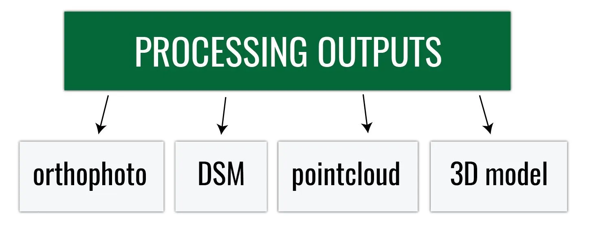{width="75%" fig-align="center" fig-alt="Processing outputs: orthomosaic, digital surface model, point cloud, textured 3D model, and report"}

::: {.notes}
Orthomosaic as the basemap, DSM or DTM as the analysis surface, point cloud as the raw 3D evidence, textured model for visualization, and the report as the record of how good all of it is.
:::

## Orthomosaic {.smaller}

::: {.columns}
::: {.column width="50%"}
- Aerial imagery corrected for perspective and terrain so that scale is uniform
- A raster with red, green, and blue bands, georeferenced like any other
- Metashape calls it an **orthomosaic**; orthophoto is the generic term
:::
::: {.column width="50%"}
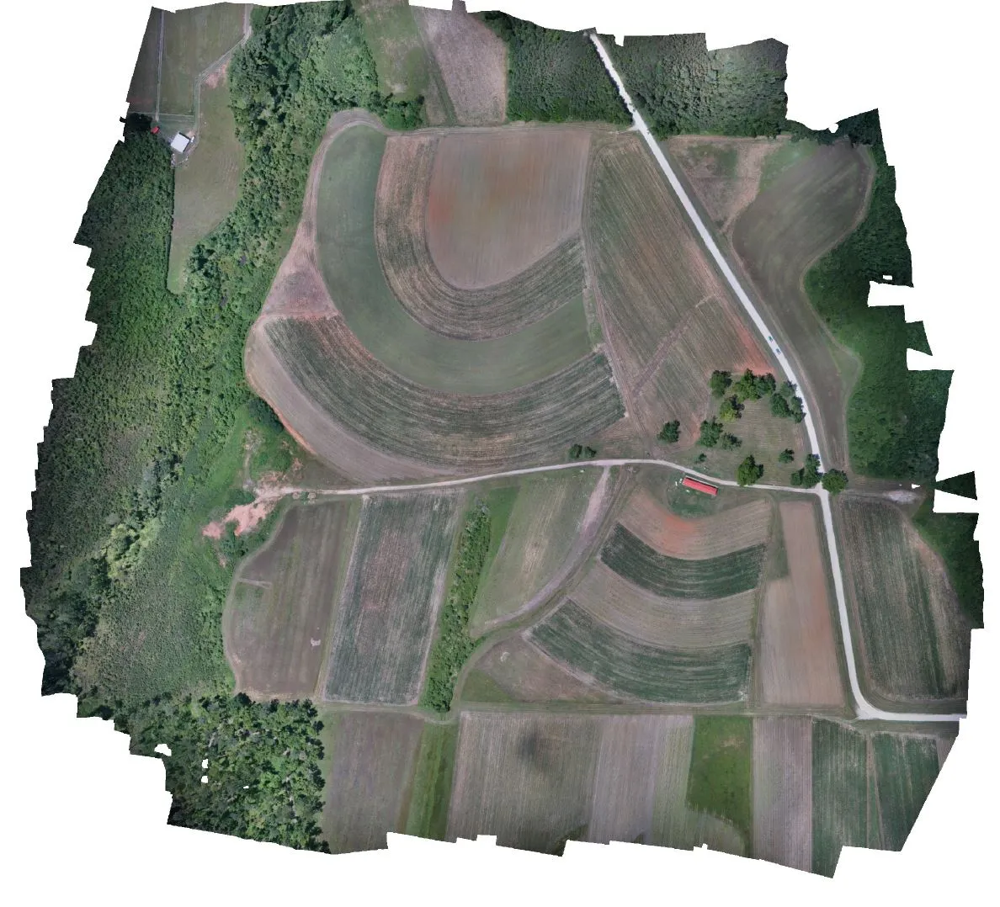{fig-alt="Orthomosaic of fields and a road"}
:::
:::

::: {.notes}
Every pixel is in the right place for measurement, as long as the surface it was draped on is right. Errors in the DSM show up as smeared building edges and doubled features; errors in control show up as the whole map being shifted.
:::

## Digital surface model {.smaller}

- **DSM, digital surface model**: the visible surface, including trees, buildings, and cars
- **DTM or DEM, digital terrain model**: bare earth
- SfM produces a DSM by default; a DTM needs ground classification and filtering

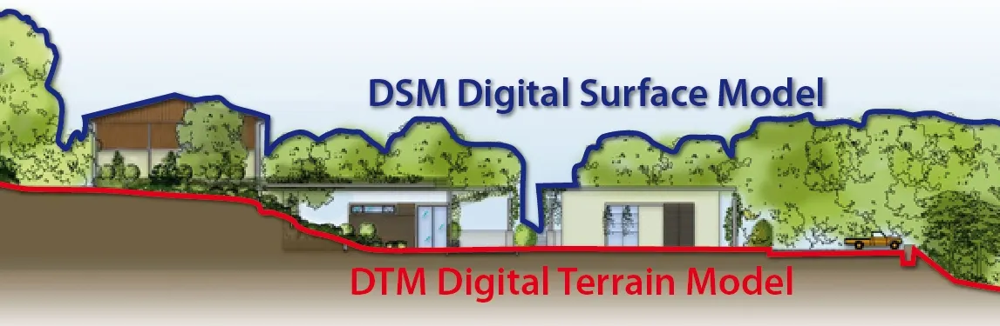{width="80%" fig-align="center" fig-alt="Cross-section comparing a surface model over trees and buildings with the bare-earth terrain model beneath"}

::: {.notes}
The distinction matters for every later topic: canopy height is DSM minus DTM, hydrology needs the DTM, and comparing an SfM DSM to a lidar DTM is a classic wrong conclusion. Metashape can classify ground points in the point cloud and build a DTM from those only.
:::

## Point cloud {.smaller}

::: {.columns}
::: {.column width="50%"}
- A set of points with x, y, z, usually color, sometimes a class
- Represents the external surface of everything the cameras saw
- Vector or raster? Neither quite: "a point cloud is a badly behaved raster" (Dale Lutz)
:::
::: {.column width="50%"}
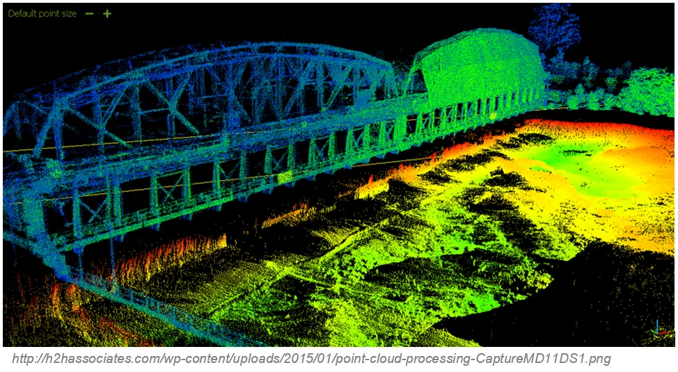{fig-alt="Colored point cloud of a landscape"}
:::
:::

::: {.notes}
Treat it as raw geometric evidence: classify it, thin it, grid it to a surface. Exported as LAS, LAZ, or COPC it moves into GRASS and other tools for the terrain topics.
:::

## Orientation and control {.center .text-center .section-divider background-color="#e9f2e9"}

::: {.notes}
Section transition into the vocabulary Metashape uses in its dialogs and report: interior orientation, exterior orientation, markers.
:::

## What the software needs {.smaller}

| Input | Where it comes from | Required? |
|---|---|---|
| Digital images with overlap | The flight | Yes |
| Exterior orientation (camera position and attitude) | Flight log or EXIF as a first guess, refined by bundle adjustment | Yes, at least approximately |
| Interior orientation (camera model) | Self-calibration during alignment, or a calibration file | Solved automatically |
| Ground control points | Field survey | For survey-grade products and for accuracy reporting |
| Elevation model | Once a prerequisite; now a by-product of SfM | No |
| Software implementing the collinearity equations | Metashape, WebODM, and others | Yes |

::: {.notes}
Lecture 2A covered the concepts; this is the checklist form. The historical column is worth a sentence: classical orthorectification needed a DEM as input, and SfM turned that requirement into an output, which is the reason it needs so much overlap.
:::

## Exterior orientation {.smaller}

::: {.columns}
::: {.column width="60%"}
Six elements for every photo: the camera position (X, Y, Z) and its angular orientation:

| Photogrammetry | Aviation | Axis | Motion |
|---|---|---|---|
| **omega** | Roll | x, flight direction | wing tilt side to side |
| **phi** | Pitch | y | nose tilt forward and back |
| **kappa** | Yaw | z | rotation about the vertical |
:::
::: {.column width="40%"}
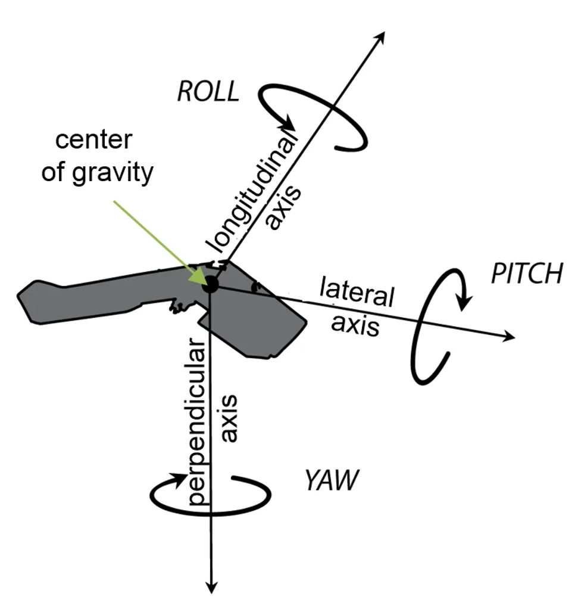{fig-alt="Aircraft with the omega, phi, and kappa rotation axes"}
:::
:::

::: {.notes}
Logs and EXIF provide first guesses for all six; bundle adjustment refines them until the tie points fit to a fraction of a pixel. In the Metashape reference pane these are the camera rows; their accuracy setting tells the adjustment how much to trust them.
:::

## Interior orientation {.smaller}

::: {.columns}
::: {.column width="50%"}
- The camera model: focal length, principal point, and lens distortion coefficients
- In the past: a laboratory calibration report for a metric camera
- Now: **self-calibration**, estimated from the images during alignment
:::
::: {.column width="50%"}
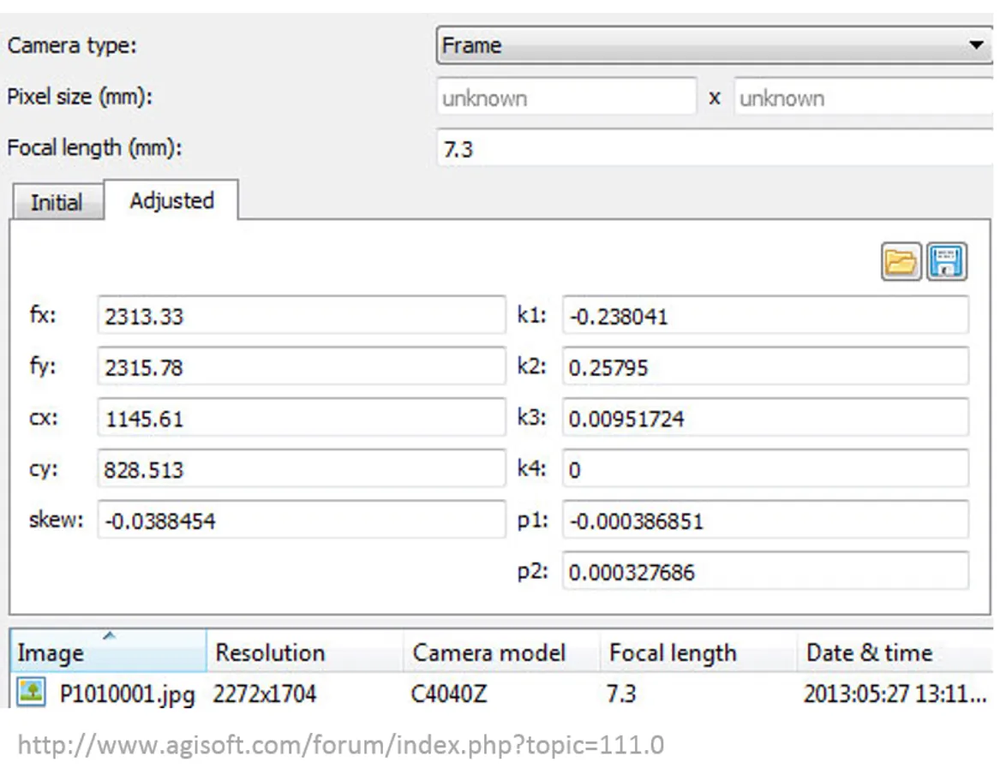{fig-alt="Diagram of focal length, principal point, and image plane inside a camera"}
:::
:::

::: {.notes}
Self-calibration is what lets a consumer camera produce usable maps, and it is also a source of the doming error from 2A: with weak geometry the adjustment can trade focal length against a bowed surface and still fit. GCPs and a second flying height constrain it. The report prints the solved camera model with its uncertainties.
:::

## Ground control points in processing {.smaller}

::: {.columns}
::: {.column width="50%"}
- A **marker** in Metashape is a GCP: known X, Y, Z plus its projections placed on the photos
- Used to set the coordinate system, to optimize the alignment, and to measure error
- Checkpoints are markers left unchecked in the reference pane: they are measured, not fitted
:::
::: {.column width="50%"}
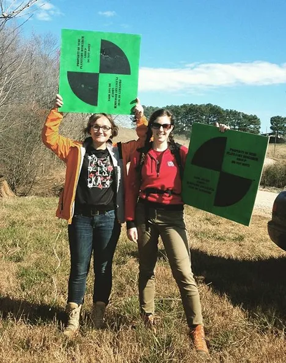{height="430" fig-alt="Two students holding ground control targets in a field"}
:::
:::

::: {.notes}
Marker placement is the manual part of the workflow and Assignment 2B walks through it: import the coordinates, filter photos by marker, drag the flag onto the target in several photos, optimize. The report then lists control error and checkpoint error separately; students should be able to say which one they would quote.
:::

## Processing in Metashape {.center .text-center .section-divider background-color="#e9f2e9"}

::: {.notes}
Section transition. Options first, then the Metashape workflow step by step, with the settings that matter and what they cost.
:::

## Where to process {.smaller}

| Option | Examples | Trade-off |
|---|---|---|
| Desktop, commercial | Agisoft Metashape, Pix4Dmatic, DJI Terra | Control and transparency; needs a capable machine and a license |
| Desktop, open source | WebODM (Topic 7) | Free, scriptable, same pipeline; fewer guardrails |
| Cloud | DroneDeploy, Pix4Dcloud, WebODM Lightning, Drone2Map | No local compute; recurring cost and less control over settings |

::: {.term-card}
**The real questions**: budget and equipment, how often you fly, whether you have the training to process, and whether you have the time
:::

::: {.notes}
This course uses Metashape (licensed for every student) and WebODM (free). RealityScan handles aerial blocks too and is free for students, so it is a fair third option for personal projects. Cloud services trade money for time and hide the parameters we spend the rest of this lecture on.
:::

## Agisoft Metashape {.smaller}

::: {.columns}
::: {.column width="55%"}
- Image-based reconstruction from still images, for aerial and close-range work alike
- Alignment and reconstruction are automated; the operator chooses parameters and places control
- Version , Professional edition, licensed for every student in this class
- [User manual](https://www.agisoft.com/pdf/metashape-pro_2_3_en.pdf), [Python API](https://www.agisoft.com/pdf/metashape_python_api_2_3_2.pdf), [YouTube channel](https://www.youtube.com/channel/UCPheXwPeFLnWHo8u4ksSH7w)
- Tutorials: [orthomosaic and DEM with GCPs](https://agisoft.freshdesk.com/support/solutions/articles/31000148381-orthomosaic-dem-generation-with-gcps), [point cloud classification and DTM](https://agisoft.freshdesk.com/support/solutions/articles/31000148866-dense-cloud-classification), [DEM-based measurements](https://agisoft.freshdesk.com/support/solutions/articles/31000148884-dem-based-measurements-)
:::
::: {.column width="45%"}
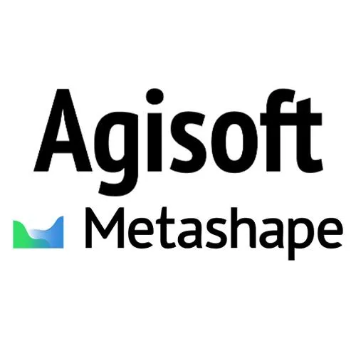{width="60%" fig-align="center" fig-alt="Agisoft Metashape logo"}
:::
:::

::: {.notes}
Metashape 2.x renamed several steps: the dense cloud is now the point cloud, build mesh is build model, and the orthophoto is the orthomosaic. Older tutorials and videos use the old names; the pipeline is the same. Keep the manual open during the assignment; the appendix has the memory requirements per quality setting.
:::

## The Metashape workflow {.smaller}

| Step (Workflow menu) | Produces |
|---|---|
| Add Photos, import positions | Cameras with initial exterior orientation |
| Align Photos | Tie points, camera poses, camera model |
| Place markers, Optimize Cameras | Georeferenced, refined alignment |
| Build Point Cloud (formerly Dense Cloud) | Dense point cloud from depth maps |
| Build Model (formerly Mesh), Build Texture | Textured 3D model; optional for mapping |
| Build DEM | DSM, or DTM from classified ground points |
| Build Orthomosaic | Orthomosaic |
| Export, Generate Report | GeoTIFF, LAS, OBJ, PDF |

::: {.notes}
This is the map of the rest of the lecture and of Assignment 2B. Check the diagnostics after every step before spending compute on the next one: a bad alignment makes everything downstream wrong, and it is the cheapest step to redo. The model step is optional for mapping; the DEM can be built from the point cloud or straight from depth maps.
:::

## Loading photos and positions {.smaller}

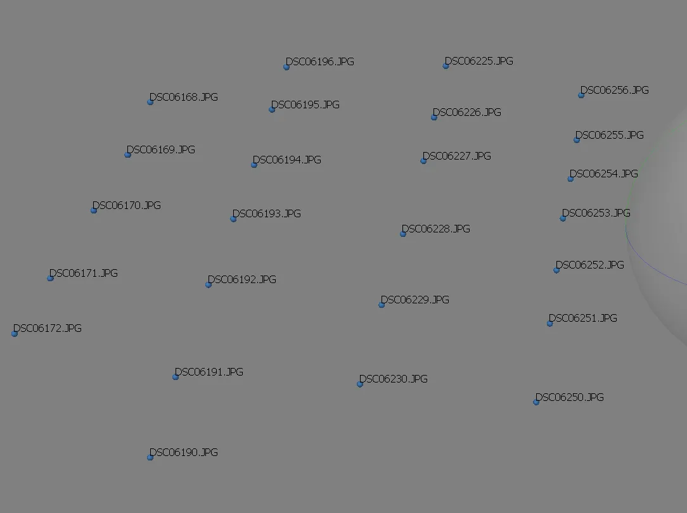{width="70%" fig-align="center" fig-alt="Metashape model view with camera positions arranged in flight lines above the site"}

- Add Photos, then check the reference pane: positions from EXIF load automatically
- Import a flight log when positions are not in EXIF: set the column order, coordinate system, and time offset
- Set camera accuracy (meters and degrees) to what the aircraft's GNSS can actually deliver

::: {.notes}
The picture to expect: cameras in neat flight lines above the footprint of the site. If they are scattered or in the ocean, the CRS or the column order is wrong. Camera accuracy is a weight, not a guess: 3 to 10 m for a standard GNSS, 0.02 to 0.05 m for RTK.
:::

## Align photos {.smaller}

::: {.columns}
::: {.column width="60%"}
- Detects features in every image and matches them across overlapping images
- Solves camera positions, orientations, and the camera model together (bundle adjustment)
- Output: **tie points** (the sparse cloud) and camera poses
:::
::: {.column width="40%"}
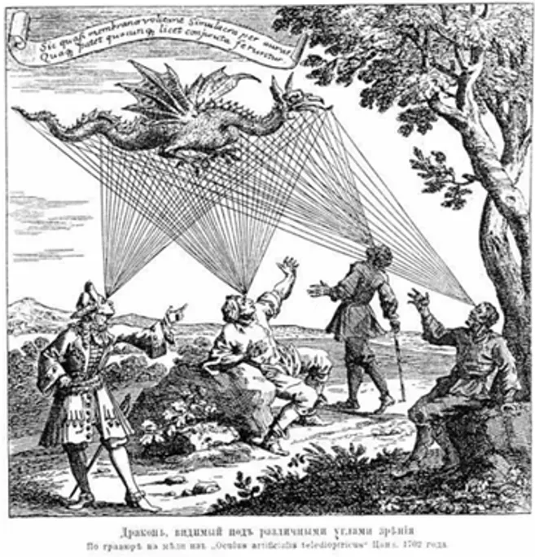{width="70%" fig-align="center" fig-alt="Cartoon of aligning photographs"}
:::
:::

| Accuracy | Highest | High | Medium | Low, Lowest |
|---|---|---|---|---|
| **Images** | upscaled 2x | full resolution | downscaled 4x | 16x, 64x |
| **Use** | small, high-quality sets | the usual choice | large projects | triage |

::: {.notes}
Start at High; drop to Medium only for very large projects, and use Low for a quick check that the block hangs together before placing markers. Reference preselection uses the geotags to decide which pairs to match and saves a lot of time on aerial blocks. If coverage is thin, revisit image quality and overlap rather than the settings.
:::

## Bundle adjustment {.smaller}

::: {.columns}
::: {.column width="50%"}
- Non-linear least squares over every camera and every tie point
- Minimizes **reprojection error**: the distance between where a 3D point projects and where the feature was detected
- Refines exterior and interior orientation at the same time
- Markers with known coordinates strengthen and georeference the solution
:::
::: {.column width="50%"}
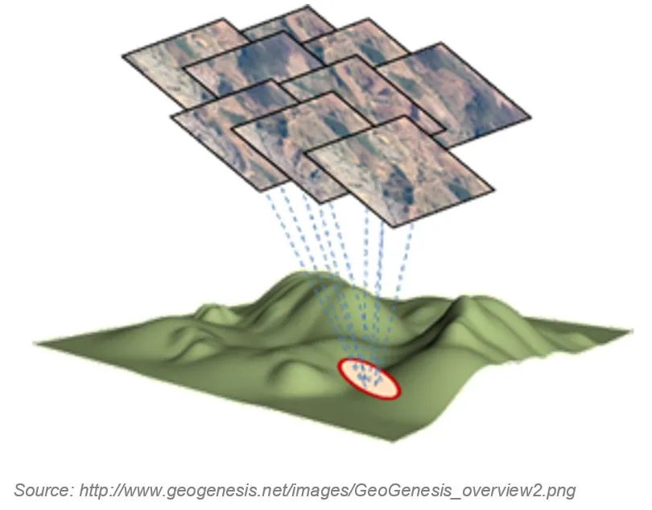{fig-alt="Diagram of rays from several camera stations converging on tie points on the ground"}
:::
:::

::: {.notes}
The mathematical heart of the workflow, and the reason the report's tie point statistics matter: a mean reprojection error above about one pixel says the camera model or the matches are poor. Optimize Cameras re-runs the adjustment after markers are placed; everything built before that (point cloud, DEM) must be rebuilt afterwards because the geometry moved.
:::

## Build point cloud {.smaller}

::: {.columns}
::: {.column width="50%"}
{height="180" fig-alt="Sparse tie point cloud"}
:::
::: {.column width="50%"}
{height="180" fig-alt="Dense point cloud of the same site"}
:::
:::

| Quality | Ultra high | High | Medium | Low, Lowest |
|---|---|---|---|---|
| **Image scale** | full, a point per pixel | 1/2 | 1/4 | 1/8, 1/16 |
| **Cost** | days on a laptop | hours; most real work | under an hour; the class setting | quick previews |

::: {.notes}
Metashape computes a depth map for every image and fuses them into the point cloud. Quality is the setting with the biggest effect on time and memory; the manual's appendix lists RAM per quality and image count. Medium is the assignment setting so that the lab finishes in class; High is what you would use for a real product.
:::

## Depth filtering and editing {.smaller}

| Depth filtering | Use when |
|---|---|
| Mild | Complex geometry with many small foreground details you want to keep |
| Moderate | In between |
| Aggressive | Aerial mapping; removes most outliers. The Assignment 2B setting |
| Disabled | Only for very clean, high-quality imagery |

- Edit the point cloud afterwards if needed: select and delete stray points, or classify ground points for a DTM
- Filter the tie points by reprojection error, reconstruction uncertainty, and image count, then optimize again

::: {.notes}
Filtering prunes outliers that come from poor texture, noise, and badly focused images. Aggressive is the aerial default; Mild is for objects with fine structure such as vegetation or thin poles. Cleaning tie points before optimization is the cheapest accuracy gain in the whole workflow.
:::

## Build model {.smaller}

::: {.columns}
::: {.column width="55%"}
| Setting | Options |
|---|---|
| Surface type | **Height field**: aerial and terrain, 2.5D, low memory. **Arbitrary**: closed objects, 3D, high memory |
| Source data | Depth maps or point cloud; tie points for a quick preview |
| Face count | High, Medium, Low, or custom |

::: {.term-card}
**Optional for mapping**: DEM and orthomosaic can be built without a model; build one for a textured 3D product
:::
:::
::: {.column width="45%"}
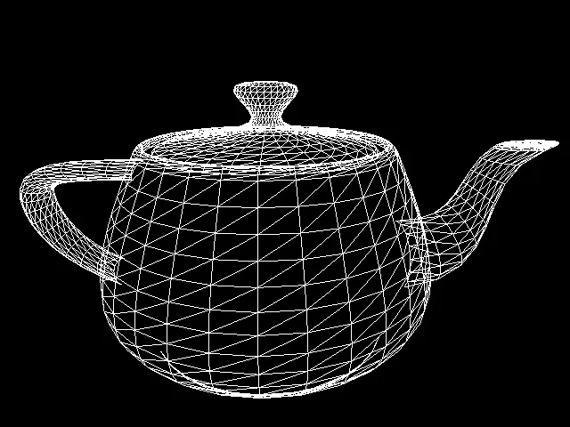{width="80%" fig-align="center" fig-alt="Triangulated mesh surface of terrain"}
:::
:::

::: {.notes}
Height field for anything flown nadir over terrain; arbitrary for the 2A-style objects and for facades. Face count controls memory and export size; generate a detailed master and decimate copies for the web. The assignment still builds a model so that students see the textured product, but a production mapping workflow often skips it.
:::

## Editing the model {.smaller}

::: {.columns}
::: {.column width="50%"}
- **Close holes**: fills gaps left by insufficient overlap; required before any volume calculation, otherwise the volume is meaningless
- **Decimate**: replaces a dense mesh with a lighter one
- Filter by connected component size and polygon size to drop floating fragments
- Export to an external editor for heavy repairs and import the result
:::
::: {.column width="50%"}
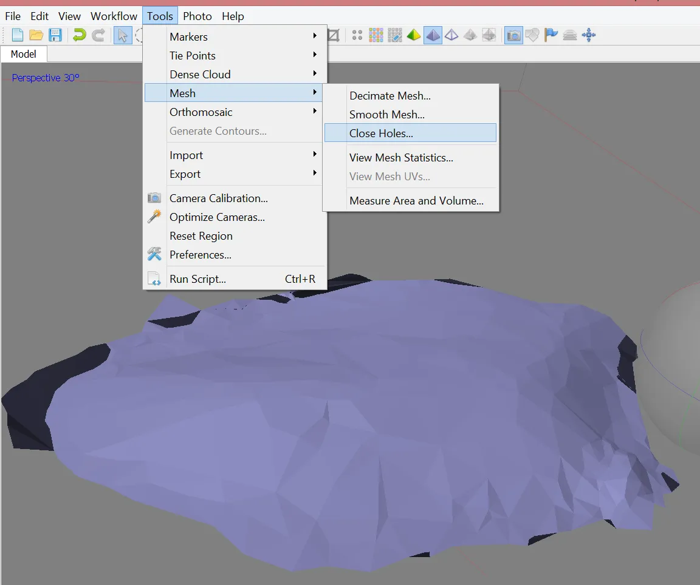{fig-alt="Metashape close holes dialog"}
:::
:::

::: {.notes}
Holes are common in UAS data because weather cuts flights short. Close them before computing volumes; leave them alone otherwise, since interpolated geometry is invented geometry. Filtering by component size is the quickest way to remove floaters over water or sky.
:::

## Build texture {.smaller}

::: {.columns}
::: {.column width="55%"}
| Mapping mode | Use |
|---|---|
| Generic | Any object; as uniform a texture as possible |
| Adaptive orthophoto | Terrain with buildings: flat areas textured orthographically, vertical faces separately |
| Orthophoto | Terrain only; most compact, weaker on vertical faces |
| Spherical, Single camera, Keep uv | Special cases: ball-shaped objects, one photo, existing parameterization |

Blending: Mosaic (default) picks the most nadir view per pixel; Average blends all views
:::
::: {.column width="45%"}
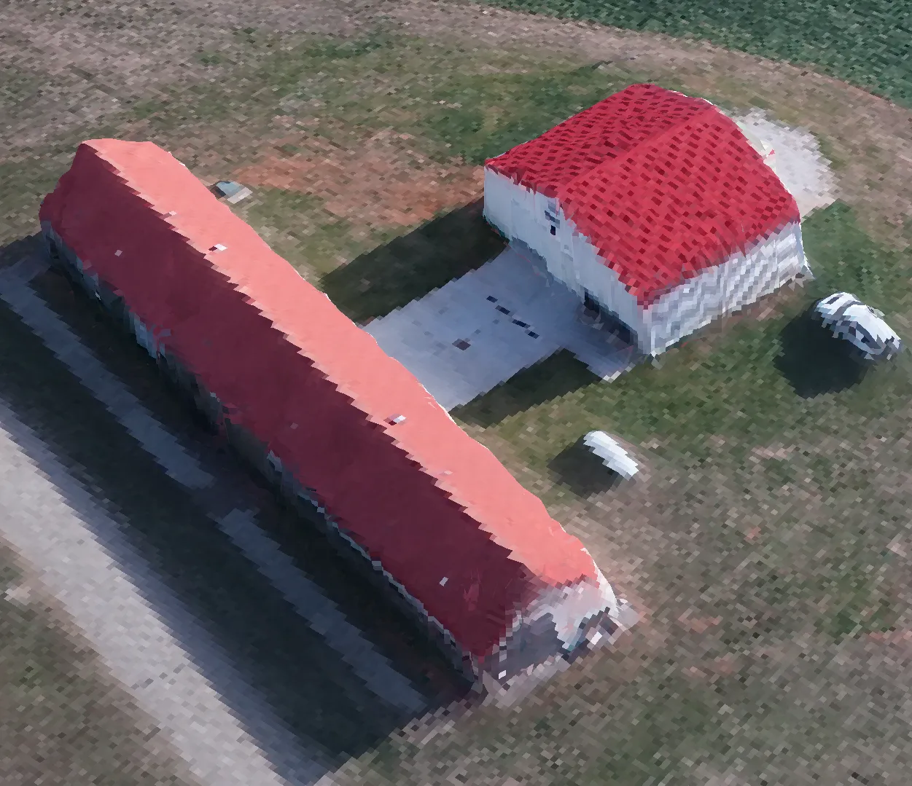{width="85%" fig-align="center" fig-alt="Textured 3D model"}
:::
:::

::: {.notes}
For terrain, Adaptive orthophoto or Orthophoto; the rest are for objects. Texture size sets the atlas resolution; 4096 is enough for the assignment. Texture is purely visual and does not affect the DEM or orthomosaic.
:::

## Build DEM {.smaller}

::: {.columns}
::: {.column width="45%"}
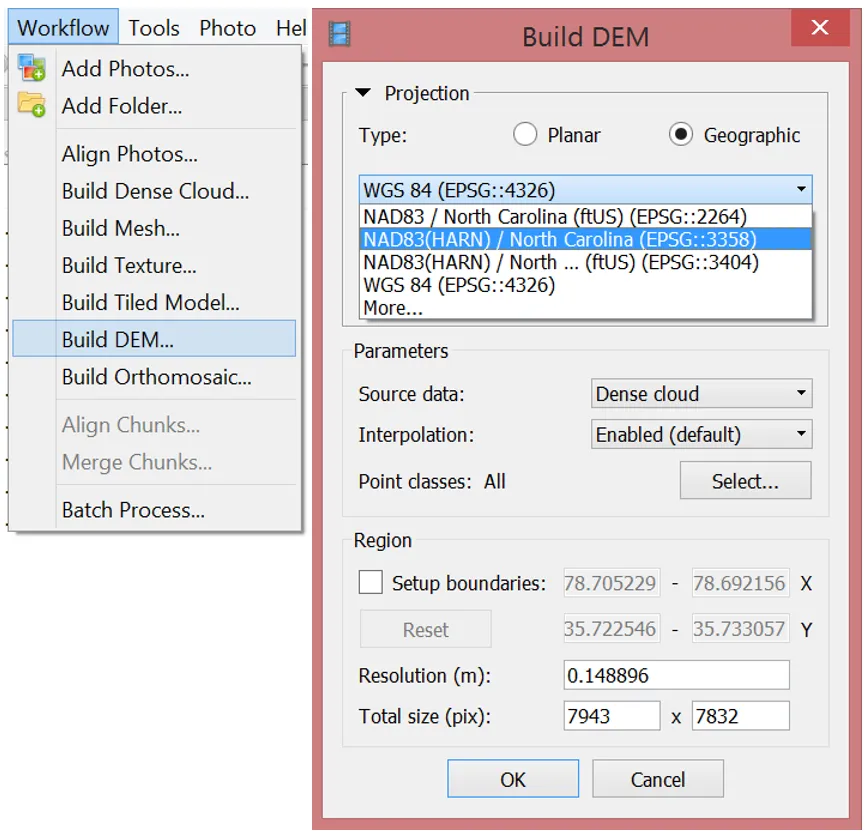{fig-alt="Metashape build DEM dialog"}
:::
::: {.column width="55%"}
- **Projection**: set the output CRS here; the assignment uses NC State Plane, EPSG:3358
- **Source data**: point cloud (all points for a DSM, ground class for a DTM), depth maps, or model
- **Interpolation**: Enabled (default) fills gaps visible in at least one image; Disabled keeps only observed cells and is the honest choice for accuracy checks
- **Resolution**: leave the default, which follows the ground sampling distance
:::
:::

::: {.notes}
Set the projection once here and the orthomosaic follows it. Point cloud as source with the ground class selected is how Metashape produces a DTM. Turn interpolation off when you want to know where the data really are, on when you need a continuous surface for analysis.
:::

## Build orthomosaic {.smaller}

::: {.columns}
::: {.column width="45%"}
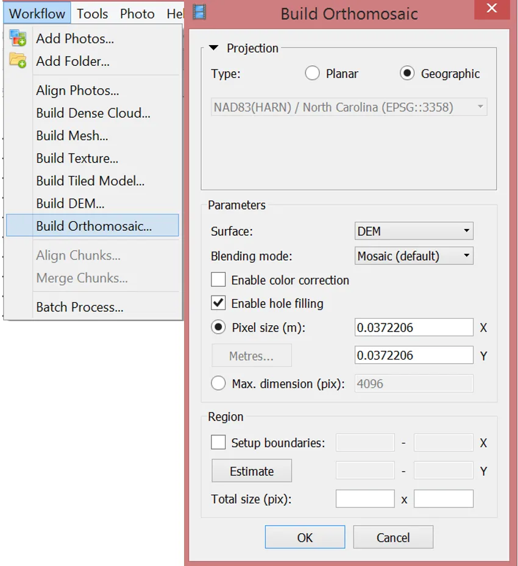{width="85%" fig-align="center" fig-alt="Metashape build orthomosaic dialog"}
:::
::: {.column width="55%"}
- **Surface**: DEM (the usual choice for mapping) or Model (true orthophoto with building facades handled)
- **Blending mode**: Mosaic (default) divides the imagery into frequency bands and blends each; Average uses a weighted mean of all photos; Disabled takes the most nadir photo per pixel and shows seams
- **Refine seamlines** and the **ghosting filter** help with moving objects and canopy
- Same CRS as the DEM; the orthomosaic can only be built in the DEM's projection
:::
:::

::: {.notes}
Mosaic is the right default; Average reduces noise on uniform surfaces but blurs edges; Disabled is a diagnostic to see where seams fall. Building on the model instead of the DEM gives a true orthophoto where building sides do not smear, at the cost of model quality driving the result.
:::

## Exports and quality control {.center .text-center .section-divider background-color="#e9f2e9"}

::: {.notes}
Section transition. Getting the products out in formats the rest of the course uses, and reading the report that says how good they are.
:::

## Export formats {.smaller}

| Product (File, Export) | Formats | Notes |
|---|---|---|
| Orthomosaic | GeoTIFF, COG, JPEG, PNG, KMZ | Check the CRS; write overviews |
| DEM | GeoTIFF, COG, XYZ | Verify units and vertical datum |
| Point cloud | LAS, LAZ, COPC, PLY, E57 | Keep RGB and classes; COPC streams into GRASS |
| Model | OBJ, PLY, GLB, FBX, 3D PDF | OBJ writes textures as separate files; GLB is one file |
| Report | PDF | Always |

::: {.notes}
Cloud-optimized formats (COG for rasters, COPC for point clouds) are what the later topics read directly from the web bucket. Camera positions and calibration can also be exported (XML, omega phi kappa text, Bundler) for reuse in other software. Save the project after every stage so a failed step can be rerun without recomputing everything before it.
:::

## The processing report {.smaller}

::: {.columns}
::: {.column width="55%"}
Always generate it. It contains:

- Survey data: image count, flying altitude, ground resolution, coverage area, camera model
- Camera calibration with residual plots
- Camera locations and error estimates
- Ground control point and checkpoint errors, listed separately
- Overlap map, DEM and orthomosaic previews, processing parameters
:::
::: {.column width="45%"}
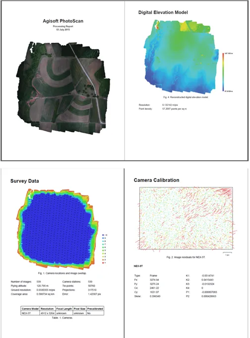{width="62%" fig-align="center" fig-alt="Pages of a Metashape processing report with the orthomosaic, DEM, overlap map, and camera calibration residuals"}
:::
:::

::: {.term-card}
**Quote the checkpoint RMSE**: control point error is circular, the adjustment was told to fit those points
:::

::: {.notes}
Assignment 2B asks students to explain the report, and this slide is the reading guide. Overlap map: dark areas with fewer than 3 images are where the reconstruction is weak. Calibration residuals: a systematic pattern means the camera model is not fitting. Control versus checkpoint: if checkpoint error is much larger than control error, the model is over-fitting the control and the distribution or weighting needs work.
:::

## Optimizing with markers {.smaller}

::: {.columns}
::: {.column width="55%"}
1. Import marker coordinates and set their coordinate system
2. Place each marker on several photos (filter photos by marker)
3. Set marker accuracy (0.005 to 0.05 m) and camera accuracy to realistic values
4. Optimize Cameras: the adjustment now fits the control
5. Rebuild the point cloud, DEM, and orthomosaic; the geometry has moved
:::
::: {.column width="45%"}
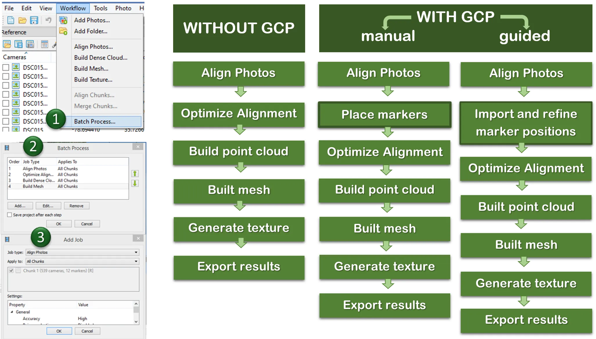{fig-alt="Metashape batch process dialog listing queued workflow steps"}
:::
:::

::: {.term-card}
**Batch process**: queue the steps with their parameters and let them run unattended; the same steps are available from the Python API for repeatable projects
:::

::: {.notes}
The step students skip is the last one: after optimization every derived product is stale. Batch processing is how you avoid babysitting a multi-hour job, and the Python API is the same workflow as a script, which becomes useful when you process repeat flights of the same site in the change-detection topic.
:::

## Wrap-up

::: {.term-card}
**Assignment 2B**: [Geoprocessing UAS imagery in Agisoft Metashape](../assignments/assignment_2b.qmd), from the Lake Wheeler photos to an orthomosaic, a DSM, and a report you can explain
:::

::: {.term-card}
**Next topic**: UAS flight planning, and the Lake Wheeler field flight where the next dataset gets collected
:::

::: {.notes}
Recap the arc: inputs, products, orientation and control, the Metashape pipeline step by step, exports, and the report. Point students at the assignment page for the data download, the step-by-step settings, and the submission requirements; remind DE students that the recorded walkthrough follows the same order as this deck.
:::

## References {.smaller}

The Metashape settings on these slides follow the user manual [@agisoft_metashape_manual_2025]; the mathematics of dense matching are in @furukawa_hernandez_2015, and Lecture 2A's concepts are the background for every step here.

::: {#refs}
:::
