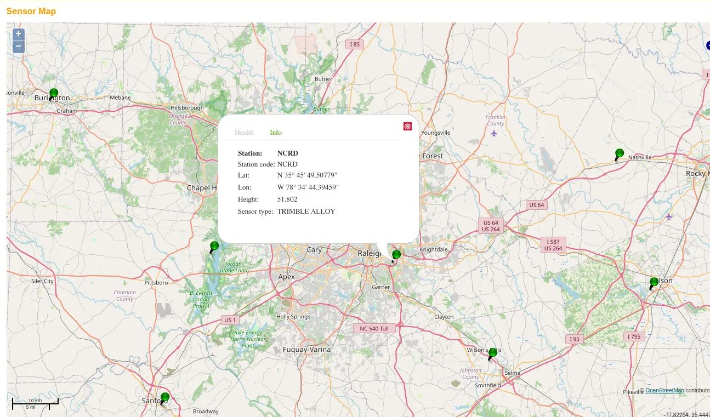
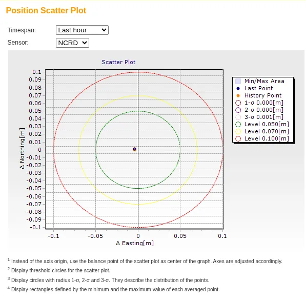

Read this before the  Lake Wheeler field flight.

::: {.callout-note}
**Distance education students**: read this protocol, then watch [How to Place Ground Control Points (GCPs) for Precise Drone Mapping](https://www.youtube.com/watch?v=uWDz1NpWGtA) for the target placement and survey in sections 3 and 5.
:::

## Equipment List

- [ ] Emlid Reach RS4 rover on a survey pole
- [ ] Emlid Reach RS4 base with a fixed-height tripod and tribrach
- [ ] Tablet running [Emlid Flow](https://emlid.com/flow/), paired to both receivers, with the NCRTN login entered
- [ ] Four ground control targets
- [ ] DJI Mavic Air 2 with two charged batteries and the flight plan loaded
- [ ] Field sheets
- [ ] LoRa radio link between base and rover, as the fallback if cell coverage drops

::: {.callout-warning}
Bring closed-toe shoes, clothes for an hour outdoors, water, and a phone for point photos. There is no bathroom or water at the site.
:::

## Plan

1. Arrive and gather at the command area.
2. Overview: what is being flown, why the targets and checkpoints exist, and where not to stand during the flight.
3. Method B on the mark with the rover (section 1).
4. Set up the base on the mark and start the log (section 2).
5. Lay the four targets and survey them, everyone together, rotating on the rover (section 3).
6. Preflight and launch. One battery over the target field (section 4).
7. While the aircraft flies, groups rotate on the rover for 8 to 10 checkpoints, off the flight line (section 5). Then a second group re-occupies 3 of them.
8. Land and check the photo count and geotags. Stop the rover and export the project. Stop the base log last. Pack up (section 6).

## 1. Method B: the mark's coordinate, by rover

Do this before the base is set up.

1. In Emlid Flow, connect the rover to the NCRTN caster: host [rtn.nc.gov](https://rtn.nc.gov/), port 2101, mountpoint `VRS_RTCM34_MSM5`, course login. Corrections come through the tablet's cell data.
2. Antenna height is the pole length. Confirm it once and leave it.
3. Hold the pole plumb on the practice mark (35.727565, -78.697788). Wait for FIX, note satellites and correction age, and collect a 2 minute averaged occupation.
4. Record the coordinate on the field sheet. This is Method B.

## 2. The base: a logger on the mark

1. Set the tripod over the mark and level it.
2. Measure the antenna height to the bottom of the receiver and record it as such. Emlid Flow adds the phase center offset. A wrong height is a direct vertical error in Method C.
3. Confirm open sky. Record satellites and PDOP.
4. **Start the raw log**: RINEX at 1 Hz. Note the start time. It runs until the last rover point is collected.
5. **Method A**: while still in SINGLE, average the position for 1 minute and record it. Skip if short on time; the log gives the same number later.
6. **Do not reconfigure, restart, or bump the base** until the end.

## 3. Targets

Project settings on the rover: NAD83(2011) / North Carolina in meters (EPSG:6542) with NAVD88 (GEOID18) height. The labs use EPSG:3358, NAD83(HARN), which differs by about 2 cm here, so write the datum on the field sheet.

- Lay the four targets on the pre-chosen spots, one toward each corner, none on the very edge. Weight them down. A surveyed target does not move.
- Measure the center of each with a 30 second averaged FIX, rotating on the rover so everyone runs an occupation. These are the only points used to control the processing.
- Photograph each target with the pole tip visible and log its number.

## 4. The flight

The instructor is the Remote Pilot in Command. Students act as visual observers and may take the controls under supervision.

- Run the preflight checklist. Lake Wheeler is Class G airspace, so no authorization is needed, and the site is inside the North Carolina State University Lake Wheeler West FRIA, so Remote ID is not required. Daylight is 6:59 am to 7:22 pm. The flight stays at or below 400 ft AGL.
- Fly one battery, one block over the target field. The second battery is the spare.
- After landing, check the photo count and confirm the photos carry geotags.

::: {.callout-warning}
## GPS interference test on the flight day

The FAA advisory [FTBRNC GPS 26-76](https://www.faasafety.gov/files/notices/2026/Sep/FTBRNC_26-76_GPS_Flight_Advisory.pdf) schedules GPS interference testing centered on Fort Bragg on September 14 to 16, daily 1500Z to 2300Z, which is 11:00 am to 7:00 pm EDT. The test starts in the middle of the field window. Lake Wheeler is 85 km (46 NM) from the center, and the advisory's area covers the whole state from the surface up.

What this means on the day:

- Method B, the base log, and the four targets are finished before 11:00. That is why they come first.
- The aircraft launches before 11:00 if at all possible. If the GPS signal degrades in flight, the instructor lands it; the flight plan does not resume until the aircraft reports a normal satellite count.
- After 11:00, watch the rover's status on every occupation. If FIX drops to FLOAT or SINGLE and does not come back within a minute, stop collecting checkpoints and note the time. Points collected without a FIX are not used.
- The base log keeps running regardless. Its post-processing against NCRD is checked in the lab for the interference window.
- The NCRTN posts interference notices on its Status Messages page; the instructor checks it the morning of the trip.
:::

## 5. Checkpoints

Collected while the aircraft flies, off the flight line. Checkpoints are withheld from processing and measure the accuracy of the products.

- Pick points you can find in the imagery: pavement corners, sidewalk joints, manhole edges, paint marks. Avoid grass and gravel.
- Hold the pole plumb, confirm FIX, and collect a 30 second averaged occupation.
- Photograph the point with the pole tip visible and log the point number.
- Spread the points across the block and its elevation range; put several on level ground for the vertical check.

Groups rotate on the rover, one or two points each. One person calls FIX status and satellite count on every occupation.

**Repeatability check.** A second group re-occupies 3 checkpoints without seeing the first numbers. Independent agreement is the honest accuracy check.

## 6. What goes to the shared folder

The GNSS lead uploads, the same day:

1. The base RINEX log
2. The Emlid Flow CSV export (all points, both height types)
3. The Method A and B coordinates, with antenna heights and times
4. The point photos, named by point number
5. A photo of the field sheet

The instructor uploads the flight photos.

## If cell coverage drops

The instructor switches the base to broadcasting: the Method B coordinate as its known position, the recorded antenna height, LoRa on, rover to LoRa. The log keeps running. If there was never coverage, the base averages in SINGLE and broadcasts that; the survey shifts onto the correct datum later, when the log is post-processed against NCRD (Method C). Nothing is lost.

## The reference station behind Methods B and C

Method B takes live corrections from the NCRTN; Method C post-processes the base log against one of its stations. For Lake Wheeler that is **NCRD** (Raleigh DOT), a Trimble Alloy at 35.763752, -78.578998, ellipsoid height 51.802 m, 11.5 km from the mark. The next nearest stations are 23 to 52 km away.

{width="85%" fig-align="center" fig-alt="NCRTN sensor map of the Raleigh area with a popup for station NCRD giving its latitude, longitude, height, and Trimble Alloy sensor type"}

The network checks every station against its published coordinate continuously. Over one hour NCRD scatters by 1 mm at 3 sigma. A two-meter error in a base coordinate comes from the tripod, the antenna height, or a typo, never from the network.

{width="55%" fig-align="center" fig-alt="NCRTN position scatter plot for NCRD showing all points clustered at the origin inside 5, 7, and 10 centimeter threshold circles, with 1 sigma 0.000 m and 3 sigma 0.001 m"}

Both pages are public at [rtn.nc.gov](https://rtn.nc.gov/) under Sensor Map and Status Messages.

::: {.callout-note collapse="true"}
## Instructor checklist (before the trip)

- NCRTN RTK login tested in Emlid Flow on the field tablet, over its own cell data, with a FIX obtained off campus
- NCRTN CORS download account working; NCRD is the station for Method C
- RS4 firmware and Emlid Flow updated; LoRa link tested at range
- Fixed-height tripod parts complete; pole tip checked
- Mavic Air 2: two batteries charged, the block planned for one battery, B4UFLY and the NCRTN status page checked the morning of; GPS advisory FTBRNC GPS 26-76 runs 11:00 am to 7:00 pm EDT on the flight day, so launch before 11:00
- Four target spots chosen in advance
- Field sheets printed; targets counted
- After the trip: derive `checkpoints.csv` (`name, easting, northing, height`, EPSG:3358, orthometric) and `checkpoints_full.csv` from the Emlid Flow export, marking re-occupations in the name. EPSG:6542 to EPSG:3358 is a datum transformation (NGS NCAT), not a relabel
- After the trip: download the NCRD RINEX for the session window and package it with the base log and the Method A and B coordinates as `base_bundle.zip`
- After processing: upload the six product files, the two report PDFs, and `base_bundle.zip` to the GCS `091626/` folder under the names in `_variables.yml`
- Assign a GNSS lead per group and a rotation order
:::

The Methods A, B, and C comparison and the checkpoint validation continue in the Topic 3B lab.
