## Objectives

::: {.incremental}
- Describe the four phases of flight planning, from project definition to flight control
- Apply safety procedures and preflight checklists required under Part 107
- Plan ground control point placement and relate GCP accuracy to ground sampling distance
- Set the flight parameters that shape a mapping mission: altitude, overlap, pattern, speed, and lighting
- Choose a flight planning platform for a given aircraft and project
:::

::: {.notes}
Topic 2 covered what processing needs from the imagery. Today is how to plan a flight that delivers it, and Wednesday we fly at Lake Wheeler. Two questions keep coming back through the deck: what is the aim of the project, and what resolution does it need. Every parameter later follows from those two answers.
:::

## Where this lecture sits {.center .text-center}

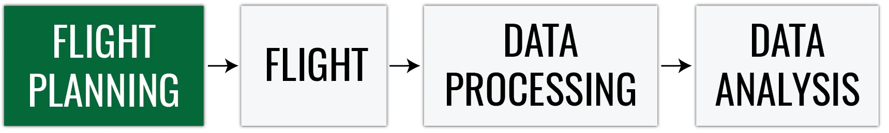{width="85%" fig-alt="UAS photogrammetric process: flight planning (highlighted), flight, data processing, data analysis"}

::: {.term-card}
**Four questions to keep asking**: What is the aim of the project? What resolution does it need? What do the regulations allow? What will the weather do?
:::

::: {.notes}
Flight planning is the first box of the pipeline, and it is the cheapest place to fix a problem. A flight that was planned wrong cannot be processed right.
:::

## Four phases of flight planning {.center .text-center .section-divider background-color="#e9f2e9"}

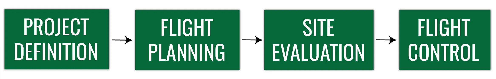{width="85%" fig-alt="Flight planning phases: project definition, flight planning, site evaluation, flight control"}

::: {.notes}
The strip at the top of the next slides tracks where we are: project definition, flight planning, site evaluation, and flight control.
:::

## Project definition {.smaller}

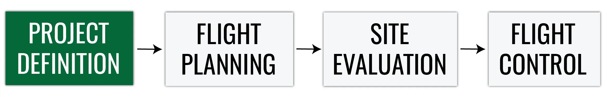{width="100%" fig-alt="Flight planning phases with project definition highlighted"}

| Decision | Driven by |
|---|---|
| Spatial scale: resolution and extent | Project aim, UAS and sensor capabilities, terrain constraints |
| UAS and sensor | Required resolution, area size, budget |
| Cost, labor, and time | Area, number of flights, field crew, processing |
| Terrain information | Existing DEMs, imagery, and local knowledge of the site |

::: {.notes}
Extent and resolution set everything downstream: the aircraft you need, the number of batteries, the number of photos, and the processing time. Collect what you can about the terrain before you commit to a sensor.
:::

## Project definition {.smaller}

{width="100%" fig-alt="Flight planning phases with project definition highlighted"}

::: {.columns}
::: {.column width="50%"}
**Legal constraints**

- Airspace class and any authorization needed (Topic 1)
- Landowner permission for takeoff, landing, and access
- Local restrictions on the site
:::
::: {.column width="50%"}
**Coordinate system**

- Chosen by the desired coordinate system of the final products
- Consistent with the coordinate system of the GCP survey
- Record the horizontal and vertical datum
:::
:::

::: {.term-card}
**Decide the coordinate system before the survey**: a GCP file without its coordinate system is a list of numbers, not coordinates
:::

::: {.notes}
Two things people forget until it is too late: permission to be on the ground, and the coordinate system. Pick the CRS of the final product first, then survey the control in it, or in something you can transform exactly. Lecture 2B covered why the vertical datum matters here.
:::

## Flight planning {.smaller}

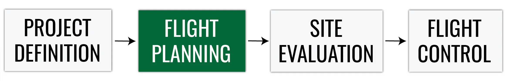{width="100%" fig-alt="Flight planning phases with flight planning highlighted"}

- Mission area assessment
- Planning geometric parameters: altitude, overlap, pattern, and camera angle
- Choosing a flight planning and flight logging platform
- Preliminary weather assessment: climate, season, forecasts
- Creating the flight plan in the chosen software

::: {.notes}
This phase is the desk work. The geometric parameters get their own section at the end of the lecture; the platform choice gets a table. Weather starts here as climate and season, and gets rechecked on the day.
:::

## Placing ground control points {.smaller}

::: {.columns}
::: {.column width="55%"}
- A **minimum of 5 GCPs** is recommended; 5 to 10 are usually enough, even for large projects
- Use more GCPs when the topography is complex
- Distribute them **evenly** across the area
- **Do not place** GCPs exactly at the **edges** of the area
:::
::: {.column width="45%"}
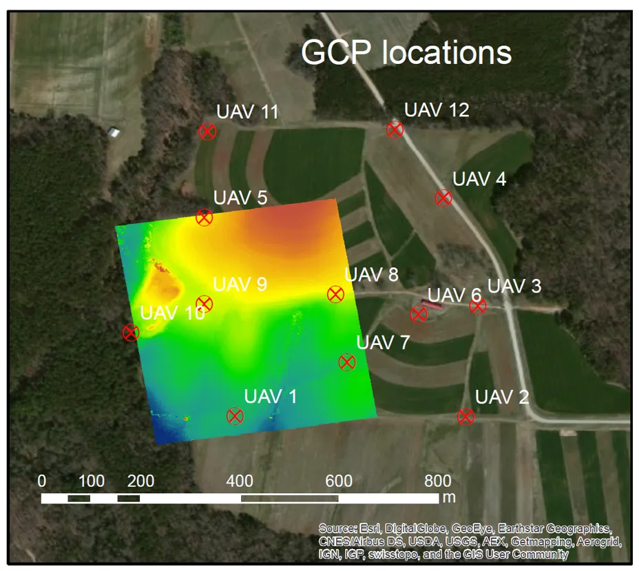{width="90%" fig-align="center" fig-alt="Map of twelve GCP locations spread across the Lake Wheeler fields around a UAS elevation model"}
:::
:::

::: {.notes}
Even distribution matters more than count. Points clustered in one corner leave the rest of the model free to bow. Points on the very edge sit in weak image geometry and are hard to place on enough photos. Lecture 3B goes into control versus checkpoints.
:::

## Surveying the GCPs {.smaller}

::: {.columns}
::: {.column width="55%"}
Before measuring the GCP coordinates, define:

- The GCP coordinate system
- The GCP accuracy the project needs
- The survey equipment: RTK GNSS rover, total station, or handheld GPS

::: {.term-card}
**Target size**: 5 to 10 times the GSD, so the center is identifiable on the photos
:::
:::
::: {.column width="45%"}
{width="80%" fig-align="center" fig-alt="An L-shaped white GCP target on grass next to a survey stake with orange flagging"}
:::
:::

::: {.notes}
A handheld GPS gives meters, an RTK rover gives centimeters, and the model can never be more accurate than the control. On Wednesday we survey with the Emlid rover; the GNSS field protocol on the topic page walks through it.
:::

## Ground sampling distance {.smaller}

::: {.columns}
::: {.column width="60%"}
Distance between two consecutive pixel centers measured on the ground:

$$
\text{GSD} = \frac{H \times S_w}{f \times I_w}
$$

| Symbol | Meaning |
|---|---|
| $H$ | Flight altitude above ground level, AGL (m) |
| $S_w$ | Sensor width (mm) |
| $f$ | Focal length (mm) |
| $I_w$ | Image width (pixels) |

::: {.term-card}
**Larger GSD** means lower spatial resolution; **smaller GSD** means higher spatial resolution
:::
:::
::: {.column width="40%"}
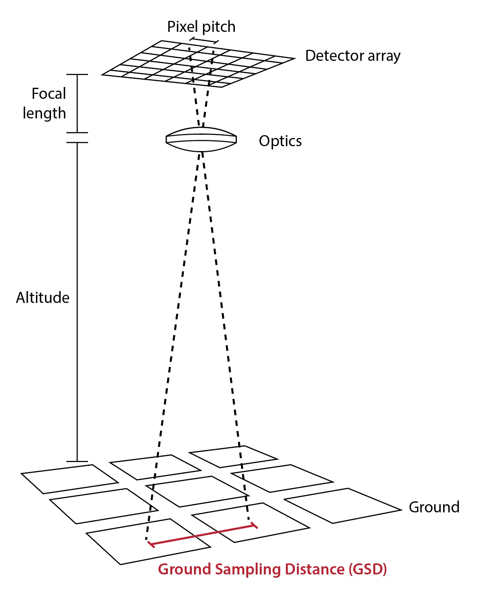{width="70%" fig-align="center" fig-alt="Diagram of a detector array, lens, and ground showing how focal length and altitude set the ground sampling distance"}
:::
:::

::: {.notes}
Same formula works with height and image height. Worked example for the Mavic Mini 2 on the later screenshots: 70 m altitude, 6.17 mm sensor, 4.36 mm lens, 4000 pixels wide gives about 2.5 cm per pixel. Halve the altitude, halve the GSD.
:::

## GCP accuracy and GSD {.smaller}

| Requirement | Rule of thumb |
|---|---|
| GCP target size | 5 to 10 times the GSD |
| GCP survey accuracy | At least 0.1 times the GSD |
| Accuracy of the final products | Sets the GSD, and so the altitude, in the first place |

::: {.term-card}
**Work backwards**: required product accuracy sets the GSD, the GSD sets the altitude and the target size, and the target size sets what the survey must deliver
:::

::: {.notes}
At 2.5 cm GSD the target must be 12 to 25 cm across and surveyed to a few millimeters. That is what an RTK rover delivers with a good fix. A handheld GPS cannot, and control worse than the GSD adds error rather than removing it.
:::

## Site evaluation {.smaller}

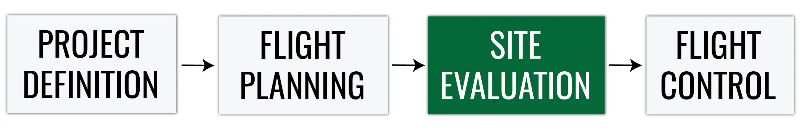{width="100%" fig-alt="Flight planning phases with site evaluation highlighted"}

- **Terrain check**: high obstacles in the takeoff, mission, landing, and alternative landing locations
- Ask the locals about possible air traffic or ground activities
- **Weather check**: temperature affects battery life, and most UAS cannot operate in rain
- Use checklists, do not rely on your memory

::: {.term-card}
**Sample checklists**: [paper checklist for the Phantom](https://phantompilots.com/attachments/drone-checklist-pdf.41608/) and the [RMUS preflight app](https://www.rmus.com/pages/rmus-uav-pilot-preflight-compliance-checklist)
:::

::: {.notes}
Walk the site before the flight day if you can. Look up for wires and trees along the flight lines, and pick the alternative landing area before you need it. Cold cuts battery life hard, so plan fewer minutes per battery in winter.
:::

## Site layout {.smaller}

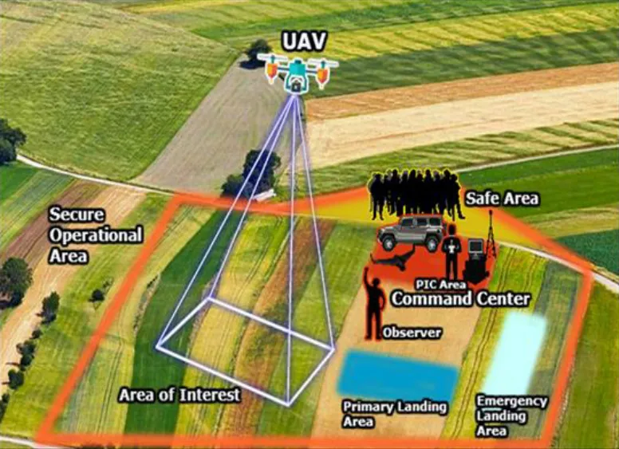{width="62%" fig-align="center" fig-alt="Aerial view of a field marked with the secure operational area, area of interest, command center, observer, safe area, and primary and emergency landing areas"}

::: {.notes}
Everything on this picture is chosen on the ground before launch: the operational area, the area of interest inside it, the command center with the pilot, the observer position, the safe area for everyone else, and the primary and emergency landing areas.
:::

## Preflight inspection {.smaller}

::: {.columns}
::: {.column width="55%"}
- Required under **Part 107.49**
- The **Remote Pilot in Command (RPIC)** must develop a preflight inspection checklist if the manufacturer has not provided one
- Usually built into the flight software or available from the vendor; otherwise write a standard checklist and have the flight crew follow it
:::
::: {.column width="45%"}
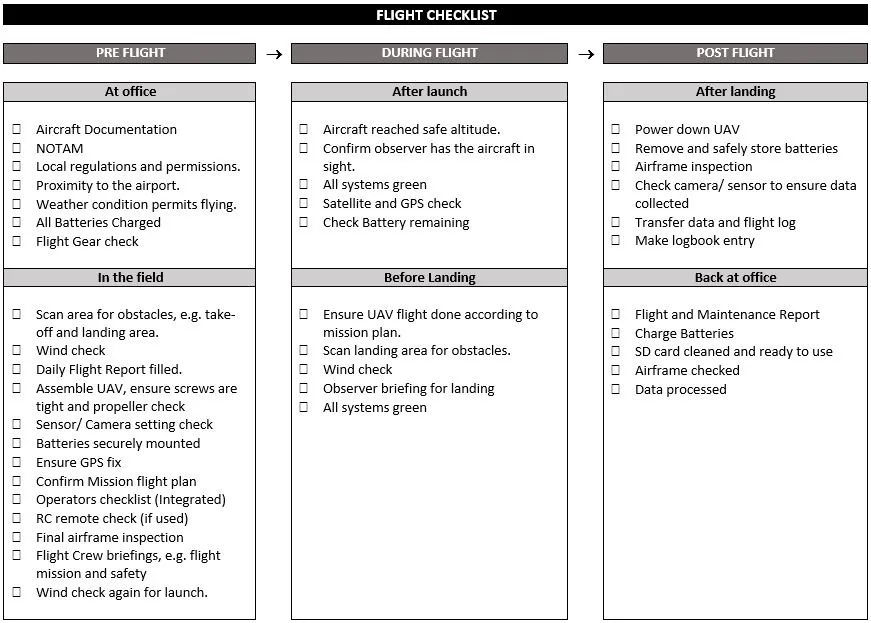{width="95%" fig-align="center" fig-alt="Flight checklist with pre-flight, during-flight, and post-flight columns split into office, field, launch, landing, and post-landing tasks"}
:::
:::

::: {.term-card}
**North Carolina**: no separate N.C. permit is required for commercial and government operators since December 1, 2024
:::

::: {.notes}
Part 107.49 is the rule that makes the checklist mandatory, not optional. Notice the checklist covers before, during, and after: the post-flight column is where data gets copied and the logbook gets written, and that is the column students skip.
:::

## Flight control {.smaller}

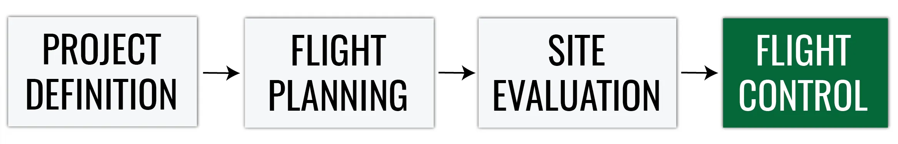{width="100%" fig-alt="Flight planning phases with flight control highlighted"}

- The RPIC should **launch, operate, and recover** from **preset locations** so the aircraft flies according to the mission plan
- Observation locations should be selected for **maximum line of sight** throughout the planned flight area (Part 107.31)
- On any failure or loss of visual contact, command the aircraft back to the recovery location or use the built-in fail-safe features

::: {.term-card}
**Visual Line of Sight (VLOS)**: the flight crew must have a clear view of the aircraft at all times, without aids other than corrective lenses
:::

::: {.notes}
Preset locations means the takeoff, landing, and observer spots from the site layout slide, not wherever the crew happens to be standing. Know the return-to-home behavior and altitude of your aircraft before you need it.
:::

## Flight crew roles {.smaller}

{width="100%" fig-alt="Flight planning phases with flight control highlighted"}

| Role | Responsibility |
|---|---|
| **RPIC**, Remote Pilot in Command | Holds the certificate; responsible for the operation and the final say |
| **PMC**, Person Manipulating the Controls | Flies the aircraft under the direct supervision of the RPIC |
| **VO**, Visual Observer | Watches the aircraft and the airspace; optional but recommended |

::: {.term-card}
**Part 107.33**: the RPIC, the person manipulating the controls, and any visual observer must be able to communicate with each other at all times
:::

::: {.notes}
On Wednesday: I am RPIC, some of you will fly under supervision as PMC, and everyone else is a visual observer. Communication means you can be heard without a radio, or with one that works.
:::

## Lake Wheeler {.center .text-center .section-divider background-color="#e9f2e9"}

::: {.notes}
Our site for the field flight and for the rest of the course data.
:::

## Lake Wheeler Field Laboratory {.smaller}

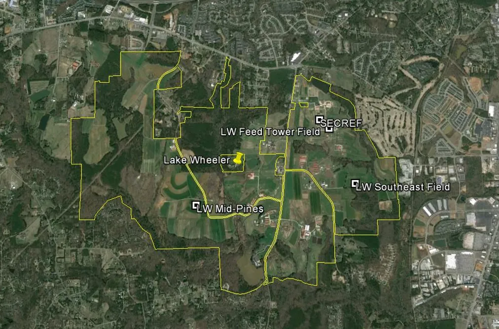{width="72%" fig-align="center" fig-alt="Satellite view of the Lake Wheeler Field Laboratory outlined in yellow, with the Mid-Pines, Feed Tower, and Southeast fields and SECREF labeled"}

::: {.notes}
NC State's agricultural field laboratory south of campus. The Mid-Pines field is where we fly, and the GCP layout you saw earlier is from here.
:::

## Lake Wheeler on the sectional chart {.smaller}

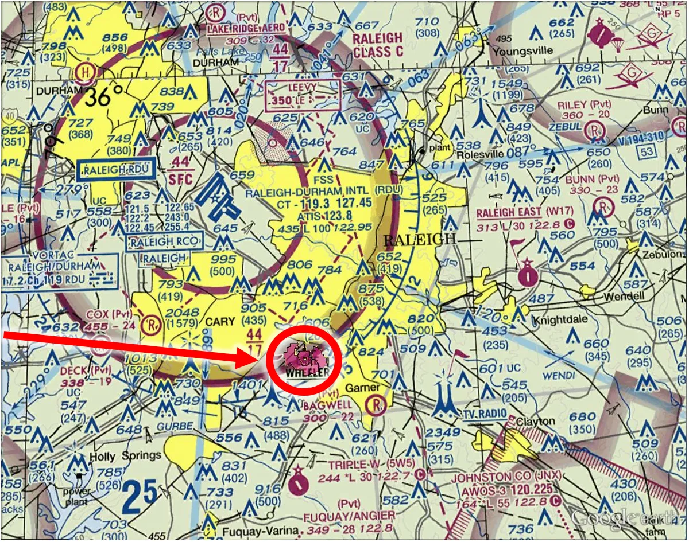{width="68%" fig-align="center" fig-alt="Raleigh sectional aeronautical chart with Lake Wheeler circled inside the RDU Class C airspace shelf"}

::: {.notes}
Read the chart as in Topic 1: Lake Wheeler sits under the RDU Class C shelf, so the flight needs a LAANC authorization at the allowed ceiling. Check the ceiling before planning the altitude, not after.
:::

## Planning the mapping flight {.center .text-center .section-divider background-color="#e9f2e9"}

::: {.notes}
Now the parameters you set in the software: location, camera, angle, altitude, pattern, overlap, speed, and lighting.
:::

## Flight planning software {.smaller}

- Multiple platforms are available; some are dedicated to a specific UAS and sold with the system

| Commercial | Open source |
|---|---|
| [DroneDeploy](https://www.dronedeploy.com/) | [QGroundControl](http://qgroundcontrol.com/) |
| [Pix4Dcapture Pro](https://www.pix4d.com/product/pix4dcapture/) | [Mission Planner](https://ardupilot.org/planner/index.html) |
| [DJI GS PRO](https://www.dji.com/ground-station-pro) | |
| [UgCS](https://www.sphengineering.com/flight-planning/ugcs) | |
| [DroneLink](https://www.dronelink.com/) | |

::: {.term-card}
**What they share**: draw the area, set altitude and overlap, and the app computes the flight lines, photo count, and flight time
:::

::: {.notes}
The screenshots in this section are DroneLink with a Mavic Mini 2. The parameters are the same in every app; only the buttons move.
:::

## Overlap geometry {.smaller}

::: {.columns}
::: {.column width="55%"}
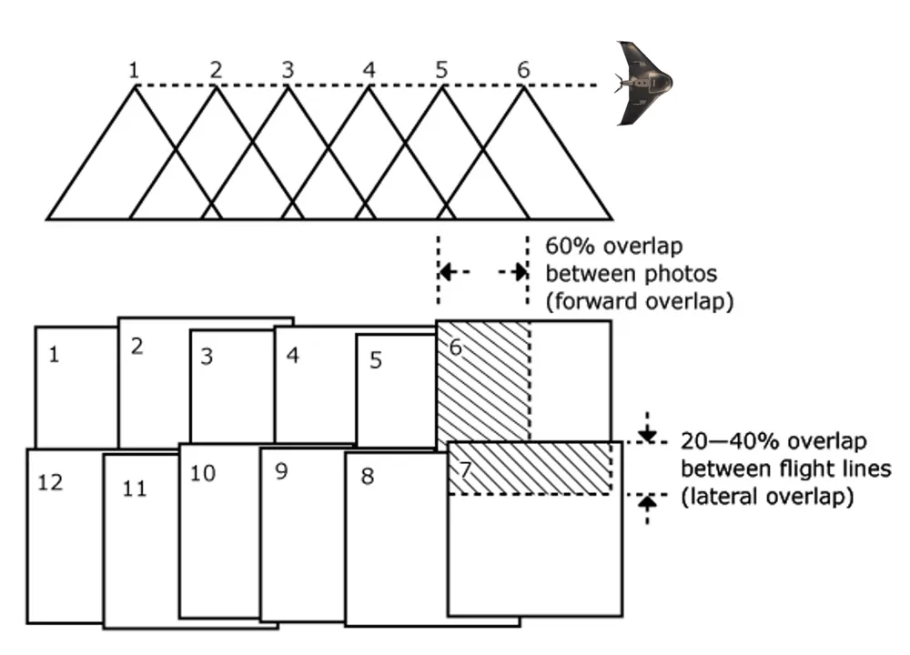{width="90%" fig-align="center" fig-alt="Diagram of forward overlap between consecutive photos along a flight line and lateral overlap between flight lines"}
:::
::: {.column width="45%"}
{width="100%" fig-alt="GNSS flight track of a lawnmower survey pattern over farmland in Google Earth"}
:::
:::

- **Forward overlap**: between consecutive photos on a flight line
- **Side (lateral) overlap**: between adjacent flight lines
- The flight track on the right is the lawnmower pattern the plan produces

::: {.notes}
Classic aerial photogrammetry got by with 60 forward and 20 to 40 side. SfM wants a lot more, because every point needs to be seen from many angles; that is why the recommended numbers on the next slides are higher than the diagram.
:::

## Location and camera {.smaller}

::: {.columns}
::: {.column width="50%"}
**Location**

- Fly a larger extent than you need
- Think about the area you need for analysis, plus a buffer
- Edge accuracy is always worse than the middle
:::
::: {.column width="50%"}
**Camera settings**

General camera settings are usually fine. Optional:

| Setting | Value |
|---|---|
| Mechanical shutter | On |
| Focus | Infinity |
| Shutter priority | 1/800 s |
| Aspect ratio | 3:2 |
:::
:::

::: {.notes}
The buffer matters because the last flight line and the first photos on each line have the weakest geometry. A mechanical shutter avoids rolling-shutter distortion; a fast shutter avoids motion blur at mapping speed.
:::

## Camera angle {.smaller}

| | Nadir (straight down) | Oblique (pitched) |
|---|---|---|
| **Gimbal pitch** | -90 degrees | 70 to 80 degrees |
| **Best for** | Most mapping: orthomosaics and DSMs | Buildings, rough terrain, 3D models |
| **Trade-off** | Simple, efficient | Improved 3D, more photos and flight time |

::: {.term-card}
**Combine them** when you need both a clean orthomosaic and facades: a nadir grid plus an oblique pass
:::

::: {.notes}
Nadir for everything we do this semester. Oblique earns its keep on vertical structure, and adding one oblique pass also helps self-calibration, which Lecture 2B mentioned as the source of doming error.
:::

## Altitude {.smaller}

- Altitude above ground level (**AGL**) sets the GSD and the flight path; typical mapping altitude is **70 m to 120 m** AGL
- Higher altitude: fewer lines, shorter flight, coarser GSD
- Use a **terrain-aware** flight path on sloping sites so AGL stays constant
- Stay under the ceiling of the airspace authorization

::: {.columns}
::: {.column width="50%"}
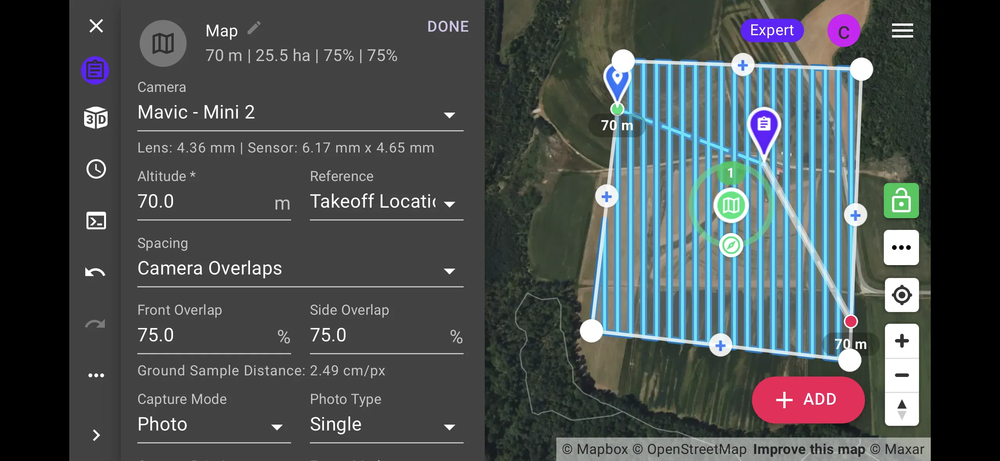{width="92%" fig-align="center" fig-alt="DroneLink flight plan at 70 m altitude with dense flight lines over the Lake Wheeler field"}
:::
::: {.column width="50%"}
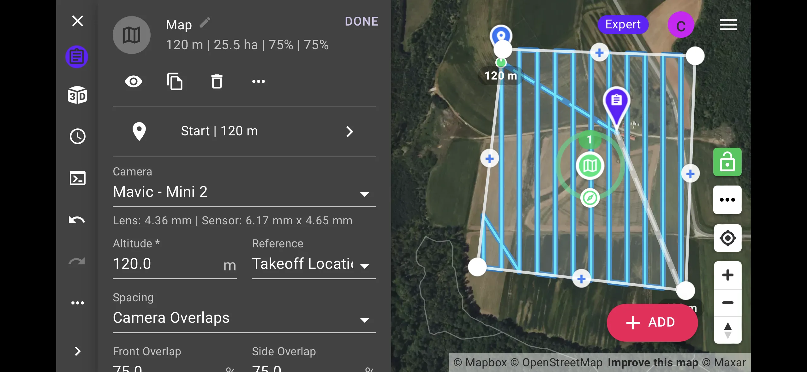{width="92%" fig-align="center" fig-alt="DroneLink flight plan at 120 m altitude with fewer flight lines over the same field"}
:::
:::

::: {.notes}
Same field, same overlap, two altitudes. The 70 m plan has almost twice the lines and gives 2.5 cm GSD; the 120 m plan flies faster at about 4.3 cm. Part 107 caps you at 400 ft AGL, and the LAANC ceiling can be lower.
:::

## Flight patterns {.smaller}

::: {.columns}
::: {.column width="50%"}
{width="100%" fig-alt="DroneLink flight plan with parallel lawnmower flight lines"}

- One set of parallel lines
- Standard for orthomosaics and DSMs
:::
::: {.column width="50%"}
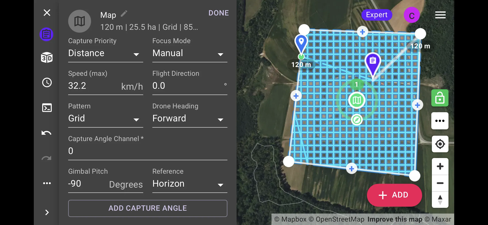{width="100%" fig-alt="DroneLink flight plan with a crosshatch grid of flight lines"}

- Two perpendicular sets of lines
- More detail and stronger geometry, longer flight time
:::
:::

::: {.notes}
Lawnmower for the field on Wednesday. Crosshatch doubles the flight time and is worth it for 3D models, for oblique work, and for sites where alignment struggled the first time.
:::

## Overlap {.smaller}

::: {.columns}
::: {.column width="45%"}
| | Minimum | Recommended for SfM |
|---|---|---|
| **Forward** | 60% | 75 to 85% |
| **Side** | 40% | 65 to 85% |
:::
::: {.column width="55%"}
- Homogeneous terrain (crops, sand, water) needs **more** overlap: fewer features to match
- More overlap means more photos, longer flights, and longer processing
:::
:::

::: {.columns}
::: {.column width="50%"}
{width="92%" fig-align="center" fig-alt="DroneLink flight plan at 70 m with 75 percent front and side overlap"}
:::
::: {.column width="50%"}
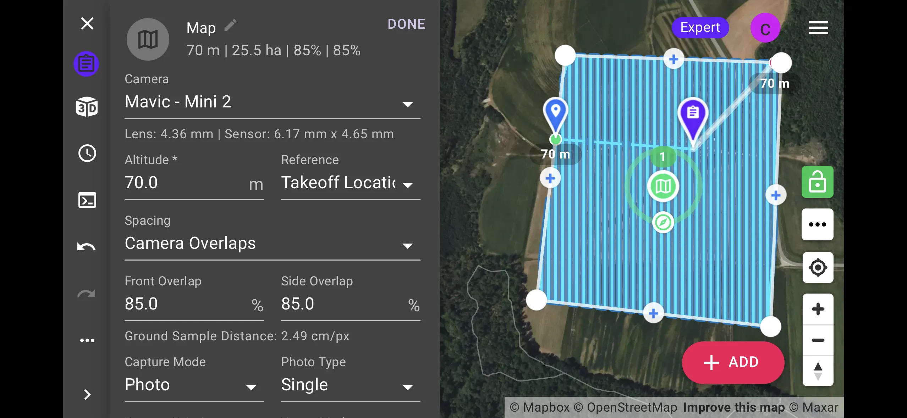{width="92%" fig-align="center" fig-alt="DroneLink flight plan at 70 m with 85 percent front and side overlap, showing denser flight lines"}
:::
:::

::: {.term-card}
**Question**: how will overlap impact your flight path?
:::

::: {.notes}
Ask them before showing the second screenshot: raising side overlap from 75 to 85 percent at the same altitude nearly doubles the number of flight lines. Forward overlap costs photos, side overlap costs flight lines and batteries.
:::

## Drone speed {.smaller}

- Typical mapping speed: about **30 km/h**, set by the app from altitude and forward overlap
- The limit is the camera, not the aircraft

| Factor | Effect on speed |
|---|---|
| Lighting | Low light forces a slower shutter and a slower flight |
| Camera shutter | Faster shutter allows faster flight |
| Altitude | Higher altitude allows faster flight for the same blur |
| Motion blur | Blur greater than about one GSD degrades matching |

::: {.notes}
The app sets a maximum speed so the camera can keep up with the forward overlap. Slow it down in low light or at low altitude; a blurred photo is worse than no photo, because it still gets matched.
:::

## Lighting {.smaller}

| Conditions | Effect |
|---|---|
| **Overcast, bright** | Best: even illumination, no hard shadows |
| **Noon** | Shortest shadows on a clear day |
| **Partly cloudy** | Exposure changes between photos; avoid if you can |
| **Low sun** | Long shadows and glare; avoid |

::: {.term-card}
**Avoid shadows**: shadows move between photos and between flights, and they show up as seams in the orthomosaic and as noise in the DSM
:::

::: {.notes}
A bright overcast day is the mapping pilot's friend. If it has to be a clear day, fly near solar noon and finish before the shadows move. Water and glossy roofs give glare that no overlap can fix.
:::

## Wrap-up

::: {.term-card}
**Assignment 3A**: [Terrain analysis of the flight site using GIS tools](../assignments/assignment_3a.qmd), a flight plan analysis for Lake Wheeler in GRASS
:::

::: {.term-card}
**Next**: the UAS flight at Lake Wheeler on Wednesday; read the [GNSS field protocol](../field_protocol_gnss.qmd) before the trip. Lecture 3B covers ground control, checkpoints, and accuracy
:::

::: {.notes}
Four phases: define the project, plan the flight, evaluate the site, control the flight. The assignment analyzes the terrain of the site you are about to fly. Wednesday we put the site layout, the checklist, and the crew roles into practice.
:::
