## Objectives

::: {.incremental}
- Relate flight GSD to the horizontal and vertical accuracy a UAS survey can reach
- Design ground control and checkpoint schemes
- Choose between GCP-based and RTK/PPK georeferencing
- Read an Agisoft or WebODM processing report
- Determine the level of detection (LoD)
:::

::: {.notes}
* The accuracy lecture Topic 2 has been pointing at
* 2A: checkpoints are the real number. 2B: quote the checkpoint RMSE
* Today: where those numbers come from and what they permit
* Everything runs on their own 2B and 2C reports and the 9/16 Emlid checkpoints
* The lab validates the flight's own products
:::

## The report number is not the accuracy {.smaller}

A worked example from the ASPRS standard [@asprs_positional_2024]:

- The DSM fits the checkpoints with RMSE~V1~ = 1 cm
- The checkpoints themselves were surveyed with an RTK rover: RMSE~V2~ = 2 cm
- You may claim the quadrature sum: $\text{RMSE}_V = \sqrt{1^2 + 2^2} = 2.24$ cm

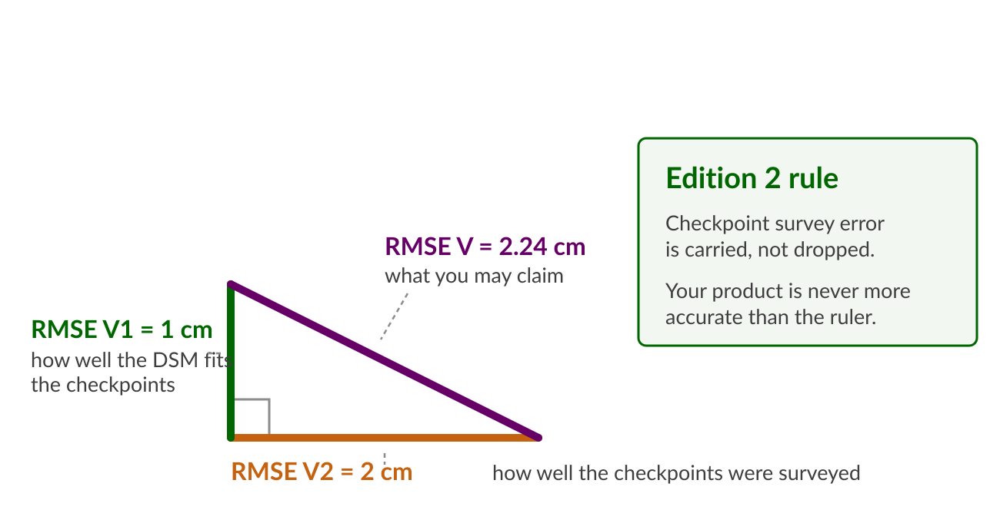{width="66%" fig-align="center" fig-alt="A right triangle with a 1 cm vertical leg for the DSM fit, a 2 cm horizontal leg for the checkpoint survey, and a 2.24 cm hypotenuse for the accuracy that may be claimed"}

::: {.notes}
* Open with the arithmetic: the software prints a fit
* Edition 1 required checkpoints 3x better, so their error was negligible
* Edition 2 relaxed that to 2x and makes you carry the term
* For the lab, RMSE V2 is the rover repeatability from the field day
* Habit for the hour: every claim says what it was measured against
:::

## What GSD buys you {.center .text-center .section-divider background-color="#e9f2e9"}

::: {.notes}
* Section 1: the floor pixel size sets, and why you rarely stand on it
:::

## GSD sets a floor, not the accuracy {.smaller}

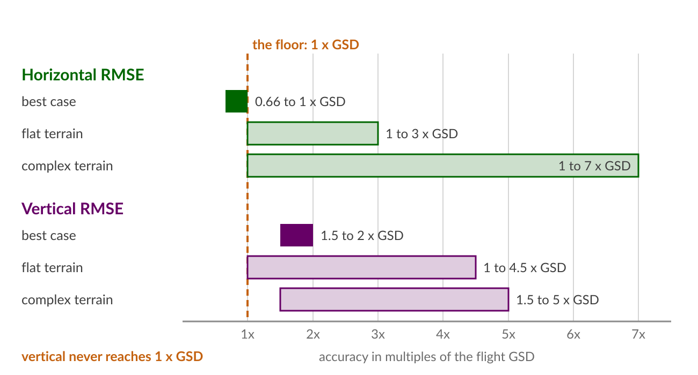{width="86%" fig-align="center" fig-alt="Bar chart of horizontal and vertical RMSE in multiples of GSD: horizontal best case 0.66 to 1x, flat terrain 1 to 3x, complex terrain 1 to 7x; vertical best case 1.5 to 2x, flat terrain 1 to 4.5x, complex terrain 1.5 to 5x"}

- Envelopes from @jimenez-jimenez_digital_2021; best case from @sanz-ablanedo_accuracy_2018
- Vertical error runs about **2.5 x** the horizontal error [@sanz-ablanedo_accuracy_2018]
- With uncorrected navigation-grade georeferencing, errors reach meters and pixel size stops mattering

::: {.notes}
* Envelope: Jimenez-Jimenez 2021. Asymptotes: Sanz-Ablanedo 2018, 3465 GCP combinations over 1200 ha
* Teach the multipliers as a band
* The gap between the floor and what you get is georeferencing and systematic error
* Ask the class: Lake Wheeler was 2 to 3 cm GSD, what vertical accuracy do you predict?
* Write the predictions down, the lab checks them
:::

## Planning with GSD {.smaller .mermaid-wide}

```{mermaid}
flowchart LR
    A["What you must<br>measure"] --> B["The accuracy<br>that requires"]
    B --> C["GSD:<br>0.5 to 1.0 x that"]
    C --> D["Flying height<br>(Topic 3A)"]
```

- ASPRS recommends source imagery GSD of **0.5 to 1.0 x** the target horizontal accuracy class: a 5 cm class wants 2.5 to 5 cm GSD [@asprs_positional_2024]
- Read backwards: expect RMSE~H~ of 1 to 2 x GSD from a well-run project
- The standard calls this a planning heuristic and says it may not be used to report accuracy

::: {.notes}
* Connects 3A's GSD formula to a requirement instead of a preference
* The chain runs left to right, never the other way
* Quote the standard's caveat: the table tells you what to fly
:::

## Ground control {.center .text-center .section-divider background-color="#e9f2e9"}

::: {.notes}
* Section 2: how many points, where, and which ones you are allowed to judge with
:::

## How many GCPs, and where {.smaller}

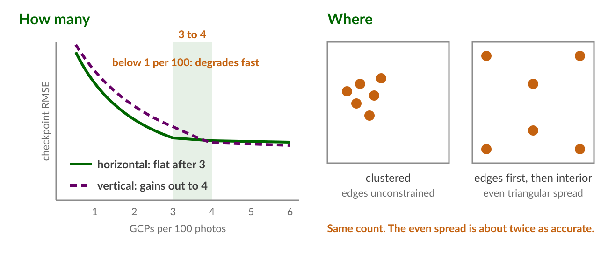{width="90%" fig-align="center" fig-alt="Left panel: checkpoint RMSE against GCPs per 100 photos, horizontal flattening after 3 and vertical still gaining out to 4. Right panel: a clustered GCP layout beside an even layout with points on the edges and interior"}

- About **3 to 4 GCPs per 100 photos**; below 1 per 100 accuracy degrades fast [@sanz-ablanedo_accuracy_2018]
- Edge coverage first, then an even interior; points past that improve error *structure* rather than RMSE [@dai_enhancing_2023]

::: {.notes}
* Per-100-photos scales with overlap and altitude; per-hectare rules do not
* Dai 2023: after the first few GCPs, RMSE barely moves, spatial autocorrelation of the residual keeps improving
* That structure is what matters for differencing
* Our 9/16 design, 4 targets on a 78-photo flight, sits on the recommended density
:::

## Control at Lake Wheeler {.smaller}

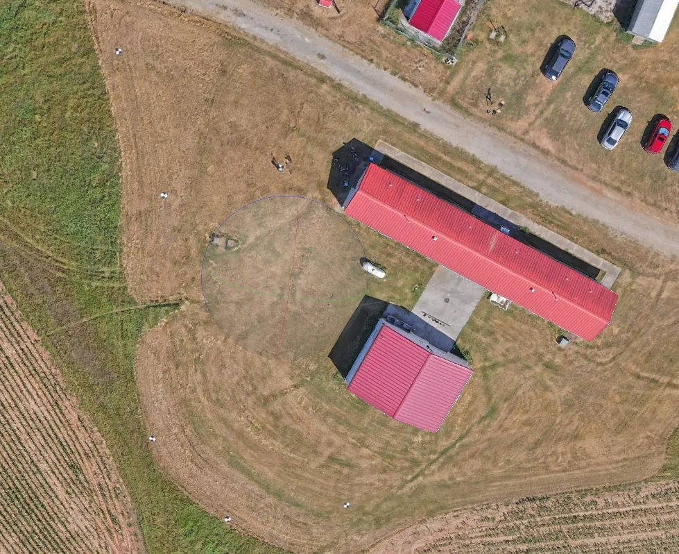{width="46%" fig-align="center" fig-alt="Orthomosaic of the Lake Wheeler barn and surrounding fields from the September 2026 flight, with checkerboard ground control targets visible on the ground around the buildings"}

Our own flight. Targets ring the site: a few become control, the rest stay checkpoints.

::: {.notes}
* Their own orthomosaic from 9/16, their own targets
* Point at the spread: edges first, then interior
* Ask which they would make control and why
* Every target they do not use as control is a checkpoint they get for free
:::

## Control is not validation {.smaller}

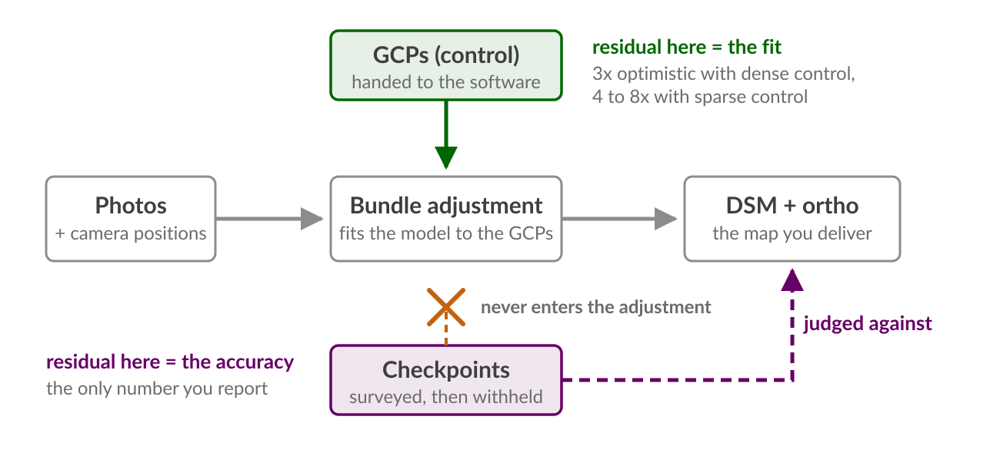{width="84%" fig-align="center" fig-alt="Flow diagram: GCPs feed the bundle adjustment which produces the DSM and orthomosaic, while checkpoints bypass the adjustment entirely and are used to judge the product"}

- Error reported on control points overstates accuracy by **3 x** (dense control) to **4 to 8 x** (sparse control) [@sanz-ablanedo_accuracy_2018]
- ASPRS: checkpoints must be independent, excluded from the aerial triangulation, and away from any GCP [@asprs_positional_2024]

::: {.notes}
* The 3 to 8 times overestimation is the number to remember
* It is why the field protocol withheld most of the surveyed points
* If they keep one distinction from today, this is it
* The midterm asks it
:::

## RTK, PPK, and what they still need {.center .text-center .section-divider background-color="#e9f2e9"}

::: {.notes}
* Section 3: direct georeferencing moved fast in five years
* Current state and the working recipe
:::

## Direct georeferencing today {.smaller}

| Evidence | Result |
|---|---|
| ASPRS Addendum V [@asprs_positional_2024] | PPK reaches 1 to 2 cm horizontal, 2 to 4 cm vertical "when used properly"; RTK typically 5 to 10 cm |
| RTK aircraft, zero GCPs, purpose-built flight [@stott_ground_2020] | Vertical RMSE 6.6 cm over 2 km of river; adding 5 GCPs did not improve it |
| PPK versus GCP workflows [@zhang_evaluating_2019] | PPK matched GCP-workflow accuracy (MAE about 2 cm, RMSE about 3 cm); some missions carried a vertical bias that **one GCP** removed, improving vertical accuracy 20 to 30 percent |
| Repeat surveys [@nota_improving_2022] | Co-alignment of epochs gives sub-2 cm relative accuracy; ground control in at least one epoch still anchors absolute Z |

::: {.notes}
* Stott's zero-GCP result required a double grid flown in opposing directions at 20 degrees off nadir
* Against sparse checkpoints, vertical errors still clustered spatially to 0.14 m
* So distributed checkpoints stay mandatory
* Zhang: the vertical bias is near constant, so one known point kills it
* Nota matters for Topic 6: co-align epochs, put control in one of them
:::

## Where the standard disagrees {.smaller}

::: {.term-card}
**Working defaults**: RTK or PPK for georeferencing, 1 or 2 GCPs to control the vertical datum, every other surveyed point withheld as a checkpoint
:::

- ASPRS keeps GCPs "highly recommended" and gives them priority over airborne positions in the adjustment: camera centers have fewer epochs and weaker geoid handling than survey-grade ground occupations [@asprs_positional_2024]
- The journal results assume strong flight geometry; the standard is written for contracts and courts

::: {.notes}
* Do not resolve the tension, name it
* Recent results justify light control when the flight design is strong
* The standard assumes you must defend the number to a client
* A consultant should know both and say which regime they are in
* Our lab uses the recipe: 3 targets as control, the rest checkpoints
:::

## The base coordinate governs everything {.smaller}

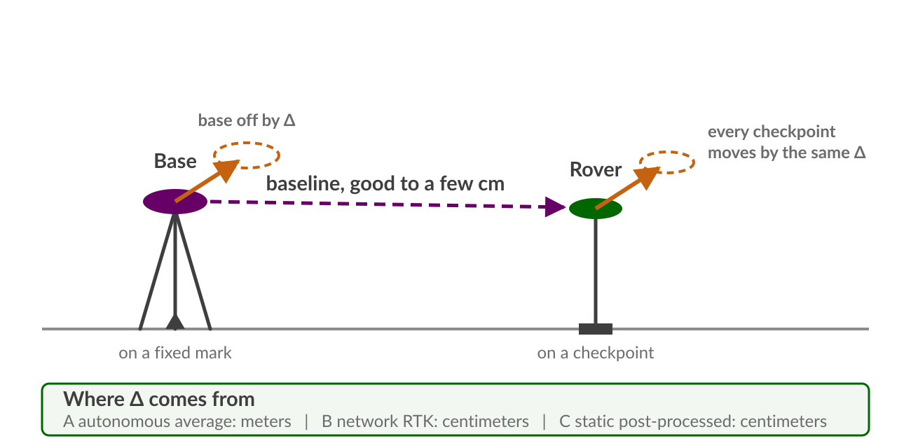{width="80%" fig-align="center" fig-alt="A base station on a fixed mark and a rover on a checkpoint joined by a baseline vector; an offset in the base coordinate shifts the rover position by the same amount"}

- Base within 0.5 mm: an Emlid Reach RS2 base gave DEM vertical RMSE of 1.94 cm versus 1.89 cm for a Trimble Alloy with a choke-ring antenna [@famiglietti_test_2021], at roughly a tenth of the price
- **Antenna beats receiver**: a low-cost dual-frequency board matched geodetic instruments in network RTK only with a geodetic-grade antenna; with a patch antenna it needed open sky [@janos_evaluation_2021]

::: {.notes}
* Connects the literature to the hardware they held
* Famiglietti is the fair Emlid-class citation; receivers have improved since
* Nobody has published RS4 versus state RTN: the class dataset is a credible short note
* Recruit interest for it here
:::

## Systematic error {.center .text-center .section-divider background-color="#e9f2e9"}

::: {.notes}
* Section 4: the error that does not average away and that differencing cannot forgive
:::

## Doming {.smaller}

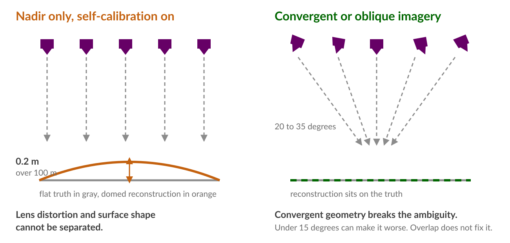{width="88%" fig-align="center" fig-alt="Left: parallel nadir views over a flat surface produce a domed reconstruction about 0.2 m high over 100 m. Right: convergent views tilted 20 to 35 degrees produce a reconstruction that sits on the true surface"}

- Camera orientations off parallel by only **2 degrees** produce a dome of about **0.2 m over 100 m** [@james_mitigating_2014]
- Fixes in order of power: a known camera model with self-calibration off; **oblique imagery** (a convergent orbit reached under 2 mm in simulation); two flying heights; well-distributed control
- Best camera angles in the tested 0 to 35 degree range were **20 to 35 degrees**, worth nearly 50 percent better accuracy in high relief [@nesbit_enhancing_2019]
- A *gently* tilted camera (under 15 degrees) can make things worse on consumer wide-angle cameras with onboard lens correction [@james_mitigating_2020]

::: {.notes}
* Recall the pitfalls table from 2A, here is the mechanism
* The 2020 caveat is the one practitioners miss
* "Just tilt the camera a bit" backfires below 15 degrees on exactly the cameras they fly
* More overlap does not fix doming: James 2020 showed relative insensitivity to overlap
:::

## Why systematic error matters more {.smaller}

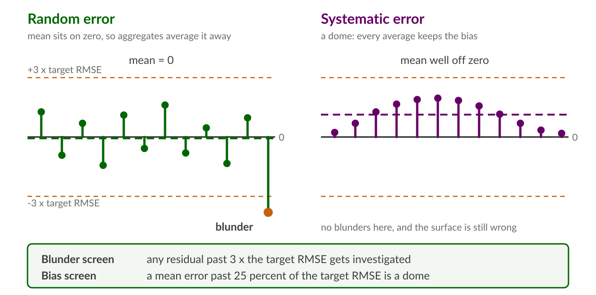{width="88%" fig-align="center" fig-alt="Two panels of checkpoint residuals about a zero line: random error with a mean on zero and one blunder past the three sigma screen, and systematic error shaped like a dome with the mean well off zero"}

- Random error averages away in aggregates; a 2 cm systematic bias does not
- Propagated uncertainty in change detection is dominated by spatially correlated and systematic error, not point precision [@anderson_uncertainty_2019]
- Blunder and bias screens from the standard [@asprs_positional_2024]

::: {.notes}
* The mean-error rule is the doming detector in a report
* A mean far from zero, or above a quarter of the RMSE, says biased
* Students run exactly this test on their DSM residuals in the lab
:::

## Reading the reports {.center .text-center .section-divider background-color="#e9f2e9"}

::: {.notes}
* Section 5: the week's stated purpose
* Put their own 2B and 2C reports on screen here
* Slides give the map, the reports give the territory
:::

## A processing report, page by page {.smaller}

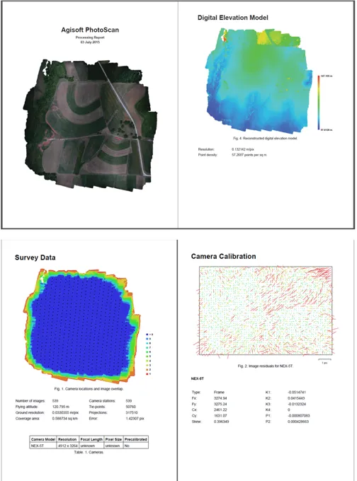{width="58%" fig-align="center" fig-alt="Four pages of an Agisoft processing report: the survey overview with the reconstructed model, the digital elevation model, the survey data page with the camera location and overlap figure, and the camera calibration page with the residual plot"}

Survey overview, DEM, survey data with the overlap figure, camera calibration with residuals.

::: {.notes}
* Walk the four panels before the comparison table
* Survey data page carries GSD, coverage, aligned images
* Camera calibration residual plot is where a bad lens model shows
* None of these four pages is an accuracy statement
:::

## Where you declare your ruler {.smaller}

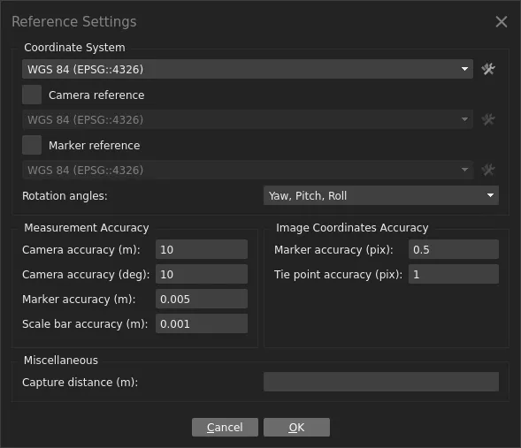{width="54%" fig-align="center" fig-alt="Metashape Reference Settings dialog showing camera accuracy of 10 m, marker accuracy of 0.005 m, and image coordinate marker accuracy of 0.5 pixels"}

Marker accuracy is RMSE~V2~. The software weights the adjustment with it, then reports a fit that still does not include it.

::: {.notes}
* This dialog is where the survey accuracy of the control goes in
* Marker accuracy 0.005 m says the targets are good to 5 mm
* Camera accuracy 10 m is the UX5 log: navigation grade, correctly downweighted
* Wrong numbers here mis-weight the whole adjustment
* Metashape still does not carry marker accuracy into the reported RMSE; you do that
:::

## The same facts in two reports {.smaller}

| Quantity | Agisoft Metashape report | WebODM quality report |
|---|---|---|
| GSD | Survey Data: ground resolution | Overview: average GSD |
| Coverage and photos | Survey Data: coverage area, aligned images | Overview: area, reconstructed images |
| Overlap | Camera locations and image overlap figure | Survey Data overlap heatmap |
| Camera model | Calibrated values with uncertainties and residual plot | Camera parameters, per-band |
| Camera position error | Camera Locations table: X, Y, Z error | GPS/geolocation details, 3D errors |
| Control fit | Ground Control Points table: control RMSE | GCP errors section (when GCPs used) |
| **Checkpoint error** | Check Points rows in the same table | Absent unless checkpoints were declared |

::: {.notes}
* Walk each row on the projector with a real pair of reports
* Trap 1: both tools print camera-position errors that students read as map accuracy
* Trap 2: WebODM reports only what it was given, so no declared checkpoints means no accuracy at all
* That silence does not mean the map is accurate
* The lab's comparison table is this slide filled in with their numbers
:::

## What neither report tells you {.smaller}

- Whether the checkpoints were independent; the software trusts your labeling
- The survey accuracy of the control and checkpoints, so neither can do the quadrature for you
- Whether the error is spatially structured: a mean near zero can hide a dome that cancels
- Anything about the parts of the site with no checkpoints

::: {.term-card}
**Report vocabulary** [@asprs_positional_2024]: report RMSE~H~ and RMSE~V~ (RMSE~3D~ if asked); Edition 2 drops the old 95 percent confidence reporting; 30 checkpoints is the minimum for a statistical claim, and Section 7.16.1 gives the wording for when you have fewer
:::

::: {.notes}
* Section 7.16.1 applies to nearly every project they will run
* Small sites cannot afford 30 checkpoints
* The answer is truth in reporting: give the RMSE, state the count, claim no confidence the sample cannot support
* The lab report requires that sentence
:::

## What can you measure {.center .text-center .section-divider background-color="#e9f2e9"}

::: {.notes}
* Section 6: the same flight either answers the question or it does not
* The arithmetic decides
:::

## The level of detection {.smaller}

$$\text{LoD} = 1.96 \sqrt{\sigma_{z1}^2 + \sigma_{z2}^2} \approx 2.8\,\sigma_z$$

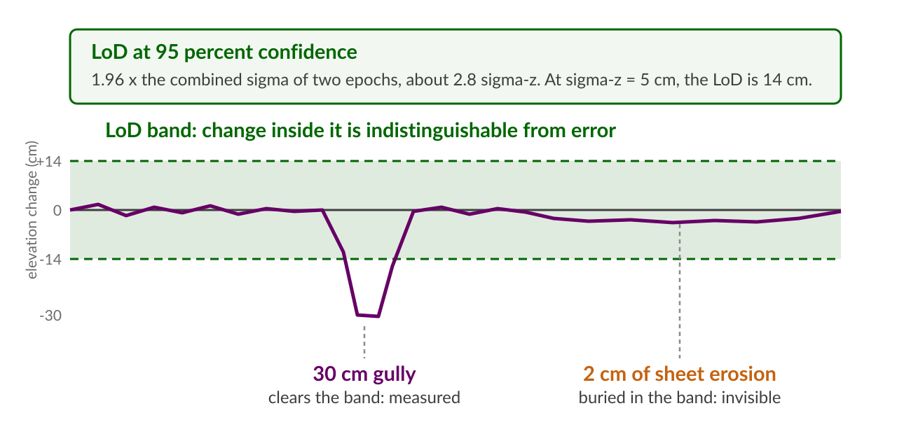{width="80%" fig-align="center" fig-alt="An elevation difference profile with a shaded plus or minus 14 cm level of detection band; a 30 cm gully punches below the band while 2 cm of sheet erosion stays inside it"}

- Thresholding is for **gross** change only; it biases net change, where random errors already cancel [@anderson_uncertainty_2019]
- Spatially variable LoD can exclude from a quarter to more than half of observed volumetric change [@wheaton_accounting_2010]

::: {.notes}
* Every accuracy number from the last fifty minutes gets plugged in here
* Wheaton's Feshie numbers: 24 to 31 percent of change excluded in dry years, 57 to 59 in wet
* Anderson's correction: gross change yes, net change no; error propagation is not thresholding
* Zhang 2019 reached sub-5 cm thresholds with PPK flights below 45 m
:::

## Trees or erosion {.smaller}

| Question | Binding constraint | Verdict at 3 cm GSD, 5 cm sigma-z |
|---|---|---|
| Count the trees | Detection in the orthomosaic | Easy; accuracy barely matters |
| Measure canopy height | Canopy and ground surfaces, not GSD: flying height 80 to 120 m showed **no significant effect** on tree height RMSE (1.8 to 3.2 m) [@grybas_evaluating_2022] | Expect meters of error regardless of pixel size |
| Detect a 30 cm rill or gully | LoD about 14 cm | Yes, cleanly |
| Quantify 2 cm sheet erosion | LoD, dominated by systematic error | No; needs sub-2 cm sigma-z, near-ground flights, and bias control |

::: {.notes}
* For trees the limiting error lives in the canopy and the terrain underneath, so more GSD buys nothing
* For micro-topography the limiting error is the whole chain built today
* Base coordinate, control, calibration, bias all show up in the LoD
* Students argue these verdicts with their own numbers in part three of the lab
:::

## Key terms {.smaller}

::: {.columns}
::: {.column width="50%"}
::: {.term-card}
**Checkpoint**: surveyed, withheld, judges the map; also called check point, validation point, independent test point
:::
::: {.term-card}
**Direct georeferencing**: camera positions from RTK or PPK doing the work of control; also called GNSS-aided or GCP-free
:::
::: {.term-card}
**Level of detection (LoD)**: the smallest elevation change distinguishable from error at a stated confidence
:::
:::
::: {.column width="50%"}
::: {.term-card}
**Doming**: broad systematic DEM deformation from the self-calibration ambiguity; also called bowling when inverted
:::
::: {.term-card}
**RMSE~H~, RMSE~V~, RMSE~3D~**: Edition 2's reporting quantities, replacing RMSEx/RMSEy/RMSEz and the 95 percent statistics
:::
::: {.term-card}
**Quadrature**: accuracies add as the square root of summed squares; the product carries the checkpoint survey error
:::
:::
:::

::: {.notes}
* The synonym lists matter: they will hit every variant in the literature
* Midterm vocabulary
:::

## Wrap-up

::: {.term-card}
**Assignment 3B**: [Validate the Lake Wheeler flight](../assignments/assignment_3b.qmd): establish the base coordinate three ways, evaluate the flight's orthomosaic and DSM against the checkpoints you collected, and rule on what the flight can measure
:::

::: {.term-card}
**Midterm 11/4**: the control versus checkpoint distinction, the quadrature rule, and the LoD arithmetic are all fair game
:::

::: {.notes}
* Recap the chain: GSD sets the floor
* Georeferencing and systematic error set the distance above it
* Checkpoints measure that distance
* Quadrature keeps the claim defensible
* LoD turns the chain into a yes or no about the question you care about
* The lab data is their own field work from 9/16
:::

## References {.smaller}

::: {#refs}
:::
