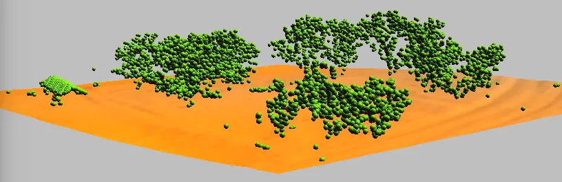
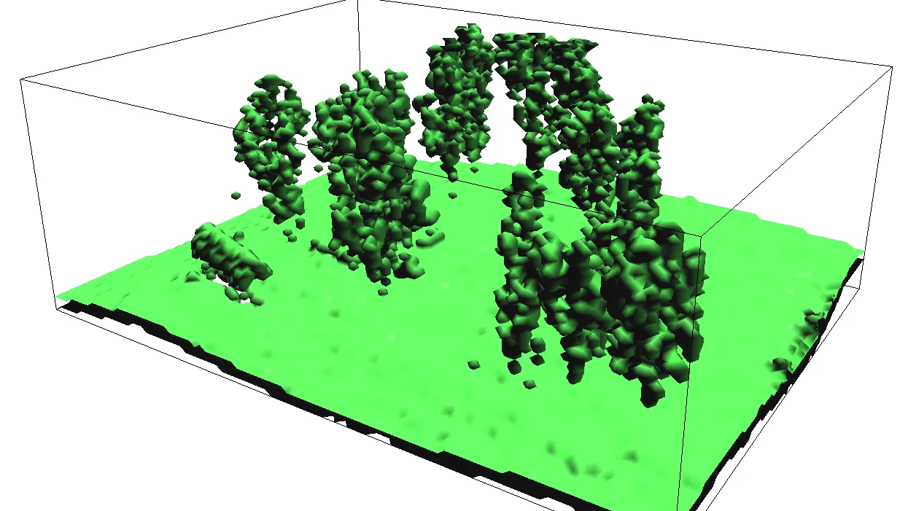
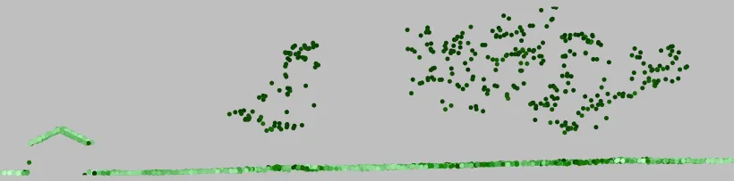

## Task

Analyze an airborne lidar point cloud and a UAS structure from motion (SfM) point cloud of the Mid Pines area at Lake Wheeler, and turn them into surfaces. You will explore the point clouds in a browser and in GRASS, compare their point densities, bin the lidar returns into raster surfaces and a simple land cover classification, interpolate a high resolution bare earth DEM and a canopy DSM with their topographic derivatives, and check the lidar DEM against the surveyed GCPs. Three optional parts go further: ground classification of the raw points, voxel models of the canopy, and lidar transects.

The two point clouds represent the same ground in two different ways. Lidar records several returns per pulse and reaches the ground under the canopy; SfM reconstructs the first surface the camera sees. Keep that difference in mind when you compare densities and surfaces.

## Data

- [Lake Wheeler GRASS project: Lake_Wheeler_NCspm]() (EPSG:3358; you have it from the earlier assignments)
- 2013 lidar point cloud for Mid Pines, classified: [LAS]() or [cloud optimized LAZ]()
- 2015 UAS SfM sample point cloud for a Mid Pines sub-area: [2015_06_sample_points_NCspm.las]()
- Surveyed GCPs: [GCP_12_decimal.pack]() (GRASS vector pack, restore with `v.unpack`)
- Fallback if the lidar import fails: [interpolated Mid Pines DEM and DSM]() (GRASS raster packs, restore with `r.unpack`)
- [ASPRS LAS 1.4 specification](https://github.com/ASPRSorg/LAS), which defines the standard point classes (the PDF is under Releases)

## Software

- [GRASS]()  with PDAL support (the standard Windows, macOS, and Ubuntu installers include it). The `r.in.pdal` and `v.in.pdal` tools used below also ship a `pdal` command line tool, used once in Part 1.
- [COPC Viewer](https://viewer.copc.io), a browser point cloud viewer that opens the cloud optimized LAZ straight from its URL, for the first look at the lidar.

## Part 1: Explore the point clouds

Open the lidar cloud in the browser: paste the cloud optimized LAZ URL into COPC Viewer. Color the points by elevation, by classification, and by intensity, and look at the trees from the side. Note what is under the canopy; the UAS sample is not cloud optimized, so you will look at it in GRASS in Part 2, where the difference under the canopy is what the densities measure.

Start GRASS in the `Lake_Wheeler_NCspm` project and create a new mapset for this assignment, for example `point_clouds`. Change the working directory to the folder holding the downloaded files (*Settings > GRASS working environment > Change working directory*) so the commands can refer to the files by name.

Read the lidar file's metadata, in particular its point classes, which you will filter on later:

```bash
pdal info --stats --filters.stats.count=Classification mid_pines_spm_2013.las
```

The `counts` block of the output lists each class and how many points fall in it. The 2013 data uses four codes:

| Class | Meaning | Points |
|---|---|---|
| 1 | Unclassified (vegetation and buildings) | 1,340,658 |
| 2 | Ground | 2,580,704 |
| 7 | Low point (noise) | 66 |
| 11 | Reserved in LAS 1.4; this provider used it for withheld points | 1,960,603 |

Classes 1 and 2 are the ones you will work with. Get the extent of the point cloud and set the computational region to it:

```bash
r.in.pdal -g input=mid_pines_spm_2013.las
g.region n=220218 s=218694 e=637795 w=636271 -p
```

::: {.callout-tip}

#### If `r.in.pdal` is not available

Some GRASS builds ship without PDAL support. Download the [interpolated DEM and DSM](), unzip it into your working directory, and restore the two surfaces under the names Part 4 uses:

```bash
r.unpack -o input=mid_pines_lidar2013_dem.pack output=mid_pines_ground_elev
r.unpack -o input=mid_pines_lidar2013_dsm.pack output=mid_pines_surface_elev
```

Skip the import commands in Parts 2 to 4 and continue with the analysis and visualization steps on these rasters.

:::

## Part 2: Point density

Set the resolution to 1 m. The `-a` flag aligns the region boundaries to whole multiples of the resolution:

```bash
g.region res=1 -pa
```

Count all points per cell with binning, then display the result with a legend and save the image for the report:

```bash
r.in.pdal -o input=mid_pines_spm_2013.las output=mid_pines_dens_all method=n
d.rast mid_pines_dens_all
d.legend -f -s -d raster=mid_pines_dens_all at=5,50,7,10
d.out.file mid_pines_dens_all.png
```

The `-o` flag skips the projection check: the file carries no CRS record but is in the project's coordinate system. The import prints a line for every point that falls exactly on the region boundary and is ignored; that is expected.

Count the ground points only, and give both density rasters the same histogram equalized color table so they can be compared:

```bash
r.in.pdal -o input=mid_pines_spm_2013.las output=mid_pines_dens_ground class_filter=2 method=n
r.colors -e map=mid_pines_dens_all,mid_pines_dens_ground color=bcyr
d.rast mid_pines_dens_ground
```

Compare the two rasters: where does the ground density drop, and why?

Now the UAS cloud. Find its extent, set a 1 m region over the sub-area, and bin it the same way:

```bash
r.in.pdal -g input=2015_06_sample_points_NCspm.las
g.region n=219660 s=219288 e=637287 w=636876 res=1 -pa
r.in.pdal -o input=2015_06_sample_points_NCspm.las output=midpines_uas_06_1m_dens method=n
r.colors -e map=mid_pines_dens_all,mid_pines_dens_ground,midpines_uas_06_1m_dens color=bcyr
d.rast midpines_uas_06_1m_dens
d.legend -f -s -d raster=midpines_uas_06_1m_dens at=5,50,7,10
```

Zoom to the UAS sub-area and compare the lidar and UAS densities over the same ground. Save the images.

## Part 3: Binned surfaces and a simple classification

Binning assigns each cell a statistic of the points that fall in it, with no interpolation. Different returns and classes give different surfaces. Set a 2 m region over the whole lidar extent and build three of them.

A surface from the highest point in each cell, using classes 1 and 2, is a DSM:

```bash
g.region n=220218 s=218694 e=637795 w=636271 res=2 -pa
r.in.pdal -o input=mid_pines_spm_2013.las output=mid_pines_all_max method=max class_filter=1,2
```

A surface from the last returns:

```bash
r.in.pdal -o input=mid_pines_spm_2013.las output=mid_pines_last_mean method=mean return_filter=last class_filter=1,2
```

::: {.callout-caution}
In `r.in.pdal`, `return_filter=last` keeps the last return only where the pulse produced more than one return, so here the surface marks the canopy, not the ground.

In general, the *last return* is the final echo of a lidar pulse and is commonly used to find the ground.
:::

A surface from the points already classified as ground:

```bash
r.in.pdal -o input=mid_pines_spm_2013.las output=mid_pines_ground_mean class_filter=2
```

Combine the three into classes: 1 ground, 2 vegetation, 3 buildings. A cell with a multi-return last echo is vegetation; a cell with a ground point but no multi-return echo is ground; a cell with a first return and neither is a building:

```bash
r.mapcalc "classes = if( not(isnull(mid_pines_last_mean)), 2, if( not(isnull(mid_pines_ground_mean)), 1, if( not(isnull(mid_pines_all_max)), 3, null())))"
```

Set the colors with `r.colors` (right-click the `classes` layer, *Set color table*, Define tab, *enter values directly*):

```bash
1 220:220:180
2 0:180:0
3 150:0:0
```

Look for places where this simple rule fails to identify buildings, and save the image:

```bash
d.out.file classes.png
```

## Part 4: High resolution DEM and DSM

Import the points as vectors, the ground class for the DEM and the first returns of classes 1 and 2 for the DSM:

```bash
v.in.pdal -o input=mid_pines_spm_2013.las output=mid_pines_ground class_filter=2
v.in.pdal -o input=mid_pines_spm_2013.las output=mid_pines_surface class_filter=1,2 return_filter=first
```

Remove the vector layers from the Layer Manager if they were added; drawing millions of points is slow.

Estimate the point density and mean spacing of the ground points:

```bash
v.outlier -e input=mid_pines_ground
```

> Estimated point density: 1.111
> Estimated mean distance between points: 0.9487

Set a smaller region at 0.5 m resolution and interpolate both surfaces with the regularized spline with tension, computing slope and profile curvature at the same time:

```bash
g.region n=219780 s=219100 e=637250 w=636575 res=0.5 -pa
v.surf.rst input=mid_pines_ground elevation=mid_pines_ground_elev slope=mid_pines_ground_slope pcurv=mid_pines_ground_profcurv npmin=80 tension=20 smooth=1
v.surf.rst input=mid_pines_surface elevation=mid_pines_surface_elev slope=mid_pines_surface_slope pcurv=mid_pines_surface_profcurv npmin=80 tension=20 smooth=1
r.colors map=mid_pines_ground_elev,mid_pines_surface_elev color=elevation
```

A higher `npmin=150` reduces the segmentation artifacts visible in the slope and curvature maps, at a much longer run time.

Visualize the DEM and DSM in the 3D view and use cross-sections. Leave only `mid_pines_surface_elev` in the Layer Manager, hide the legend, zoom to the computational region, switch to 3D, set the surface resolution to 1 and the color to the `classes` raster. Save the images.

## Part 5: Validate the lidar DEM against the GCPs

Restore the surveyed GCPs and add columns for the DEM height and the difference:

```bash
v.unpack -o input=GCP_12_decimal.pack
v.db.addcolumn map=GCP_12_decimal columns="dem_height DOUBLE, height_difference DOUBLE"
```

The pack was written by an older GRASS whose CRS record differs in wording from the current project's; `-o` accepts the project's definition.

Sample the DEM at the GCP locations (`-i` interpolates between the four nearest cells), compute the difference, and list the results:

```bash
v.what.rast -i map=GCP_12_decimal raster=mid_pines_ground_elev column=dem_height
v.db.update map=GCP_12_decimal column=height_difference query_column="ASL - dem_height"
v.db.select map=GCP_12_decimal columns=ASL,dem_height,height_difference
```

Compute the statistics of the differences and map them:

```bash
v.univar -e GCP_12_decimal column=height_difference
d.vect.thematic map=GCP_12_decimal column=height_difference algorithm=int nclasses=4 colors=blue,30:144:255,173:216:230,255:192:203 icon=basic/circle size=20
d.legend.vect at=10,40
```

The *Attribute Table Manager* shows the same table. Read the mean and the standard deviation the way Topic 3B read checkpoint residuals: the mean is the bias of the lidar DEM against the survey, and the RMSE of the differences is its vertical accuracy at these twelve points.

## Part 6 (optional): Classification, voxels, and transects

### Ground classification

Install the [v.lidar.mcc](https://grass.osgeo.org/grass-stable/manuals/addons/v.lidar.mcc.html) addon, which separates ground from non-ground points with a multiscale curvature classification:

```bash
g.extension v.lidar.mcc
```

Import a small, unclassified sample and classify it:

```bash
g.region n=219511 s=219354 w=637071 e=637249 res=1
v.in.pdal -r -o input=mid_pines_spm_2013.las output=mid_pines_sample
v.lidar.mcc input=mid_pines_sample ground=ground nonground=nonground
```

Compare the result with the provider's class 2 in 2D or 3D.



### Point density in 3D

Set a small region with a vertical extent (`b`, `t`, `tbres`) for a 3D raster:

```bash
g.region n=219502 s=219348 w=637070 e=637276 b=110 t=135 res=2 res3=2 tbres=0.5 -p3
```

GRASS has no PDAL-based 3D raster import, so export the points inside this region to a text file with PDAL (about 100,000 points, one second) and bin the text file with [r3.in.xyz](https://grass.osgeo.org/grass-stable/manuals/r3.in.xyz.html):

```bash
pdal translate mid_pines_spm_2013.las mid_pines_sub.txt crop \
    --filters.crop.bounds="([637070,637276],[219348,219502])" \
    --writers.text.order="X,Y,Z" --writers.text.keep_unspecified=false --writers.text.write_header=false
r3.in.xyz input=mid_pines_sub.txt output=mid_pines_dens method=n separator=comma
```

`r3.in.xyz` reads the file once per vertical slice, which is why the crop matters.

Set a custom color table with `r3.colors`:

```bash
0% 255:255:100
5% green
100% red
```

Visualize the density in the 3D view with slices and isosurfaces:

1. Leave only the 3D raster `mid_pines_dens` in the Layer Manager.
2. Set the computational region from the 3D raster and zoom to it.
3. Switch to 3D.
4. On the View page press Reset, set *Height* to 50 and *Z-exag* to 2. Nothing is visible yet.
5. On the Data page, 3D raster, check *Draw wire box* and set the resolution to 1.
6. Add an isosurface, set its value to 1, and press Enter.
7. Check *toggle normal direction* and change the isosurface color.
8. Try other isosurface levels (press Enter to apply each value).
9. Remove the isosurface, change the draw mode to slices, add a slice, and set its axis to Z.
10. Move the slice through the canopy.
11. Save images for the report.

{width=80%}

### Lidar transect

Install the [v.profile.points](https://grass.osgeo.org/grass-stable/manuals/addons/v.profile.points.html) addon:

```bash
g.extension v.profile.points
```

Cut a 5 m wide transect through the point cloud, straight from the LAS file, color the points by elevation, and display it. The output is the transect rotated into a vertical plane, so zoom to the vector map to see it:

```bash
g.region n=219511 s=219354 w=637071 e=637249 res=1
v.profile.points file_input=mid_pines_spm_2013.las output=profile width=5 coordinates=637106,219373,637132,219451
v.colors map=profile use=z color=elevation
d.vect map=profile color=none width=1 icon=basic/circle
```

To profile points you already imported, pass them as `point_input=` instead; run `v.build` on them first, since `v.in.pdal` does not build topology and the selection step needs it.



## Report

Prepare a report (3 to 5 pages including figures):

1. **Point density**: the lidar all-point and ground-point densities and the UAS density over the sub-area, with the same color table, and a paragraph on where and why they differ.
2. **Classification**: the `classes` raster, with examples of where the binning rule identifies buildings correctly and where it fails.
3. **Surfaces**: the interpolated DEM and DSM with their slope or curvature maps and a 3D view, and what the derivatives show that the elevation does not.
4. **Validation**: the GCP table with the DEM height and the difference, its mean and RMSE, and what they say about the vertical accuracy and bias of the lidar DEM.
5. **Optional parts**: figures and a short interpretation for any of Part 6 you completed.

## Submission

Upload to Moodle, Assignment 4B:

* Your report as a PDF.
* The GCP difference table (CSV export from the Attribute Table Manager or `v.db.select`).

## Grading

* **Density**: the three density maps are comparable and the differences between lidar and UAS are explained by how each sensor sees the ground.
* **Classification**: the classes raster is produced and its failures are identified and explained.
* **Surfaces**: the DEM and DSM are interpolated at 0.5 m with derivatives, visualized in 3D, and interpreted.
* **Validation**: the GCP differences are computed, summarized, and read as bias and accuracy.
* **Interpretation**: conclusions tie back to the lecture: returns, classes, binning versus interpolation.
* On-time submission.

### Due 
