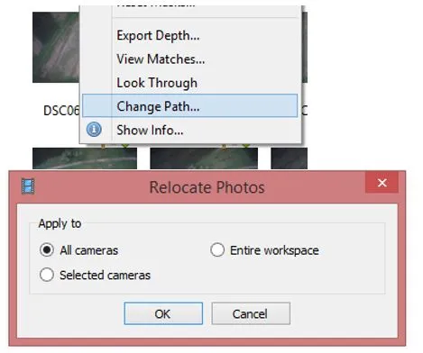
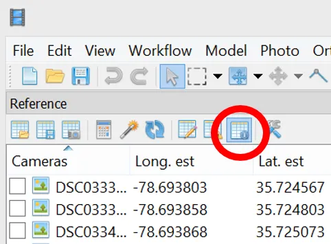

## Measurements in Agisoft Metashape

### Task

Perform measurements in Agisoft Metashape :

- calculate distance, area, and volume measurements
- generate profiles and contour lines

Metashape 2.x renamed several menu items. The instructions use the current names, with the Metashape 1.x name in parentheses the first time it appears; the screenshots are from 1.x.

### Data

- [Agisoft project files with the processed 02/06/2018 Lake Wheeler flight]() (7.5 GB, required)
- [Imagery from the 02/06/2018 Lake Wheeler flight]() (3.2 GB, optional, see below)
- [Imagery for the volume and area measurements]() (120 MB), 25 photos acquired 02/07/2017 at the Wake County Waste Transfer Station ([location](https://goo.gl/maps/hkYqDxZHcpT2))

### Performing measurements on a model

#### Data preparation

In the first part of the lab you will be working with the 02/06/2018 Lake Wheeler flight. Because the processing is very time consuming, the processed project is provided. Start the download before the lab.

Unzip the project files and open **2018_02_06_assignment.psx**. The Workspace pane lists the point cloud, model, DEM, and orthomosaic, which is everything the measurements below use. Metashape warns that it cannot find the photos; the measurements work without them. If you also downloaded the photos, **right click** on any picture in the Photos pane, choose `Change Path...`, and mark `All cameras` in the dialog. This applies the new location to all the pictures in the project.

{width=50% fig-align="center"}

#### Distance measurement

Using the **Ruler** tool from the toolbar of the Model view, measure the length of the longer side of the largest building in the model. Take a screenshot that shows which building and which side you measured and include it in the report.

#### Distance between GCPs

To measure the distance between two markers in Metashape:

- Select both markers on the Reference pane using the  key
- Right click on one of them and select `Create Scale Bar`. The scale bar is added to the Scale Bars list on the Reference pane.

::: {.callout-note}
To see the estimated values, the Reference pane has to be in the estimates display; the following button needs to be active:

{width=50% fig-align="center"}

:::

Compare the distance between **UAV 9** and **UAV 12** estimated by Metashape with the distance calculated from the coordinates:

| GCP      | Easting *[m]* | Northing *[m]* | ASL *[m]* |
|----------|----------------|----------------|-----------|
| **UAV 9**  | 636744.300     | 219381.308     | 109.971   |
| **UAV 12** | 637057.310     | 219733.909     | 116.12    |

::: {.callout-note}
The scale bar distance is the straight line between the two markers in 3D, so include the elevation difference in your calculation. **Show your work.**

How much (in meters and in percent) do these values differ?

Euclidean distance:
$$
d = \sqrt{(x_2 - x_1)^2 + (y_2 - y_1)^2 + (z_2 - z_1)^2}
$$

Difference in meters:
$$
\text{Difference in meters} = \left| \text{Metashape distance} - \text{Calculated distance} \right|
$$

Percent difference:
$$
\text{Percentage difference} = \left( \frac{\text{Difference}}{\text{Calculated distance}} \right) \times 100
$$

The coordinates are State Plane grid coordinates, and the grid scale factor at Lake Wheeler is about 0.9999. Metashape measures the true distance, so expect it to be a few centimeters longer than the calculated one even if the model were perfect. That part of the difference comes from the map projection, not from the model.
:::

#### Distance between cameras

To measure the distance between two cameras in Metashape:

- Select the two cameras on the Workspace or Reference pane using the  key. The Reference pane can be sorted by name to find them. Alternatively, select the cameras in the Model view with the selection tools from the toolbar.
- Right click on one of them and select `Create Scale Bar`. The scale bar is added to the Scale Bars list on the Reference pane.

Measure the distance between cameras **DSC03341** and **DSC03752**.

### Performing measurements on DSMs

Switch to the Ortho view (double click on the orthomosaic in the Workspace pane).

#### Point and distance measurement

In the western part of the area, close to the forest edge, there are some sheaves.

::: {.callout-tip}
*sheaf (sheaves)* - a bundle of grain stalks laid lengthwise and tied together after reaping.
:::

Estimate the diameter and the height of the northernmost sheaf. Include a screenshot of the sheaf you measured.

- Diameter: use the Ruler tool or Draw Polyline from the Ortho view toolbar.
- Height: the Ortho view shows the coordinates and the DEM elevation of the point under the cursor in its bottom right corner. Read the elevation on top of the sheaf and on the ground next to it; the height is the difference. You can also draw a polyline across the sheaf and look at the cross section (see below).

#### Contours

- Select `Tools > DEM > Generate Contours...` (`Tools > Generate Contours...` in 1.x).
- Set round values for the Minimal altitude and Maximal altitude parameters as well as the Interval of the contours.
- Set the transparency of the contours to 50% and do not display the labels (`Preferences` in the context menu of the contours layer in the Workspace pane; contours are in the Shapes folder).

#### Cross section

Choose an interesting place for a cross section (the contours show where the terrain varies).

- Draw a line across it with the Draw Polyline tool from the Ortho view toolbar (double click ends the line).
- Right click on the polyline and select `Measure...` from the context menu. The Profile tab shows the cross section. If your version lists a separate `Measure Profile...` command, use that.
- Include the profile and a screenshot of its location in your report.

### Volume and area measurements

In this part of the lab you will be working with the [25 photos acquired in February 2017 at the Wake County Waste Transfer Station]().

#### Processing

The photos have not been processed. Create a new project and process them as in [Assignment 2B](../../topic_2_sfm/assignments/assignment_2b.qmd): add the photos, align them, build the point cloud, the model, the DEM, and the orthomosaic. There are no GCPs for this flight, so the model is positioned and scaled by the camera geotags only. That is enough for a volume; the absolute position can be off by a few meters. With 25 photos the processing takes about 15 minutes at Medium quality.

Use a high (or custom) face count when building the model, so that the surface of the pile is detailed.

#### Measurement

**Calculate the volume and the area of the "waste pile"** (for the exact location see [Google Maps](https://goo.gl/maps/hkYqDxZHcpT2)).

- Switch to the Ortho view and draw a polygon around the pile with the Draw Polygon tool. The delimitation of the pile is up to you; include a screenshot of the polygon in the report.
- Right click on the polygon and select `Measure...`. The dialog reports the perimeter, the area, and the volume above and below a base level. Agisoft's tutorial on [DEM based measurements](https://agisoft.freshdesk.com/support/solutions/articles/31000148884) shows the dialog.
- The base level is the surface the volume is measured from. Choose `Best fit plane` or `Mean level` and say in the report which one you used; the volume depends on it. Report the volume above the base level and the area.

Optional: measure the volume on the model as well, with `Tools > Model > Measure Area and Volume...` (`Tools > Mesh` in 1.x). This method needs a closed surface, so close the holes first (`Tools > Model > Close Holes`, level 100%) and remove everything but the pile from the model. Compare the two volumes.
