## Objectives {.smaller}

::: {.incremental}
- Interpret a processing report section by section
- Compare survey data and errors from different flights of the same site
- Recognize differences in the products generated by different software
- Explain what GCPs change in the processing and in the final products
- Identify which processing step to revisit to fix a particular error
- Explain what causes the bowl effect
- Execute profile, contour, and volume measurements in Agisoft Metashape
:::

::: {.notes}
* Produced the products; Measured their accuracy against checkpoints
* Today: read the report the software wrote and compare products across flights, software, and control
* The lab (4A) has them measure on those products and difference DSMs in GRASS
* Screenshots are from PhotoScan 1.x; the dialogs have the same content in Metashape 2.x
:::

## Two flights {.center .text-center .section-divider background-color="#e9f2e9"}

::: {.notes}
* Section 1: the dataset behind every comparison in this deck
* Two flights on the same day over the same field, plus a later winter flight
:::

## Flights, Oct 6 2015 {.smaller}

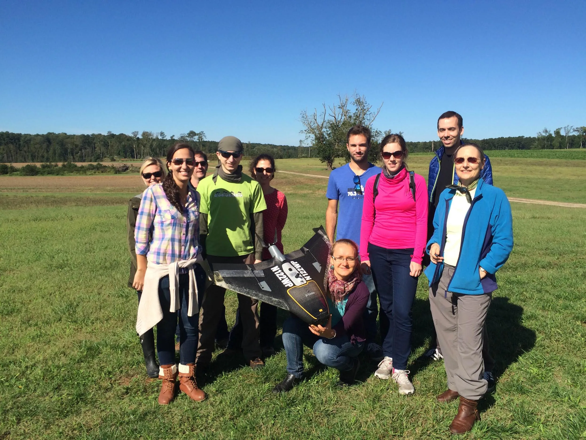{width="70%" fig-align="center" fig-alt="Field crew standing in a harvested field at Lake Wheeler with the Trimble UX5 fixed-wing aircraft and its launcher"}

Two consecutive flights with the Trimble UX5 over the Lake Wheeler fields.

::: {.notes}
* Same site, same aircraft, same camera, one hour apart
* Any difference between the two DSMs is error, not change
* That makes the pair a measurement of repeatability
:::

## Flight, Feb 6 2018 {.smaller}

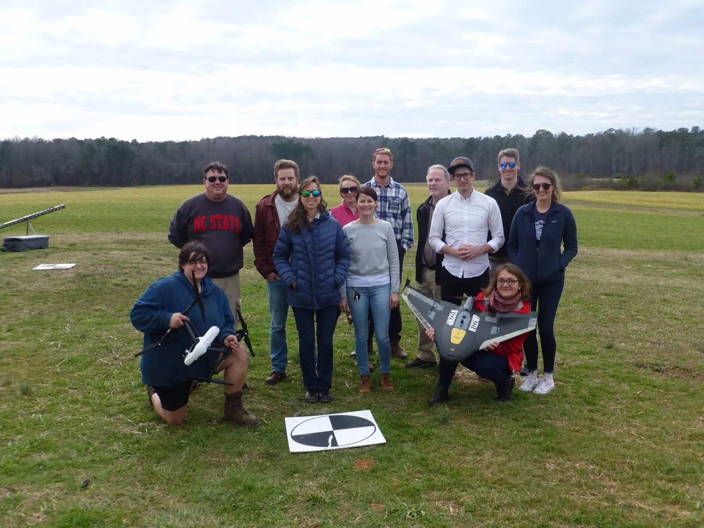{width="70%" fig-align="center" fig-alt="Field crew in winter clothing with the UX5 aircraft on a dormant field at Lake Wheeler"}

A winter flight of the same fields, used for the measurement examples at the end of the deck.

::: {.notes}
* Different season, bare fields, leafless trees
* The contours and volumes later in the deck come from this flight
:::

## The two October flights side by side {.smaller}

| | Flight 1 | Flight 2 |
|---|---:|---:|
| Number of images | 502 | 659 |
| Flying altitude | 110.1 m | 112.4 m |
| Ground resolution | 3.06 cm/pix | 3.13 cm/pix |
| Coverage area | 0.56 km^2^ | 0.70 km^2^ |
| DSM resolution | 12.2 cm/pix | 12.5 cm/pix |

The second flight covered more ground with more images at almost the same altitude, so the GSD and DSM resolution match within a tenth of a centimeter.

::: {.notes}
* All five numbers come from the first page of the processing report
* Altitude within 2 m, GSD within 0.07 cm: the flights are comparable
* DSM resolution is about 4 x GSD; that is Metashape's default
* Ask: with these two reports, what else would you check before differencing the DSMs?
:::

## Reading the processing report {.center .text-center .section-divider background-color="#e9f2e9"}

::: {.notes}
* Section 2: what each page of the report shows and which numbers matter
* 3B walked the four pages at a glance; here we go page by page with the two October flights
:::

## What the report contains {.smaller}

| Report section | What to look for |
|---|---|
| Survey data | Number of images, flying altitude, ground resolution, coverage area, camera model |
| Camera locations and image overlap | Where the photos were taken and how many see each spot |
| Camera calibration | The adjusted lens model and the image residual plot |
| Camera locations error | How far the solved camera positions sit from the geotags |
| Ground control points | Control (and checkpoint) errors in meters and in pixels |
| Digital elevation model | The DSM sketch, its resolution, and point density |
| Processing parameters | Every setting used, for reproducing the run |

::: {.notes}
* The report is the only record of how the products were made
* Two of these sections are accuracy statements, and only if checkpoints were declared (3B)
* The rest is provenance: enough to repeat the processing
:::

## Orthomosaic {.smaller}

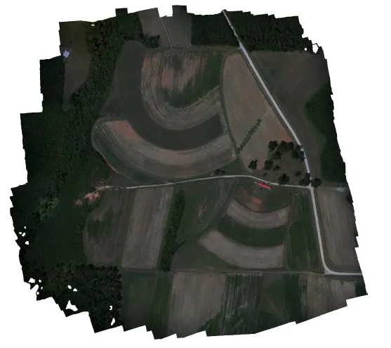{width="55%" fig-align="center" fig-alt="Orthomosaic of the Lake Wheeler fields with contour strip cropping, a farm road, and tree lines along the field edges"}

::: {.notes}
* First page of the report: the orthomosaic sketch
* Ragged edge is where overlap ran out; the DSM will be weakest there too
* Trees along the edges will matter for the DSM comparison
:::

## Camera locations and image overlap {.smaller}

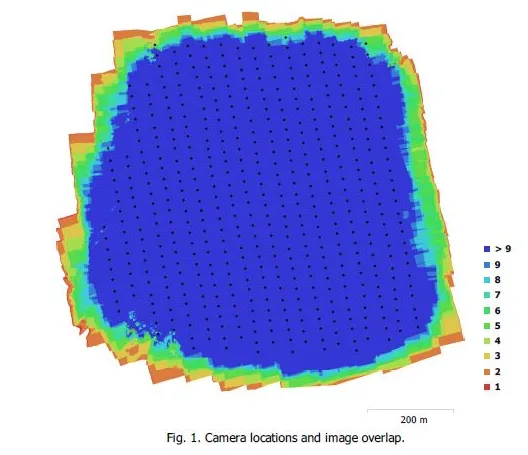{width="55%" fig-align="center" fig-alt="Overlap map from the report: black dots mark camera positions in a grid; the interior is dark blue for more than nine overlapping images, fading to green, yellow, and orange at the edges with one to three images"}

- Dark blue: more than nine images see each point in the interior
- One to three images at the edges: expect noise and holes there

::: {.notes}
* The planned 80 percent overlap shows up as the deep blue interior
* Anything measured near the edge is measured from one to three photos
* Recall 3A: overlap is what you bought with batteries and flight time
:::

## Flight plan {.smaller}

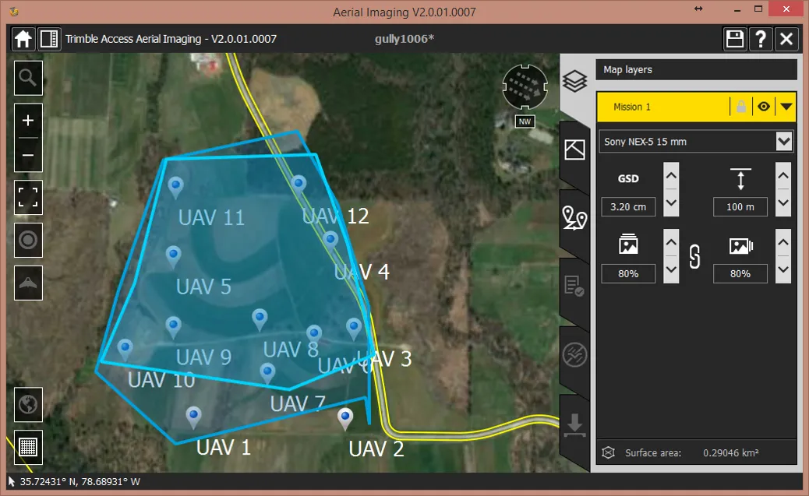{width="70%" fig-align="center" fig-alt="Trimble Aerial Imaging planning screen: a blue polygon over the field with twelve GCP pins labeled UAV 1 to UAV 12, Sony NEX-5 camera, GSD 3.20 cm, height 100 m, 80 percent overlap, surface area 0.29 square km"}

::: {.notes}
* The plan behind both flights: NEX-5 camera, 100 m, 80 percent overlap, 3.2 cm GSD
* Twelve surveyed targets spread over the polygon, edges and interior (3B's layout rule)
* The report's 3.06 cm GSD is the as-flown value against the 3.20 cm planned
:::

## Flight paths as flown {.smaller}

::: {.columns}
::: {.column width="50%"}
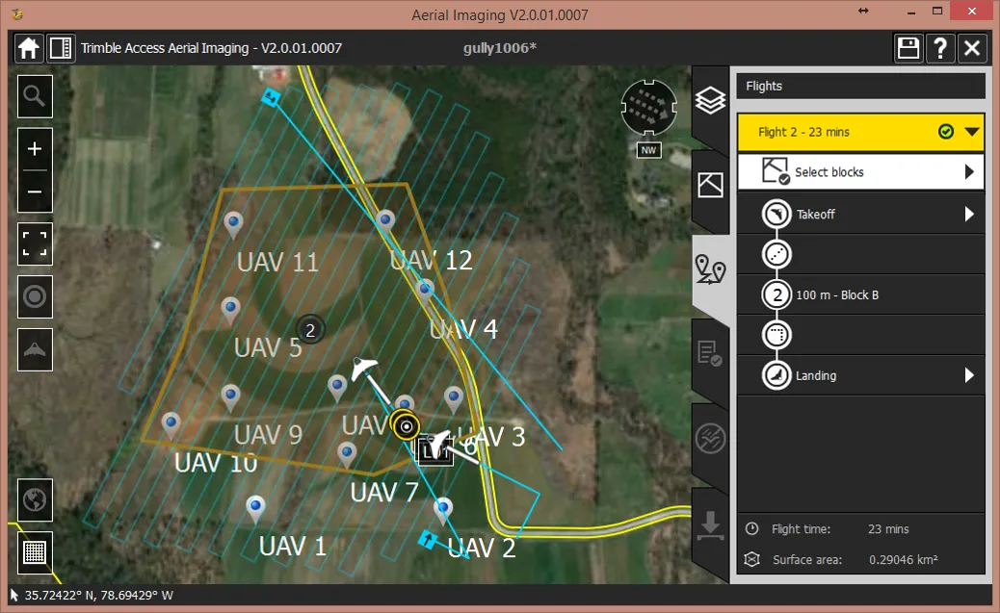{fig-alt="Planned flight lines and camera positions for the first October flight"}

Flight 1
:::
::: {.column width="50%"}
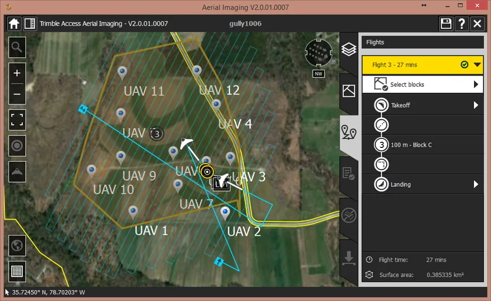{fig-alt="Planned flight lines and camera positions for the second October flight"}

Flight 2
:::
:::

::: {.notes}
* Flight 2 extended the block, which is why it has 659 images and 0.70 square km
* Compare the two overlap figures when you compare the two DSMs
:::

## Ground control point errors {.smaller}

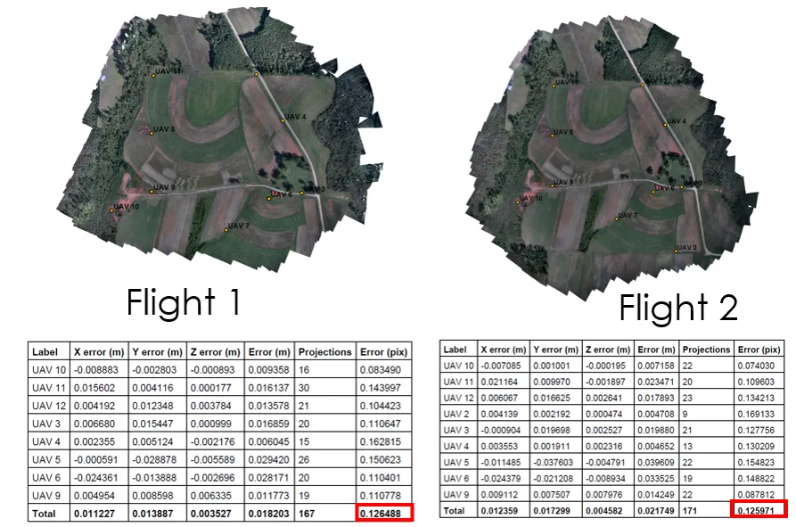{width="80%" fig-align="center" fig-alt="Side by side GCP error tables for flight 1 and flight 2 over their orthomosaics: eight or nine markers each, X, Y, Z errors in meters, projections, and error in pixels, with totals of 0.018 m and 0.126 pixels for flight 1 and 0.022 m and 0.126 pixels for flight 2"}

::: {.notes}
* Both flights fit their control to about 2 cm and an eighth of a pixel
* Same markers, same surveyed coordinates, so the tables are directly comparable
* These are control errors: they say how well the model was forced onto the targets
* 3B: control error overstates accuracy 3 to 8 x; checkpoints give the honest number
:::

## Reading one row of the GCP table {.smaller}

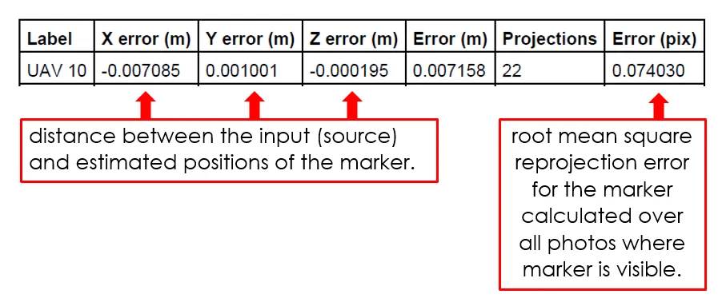{width="80%" fig-align="center" fig-alt="One row of the GCP table for marker UAV 10: X, Y, Z error and total error in meters are the distance between the surveyed and estimated marker positions; error in pixels is the root mean square reprojection error over all photos where the marker is visible"}

- **Error (m)**: distance between the surveyed and the estimated marker position
- **Projections**: how many photos the marker was placed on
- **Error (pix)**: RMS reprojection error of the marker over those photos

::: {.notes}
* Meters tells you about the georeferencing; pixels tells you about the marker placement
* A marker with large pixel error and few projections was probably misplaced on a photo
* Fix: go back to Stage 2 of 2B and re-place that marker
:::

## Camera calibration {.smaller}

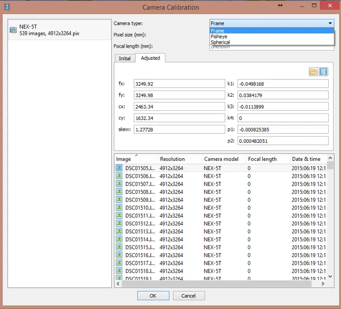{width="55%" fig-align="center" fig-alt="Camera Calibration dialog for the NEX-5T with 539 images at 4912 by 3264 pixels; the Adjusted tab lists fx, fy, cx, cy, skew, k1 to k4, and p1, p2, with Frame selected as the camera type"}

During alignment the software estimates both the exterior orientation of every photo and the interior orientation of the camera, including nonlinear lens distortion. The adjusted values are in *Tools > Camera Calibration* and on the report's calibration page.

::: {.notes}
* Interior orientation from 2A: focal length, principal point, distortion
* Self-calibration: these are solved from the photos, not measured in a lab
* Camera type must be right first: Frame for the NEX-5, Fisheye for action cameras
:::

## Reading the calibration parameters {.smaller}

::: {.columns}
::: {.column width="45%"}
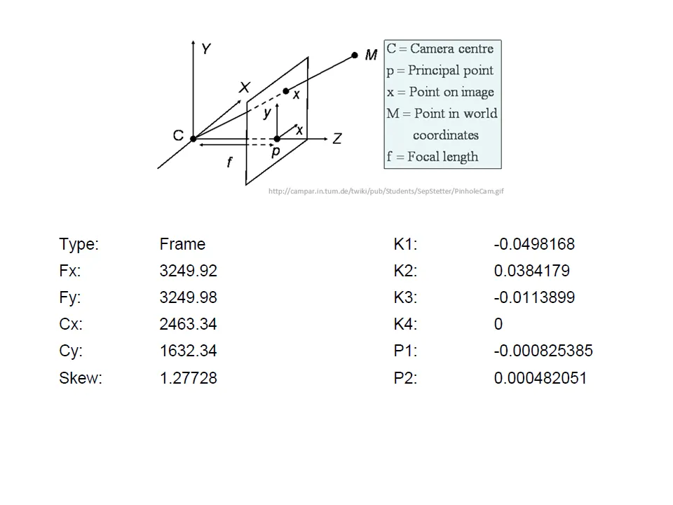{fig-alt="Pinhole camera diagram with camera centre, principal point, image point, world point, and focal length, above the adjusted calibration values: Fx 3249.92, Fy 3249.98, Cx 2463.34, Cy 1632.34, skew 1.28, K1 to K4, P1 and P2"}
:::
::: {.column width="55%"}
| Parameter | Meaning |
|---|---|
| Fx, Fy | Focal length in pixels along each axis |
| Cx, Cy | Principal point: where the optical axis meets the sensor |
| Skew | Non-orthogonality of the pixel axes (near zero) |
| K1 to K4 | Radial distortion coefficients |
| P1, P2 | Tangential distortion coefficients |
:::
:::

::: {.notes}
* Cx, Cy should sit near the sensor centre: 2456 by 1632 for this 4912 by 3264 sensor
* K1 dominates radial distortion; K3 and K4 absorb what is left and can overfit
* Large or unstable values between flights of the same camera are a warning sign
* 3B: a bad lens model is the mechanism behind doming
:::

## Image residuals {.smaller}

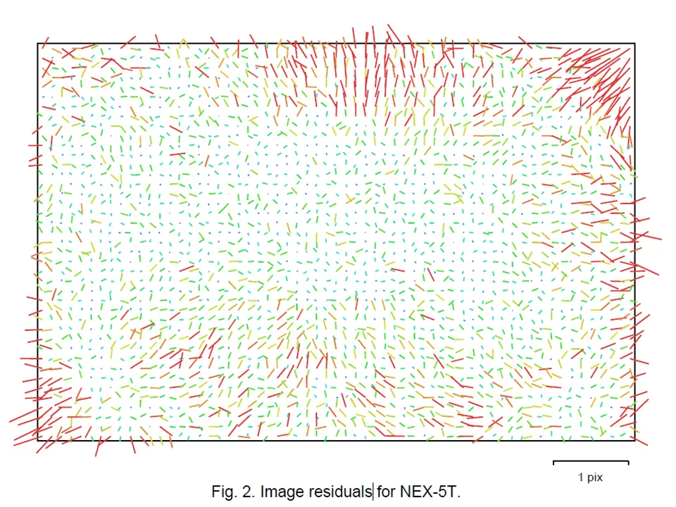{width="62%" fig-align="center" fig-alt="Report figure of image residuals for the NEX-5T: a rectangle covering the sensor filled with short colored vectors, small and green in the centre and longer and red toward the corners, with a 1 pixel scale bar"}

::: {.notes}
* The calibration page's second figure: residual vectors over the sensor
* Each vector is averaged over all photos for that part of the frame
* Pattern to look for: small and random in the centre, growing toward the corners
* Systematic swirls or a one-sided pattern mean the lens model is wrong
:::

## What a residual is {.smaller}

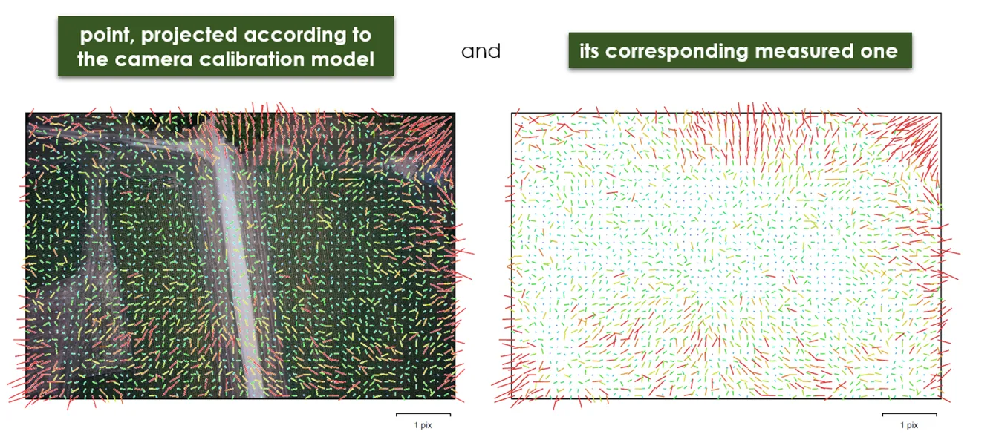{width="85%" fig-align="center" fig-alt="Two residual plots side by side: the left over a photograph of the field, the right on a blank sensor rectangle, each vector joining a point projected through the camera calibration model and its corresponding measured point"}

::: {.term-card}
**Image residual**: the distance in pixels between where the calibration model projects a 3D point onto the photo and where that point was actually measured in the photo
:::

::: {.notes}
* Two positions for the same point on the sensor: predicted and observed
* The vector between them is the residual; the plot averages them per sensor cell
* 1 pixel scale bar: these are sub-pixel quantities
:::

## Reprojection error {.smaller}

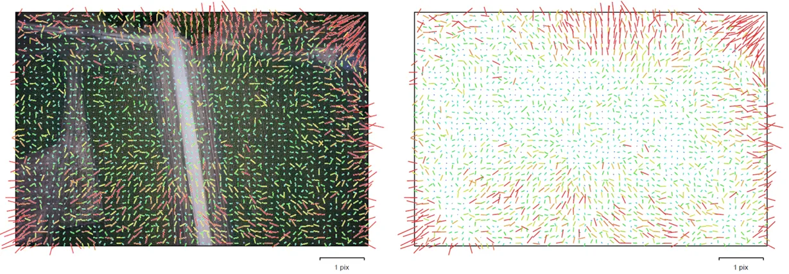{width="80%" fig-align="center" fig-alt="The same two residual plots, over the photograph and on the blank sensor, shown together"}

::: {.term-card}
**Reprojection error**: the RMS image residual over all tie points, the number the report quotes in pixels; it is the same quantity the photogrammetric literature calls the RMS image residual [@agisoft_metashape_manual]
:::

::: {.notes}
* The report prints one number for the whole project; the plot shows its spatial structure
* Low reprojection error says the model is internally consistent
* It says nothing about where the model sits on the ground: that is the GCP and checkpoint tables
* Nouwakpo 2016 is the reading on how residuals and calibration drive accuracy [@nouwakpo_evaluation_2016]
:::

## Flight path {.smaller}

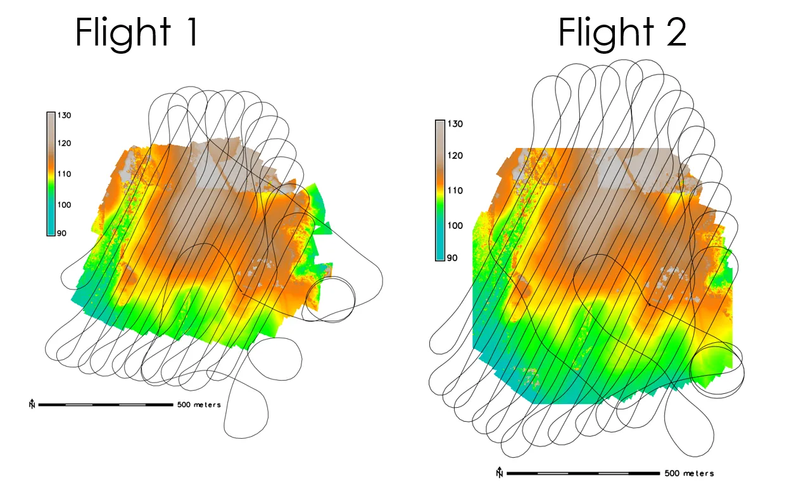{width="70%" fig-align="center" fig-alt="Flight track of the UX5 drawn over the field: parallel flight lines with wide turning loops outside the mapped area"}

::: {.notes}
* The flight log drawn as a line, from the camera positions in the report
* Turns are outside the block; the camera only fires on the straight lines
:::

## Flight path in 3D {.smaller}

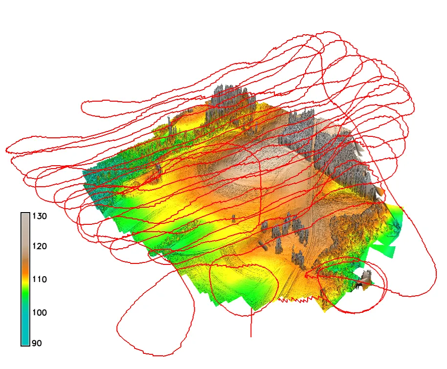{width="62%" fig-align="center" fig-alt="Three-dimensional view of the DSM with the red flight track looping above it; trees stand as spikes at the block edges and the elevation legend runs from 90 to 130 m"}

::: {.notes}
* Same track over the DSM in the GRASS 3D view
* The aircraft held altitude while the ground rose and fell under it: GSD varies with terrain (3A)
* Tree spikes at the edges are the noisy, low-overlap zone from the overlap figure
:::

## Comparing surface models {.center .text-center .section-divider background-color="#e9f2e9"}

::: {.notes}
* Section 3: what changes between flights, between software, and with or without control
* Each comparison isolates one variable
:::

## Digital surface models {.smaller}

::: {.columns}
::: {.column width="50%"}
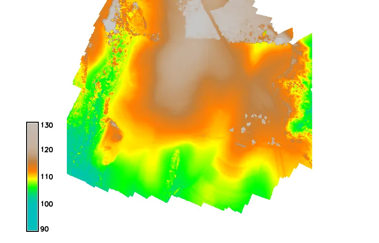{fig-alt="DSM of the first October flight colored from 90 m in cyan through green and yellow to 130 m in brown, with the field terraces and tree lines visible"}

Flight 1
:::
::: {.column width="50%"}
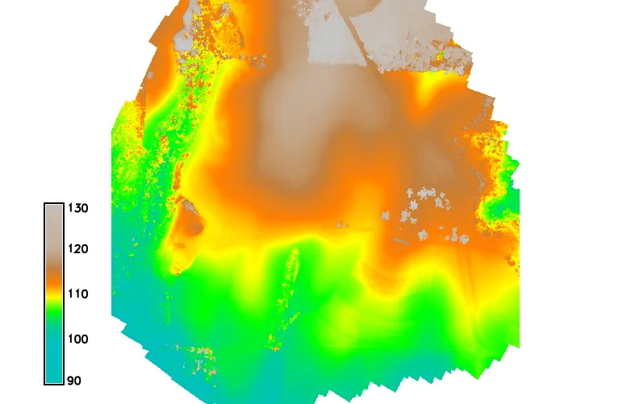{fig-alt="DSM of the second October flight with the same color ramp and a larger extent"}

Flight 2
:::
:::

::: {.notes}
* Same color ramp, 90 to 130 m, so the eye can compare them
* Looking alike is not the same as agreeing: subtract them
:::

## Difference between the two flights {.smaller}

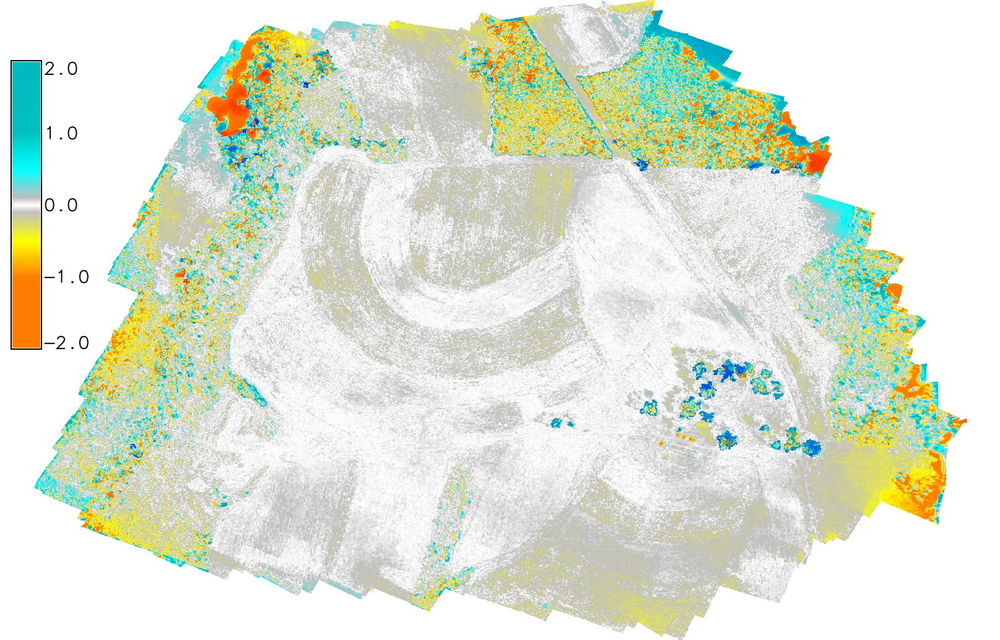{width="62%" fig-align="center" fig-alt="Difference map between the two October DSMs in meters: the open fields are near zero in white and grey, the tree lines and field edges show patches of plus and minus one to two meters in cyan and orange"}

Difference in meters between the DSMs from the two consecutive flights. Bare fields agree to within centimeters; the edges and the trees do not.

::: {.notes}
* The honest repeatability test: nothing changed on the ground in that hour
* Fields near zero: the repeatable part
* Trees and edges at plus or minus 1 to 2 m: wind in the canopy and low overlap, not change
* 3B's level of detection comes straight from a map like this
:::

## The same flight in three programs {.smaller}

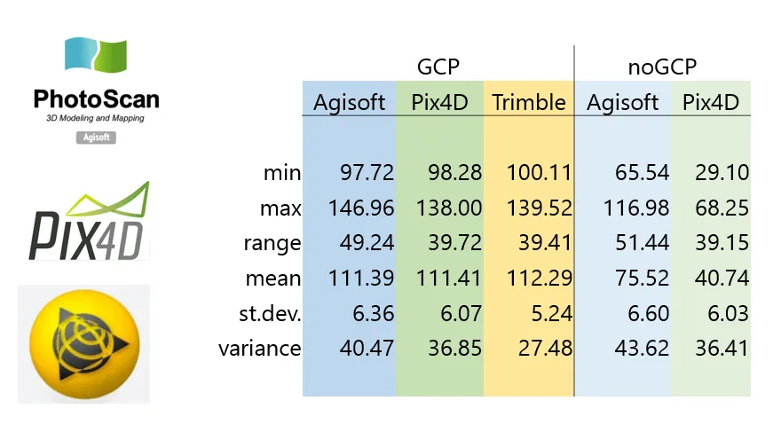{width="75%" fig-align="center" fig-alt="Table of DSM elevation statistics for the same flight processed in Agisoft, Pix4D, and Trimble Business Center with GCPs, and in Agisoft and Pix4D without GCPs: with GCPs the means are 111.4, 111.4, and 112.3 m; without GCPs they drop to 75.5 m in Agisoft and 40.7 m in Pix4D"}

- With GCPs, three programs agree on the mean elevation to within a meter
- Without GCPs, the two programs disagree with each other by 35 m and with the truth by 36 to 71 m

::: {.notes}
* With control, software choice is a second-order effect: the means differ by less than a meter
* Without control, every program lands wherever the navigation-grade geotags put it
* The 3 to 7 m standard deviation is terrain and trees, similar in all five columns
* The lab compares these DSMs in GRASS
:::

## With and without ground control {.smaller}

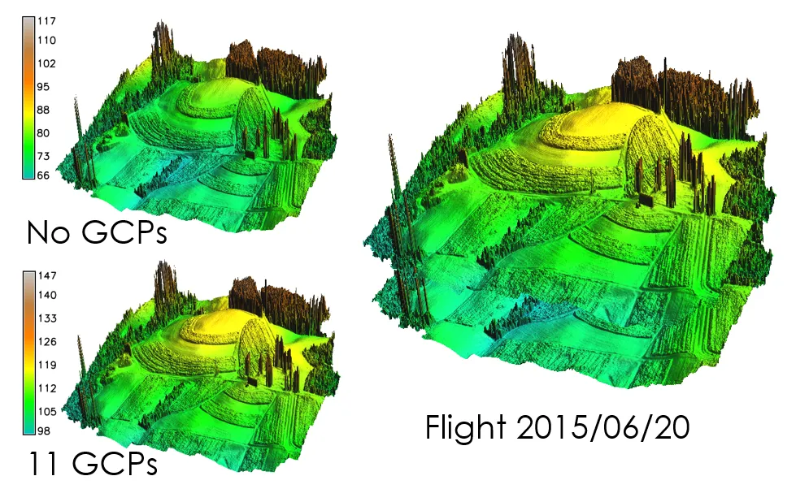{width="80%" fig-align="center" fig-alt="Three 3D views of the June 20 2015 flight DSM: without GCPs the elevation legend runs 66 to 117 m, with 11 GCPs it runs 98 to 147 m; the shapes are the same, shifted about 30 m in elevation"}

The same photos processed with no GCPs and with 11 GCPs. The shape is identical; the elevation is off by about 30 m without control.

::: {.notes}
* A pure vertical offset: the relative model is fine, the absolute position is not
* This is the geotag altitude error from 2A and 3B, usually tens of meters on consumer GNSS
* One GCP, or an RTK aircraft, removes most of it (3B, Zhang 2019)
* Not every GCP-free error is a shift: the next section is the one that bends
:::

## The bowl effect {.center .text-center .section-divider background-color="#e9f2e9"}

::: {.notes}
* Section 4: the systematic error that control fixes and differencing cannot forgive
* 3B introduced it as doming; here is what it looks like in a real project
:::

## The bowl effect {.smaller}

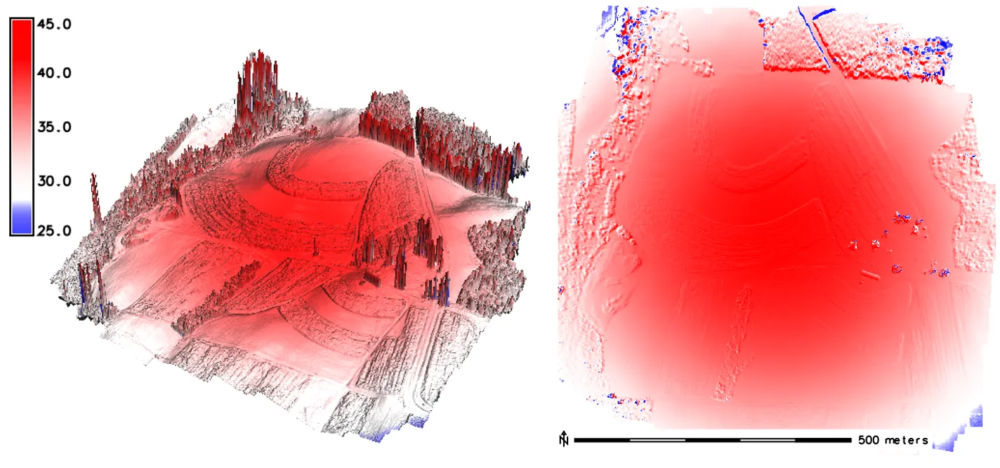{width="80%" fig-align="center" fig-alt="Left: 3D view of a DSM difference surface shaped like a dome, red in the centre and white at the edges, with a 25 to 45 m legend. Right: the same difference in plan view, a smooth red dome centred on the field with a 500 m scale bar"}

::: {.term-card}
**Bowl (or doming) effect**: a smooth, broad bending of the whole model introduced during alignment when the camera calibration is estimated inaccurately; the self-calibration trades lens distortion against a curved surface [@james_mitigating_2014]
:::

::: {.notes}
* The difference between a DSM processed without GCPs and one with: a dome tens of meters high
* Nothing on the ground is shaped like this; it is the lens model gone wrong
* A mean error far from zero in a report is the detector (3B's bias rule)
* Parallel nadir photos of flat terrain are the classic trigger: James and Robson 2014
:::

## Avoiding the bowl {.smaller}

::: {.incremental}
- **Use GCPs** spread across the block, or RTK/PPK camera positions, and optimize on them
- **Improve the camera calibration**: a known camera model, or convergent and oblique photos so the lens can be solved
- **Increase the overlap** and add cross strips so every point is seen from more angles
- **Post-process**: fit and remove the dome against control, a last resort that treats the symptom
:::

::: {.notes}
* Order of power from 3B: known calibration, oblique imagery, two heights, then control
* Overlap alone does not fix doming (James 2020); it helps only when it adds view angles
* The field recipe: tilt the camera 20 to 35 degrees for part of the flight and fly an orbit
* Post-processing is what you do when the flight is over and cannot be reflown
:::

## Optimization {.smaller}

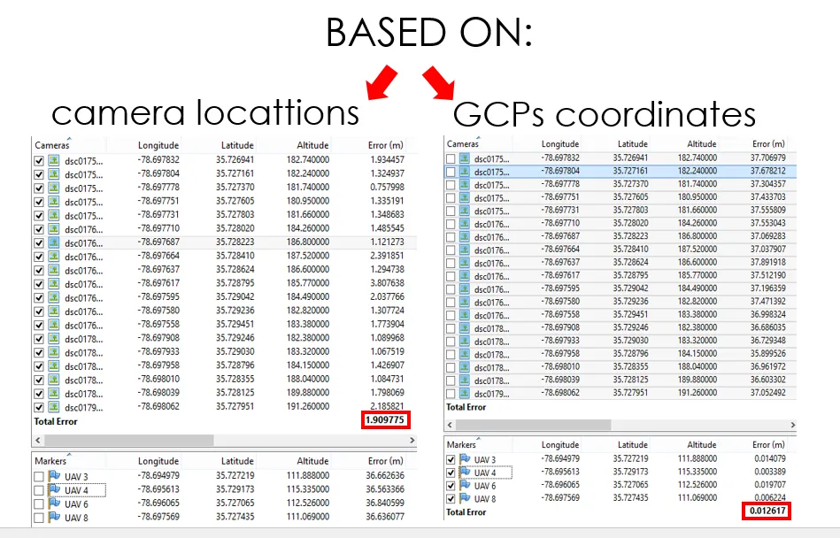{width="78%" fig-align="center" fig-alt="Two Reference pane screenshots. Optimizing on camera locations: camera total error 1.91 m, marker total error 36.6 m. Optimizing on GCP coordinates: camera total error about 37 m, marker total error 0.0126 m"}

Optimize on the camera geotags and the markers sit 36 m off. Optimize on the markers and the cameras sit 37 m off. The ground control wins.

::: {.notes}
* The same project optimized two ways; the 36 m is the geotag altitude bias
* Whichever reference you weight, the other reports the disagreement
* 2B Stage 2: first on cameras to get close, then on markers to get right
* 3B: the Reference Settings accuracies decide how much each reference is trusted
:::

## What optimization does {.smaller}

::: {.incremental}
- A full photogrammetric bundle adjustment with the ground control as additional constraints
- Exterior orientation of every camera and the interior orientation of the lens are re-solved together
- Replaces the simple seven-parameter transform (shift, rotation, scale) that georeferencing uses by default
- The reported errors drop by orders of magnitude when the control is good
:::

::: {.term-card}
Marker accuracy in the Reference Settings is the weight: 5 mm says the targets are trusted to 5 mm. Wrong weights give a wrong adjustment [@agisoft_metashape_manual]
:::

::: {.notes}
* Without optimization the model is only moved, rotated, and scaled onto the GCPs; the bowl survives
* With it, the lens model is refit under the constraint that the GCPs are where they were surveyed
* That is why the bowl disappears with control and not with a plain georeference
* Lab: the DSM without GCPs is exactly the unoptimized case
:::

## Measuring on the products {.center .text-center .section-divider background-color="#e9f2e9"}

::: {.notes}
* Section 5: what the lab does with the products
* Simple measurements in Metashape, terrain analysis in GRASS
:::

## Profiles in Metashape {.smaller}

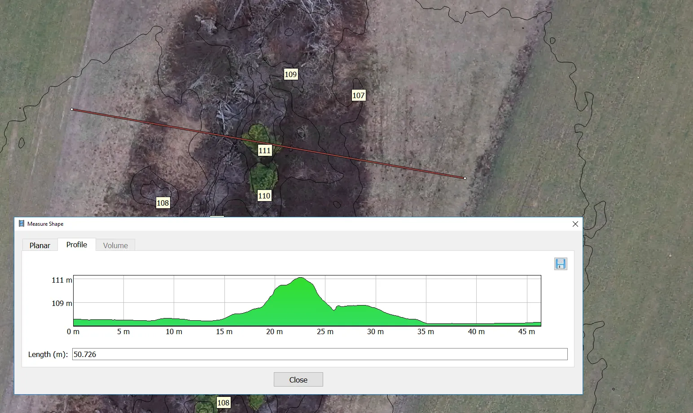{width="80%" fig-align="center" fig-alt="Metashape orthomosaic with contour lines and a red profile line drawn across a brush pile; the Measure Shape dialog shows the elevation profile rising from 108 to 111 m over a 50.7 m line"}

Draw a polyline on the DSM or model and read the elevation profile along it.

::: {.notes}
* Measure Shape: Planar, Profile, Volume tabs
* Profile over a brush pile: 2 to 3 m above the field in the DSM
* Compare the DSM profile with the same line in GRASS (r.profile) in the lab
:::

## Contours in Metashape {.smaller}

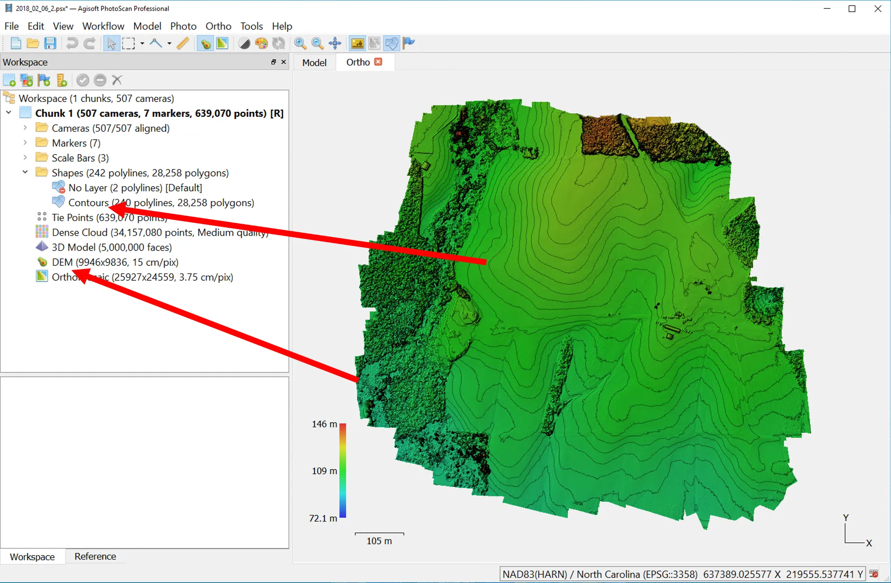{width="70%" fig-align="center" fig-alt="Metashape workspace for the February 2018 project: 507 cameras, 7 markers, a 15 cm DEM, a 3.75 cm orthomosaic, and 240 contour polylines drawn over the colored DEM of the field"}

*Tools > DEM > Generate Contours*. Contours are shapes, so they export as vector files alongside the DEM.

::: {.notes}
* February 2018 project: 507 cameras, 7 markers, 15 cm DEM, 3.75 cm orthomosaic
* Contours on a DSM follow the canopy as well as the ground; look at the tree lines
* Bare winter fields make this flight the better one for terrain contours
:::

## Volumes and areas in Metashape {.smaller}

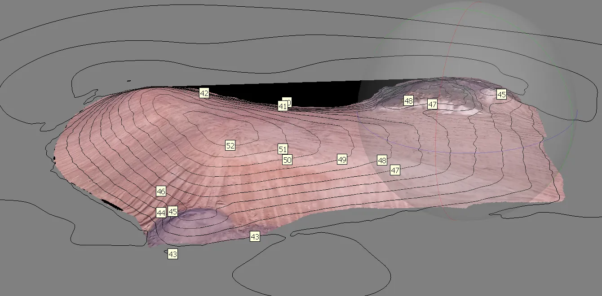{width="80%" fig-align="center" fig-alt="Textured 3D model of a soil stockpile with contour lines from 41 to 52 m draped over it, viewed obliquely"}

Close a polygon around the pile, pick the base plane, and read the volume above and below it. The model must be watertight under the polygon.

::: {.notes}
* Volume needs a base: best fit plane, mean level, or a custom plane
* Holes under the polygon make the number wrong; this is where Close Holes (2B) matters
* Lab: measure the same pile twice with different bases and report the difference
* 3B: the volume uncertainty follows from sigma-z times the footprint area
:::

## Terrain analysis in GRASS {.smaller}

::: {.columns}
::: {.column width="50%"}
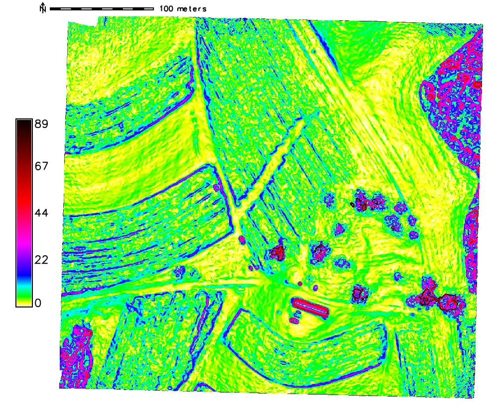{fig-alt="Slope map of the field derived from the UAS DSM, steep terraces and tree edges in dark tones"}

Slope
:::
::: {.column width="50%"}
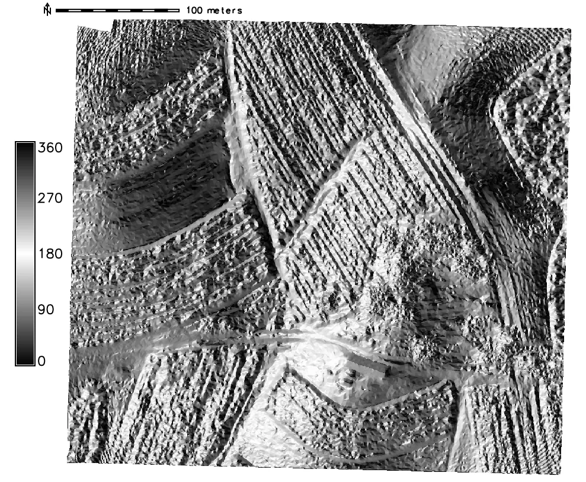{fig-alt="Aspect map of the field derived from the UAS DSM, with the terrace faces colored by the direction they face"}

Aspect
:::
:::

[r.slope.aspect](https://grass.osgeo.org/grass-stable/manuals/r.slope.aspect.html) computes slope, aspect, and curvatures from the DSM in one run.

::: {.notes}
* Same DSM, GRASS instead of Metashape
* Slope shows the terraces and every tree edge; aspect shows which way they face
* The noise from the DSM comparison shows up here as speckle
:::

## Curvature and shaded relief {.smaller}

::: {.columns}
::: {.column width="50%"}
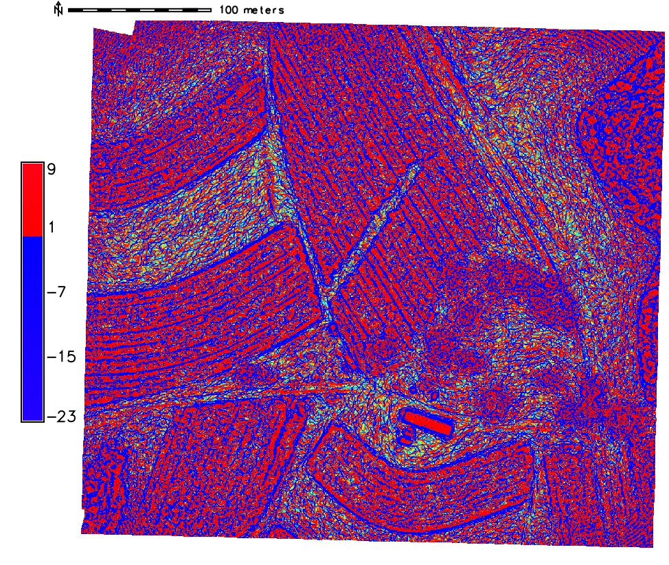{fig-alt="Profile curvature map of the field, with convex terrace crests and concave channels in contrasting tones"}

Curvature
:::
::: {.column width="50%"}
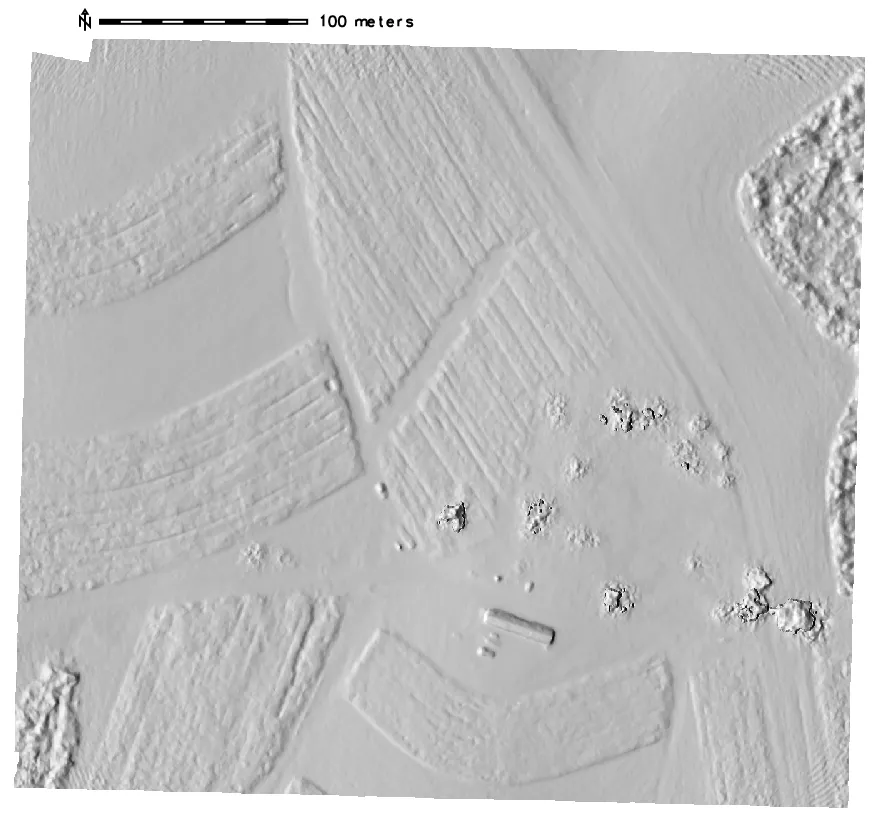{fig-alt="Shaded relief of the UAS DSM showing the terraces, farm road, and tree lines"}

Shaded relief
:::
:::

[r.relief](https://grass.osgeo.org/grass-stable/manuals/r.relief.html) for the hillshade; curvatures from r.slope.aspect or from the interpolation itself (v.surf.rst).

::: {.notes}
* Curvature amplifies the smallest surface detail, including the error
* Shaded relief is the quickest visual check of a DSM: artifacts jump out
* The DSM without GCPs would show the bowl as a slow gradient in slope and aspect
:::

## Advanced terrain analysis {.smaller}

::: {.columns}
::: {.column width="50%"}
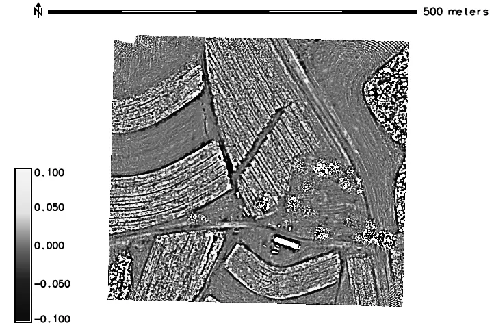{fig-alt="Local relief model of the field: small positive and negative features such as rows and furrows stand out after the broad terrain trend is removed"}

Local relief
:::
::: {.column width="50%"}
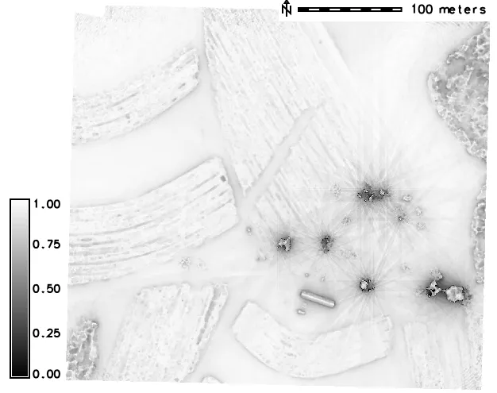{fig-alt="Sky-view factor map of the field: open ground is bright, furrows and the base of trees are dark"}

Sky-view factor
:::
:::

Addons [r.local.relief](https://grass.osgeo.org/grass-stable/manuals/addons/r.local.relief.html) and [r.skyview](https://grass.osgeo.org/grass-stable/manuals/addons/r.skyview.html); install with `g.extension`.

::: {.notes}
* Local relief removes the broad trend and leaves the micro-topography: furrows, rows, tracks
* Skyview factor is independent of light direction, unlike a hillshade
* Both are tools for subtle features on bare ground, which is where UAS DSMs excel
* 4B does the same analysis on lidar surfaces
:::

## Key terms {.smaller}

::: {.columns}
::: {.column width="50%"}
::: {.term-card}
**Processing report**: the record of images, overlap, calibration, and errors from a run;
:::
::: {.term-card}
**Image residual**: pixel distance between a point projected through the camera model and its measured position
:::
::: {.term-card}
**Reprojection error**: the RMS of the image residuals over all tie points
:::
:::
::: {.column width="50%"}
::: {.term-card}
**Bowl effect**: broad systematic bending of the model from an inaccurate self-calibration; also called doming
:::
::: {.term-card}
**Optimization**: the bundle adjustment re-run with ground control as constraints
:::
::: {.term-card}
**DSM difference**: between repeat flights it measures error; between epochs, change plus error
:::
:::
:::

::: {.notes}
* Midterm vocabulary, and the words the lab report has to use correctly
* Control error versus camera location error: neither one is the map accuracy
:::

## Wrap-up

::: {.term-card}
**Assignment 4A**: [Analysis of UAS data processing results](../assignments/assignment_4a.qmd): measure profiles, contours, and volumes in Metashape, then compare DSMs with and without GCPs, across software, and between surveys in GRASS
:::

::: {.notes}
* Recap: the report records how the products were made and, with checkpoints, how good they are
* Two flights an hour apart show the repeatable part and the noisy part
* Control fixes the offset; optimization fixes the bowl; software choice matters least
* The lab measures on the products and differences them in GRASS
:::

## References {.smaller}

::: {#refs}
:::
